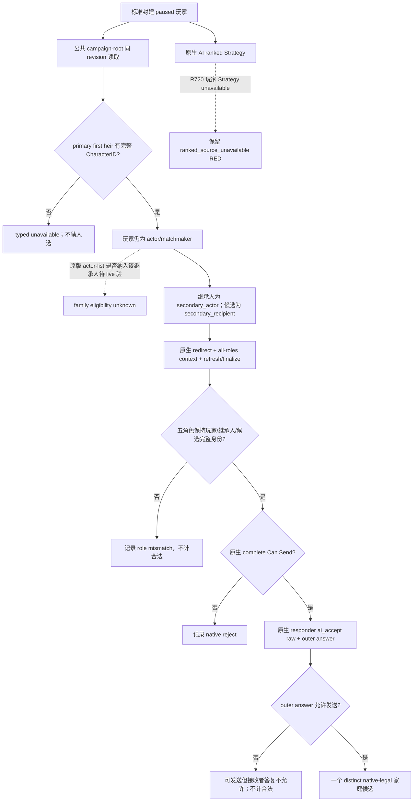

# G2-M5 R720：标准封建玩家的可观测家庭婚姻候选

状态：`production-live capability RED`（原私有 AI-ranked 路径）；本文新只读候选为 `static-ready / paused live 待验`。本页仅处理真实 R720 阻塞的婚姻候选观测，不改变正式 G2-M5 状态、公共能力广告或婚姻动作。

## 冻结输入与原版调用链

CK3 exact build `1.19.0.6`，EXE SHA-256 `2D00FF3101EF70B566F2FCBAE292F09263199C80E9DC8F139B82D7D96F83DB86`。原版 `game/common/character_interactions/00_marriage_interactions.txt` SHA-256 `681A9B669E5A16642A197B6FE16085193DFBB99A398D0E20E86173F5AC6DE219`，第 94–160 行按 `matchmaker` 重定向 actor/recipient 和实际婚配双方；第 162–268 行的 `populate_actor_list` 包括 actor、廷臣和在原版条件下的子孙，第 330–331 行明定 actor/recipient 为安排者、secondary_actor/secondary_recipient 为婚配双方。能否把某个继承人放入有效玩家提案，仍由原生最终判定，不能从脚本候选集直接推出。

R720 冻结产物：[实机报告](<Z:/ck3_mod_rewrite_process_assets/g2-m5-r718-observer-20260915/candidate/live-R720/report.json>) SHA-256 `BF04C17D3C2C06C59D138B6A9717676B0DD6487DBD77D0002BEA2D9C9316BD57`；标准封建 paired save `dev3b_r639.ck3` SHA-256 `9104CCB8AE9D5776166FBBAEDA9B43BD08CBAA2CB5C057332EB8B7A1A212CC63`，当前玩家 CharacterID 29829。私有 slot 38 真正执行了一次，`observer_failure=ranked_source_unavailable`、`source_adapter_failure_after=strategy_unavailable`，query submit/wait/reclaim 均为 0，后续 paused frame 未变化；不能把它写成有序候选空列表。公共直接玩家婚姻查询遍历 34,663 个存活 Character、构造同数原生上下文，34,663 次最终 validation 均为 false，结果 0；这是该玩家在该帧的直接婚姻结果，不是家庭婚姻机会总数。公共原生宣战列表另有 30 个不同 declaration row，尚未完成跨域联合评分。

## 最小只读 ABI 与验收边界

新受控 step `query-observed-heir-marriage-choices-v1-private` 仅在已有 M5 private CMake 开关 ON 时存在；默认编译、正式 capability 列表、公共 action step 和 MCP 广告保持不变。调用者先经正式公共 `query-campaign-root-context-v1` 查询同一 native revision；bridge 只缓存该公共结果的 primary `first_heir_character_id`、revision 和连接代，私有请求不接受 CharacterID。若公共观测缺失、身份过期、paused frame 变化或原生上下文失败，输出 typed unavailable/RED，不把 unknown 当 false。

既有 exact-build binder 的 RVA：`redirect roles 0x2C3C4C0`、all-roles constructor `0x2C3F000`、`complete Can Send 0x2C43F00`、recipient `ai_accept 0x2C44320`、outer answer `0x2C43B40`；这些值与现行 `marriage_matchmaking_source_adapter_v1.hpp` 和 `ck3_11906.cpp` 常量一致。新查询复用 `ck3_11906.cpp` 已绑定的 context constructor、refresh、finalize、destroy 与这三个最终读口，不调用 AI-ranked source、提交队列、UI 或日期推进。每个完整 generation-bound CharacterID 在 native storage 中核对；重定向后 actor 必须仍是玩家，secondary_actor 必须是观测继承人，secondary_recipient 必须是候选，recipient matchmaker 必须可解析。返回 `native_rank=null`，因为人类玩家 Strategy 在 R720 不可用；仅 `complete_can_send=true` 且 `recipient_answer_allows_send=true` 的不同候选计入 M5 法律机会。

新候选需在相同标准封建 paused snapshot 上经正常 bridge/driver 路径做一次有界只读实机复验：固定 EXE、agent/native commit 与 DLL 哈希、DLC/mod、paired save、私有开关、前后 revision/date/玩家、无 CK3 第二实例；先保存公共宣战查询，再用公共 root 首继承人观测接入私有家庭候选，比较不同合法 ID 的数量。若继承人已婚、缺失或所有 native final gate 拒绝，如实报告 0 或不足五个；不重复 R720 原候选、不伪造 rank 或复制候选。这个读取门通过也不证明联合评分、婚姻 typed 提交、双向关系/联盟后置或下一 turn 消费。

当前 open_kaishek 不消费该私有 step，已有公共协议不变；若后续公开 family typed row 或 MCP 查询，先做兼容评估与最小适配。事件采集与安全选项判断的通用资产义务仍待公共只读接口验收，不把当前私有诊断称为通用完成。
