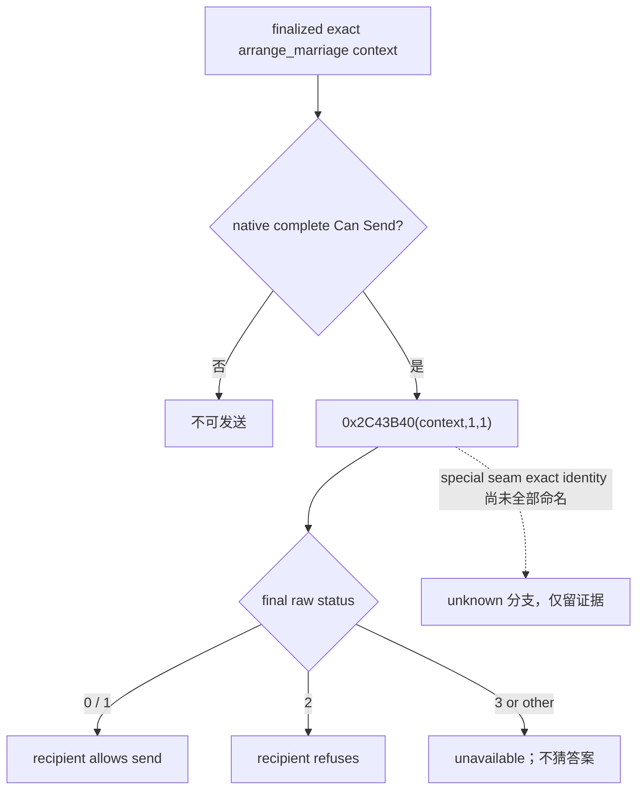

# G2-M5 R725：婚姻最终答复的 exact-build 状态语义

本项源于标准封建 R725 的真实 paused 只读结果，不改变 G2-M5 状态，也不接通公共婚姻查询、动作或 MCP 广告。冻结 CK3 `1.19.0.6`，EXE SHA-256 `2D00FF3101EF70B566F2FCBAE292F09263199C80E9DC8F139B82D7D96F83DB86`；存档 `dev3b_r639.ck3` SHA-256 `9104CCB8AE9D5776166FBBAEDA9B43BD08CBAA2CB5C057332EB8B7A1A212CC63`。R725 [报告](<Z:/ck3_mod_rewrite_process_assets/g2-m5-r720-player-safe-20260915/candidate/live-R725/report.json>) SHA-256 `81DE1DB196BBB9F6B35E096D1506526431CD956A1374565F269CC6AAB7842920`；[私有家庭结果](<Z:/ck3_mod_rewrite_process_assets/g2-m5-r720-player-safe-20260915/candidate/live-R725/private-family-query.json>) SHA-256 `8AC6518663D9A199868E99021106B75A4FA70F18C67F4D0AAF41DA660B4D2879`。

R725 的正式公共 campaign-root 同帧给出玩家 29829、首继承人 38822、native revision 3。私有查询由玩家作为 actor、继承人作为 secondary_actor，构造 34,662 个原生婚姻 context；657 行通过 complete Can Send。657 行的 recipient `ai_accept` raw 全部大于零，原生 outer answer raw 全部为 `0`。现有私有家庭读口以及旧 AI-ranked source adapter 把 `answer_raw != 0` 写成 `recipient_answer_allows_send`，因而错误地将 657 行全部计为拒绝。公开宣战同帧有 30 行不同的原生可宣告战争。按修正合同**离线重算**该冻结 artifact 得到 657 个不同的家庭候选与总共 687 个跨域机会键；这是补丁设计输入，尚不是修复版 DLL 的 paused-live 合法候选证据，更不证明联合评分或已选择动作。

原版 exact-build `0x18F9C95` 调用 `0x2C43B40(context,1,1)`，其后 `0x18F9C9A test al; 0x18F9C9C je 0x18F9CF6` 在 raw `0` 时进入返回 `AL=1` 的 stock 婚姻门；另一分支 `0x18F9CD3` 再调用同一答复，`0x18F9CDA sete al` 也在 raw `0` 时返回 `1`。`0x2C43B40` 先调用 special seam `0x2C43220`，当其 status 非 `3` 时直接返回 raw `0`。已有 [互动最终答复树](interaction-structured-terms.md) 根据同一 exact build 将 `0/1` 判为接受、`2` 判为拒绝，`3` 留作 unavailable。旧 source adapter 的测试夹具曾把 raw `2` 当作“允许”，这是测试输入与原版合同不一致，不是 R725 的真实拒绝证据。

最小修复只改私有 family row 和旧 private AI-ranked pair adapter 的 raw-status 布尔映射；`0/1` 允许、`2` 拒绝，`>=3` 整体 unavailable。Python 私有家庭消费者同时核对 native raw 与布尔值，防止再次把 raw `0` 当作拒绝而报告合法候选为零；聚焦 native Debug/Release 与 Python normal/`-O` 夹具覆盖真实 R725 的 raw `0` 以及拒绝/未知分支。保持 actor/secondary pair、Can Send、原生 raw、存档和 UI/日期不变；R725 冻结 DLL 继续保留，不在原候选上重跑。新源码须生成明确新 DLL/manifest，并由唯一 CK3 owner 在同版本 paused 标准封建存档做一次有界只读复验，要求至少五个不同的最终答复合法家庭候选且至少一个 raw `0` 被正确判为允许；若没达到便保留 RED，不靠 30 个战争机会遮盖本 B1。

此补丁改变私有 typed row 的布尔意义，已有公共 query/action/MCP 广告仍关闭；open_kaishek 当前不消费这个私有 step。以后公开该 row 前需给出协议版本、兼容顺序与同版本实机后置证据。原版源码分析与安全选项判断已记录为带 EXE 哈希及调用点的可复用只读资料；通用 MCP 查询仍未验收，不能称资产义务完成。
