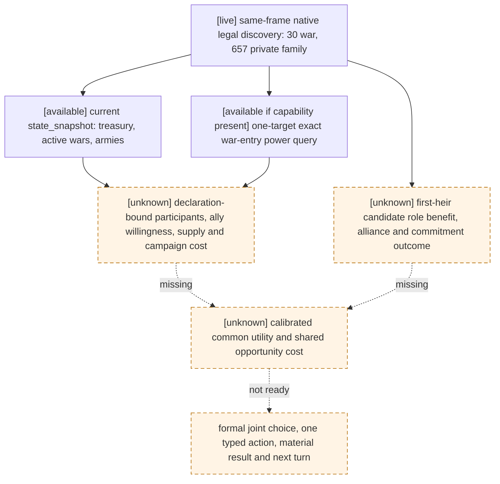

# G2-M5 R736: joint selector input boundary

## Exact scene and result

CK3 `1.19.0.6`, `ck3.exe` SHA-256
`2D00FF3101EF70B566F2FCBAE292F09263199C80E9DC8F139B82D7D96F83DB86`;
standard-feudal paired production save SHA-256
`9104CCB8AE9D5776166FBBAEDA9B43BD08CBAA2CB5C057332EB8B7A1A212CC63`;
agent source `67cafd027f5b81cf703aec4dc63a4887d2f3cec9` with the
equivalent M5 native binary source `ab7899c19ef4c639c9376a0b07b62def6a429505`.
The enabled mod is `mod/xar_autoplayer.mod`; the candidate disabled no DLC.

The immutable R736 report is stored outside Git at
`Z:\ck3_mod_rewrite_process_assets\g2-m5-r733-pump-20260916\candidate\live-R736\report.json`,
SHA-256 `83AE48416AD7B7F0CEC1E3DCE7F3C0322B6DAAA6139DF996B0238BFF798C8E94`.
The linked `war-query.json` and `private-family-query.json` were read on one
unchanged paused native revision `3`, player `29829`, date_raw `53178264`.
They contain 30 distinct native declarable-war choices and 657 distinct
first-heir family rows that passed complete Can Send and the exact native final
answer (`raw=0`, allowed). These are 687 distinct **legal observations**;
the private family query remains unregistered and unadvertised. R736 submitted
no gameplay action and supplies no selected path, postcondition, or next-turn
consumption.

## Which decision inputs are present

The existing exact-build [war declaration tree](war-declaration.md) evaluates
target/CB/title, actor and target strategic power, relationship-network power,
war participation, CB score and risk gates before submitting. The
[marriage/alliance tree](marriage-and-alliance.md) evaluates the exact pair,
recipient reply, marriage or betrothal outcome and possible alliance/commitment
effects. The current [war-entry policy](player-war-entry-policy.md) explicitly
keeps total expected utility unknown when forecast, campaign cost and exit
terms are absent. Native legal discovery alone is not a utility value.

| Input for one joint comparison | Available source | R736 actual coverage |
| --- | --- | --- |
| Native legal identity and current frame | Public `query-declarable-wars`; private observed-heir Can Send/final answer; `native:3` | 30 war + 657 family rows, same paused frame |
| Family subject role | Public campaign-root primary first heir | First heir `38822`; no candidate-specific family value |
| Monthly resource flow | Public campaign-root `player_monthly_gold_income` | raw `557348`, scale `100000`; not current treasury or campaign cost |
| Current treasury, active wars and raised armies | Existing `state_snapshot` fields `played_character_gold`, `active_wars`, `player_armies` | Not retained in the R736 report or query JSON; query the current frame before using |
| One war target's strategic/network power | Existing `query-war-entry-assessments-v1-1-<target>` and strict `war_entry_contract.py` | Not queried in R736; at most one target per request; native ratio is not win probability |
| Family acceptance | Private exact final answer and `recipient_ai_accept_raw` | Present for 657; acceptance is neither family benefit nor alliance value |
| War participant, supply, route and exit-cost bounds | [Prewar input tree](prewar-encounter-inputs.md) has a partial declaration-bound ABI; active-war fields are a separate scope | No complete declaration-bound participant/voluntary-ally/supply forecast or campaign cost/exit result in R736 |
| Candidate family benefit and commitment | Exact marriage tree retains secondary pair/alliance/lineality and longer obligation branches | No first-heir candidate outcome, alliance value, role benefit or long commitment cost in R736; current public `query-arrange-marriage-choices` enumerates the played character, not these private first-heir rows |
| One cross-domain utility scale and budget limits | Must be an explicit versioned policy input after the observed native terms | No calibrated common values in R736 or `joint_candidate_ledger.py` |

The production `joint_candidate_ledger.py` already lists the missing common
utility scale, marriage alliance/commitment value, war participant/supply,
campaign cost/exit and shared budget/multiwar opportunity cost. It deliberately
returns `joint_selection_ready=false` and no selected step. Its ranked-marriage
schema cannot normalize these 657 unranked private first-heir rows (`native_rank`
is `null`); relabeling them as ranked choices would be incorrect.

## Next smallest read-only observation package

When CK3 use is released by the user and the sole-instance owner allocates a
new round, use a **new frozen candidate**, not an unchanged R736 replay. Start
from the same standard-feudal paused pair through the formal production entry.
Retain `state_snapshot` treasury (`raw/scale`), `active_wars`, `player_armies`,
player/episode IDs, date and native revision before and after discovery. Query
public declarable wars, then the already implemented one-target
`query-war-entry-assessments-v1` for a distinct current declarable target **only
if this binary advertises that query**, checking the same paused revision and
native network decomposition. This removes the existing-state and power
unknowns without new ABI work. Do not infer ally attendance from relationship
network power or infer supply from troop total.

The first new native/MCP work after that is a declaration-bound **read-only**
prewar projection for one chosen current legal declaration: exact initial
participants including voluntary allies and overlord acceptance; current
army/supply composition and objective route; projected campaign resource burn
and legal exit exposure. Use the frozen `prewar-encounter-inputs.md` active-preview
source/ABI and its explicit missing branches, then verify against a real paused
snapshot. For the family alternative, extend the existing observed-heir private
source only after the query gate: expose exact subject/candidate pair roles,
marriage-vs-betrothal/lineality, native alliance/commitment effects, and the
minimal opaque faith-dependent final legality. A public formal choice/action
for that same heir cannot be assumed from the current played-character marriage
command. Keep the private result OFF until its separate action/postcondition
gates close.

These queries and the explicit policy budget/goal values must all be bound to
the same actor, candidate generation, exact build and paused native revision.
If any remains absent, record `unknown` and do not submit a war or marriage
action on the strength of R736 legality. The first scoring test should consume
five distinct **actual** native-final-legal R736 rows after these inputs exist;
it must not duplicate candidates or supply invented resource/benefit values.
