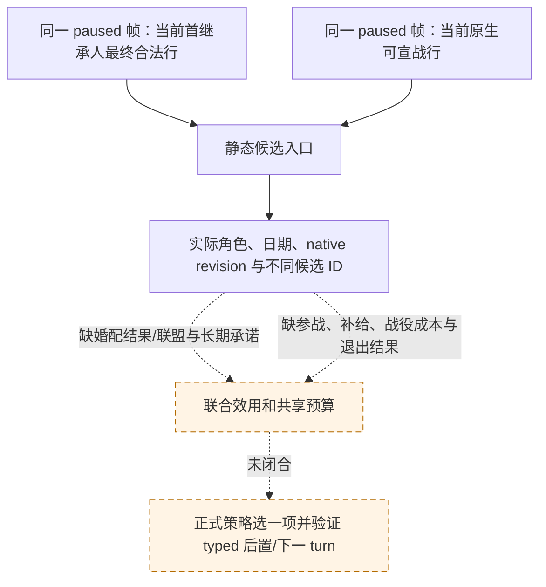

# M5 同帧候选入口：合法性与联合选择的边界

状态：**static-ready intake；联合选择未就绪**。冻结 CK3 `1.19.0.6`，EXE SHA-256
`2D00FF3101EF70B566F2FCBAE292F09263199C80E9DC8F139B82D7D96F83DB86`。
原生依据是[婚姻/联盟树](marriage-and-alliance.md)、[宣战树](war-declaration.md)、
[R736 同帧输入账本](m5-r736-joint-selector-inputs-2026-09-16.md)及
[R0082 字段缺口](m5-r0082-joint-selector-field-gap-2026-09-22.md)。

R0082 的不可变私有 typed 结果 SHA-256
`D7C3FE9BC820983BE6E747A2415DCDDC69F4FD5A10E88D65DC4543759A8B698A`：
同一 paused native revision `3` 中，玩家 `29829` 的首继承人 `38822` 有
657 个不同的最终合法候选，`native_rank` 全为 `null`。R736 的公共宣战
结果另有 30 个原生合法声明；它属于旧场景，不能与 R0082 合并成一次
同帧决策。两轮均没有执行 M5 选择或动作。

新 `m5_joint_intake.py` 只把**当前**私有首继承人合法性结果与公共宣战结果
装入同一候选表，要求查询前后维持相同的 paused native revision、日期和
玩家身份。它保留首继承人候选“无原生排名”和“私有动作未广告”的事实，
每个原生 declaration ID 只计一次。返回 `joint_selection_ready=false`、
`selected_step=null`，不将 `recipient_ai_accept_raw` 当成联盟价值，也不因
候选数达到五个就提出宣战或婚配动作。当前没有调用它的正式策略消费者。

下一项最小只读施工按现有 ABI 复用，不重做 657 行库存：

1. 在合法自然 paused 场景同帧读取现有 `state_snapshot` 的 treasury、
   `active_wars`、`player_armies`，并读取公共可宣战行及私有首继承人
   最终合法行；版本、玩家、首继承人和 native revision 必须一致。
2. 对五条**动态发现、不同且当前合法**的婚配行，使用已接线、默认关闭的
   `query-first-heir-candidate-alliance-projection-v1-private` 作真实 paused
   读回。其潜在 pair 只是接受后的创建尝试，不是最终联盟、收益或排名；
   仍需婚姻/订婚结果类型及承诺期限/取消代价。
3. 对一个当前合法 declaration，复用默认关闭的 M5 战前主力/补给只读口，
   再补尚缺的自愿盟友最终判定、战役资源消耗和退出条款。相对军力不是
   战争胜率；已在战争中的军队与现金不能重复计作新战争的可用预算。
4. 真实字段齐备后才版本化共同效用量表与资源占用，比较婚配、外交、
   宣战、维持现有战争和等待；每帧只提交一个正式 typed 动作，独立验证
   物质结果和下一 turn，必要时验证配对 checkpoint/cold restore。

该静态入口没有使 M5 从 `not_started` 变为完成，也没有公开 MCP 查询或
动作。R0082、R736 的读取资格各自保持原有边界。
