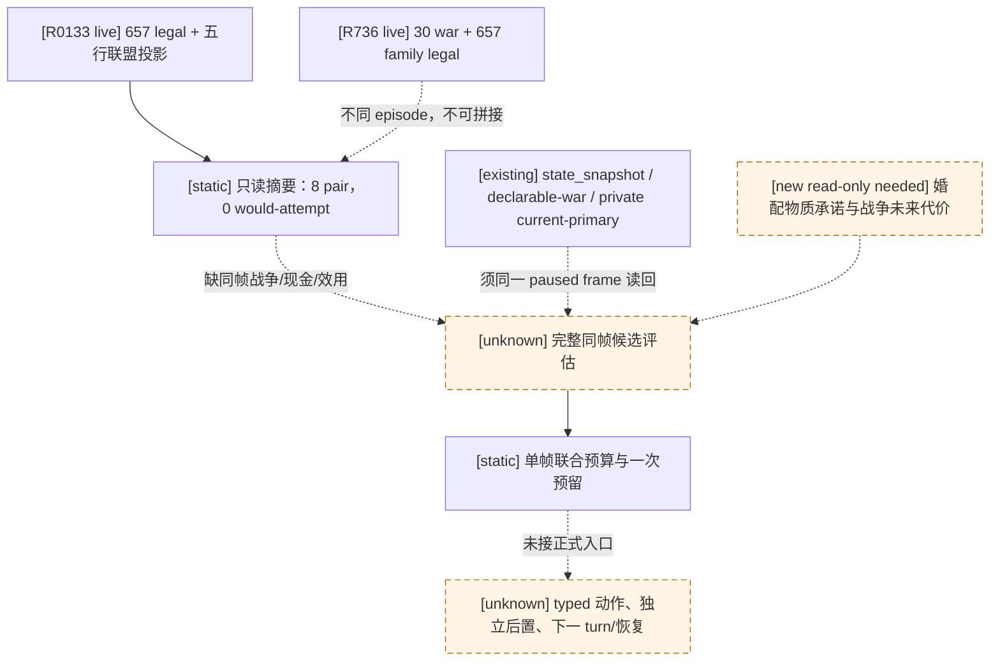

# M5 单帧联合调度与 R0133 只读边界

状态：**static-ready analytic dispatcher；尚无正式策略选择、typed 动作或下一 turn**。绑定 CK3 `1.19.0.6-steam23530548`，EXE SHA-256 `2D00FF3101EF70B566F2FCBAE292F09263199C80E9DC8F139B82D7D96F83DB86`。原生输入树见[婚姻与联盟](marriage-and-alliance.md)、[宣战](war-declaration.md)、[战前参战与补给](prewar-encounter-inputs.md)；本页只说明现有观测如何进入我方仲裁，不把原生合法性改写成效用。

## 已观测输入与不能拼接的证据

[R0133 实机报告](<Z:/ck3_mod_rewrite_process_assets/g2-m5-alliance-readback-live-R0133/evidence/report.json>) SHA-256 `CFE5635392393AABC4A1C5B1643151CA5C5A4CDAC9FF91740FD3661442F1B3B9`，同帧[五行联盟投影](<Z:/ck3_mod_rewrite_process_assets/g2-m5-alliance-readback-live-R0133/evidence/five-candidate-alliance-projection.json>) SHA-256 `C58A3279BCD544844298B9C53D1C635FC23384D6F76E112B092E2BB7A5DBCF3A`：玩家 `29829`、首继承人 `38822`、native revision `3`、`date_raw=53178264`、episode `native-29829-5e02a8fc4bfa`，657 个不同的 final-legal 行。动态抽样五个候选 `16778038/16778252/16778632/16778730/16778737` 都返回 `available`；八个 possible pair 全部 `both_have_realm_data=false`、`would_attempt_if_accepted=false`。该结果没有联盟收益、结婚或订婚物质结果、承诺期限或取消代价。

[R736 同帧账本](m5-r736-joint-selector-inputs-2026-09-16.md)在另一轮实例中同时观察到 30 条原生宣战和 657 条家庭合法行，但未留当前现金、战争、军队和补给快照。R0133 没有查询宣战。即使两轮来自相同原始 save、相同日期和 native revision，也不能把两个不同 episode 拼成一个同帧联合选择。现有 `m5_joint_intake` 因此额外携带 `snapshot_id`、公共 revision 与 `episode_run_id`；新调度核要求 intake、snapshot、每项外部评估与当前承诺读数的完整帧身份一致。

## 已可运行的纯分析仲裁

`m5_joint_dispatch.M5FrameDispatcher` 复用现有 `m5_joint_budget_selector` 的正净值、现金保留、军队可控、目标补给余量与角色/盟友/承诺互斥判断。调用者必须显式给出当前承诺现金和 `pending_war_slots`；计划中战争先占预算，不能等战争真正出现在 `active_wars` 才计入。一个受锁保护的 dispatcher 在同一 paused frame 最多预留一个分析候选，返回拟占用的现金、军队、盟友、角色、长期键和战争槽；同帧再次请求不返回第二个选择。它不生成 typed step，预留仍须由未来正式消费者在实际动作、后置和恢复时核对/释放。

`summarize_m5_alliance_readback` 消费现有私有合法性与投影 schema，核对 native revision、合法性 query sequence 和五个真实 final-legal ID，仅发布 possible pair 与 would-attempt 数量；它不会把 `available`、接收方 `ai_accept` 或零次 would-attempt 当成收益。R0133 摘录的静态测试得出 8 pair、0 would-attempt 和 `alliance_payoff_ready=false`。另一项**完全合成**的完整评估 fixture 验证了正收益安全场景会选择一个候选并预留资源、重复调用不会选择第二个；其现金、效用、补给和承诺数值都不是 R0133 实测。normal/-O 聚焦测试各 `17/17`。

## 下一最小只读查询入口

1. 在同一个新鲜 paused episode 中，先用**已有** `state_snapshot` 读取 `played_character_gold.raw/scale`、`active_wars`、`player_armies`；用公开 `query-declarable-wars` 和现有私有首继承人 final-legal/五候选投影读取两类候选，并在前后 snapshot 对照完整帧身份。这个组合不需要新原生偏移；R0133 runner 尚未同时保存这些字段。不能从 R736 文件补它们。
2. 婚配收益仍需扩现有默认关闭的五候选只读 bridge/MCP：绑定当前五角色 context，返回每候选的成人婚姻或订婚、lineality、原生联盟 pair 的可形成条件、真实双方 realm/盟友当前状态、持续义务与取消代价。优先复用现有 `marriage_alliance_readback_adapter_v1`、`marriage_native_outcome_classifier_v1` 和 `query-first-heir-candidate-alliance-projection-v1-private`；新增字段先以 exact-build 定义/调用链和版本 fixture 证明，再做 paused readback。R0133 前五行均无 realm pair，不能对它们编造联盟价值。
3. 战争成本先让已静态就绪的默认关闭 `query-m5-war-primary-current-v1-<target>` 在同一合法 declaration 上完成实机只读读回；它只覆盖当前主力、位置/路线与当前补给。再以[战前输入树](prewar-encounter-inputs.md)为入口补自愿盟友最终可调用性、未来目标路线补给、预计现金/兵力消耗和白和/投降物质退出价。现有战略 power ratio 不是胜率。长期承诺与共同效用权重由版本化策略明确给出，不能由 native legality 或枚举顺序推断。

所有补口均须先在私有、只读、exact-build 候选上按同帧结果核验；正式 M5 还需要一个策略消费者对至少五个不同真实候选进行联合选择、恰好一个 typed 动作、独立物质后置、下一 turn 消费及合同要求的恢复。当前 G2-M5 仍 `not_started`，不注册或广告公共 M5 能力。

## 2026-09-24：同帧有价短名单分析入口

`m5_joint_shortlist.compare_m5_joint_shortlist` 现在把现有 **unranked** 首继承人/宣战合法库存与现有正式域策略已选出的建设、派系礼金、内阁和生活方式 proposal 放入同一分析短名单。它没有重新查询或增加合法候选。每个被估值的婚配行须是同一原生合法性 query sequence 的五候选联盟投影之一；被估值的宣战行须与同帧私有 `m5-war-primary-current` 的 exact declaration、现金、当前 WarID 与现役补给读回一致。该私有战争读回只报告**当前**补给，已有 `future_supply_ready=false` / `campaign_cost_ready=false` 仍原样保留，不能由当前补给推断未来路线余量。

所有有价行必须声明同一个版本化共同价值政策和显式收益、战争、家庭、外交、补给、长期成本。建设/派系等已审批域 proposal 的金钱与军队/盟友/角色/长期承诺声明必须逐项等于其原始观测；共同金钱储备与域内最低储备取较大值；已发生与 pending 战争共同占用战争槽。分析核选最高正净值的可行候选并仅预留一个资源集合；同价按稳定候选 ID。它始终返回 `selected_step=null`、`formal_action_ready=false`。某候选未取得收益/长期义务、战争未来补给或统一量纲时，输出逐候选缺项；不足五条实际有价行不选。正收益可行例在纯合成测试中会选择礼金、生活方式或战争，视现金、盟友、补给和并发战争预算改变；测试没有把合成收益写成真实 R0082/R0133 战局。

当前生产读回尚无五条婚配的真实物质收益/长期义务，也没有一条宣战的未来路线补给、预计军费/兵损与退出价，更没有可比的版本化目标估值。因此新入口仅为可审阅 **static-ready analytic core**，没有正式调用者、typed 动作或 M5 里程碑升级。下一最小只读施工仍是同一 paused frame 的五候选婚配物质投影和一条 declaration-bound 未来路线/盟友/战役代价读回，再把真实估值交给这一入口；不得用 R0133 的八个 `would_attempt=false` pair 或原生答复分数代填收益。
