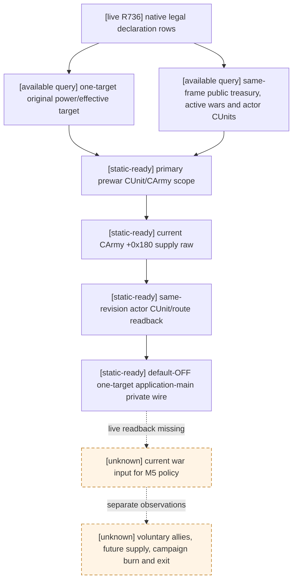

# M5 one-war current primary readback

This source-only helper is bound to frozen CK3 `1.19.0.6` and `ck3.exe`
SHA-256 `2D00FF3101EF70B566F2FCBAE292F09263199C80E9DC8F139B82D7D96F83DB86`.
It consumes existing exact-build observations; it adds no native call or game
action. The [R736 joint input tree](m5-r736-joint-selector-inputs-2026-09-16.md)
proved 30 native declarable war rows and 657 legal first-heir marriage rows on
one paused revision, but retained no `state_snapshot` armies or selected war
power assessment. R736 is only legal discovery.

The `ReadM5WarPrimaryReadbackV1` signature and exact input paths are in
`ck3_autonomous_player/native_bridge/research/m5_war_primary_readback_v1_contract.json`.
For **one** current native-legal declaration, it requires the same published
paused native revision for the complete declarable list, public
`state_snapshot`, existing one-target `WarEntryAssessmentsV1`, the
[declaration primary prewar scope](prewar-encounter-inputs.md), and the
[current CArmy supply source](m5-primary-current-army-supply-source-2026-09-16.md).
The effective target from the original assessment must be the prewar primary
defender. Each actor `CUnitID`/`CArmyID` supply row must match the public
`player_armies` ID, owner, current province and route. A public actor army
omitted from the primary scope makes the result unavailable; it cannot make an
empty supply list look like positive evidence.

`available_current_primary_slice` permits a real raw treasury zero, current
supply zero or no **currently raised** primary actor armies when the independent
sources agree. The original power ratio is retained as a native relative
metric, not converted to win probability. Neither this helper nor R736 prices
voluntary allies, future route supply, campaign cost/exit, or a first-heir
marriage alliance/long commitment. It therefore cannot claim
`joint_selection_ready`, choose one typed action or complete M5. The
`XAR_CK3_ENABLE_G2_M5_WAR_PRIMARY_CURRENT_PRIVATE_V1` candidate adds
`query-m5-war-primary-current-v1-<target CharacterID>` behind a default-OFF
build option. In one application-main mailbox invocation it double-checks the
public paused snapshot and native-final-legal one-target declaration rows,
runs the existing native power assessment, primary CUnit/CArmy source and
`CArmy+0x180` current supply source, then requires the same public/legal frame
again before returning the strict joined result. The first native-order legal
declaration row is observed, never ranked or submitted. The province resolver
is the exact-build read-only layout already implemented by the frozen adapter;
no new offset or native call is introduced. A mismatch returns unavailable,
not a partial success. This is **static-ready only**: no live readback or next
strategy-turn consumption yet; no capability registration/advertisement,
preview artifact or open_kaishek public contract change.
