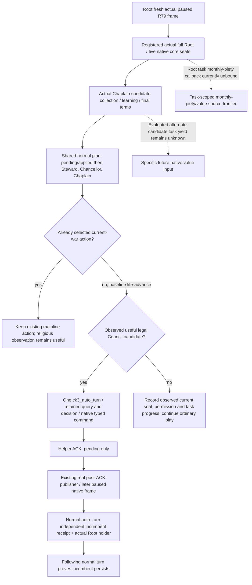

# M6 ordinary Chaplain opportunity on Native41 / R79

2026-10-09 / ISO2026-W41. Status: **NO_NEW_PRODUCTION_SOURCE**;
this is a finite Root live plan, not a new live result. The frozen complete
SDK source is `45ce81348ab7fcdde6900dfa95b9e5fbf546c927` at
`Z:/gbs-runtime41-person-mcp-qualified-source`; compiled Native41 is
`c928804c8afd61b6ded61c52b191b329e754d2da`. The exact target remains CK3
`1.20.0.4 / Steam25734779`, with the retained executable identity from the
accepted migration. No executable read or hash is performed here.

Root has accepted the Native36 candidate/Chaplain action qualification and
Native37 five-core-seat Root qualification. Reuse those results. Native37's
registered retry03 is actual GREEN at
`Z:/g2-native37-build01/root-consumer-retry03/ROOT-ACTUAL-RESULT.json`;
the earlier expected-dict and missing synthetic routing-context failures
remain historical artifacts. Neither their fixtures nor their fixes are
rerun for R79. The synthetic plan-only capability in that fixture is not
part of this live plan.

## Native inputs and existing ordinary path

Read the existing [realm-priest input tree](religion-realm-priest-council-native-ai-12003.md),
[actual4 Clergy mapping](religion-clergy-appointment-12004-migration.md),
[candidate terms source](clergy-candidate-terms-12004-source-closure.md),
[ordinary Chaplain command](chaplain-council-assignment-12004.md), and
[same Root Council seats](campaign-root-core-council-seats-12004.md).
Their earlier SOURCE_NOTRUN entries describe their original construction
stage; Root's later actual36/37 qualification supplies the present offline
readiness. It does not supply R79 live values.

The loaded native chain supplies current core seats through Lookup2684EE0,
actual Task/fullID/owner relations, current candidates and learning, and
candidate-specific final terms. Chaplain's task-bound assignment retains
115AAA0 and the complete 2968280 context+20 to CanSend307C020 command
validator; occupied confirmation uses the actual CanConfirm11604A0. The
existing Clergy query separately observes position/candidate validity,
Rite, task CanReassign and incumbent CanFire. These distinct observations
are not replaced with a new CanReassign-and-CanFire conjunction.

Learning is the existing bounded comparison, not complete stock AI utility
or an evaluated religious task yield. The ordinary consumer considers an
observed vacancy or a strictly better eligible candidate after pending and
applied receipt handling and existing Steward/Chancellor opportunities.
It reaches Chaplain only when the shared baseline still selects
`life-advance`. A selected current-war action retains priority. The owner
remains the played Robert29829; candidates are recipients, not extra actors.

## Root calls and dynamic bindings

The complete exact interface table, arguments and schema pointers are in
`Z:/ck3_mod_rewrite_process_assets/g2-parallel-20261009/faith-g2-next/m6-r79-live-plan/registered-interfaces.json`.
The ordinary role/ledger/decision branches are in the adjacent
`ordinary-opportunity-plan.json`. Root's actual R79 bootstrap already
contains `--private-council-query`,
`--private-player-clergy-appointment-query` and `--private-council-action`.
No new discovery flag or gate is introduced.

1. Root obtains its actual R79 paused snapshot using
   `ck3_take_snapshot(include_native_command_history=false)`. Use that response's revision/native revision,
   date, episode and played fullID. Bind every later expected revision to
   the actual current response. No fixture revision9, old incumbent56513,
   archived Task7162 or invented revision increment is a live input.
2. Call `ck3_query_campaign_root_context_v1(expected_revision=R)` and
   retain its whole response. Locate the row with
   `position_key=councillor_court_chaplain` in
   `/campaign_root_context/council/positions`; preserve its actual vacancy,
   incumbent, task, target, frozen state and progress. The same normal
   planner can reuse this successful same-frame history result.
3. For a finite religious opportunity observation, use the existing
   `ck3_query_council_final_gates_private_v1(expected_revision=R,
   position_key="councillor_court_chaplain")`. It includes current
   composition and final terms, so a separate composition request is
   unnecessary when this whole response already supplies the required
   candidate collection. One optional
   `ck3_query_player_clergy_appointment_v1(expected_revision=R,
   candidate_character_id=C)` uses a genuine current collection candidate
   or the observed incumbent; vacancy supplies no invented candidate.
   Keep native false values and the candidate-specific terms. An older
   CanReassign false is not this R79 frame's value.
4. Call `ck3_plan_turn()` with no arguments. Preserve the whole plan and
   its ordinary query/decision, selected role and selected candidate. If a
   current-war or another established normal action wins, Root continues
   that existing action; this plan does not force a Chaplain replacement.
   If the ordinary plan selects `private-assign-councillor-v1`, Root uses
   `ck3_auto_turn()` with no arguments for exactly one currently planned
   turn. It replans its actual current frame, invokes the existing formal
   submit path, and writes pending query, decision and ACK to the restored
   Council ledger. Check the actual returned plan rather than assume it
   must equal the earlier detached plan.
5. Treat the typed helper ACK as pending. The existing actual4 submit path
   sets `publish_after_ack` only for submitted-verification-pending; the
   dispatcher clears the previous coarse snapshot and calls the real native
   `PublishSnapshot`. That publisher reads actual state and advances its
   native revision, even when the same game date is paused. Council is not
   part of the coarse snapshot, so this existing publication prevents its
   change from being lost to snapshot deduplication. It proves a fresh
   frame, not an applied appointment. Root can observe it with
   `ck3_wait_for_change(after_revision=ACK_PRE_PUBLIC_REVISION,
   timeout_seconds=10.0)` or a fresh snapshot. Source witnesses are
   `native_bridge/src/bridge.cpp:11108`, `:17011`, `:11787` and `:11797`.
   On that distinct actual later
   paused frame with native revision greater than the ACK's pre revision,
   the normal consumer selects
   `private-query-assign-councillor-receipt-v1`. Root runs the next normal
   `ck3_auto_turn()` to consume its independent receipt. Actual frame
   progression may also follow a normal mainline action or state publication;
   no revision is synthesized, and no extra game day is claimed solely
   from a later frame. While awaiting it, continue only through existing
   supported normal frame progression, without another assignment.
   `council_pending_later_frame` with `selected_step=null` makes auto-turn
   blocked; it is not a hidden date-advance instruction. Observe the real
   post-ACK publication first, and retain existing pending until its actual
   receipt can be read.
6. The receipt must observe the requested candidate as the real incumbent
   on the same owner/role/task binding. The formal reader also obtains an
   independent full Root holder observation before moving pending to
   applied. A following ordinary `ck3_plan_turn()` must consume that
   applied record and report that the actual current holder persists.
   Preserve these responses and the existing Council ledger as the M6
   evidence package. Do not reset or hand-edit Root's restored ten streams.

`ck3_assign_councillor_private_v1` and
`ck3_query_council_assign_receipt_private_v1` are registered lower-level
tools with complete typed query/pending arguments. They do not themselves
write the ordinary formal ledger. This plan uses the ordinary
`ck3_auto_turn` route for the visible action and its verification chain.

## Outcomes and remaining source frontiers

A current occupied seat without a strictly better eligible candidate is a
valid observed no-op. A native denial or a helper-only unchanged seat is
retained as its actual result, not an applied appointment. No result from
this worker upgrades current live readiness or claims a complete M6 loop.

The adopted Clergy county sibling can already expose actual conversion
candidates, progress/rates and task dispatch/result primitives. Current45ce
has no ordinary county-conversion selector in the shared normal chain.
This round uses those fields as a read-only fallback where they provide
current task value; it does not add a selector or blindly retarget a county.
If Root selects a real fresh target via that established typed primitive,
task assignment and independent assignment result still do not prove
completed county conversion or a replaced Chaplain incumbent.

The Root binder explicitly leaves `task_owner_monthly_piety=nullptr`, so
`task_owner_monthly_piety_v1=unavailable` is an honest current source frontier,
not a completed yield observer. Once actual outcomes require religious
task utility beyond observed learning/progress, the next bounded source
entry is the actual task/owner-scope monthly-piety evaluator and related
ReligiousRelations accumulated-opinion value already named in the native
realm-priest ledger. Do not hand-calculate these values from historical
stock formulas or infer them from total player income. This finite live
plan closes no new yield source and performs no general religious audit.

Worker execution: **Game0 / SDK0 / build0 / test0 / production-import0 /
EXE-read0 / hash0**. Existing qualification and failures are reused;
new R79 paused observations, appointment, independent receipt,
following-turn outcome, new days and G2 material credit remain Root work.
