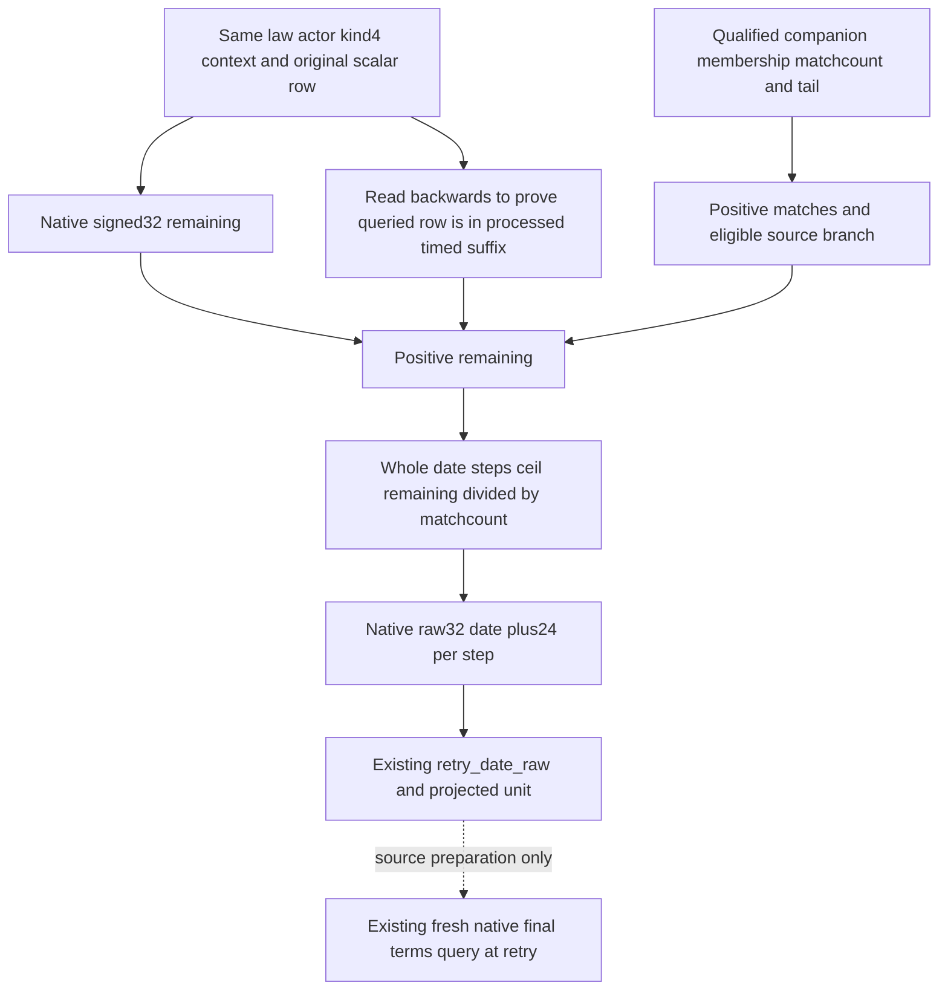

# M7 Character calendar retry projection

2026-10-09 / W41. This source increment follows the actual source and current
actor observer recorded in
[the Character-clock topic](m7-character-clock-calendar-deadline-12004.md).
Exact1.20.0.4 identity and source costs are retained; no EXE/hash/Game read
is repeated. The input provider passed Root's Native56 six new native
scenarios and seven whole-wire registered consumer cases; its canonical
receipt is recorded in the preceding topic. This separate projection is
**SOURCE_READY / FIRST_NOTRUN**. No policy call or live readiness is granted
here.

The selected native path writes rawdate+24, then invokes the named
UpdateTurnTick task. Each matching eligible full context entry increments
clock+28 once. The normalizer887360 processes the timed suffix backwards:
expiry-minus-clock with negative results clamped0, then clock0. For a
surviving row with positive remaining inside that suffix, rebasing preserves
the remaining. An untimed prefix ends that loop and remains distinct.

The deterministic relative projection is whole steps
`(remaining + match_count - 1) / match_count`, implemented with unsigned64
quotient/remainder to avoid changing native remaining arithmetic. Future
rawdate wraps through the native32 addition of24 per step and is sign
extended to the existing date DTO width. Twenty years and365-day calendar
constants do not enter this operation;24 is the actual date-writer step.
No packed full CDate is written by this readonly observation.

Projection requires the actual private companion to be available, contain
this exact kind4 context and allow ticking, with positive matchcount; the
queried row must be in the source-processed timed suffix and its existing
native signed32 remaining must be positive. These are actual source inputs,
not a new native permission gate. Otherwise retain original raw9 semantics.
The existing native counter fields keep their meaning. A distinct projected
unit and an actual computed retry_date_raw make the new result explicit.
Native final law terms still decide whether any later action may execute.

The authored production source owners are the existing observer and strict
Python transport/clock interpretation; no public layout, mailbox, serializer
or new native getter changes. The observer retains the exact matched row
index, proves its timed-suffix membership from the same scalar array and
sets the existing `retry_date_raw` with unit
`scalar_clock_step_calendar_projected`. Otherwise it retains the earlier
unit and null retry value. The transport checks this projected date against
the same whole-wire frame and qualified companion. The existing pure clock
interpreter retains the native clock deadline and reports
`calendar_deadline_ready=true` only for that projected unit. No strategy or
action caller changes.

The existing law-wire fixture now has the independent mode
`--calendar-deadline-wire-dir <fresh-directory>`. Four new whole wires pass
through the real private mailbox, reader and command-results emitter:

| Whole wire | Actual fixture inputs | Expected result |
| --- | --- | --- |
| `single-match-timed-suffix.json` | One exact context match, untimed prefix, clock7 and expiry27 | Remaining20; raw retry53169552. |
| `double-match-odd-remaining.json` | Two exact matches, clock7 and expiry28 | Remaining21; eleven date steps; raw retry53169336. |
| `known-not-member.json` | Complete valid manager without this context | Known count0, original unit and null retry. |
| `manager-read-unavailable.json` | Actual denied late bucket-pointer read | Raw remaining retained; companion unavailable; original unit and null retry. |

The synthetic native frame date is53169072. Each scenario asserts one kind4
resolution, two stable frame snapshots and zero actions. The first case
proves that an untimed prefix does not prevent projection of a later timed
row; the second proves unsigned quotient/remainder rounding for multiple
matching entries. The canonical scalar names and original native final
terms remain unchanged.

The sole new registered consumer is
[test_crown_authority_cooldown_calendar_deadline_registered_query.py](../../ck3_autonomous_player/tests/test_crown_authority_cooldown_calendar_deadline_registered_query.py),
method `test_calendar_deadline_reaches_registered_realm_law_query`. Its
standalone launcher requires `--source-root`, `--source-sha`,
`--native-wire-dir` and `--output-dir`. It consumes exactly the four compiled
whole wires through actual MCP registration, Service lifecycle, Driver,
strict transport and protocol ingest/wait, and asserts both computed dates
and the two unavailable/nonmembership distinctions. Synthetic endpoint
metadata remains explicit; native packets are not repaired by the consumer.

The focused CTest leaf registers
`crown_authority_cooldown_calendar_deadline_whole_fixture_12004` on the
existing genuine fixture target. Root selects only the new mode and sole
consumer. The minimum following native increment is one Runtime owner,
`crown_authority_cooldown_observer_12004.cpp`, plus the existing fixture;
Bridge, Protocol and the other Runtime owners retain their qualified pins.
Root will compose this after Native57 and qualify it as Native58. Old6/7
GREEN scenarios are retained. Worker builds, tests, project imports,
EXE/hash/Game/SDK calls and new live/day/G2 credit are all0.
