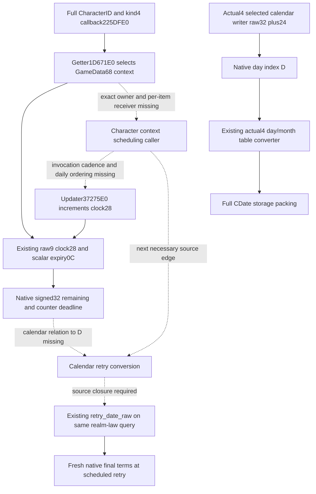

# M7 Character clock to calendar deadline

2026-10-09 / 2026-W41. Source baseline
`a41c05d1eb9f9e107dc4bbda9237b6dab34c8c2a`, isolated tree
`Z:/cg48-m7-calendar`. Exact target remains CK3 1.20.0.4 / Steam25734779 /
EXE SHA-256 `98702F88A547CDE2EAF29A85F93B85F68EE4CF8148336A4F7AFAEB75319DD518`.
The identity and previous source qualifications are reused, with no hash or
binary read. Root owns any new capture and all runtime qualification.

The decision input is a usable calendar deadline for a currently observed
timed Character scalar, so that the existing M7 plan can schedule a fresh
native final-terms query. This remains necessary even when a particular
current policy branch happens not to select an action. No current crown-law
level, historical material outcome or authored duration supplies that deadline.

## Source tree and the remaining writer

The [existing cadence topic](crown-authority-cooldown-character-cadence-source-12004.md)
closes the Character kind4 callback `225DFE0`, full-context getter `1D671E0`
and updater `37275E0`. The getter selects
`QWORD[QWORD[GameData+68]+signed32_index*8]` using Character's own handle.
The raw observer reads that context's signed clock at `+28` and the first
matching scalar row's signed expiry at `+0C`. Their native signed32
subtraction is already published; it is not yet a date difference.

The held updater increments this same clock at `3727616` on its eligible
invocation and calls the inner normalizer at `372762E`. Its invocation
frequency and order against the calendar write are not attached. The known
old3 daily call instead passes `GameData+C8`; it does not prove a daily visit
to the Character context table at `GameData+68`.

The existing actual writer fragment `3728439..37284EF` gives the exact
counter writer: a positive `R9D` duration reads the inner receiver's clock
at `372843E`, adds the duration at `3728441` using native32 arithmetic and
stores expiry at row+0C at `37284E6`. A nonpositive duration selects expiry
`-1`. The captured caller uses full-context+8 as that inner receiver, so
inner+20 is full-context+28. The separately named captured effect caller is
`CAddCharacterFlagEffect`; it is not relabeled as a `set_variable` parser.
This closes the counter writer formula and still leaves its calendar relation
unproved. The actual source evidence is retained in
[MINIMUM-WRITER-EVIDENCE.json](Z:/ck3_mod_rewrite_process_assets/g2-parallel-20261009/m7-calendar-deadline48/scalar-writer/MINIMUM-WRITER-EVIDENCE.json).

## Newly joined existing calendar implementation

The current source already contains
[ck3_12004_cdate_calendar.hpp](../../ck3_autonomous_player/native_bridge/include/xar_bridge/ck3_12004_cdate_calendar.hpp).
`ReadSourceDerivedNextCDateCalendar12004` accepts a **native raw32 date and
native day index**, then uses the actual day table `444C4B0` and month table
`444C340`. It computes signed year quotient `D / 365`, corrects only the
physical table index for a negative remainder and packs raw32, day, month
and year16 into the original native CDate64 layout. This is a reusable
implementation, not a Character-clock converter.

The current Army next-frame source derives its own next date by wrapping
raw32 addition of24 and obtains `D` by signed division of the wrapped
`next_raw32 - 43800000` by24. Its reader obtains the corresponding inputs
from `GameState+08/+9C`; its Unit owner uses `GameData+2A508`. Neither
receiver is the Character variable context. This source join avoids
reimplementing the calendar packing once the Character scheduling relation
is known, while preserving the actual missing input.

## Existing query and minimum implementation seam

The producer is
[crown_authority_cooldown_observer_12004.cpp](../../ck3_autonomous_player/native_bridge/src/crown_authority_cooldown_observer_12004.cpp).
The existing `Observation` has `remaining_unit` and `retry_date_raw`; no new
DTO, MCP method, public Snapshot layout, action or scheduler is needed.
The strict consumer is
[realm_law_paused_private_transport.py](../../ck3_autonomous_player/src/xar_autoplayer/bridge/realm_law_paused_private_transport.py).
It currently retains `scalar_clock_step_calendar_unqualified` and rejects a
present-row calendar retry date, accurately reflecting the missing source.
The pure clock helper preserves the counter deadline and does not relabel it.

After the actual caller closes the relation, the minimum production change
is that observer's present-timed conversion and the matching existing strict
normalizer branch. A same-query whole-wire qualification should cover a
positive remaining value, legitimate zero, a timed computed-minus-one,
the source-defined daily ordering boundary, untimed, absence and read failure.
The exact expected calendar numbers must come from that new source; they
are not authored now. Final native permission remains independent of timing.

## Necessary next source entrance

The next native writer entrance is **an actual caller of `37275E0` whose
receiver reaching definition attaches the GameData+68 Character context**.
The already reviewed named scopes contain no such caller site. No caller
RVA, extent or daily order is invented from the updater's address.

To resolve that specific missing site, a proposed Root-only source locator
uses only direct E8-call encodings whose target is the already proved
`37275E0`, records finite neighboring instruction bytes and attaches each
candidate to the held runtime-function table. It does not enumerate all
callees or scan script names. An existing owner-confirmed raw text cache
would avoid any new image read; without one, this proposal costs one existing
mapped `.text` read of71141888 bytes. Root accepted this necessary single-target
E8 source cost; the recipe remains **SOURCE_NOTRUN**, not a capture receipt
or capability.
The parent must not execute an expected-failing game query to justify it.

Literal matches and E8 byte candidates alone do not prove an instruction
boundary, receiver or cadence. A positive result must first be decoded from
its emitted small cache, then select only the necessary caller range if
more source is needed. A zero result would reject this direct-reference
route, not justify recursively expanding unrelated generic callees.

## Execution and readiness

This increment reads source and existing metadata only. Game, SDK, pipe,
UI, process, runtime prepare/rebind, EXE/bin reads, hashes, builds, project
imports and tests are all0. Previous raw9 and pure-clock GREEN qualifications
are reused without a replay. No CA material, guessed20-year countdown,
flag-set parser factor or constructor default is used as calendar evidence.

Calendar deadline and scheduled-retry readiness remain **research**;
`calendar_deadline_ready=false`. The concrete reuse seam and next writer
entrance are recorded here rather than adding a permanent-null schema.
No live, new-day, natural succession, completed family or G2 credit is added.
Root owns daily/W41 integration, source adoption, capture, FIRST and push.
