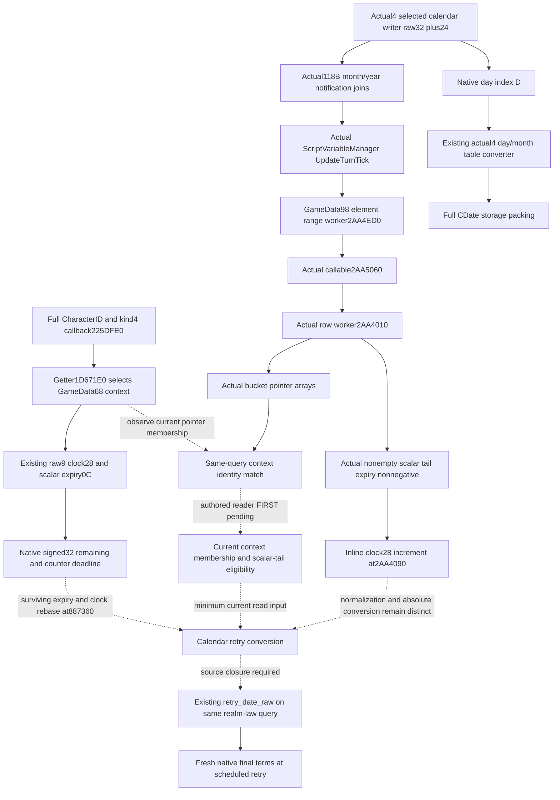

# M7 Character clock to calendar deadline

2026-10-09 / 2026-W41. Source baseline
`a41c05d1eb9f9e107dc4bbda9237b6dab34c8c2a`, isolated tree
`Z:/cg48-m7-calendar`. Exact target remains CK3 1.20.0.4 / Steam25734779 /
EXE SHA-256 `98702F88A547CDE2EAF29A85F93B85F68EE4CF8148336A4F7AFAEB75319DD518`.
The identity and previous source qualifications are reused, with no hash or
binary read. Root owns any new capture and all runtime qualification.

The decision input is a usable calendar deadline for a currently observed
timed Character scalar, so that the existing M7 plan can schedule a fresh
native final-terms query. This remains necessary even when a particular
current policy branch happens not to select an action. No current crown-law
level, historical material outcome or authored duration supplies that deadline.

## Source tree and the remaining writer

The [existing cadence topic](crown-authority-cooldown-character-cadence-source-12004.md)
closes the Character kind4 callback `225DFE0`, full-context getter `1D671E0`
and updater `37275E0`. The getter selects
`QWORD[QWORD[GameData+68]+signed32_index*8]` using Character's own handle.
The raw observer reads that context's signed clock at `+28` and the first
matching scalar row's signed expiry at `+0C`. Their native signed32
subtraction is already published; it is not yet a date difference.

The held updater increments this same clock at `3727616` on its eligible
invocation and calls the inner normalizer at `372762E`. Its invocation
frequency and order against the calendar write are not attached. The known
old3 daily call instead passes `GameData+C8`; it does not prove a daily visit
to the Character context table at `GameData+68`.

The existing actual writer fragment `3728439..37284EF` gives the exact
counter writer: a positive `R9D` duration reads the inner receiver's clock
at `372843E`, adds the duration at `3728441` using native32 arithmetic and
stores expiry at row+0C at `37284E6`. A nonpositive duration selects expiry
`-1`. The captured caller uses full-context+8 as that inner receiver, so
inner+20 is full-context+28. The separately named captured effect caller is
`CAddCharacterFlagEffect`; it is not relabeled as a `set_variable` parser.
This closes the counter writer formula and still leaves its calendar relation
unproved. The actual source evidence is retained in
[MINIMUM-WRITER-EVIDENCE.json](Z:/ck3_mod_rewrite_process_assets/g2-parallel-20261009/m7-calendar-deadline48/scalar-writer/MINIMUM-WRITER-EVIDENCE.json).

## Newly joined existing calendar implementation

The current source already contains
[ck3_12004_cdate_calendar.hpp](../../ck3_autonomous_player/native_bridge/include/xar_bridge/ck3_12004_cdate_calendar.hpp).
`ReadSourceDerivedNextCDateCalendar12004` accepts a **native raw32 date and
native day index**, then uses the actual day table `444C4B0` and month table
`444C340`. It computes signed year quotient `D / 365`, corrects only the
physical table index for a negative remainder and packs raw32, day, month
and year16 into the original native CDate64 layout. This is a reusable
implementation, not a Character-clock converter.

The current Army next-frame source derives its own next date by wrapping
raw32 addition of24 and obtains `D` by signed division of the wrapped
`next_raw32 - 43800000` by24. Its reader obtains the corresponding inputs
from `GameState+08/+9C`; its Unit owner uses `GameData+2A508`. Neither
receiver is the Character variable context. This source join avoids
reimplementing the calendar packing once the Character scheduling relation
is known, while preserving the actual missing input.

## Existing query and minimum implementation seam

The producer is
[crown_authority_cooldown_observer_12004.cpp](../../ck3_autonomous_player/native_bridge/src/crown_authority_cooldown_observer_12004.cpp).
The existing `Observation` has `remaining_unit` and `retry_date_raw`; no new
DTO, MCP method, public Snapshot layout, action or scheduler is needed.
The strict consumer is
[realm_law_paused_private_transport.py](../../ck3_autonomous_player/src/xar_autoplayer/bridge/realm_law_paused_private_transport.py).
It currently retains `scalar_clock_step_calendar_unqualified` and rejects a
present-row calendar retry date, accurately reflecting the missing source.
The pure clock helper preserves the counter deadline and does not relabel it.

After the actual caller closes the relation, the minimum production change
is that observer's present-timed conversion and the matching existing strict
normalizer branch. A same-query whole-wire qualification should cover a
positive remaining value, legitimate zero, a timed computed-minus-one,
the source-defined daily ordering boundary, untimed, absence and read failure.
The exact expected calendar numbers must come from that new source; they
are not authored now. Final native permission remains independent of timing.

## Necessary next source entrance

The next native writer entrance is **an actual caller of `37275E0` whose
receiver reaching definition attaches the GameData+68 Character context**.
The already reviewed named scopes contain no such caller site. No caller
RVA, extent or daily order is invented from the updater's address.

To resolve that specific missing site, a proposed Root-only source locator
uses only direct E8-call encodings whose target is the already proved
`37275E0`, records finite neighboring instruction bytes and attaches each
candidate to the held runtime-function table. It does not enumerate all
callees or scan script names. An existing owner-confirmed raw text cache
would avoid any new image read; without one, this proposal costs one existing
mapped `.text` read of71141888 bytes. Root accepted and subsequently executed
this necessary single-target E8 source cost, as recorded below. The initial
recipe's SOURCE_NOTRUN status is historical; it is not capability evidence.
The parent must not execute an expected-failing game query to justify it.

Literal matches and E8 byte candidates alone do not prove an instruction
boundary, receiver or cadence. A positive result must first be decoded from
its emitted small cache, then select only the necessary caller range if
more source is needed. A zero result would reject this direct-reference
route, not justify recursively expanding unrelated generic callees.

## Actual single-target result and context-task continuation

Root executed the E8-only locator at2026-10-09T13:28:25.791154Z through
13:28:26.160641Z:71141888 frozen-image source bytes/one read,0.3694866s total
and0.0146766s for that source read. No raw whole-text cache was persisted.
The [actual result](Z:/ck3_mod_rewrite_process_assets/g2-parallel-20261009/m7-calendar-deadline48/root-caller-first01/CHARACTER-CLOCK-CALL-CANDIDATES.json)
has exactly one candidate at `22A100B`. Its emitted229-byte small window was
decoded once from JSON with0 further image/bin reads.

Actual `22A0FFD` obtains GameData from `[RSI+A0]`, `22A1004` passes its
embedded `+C8` context and `22A100B` calls `37275E0`. Thus the only direct
reference does not attach the Character context receiver. This conclusion
does not exclude an inlined or indirect Character update.

The same actual window supplies a positive next task entrance after that
call: `22A1040` changes RBX to `GameData+98`, `22A1053` retains that container
and `22A105A` reads its count at `+C`. Actual LEAs select data `477C408` and
`472E7B0`, stored in the task frame at `+48/+50`; their type/name is unproved.
The instruction starting at `22A105D` has only a three-byte prefix in this
small window. The corresponding held old3 source continuation constructs
partition arguments and calls its task dispatcher `2AA4B00`. That historical
target is not transferred into an actual4 binder.

The [next finite manifest](Z:/ck3_mod_rewrite_process_assets/g2-parallel-20261009/m7-calendar-deadline48/ROOT-CONTEXT-TASK-NEXT-MANIFEST.json)
therefore selects only the actual100-byte fallthrough prefix and two actual
LEA data spans of64 bytes each, cache first: maximum228 bytes/three reads.
Root executed this228-byte/three-read manifest at13:33:55.865173Z through
13:33:56.481123Z, total0.6159467s. Both pointed data spans contain terminated
ASCII: `477C408` is
`C:\mnt\gsg\ck3\titus\source\logic\script_variable_manager.cpp`, and
`472E7B0` is `UpdateTurnTick`. These identify the genuine variable-manager
task rather than a guessed CharacterNewDay name. The code constructs its
partition inputs from container count+C and scheduler thread count+AC+1,
then actual `22A10BC` calls `2AA4AE0`.

The new source result and sole decode are
[CONTEXT-TASK-SOURCE.json](Z:/ck3_mod_rewrite_process_assets/g2-parallel-20261009/m7-calendar-deadline48/root-context-task-first01/CONTEXT-TASK-SOURCE.json)
and [CONTEXT-TASK-DECODE-AND-NEXT-PIN.json](Z:/ck3_mod_rewrite_process_assets/g2-parallel-20261009/m7-calendar-deadline48/CONTEXT-TASK-DECODE-AND-NEXT-PIN.json).
No old229-byte window, updater or getter was decoded again.

The held actual runtime fragment for that emitted callee is precisely
`2AA4AE0..2AA4ED0`,1008 bytes, ordinal146968. The next
[Root-only recipe](Z:/ck3_mod_rewrite_process_assets/g2-parallel-20261009/m7-calendar-deadline48/ROOT-VARIABLE-TURNTICK1008-ARGV.json)
selects only this named task entry, cache first, maximum1008 bytes/one read.
It was SOURCE_NOTRUN when prepared; Root's execution is recorded below.
Its actual row/worker operands must establish the
Character collection and clock update; `GameData+98` alone is not renamed
Character and no relation to `GameData+68` is assumed. No unrelated generic
scheduler callee is selected.

Root subsequently captured that1008-byte entry. The sole cached decode
closes its direct sequential worker path: `2AA4EB1` passes the original
functor as RCX and `2AA4EB4` calls `2AA4ED0` with a two-int begin/end range.
That actual callee's held interval is `2AA4ED0..2AA5051`,385 bytes. Root
captured it once; the actual receipt records385 fresh bytes/one read and
0.6454678s. Its loop obtains the original `GameData+98` container through
functor+40 and advances the actual element index through the supplied range.

This element layer includes profiling context bookkeeping. Those TLS,
profiling and scheduler helpers are not expanded. Instead, its actual LEA
at `2AA4F0E` selects callable target `2AA5060`. The function constructs the
callable's arguments from the real container and current element-index
pointer before handing it to `3978C00`. This is the next concrete data
worker rather than an inferred virtual callback.

The target has no runtime-function row; the next held row begins at
`2AA50C0`. The [sole next recipe](Z:/ck3_mod_rewrite_process_assets/g2-parallel-20261009/m7-calendar-deadline48/ROOT-TURNTICK-LEAF96-ARGV.json)
selects that finite96-byte intervening region, cache first, and does not call
it a96-byte logical whole function. It was SOURCE_NOTRUN at preparation;
Root's execution is recorded below. The published
source pin and both unique cached decodes are
[VARIABLE-TURNTICK-CALLEE1008-DECODE.json](Z:/ck3_mod_rewrite_process_assets/g2-parallel-20261009/m7-calendar-deadline48/VARIABLE-TURNTICK-CALLEE1008-DECODE.json),
[VARIABLE-TURNTICK-ELEMENT385-DECODE.json](Z:/ck3_mod_rewrite_process_assets/g2-parallel-20261009/m7-calendar-deadline48/VARIABLE-TURNTICK-ELEMENT385-DECODE.json)
and [TURNTICK-LEAF-CALLBACK-NEXT-PIN.json](Z:/ck3_mod_rewrite_process_assets/g2-parallel-20261009/m7-calendar-deadline48/TURNTICK-LEAF-CALLBACK-NEXT-PIN.json).

Root executed that96-byte region once,0.5780831s. The necessary callable is
only23 bytes, `2AA5060..2AA5077`: it reads the actual element index and then
`QWORD[QWORD[GameData+98]+index*8]` into RDX before tail-transferring at
`2AA5072` to `2AA4010`. Other thunks and padding present in the bounded region
are left alone.

The initial held runtime row at `2AA4010..2AA403A` is42 bytes. Root captured
it once,0.6230298s. Actual source reads the selected row's count at `+C`,
then branches from `2AA4034` to `2AA4307`, with fallthrough `2AA403A`.
There is no return in this42-byte prefix. This corrects any interpretation
of its pdata row as the full logical worker.

The corresponding held continuation rows are `2AA403A..2AA4307` and
`2AA4307..2AA4310`; the [next sole recipe](Z:/ck3_mod_rewrite_process_assets/g2-parallel-20261009/m7-calendar-deadline48/ROOT-TURNTICK-CONTINUATION726-ARGV.json)
captures only their726 bytes, preserving the common conditional exit and
excluding the already consumed42-byte prefix. This is a continuation of
the same selected data worker, not a new generic callee. The actual decoded
sources are [leaf96](Z:/ck3_mod_rewrite_process_assets/g2-parallel-20261009/m7-calendar-deadline48/VARIABLE-TURNTICK-LEAF96-DECODE.json)
and [prefix42](Z:/ck3_mod_rewrite_process_assets/g2-parallel-20261009/m7-calendar-deadline48/VARIABLE-TURNTICK-CONTEXT42-DECODE.json).
Character context selection and the clock update remain unproved at this
prefix; no calendar formula or counter unit is inferred from the task name.

Root completed the726-byte continuation once,0.7252758s. Reusing the decoded
42-byte prefix now closes the logical768-byte worker through its actual
`2AA430F` return. The outer selected row is a bucket: data at+0, count+C,
pointer entries of8 bytes. Each nonnull entry becomes R15, an actual full
variable context with scalar rows+10, count+1C and clock+28. The decisive
source path is:

| Actual instruction | Input and effect |
| --- | --- |
| `2AA4070..2AA408E` | Scalar count must be nonzero and the last0x20-byte row's expiry0C must be nonnegative. |
| `2AA4090` | Increment this exact full context's clock28 once. |
| `2AA4094..2AA40A4` | Compare updated clock with that last scalar expiry. |
| `2AA40A6..2AA40AA` | If due, pass the same context+8 to the already named normalizer887360. |
| `2AA40B0..2AA40F6` | Remove the due tail row and continue removing timed zero-expiry tails; keep the untimed sentinel distinct. |
| `2AA42D1..2AA42E8` | Advance by8 to the next context pointer within the bucket count. |
| `2AA4307..2AA430F` | Common exit restores stack and returns. |

This closes the real inline clock writer and explains why the single-target
E8 scan found only the unrelated embedded+C8 call. List-variable handling
and task-maintenance queue code in the same worker are retained in the source
packet but not expanded into additional capabilities.

Two concrete inputs remain before calendar retry publication. First, the
current Character context selected by the existing kind4 getter must be
matched by pointer identity against these actual manager buckets; matching
field layouts alone is not that identity. This can be read within the same
law query using the qualified GameState slot `5C68C50` and GameState+A0,
without a new native getter. Its real last scalar expiry also states whether
the current context takes the clock increment branch.

Second, the existing qualified calendar writer ends at `22A0F05`, while the
new task window begins at `22A0F7B`. The sole missing118-byte control-flow
bridge is the [next finite order recipe](Z:/ck3_mod_rewrite_process_assets/g2-parallel-20261009/m7-calendar-deadline48/ROOT-CALENDAR-ORDER118-ARGV.json).
It can establish the actual branch/order relation between one rawdate+24
write and the task invocation, preserving both already held ends. A frozen
same-actor law thin pair with actual date, clock and expiry at different
dates is an alternative interval observation; no game query is performed.
Normalization of other due rows must retain its real source meaning; neither
an authored20-year constant nor a task label substitutes for these inputs.

## Actual calendar-to-task order closure

Root completed that118-byte gap once: `22A0F05..22A0F7B`, one frozen-image
read,0.6742582s. Its [actual result](Z:/ck3_mod_rewrite_process_assets/g2-parallel-20261009/m7-calendar-deadline48/root-calendar-order-first01/CALENDAR-TO-TURNTICK-ORDER118.json)
and [sole cached decode](Z:/ck3_mod_rewrite_process_assets/g2-parallel-20261009/m7-calendar-deadline48/CALENDAR-TO-TURNTICK-ORDER118-DECODE.json)
complete the previously missing control-flow bridge. No end window was
decoded again.

Actual `22A0F47` skips the month notification to already held `22A0FC7`;
`22A0F69` and `22A0F78` skip optional logging to already held `22A0FB3`.
The successful logging fallthrough is the already held `22A0F7B`. All these
paths then reach `22A0FFD`, followed by the embedded global+C8 update and
the real variable-manager task. This bridge has no branch bypassing that
task and no second date write. It therefore closes the order on the selected
native rawdate+24 path: date write, optional month/year notification and
logging, then `UpdateTurnTick`. It does not establish every possible caller
of that path, or an absolute Character deadline formula.

## Minimum same-query membership and eligibility observer

The next implementation is a read-only input on the existing
`query-realm-law-final-terms-v1-private`, not a new scheduling action. The
existing `crown_authority_cooldown` nine-field leaf remains intact. A private
companion leaf named `crown_authority_cooldown_turn_tick` can carry the real
current-context scheduling input. The full implementation and first-run
contract is frozen in [SAME-QUERY-OBSERVER-IMPLEMENTATION-CONTRACT.md](Z:/ck3_mod_rewrite_process_assets/g2-parallel-20261009/m7-calendar-deadline48/SAME-QUERY-OBSERVER-IMPLEMENTATION-CONTRACT.md).

Resolve the same full played CharacterID with the existing kind4 target and
native `variable_context` callback once, retaining the exact pointer used
for the raw cooldown read. Read GameData through the already qualified
actual4 slot `5C68C50` and GameState+A0. Its embedded+98 container has data
at+0 and signed count+C; each selected bucket has the same pointer-array
data/count layout. Compare each nonnull full-context pointer with that
retained pointer. The comparison is pointer identity within this one paused
mailbox capture; no pointer is serialized and no bucket is presumed to be
the Character collection merely because its layout matches.

Read the current context's scalar count+1C, rows+10 and last row expiry
`rows + (count-1)*0x20 + 0x0C`. Count zero is a legitimate false eligibility
result without reading a row. For a nonempty readable scalar array, expiry
>=0 is exactly the source branch that reaches `2AA4090`. An untimed last
row is a legitimate false result even if another matching row exists.
Record `manager_contains_context` and `scalar_tail_allows_tick` independently;
their conjunction is `context_takes_tick_branch`. Do not substitute the
queried cooldown row's own timed flag, maintenance slot+48, pending flag+4E
or an arbitrary current actor for either input. Valid empty collections and
no pointer match produce knownfalse; a read failure produces an unavailable
result with a concrete reason, preserving the raw9 independently.

The implementation should keep `RealmLawReadback12002`, the existing
`Observation` and public Snapshot layouts unchanged. A dedicated private
sidecar is local to the actual4 mailbox owner. A private capture/serializer
overload carries it through the existing mailbox; legacy entry signatures
and the old nine-field normalizer remain available. The concrete owning
source seams are `crown_authority_cooldown_observer_12004.cpp`,
`ck3_12002_realm_law.cpp` and `ck3_12002_realm_law_mailbox.cpp`, with the
existing private Python realm-law transport retaining the new known input.
No dependency count or incremental build qualification is invented before
those source changes exist.

The unique next FIRST contract consumes whole law wires from the real new
reader, using fixture-owned GameState, GameData, bucket and full-context
arrays. It covers a late exact pointer match, legitimate empty/absent
membership, scalar count zero, an untimed tail, and an actual memory-read
failure independent of the raw cooldown result. Registered consumption
must retain the source values while leaving calendar deadline readiness
false. Previous raw9 GREEN scenes are retained rather than replayed. This
contract is SOURCE_NOTRUN: no observer implementation, compiled fixture,
consumer run or live membership observation is claimed here.

## Execution and readiness

Worker execution reads source, cached JSON instructions and existing metadata
only. Worker Game, SDK, pipe, UI, process, runtime prepare/rebind, EXE/bin
reads, hashes, builds, project imports and tests are all0. Root's source
captures are distinct:71144571 physical frozen-image bytes/eleven reads in
5.6531017s, comprising one71141888-byte locator read and2683 retained small
source bytes. These are physical read costs, not unique image coverage;
small code captures overlap the earlier unpersisted locator buffer. Root
source costs are counted once, not again for cached JSON decoding.
Previous raw9 and pure-clock GREEN qualifications
are reused without a replay. No CA material, guessed20-year countdown,
flag-set parser factor or constructor default is used as calendar evidence.

Calendar deadline and scheduled-retry readiness remain **research**;
`calendar_deadline_ready=false`. The concrete reuse seam and next writer
entrance are recorded here rather than adding a permanent-null schema.
No live, new-day, natural succession, completed family or G2 credit is added.
Root owns daily/W41 integration, source adoption, capture, FIRST and push.

## Authored same-query private companion

The contract above is now implemented in the isolated full source tree
`Z:/cg49-m7-turntick-context`, based on Root's integrated
`1e6d5fa4f6e1696218a730db1dbea8700c81944f`. This source increment is
**SOURCE_READY / FIRST_NOTRUN**, not a compiled or live observation.

The private header
[crown_authority_cooldown_turn_tick_12004.hpp](../../ck3_autonomous_player/native_bridge/include/xar_bridge/crown_authority_cooldown_turn_tick_12004.hpp)
introduces the query-local companion and capture/serializer entry points.
The original `Observation`, `RealmLawReadback12002`,
`RealmLawReadbackQuery12002`, public Snapshot and their shared headers are
unchanged. Exactly three production Runtime owners include the new private
header: the existing cooldown reader, law capture/emitter and law mailbox.
There is no Bridge or protocol source change.

The cooldown implementation resolves kind4 once and passes that exact pointer
to both old raw9 and the new memory-backed reader. Its actual GameState+A0
and GameData+98 accesses use the existing law memory callback. It traverses
every bucket entry and counts every matching pointer; it does not stop at
the first match. The new wire therefore has seven fields: the six from the
initial contract plus `manager_match_count`, a copied unsigned64 count.
Available membership equals count>0. The eligibility conjunction remains a
current source-branch input and not an ACK or a guarantee about later state.
Valid empty manager/count0, no match, zero scalars and an untimed tail are
available known values. Failures keep a concrete reason and null input
values while leaving raw9 independent.

Actual4 uses `RealmLawTurnTickQuery12004` to compose the old query with this
sidecar. `ExecuteRealmLawPausedPrivateQueryWithTurnTick12004` enters the same
paused mailbox, captures law terms/raw9/companion, then calls the existing
Finish logic. `ReadRealmLawOnApplicationMain12002` selects that private
executor and serializer for the actual4 build. Older entry signatures and
serialization remain callable. The existing registered law tool and strict
transport retain the optional sibling without introducing an action or
replacing native final permission.

The new source mode in the existing law-wire fixture is exactly
`--turn-tick-context-wire-dir <fresh-directory>`. Six new scenarios use real
fixture-owned native-layout arrays and this actual mailbox/reader/emitter.
The late match appears twice, so expected match count2 proves complete
traversal. Its middle bucket is a valid empty bucket: the native outer
callable does not guard a null bucket, while the inner row worker explicitly
skips null context entries. Read failure denies the late bucket's actual
second pointer read; raw9 still succeeds. The same first successful readback
also emits one legacy leaf-absent wire without another capture or old case
execution. Each new scenario asserts one kind4 resolution, stable Enter and
Finish snapshots and zero action calls.

The sole new registered consumer is
[test_crown_authority_cooldown_turn_tick_registered_query.py](../../ck3_autonomous_player/tests/test_crown_authority_cooldown_turn_tick_registered_query.py),
method `test_turn_tick_context_reaches_registered_realm_law_query`. Its
standalone launcher takes `--source-root`, `--source-sha`,
`--native-wire-dir` and `--output-dir` and selects only that method. The six
new complete native command_results and one same-readback legacy wire pass
unchanged through actual MCP registration, Service lifecycle, Driver,
strict transport and protocol ingest/wait. The source asserts retained
raw9, matchcount2, native terms, read failure distinction and calendar
readinessfalse. Neither compiled output nor a consumer result exists yet.

## Specific remaining absolute-date source

The selected date+24 path, its UpdateTurnTick invocation and eligible full
context's clock+1 operation are now actual source facts. They are no longer
generic unknown cadence. Current pointer membership/count and eligibility
are implementable inputs and can be read_available=true after Root qualifies
this new source.

The specific remaining source was the **clock/expiry rebase operation in
the exact callee `887360` selected by actual `2AA40AA`**. That caller passes
this same full context+8 after its updated clock reaches another scalar's
tail expiry. It required checking how the normalizer subtracts that clock
from surviving timed scalar expiries and resets the clock, preserving their
signed32 remaining difference. A task label or the
queried scalar's initial expiry cannot establish that relation. No authored
20-year multiplier is relevant to this question.

The held runtime table has no containing pdata row at887360. The next held
row starts8873B0, so the [sole next Root recipe](Z:/ck3_mod_rewrite_process_assets/g2-parallel-20261009/m7-calendar-deadline48/ROOT-CLOCK-EXPIRY-NORMALIZATION80-ARGV.json)
selected only `887360..8873B0`,80 bytes, cache first. Root completed it once,
one actual80-byte read,0.6589708s. Its [actual packet](Z:/ck3_mod_rewrite_process_assets/g2-parallel-20261009/m7-calendar-deadline48/root-normalization-first01/CLOCK-EXPIRY-NORMALIZATION80.json)
and [sole cached decode](Z:/ck3_mod_rewrite_process_assets/g2-parallel-20261009/m7-calendar-deadline48/CLOCK-EXPIRY-NORMALIZATION80-DECODE.json)
now close every branch through the real RET at8873A7, with no other callee:

| Actual source | Operation on inner full-context+8 receiver |
| --- | --- |
| `887360..887364` | Clock+20 equal0 goes directly to return. |
| `887366..887374` | Start at scalar count+14 minus1, row stride0x20. |
| `887380..88738C` | Read rows+8 and the current tail expiry+0C; expiry<=-1 ends the loop. |
| `88738E..887395` | Native signed32 expiry-minus-clock; negative result is clamped to0, then stored. |
| `88739A..8873A1` | Move to the previous scalar until the timed suffix is exhausted. |
| `8873A3..8873A7` | Reset clock+20 to0 and return. |

For a processed surviving timed row with positive native remaining, the
post-rebase expiry is its previous expiry-minus-clock and the post-rebase
clock is0. Its positive remaining is therefore unchanged by rebasing. Due
rows clamp to0 and the already closed caller removes due tail rows. The
untimed prefix remains distinct; the source does not claim to process past
the first negative sentinel.

This closes the specific normalizer source dependency. The next work is
source implementation of the projection using the current actor's observed
membership/count and eligibility and the queried row's membership in that
processed timed suffix, obtainable from the same existing scalar array.
It requires no new scheduler, writer, name scan or guessed duration. The
raw date step on the selected native path is24; the scalar clock step is1
per eligible matching context entry. This observer package publishes the
current inputs first. It does not yet replace the original raw9 unit or fill
a positive calendar retry date, and it does not relabel that remaining
source-code work as an unlocated native cadence.
