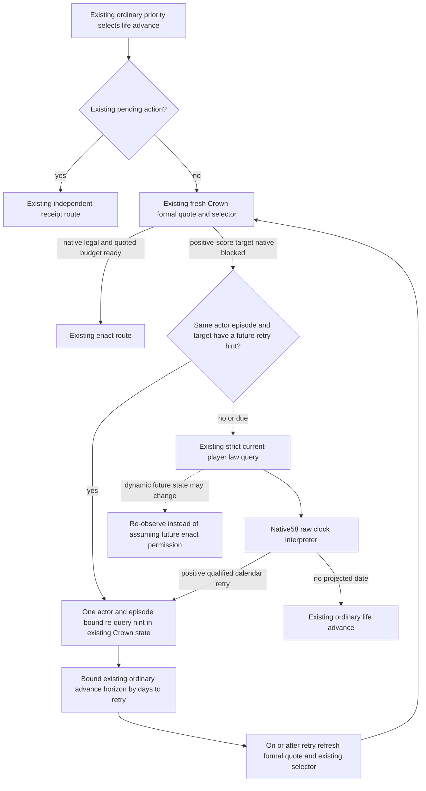

# M7 ordinary Crown calendar re-query consumption

2026-10-09 / W41. This source work starts from integrated Native58
`d8011e87ac72600d09bee854e155e464c6602029`. Its input is the offline
qualified same-law-query projection in
[the native calendar topic](m7-character-calendar-projection-12004.md),
not an inferred twenty-year delay. No new native getter or live observation
is required for this Python-only source increment.

## Native inputs and existing decision tree

The actual selected date writer advances raw date by24 and invokes the
named UpdateTurnTick task. An eligible matching kind4 context increments
its clock once per matching entry. The closed normalizer preserves positive
remaining for surviving rows in its processed timed suffix. The current
law query publishes membership/count and the resulting ceiling-divided
calendar retry date. Native58 qualified positive readiness and the known
nonmember/read-failure distinctions. These are current observation inputs,
not a promise about future membership or future CanEnact.

Stock positive-score Crown upgrades and native final permission remain
owned by the existing Crown policy/formal query. The existing ordinary
consumer runs after urgent and earlier institution choices have retained
their priority. Its pending branch resolves the original action through
the existing independent receipt before considering a new Crown choice.
The no-pending branch already obtains a fresh formal quote and chooses
either the source-backed positive-score upgrade or ordinary life advance.

## Smallest counter-policy

Retain the existing pending/resolved state and formal choice precedence.
Only a native-blocked authored positive-score target without a matching
future hint needs the additional existing strict final-terms query and its
clock interpreter. When that current actor observation has a positive
qualified retry date, save one
re-query hint in the same `crown-authority-formal-v1.json`. Its actor,
episode and bridge context come from the already used snapshot and query;
the quoted law target identifies the ordinary choice being reconsidered.
This is scheduling information, not a native permission or action result.
Every ordinary fallback still takes a fresh formal quote. A matching future
hint avoids only the additional cooldown-clock query; it is not relabeled
as a new same-frame observation. A due hint or changed actor/episode/target
requires a new clock observation if the fresh formal choice remains blocked.
This differs from the earlier proposed cached-law-query wait: no future
date suppresses the existing formal quote or a newly legal choice.

The actual consumer of that date is the existing life-advance budget.
`NativeDriver._execute_life_advance` already calculates an ordinary horizon
from observed peace/war/route state. Clip that horizon to the number of
whole date steps until the matching actor's retry, then pass the same
horizon to the existing timeline policy and progress predicate. The latter
must receive the clipped override: otherwise it recalculates the original
horizon and discards the scheduling change. Exact-one-day paths remain
one day, and earlier war/route/assault bounds are never extended. This does
not add a Service hook, scheduler, global waiting gate,
native schema or WAL.

At the due frame, consume or replace the hint through the same ordinary
fresh formal quote and selector. A fresh legal quote still uses the existing
enact path, costs and independent receipt. A changed or unavailable clock
does not become a future permission claim. Pending receipt handling remains
first, and urgent or earlier institution choices continue without Crown
overriding them.

Current native observation predicts the next useful recheck. It does not
guarantee that the manager count, scalar membership, law, resources or other
native conditions remain fixed. Dynamic changes can make the estimate early
or late; the fresh formal query determines action legality. This source
increment records that quality boundary instead of adding unrelated audits.

## Source owners and focused qualification

The production owners are the existing
`crown_authority_formal_consumer_v1.py` for same-state hint and raw query
consumption, and two small life-advance sites in `bridge/native_driver.py`
for the actual horizon and its progress override. Native58 transport,
interpreter, native objects and complete compiled wires are retained.
The actual driver sites are `bridge/native_driver.py:22533` for the original
budget, the helper call immediately after it, and the existing
`horizon_days_override` before the progress loop. Both timeline selection
and `_life_advance_progressed` consume the clipped value; the latter stops
at `starting_date_raw + horizon_days * 24` through its existing branch.

One new registered/service consumer will exercise the new ordinary branch,
same-state hint, actual driver horizon/progress consumption, due re-query,
pending priority and native-unavailable fallback. It must retain current
native final permission/cost/receipt semantics and explicitly mark synthetic
outer frames. Root runs that sole focused FIRST once; no native57/58 FIRST
or old compound is replayed. Author imports/tests/build/Game/SDK/EXE/hash
execution is0. This topic and source remain SOURCE_READY / FIRST_NOTRUN
until Root qualifies the new consumer; there is no live, action, M7 complete,
natural succession or G2 credit.

The authored consumer is
[test_crown_authority_calendar_retry_registered_plan.py](../../ck3_autonomous_player/tests/test_crown_authority_calendar_retry_registered_plan.py),
sole method `test_calendar_retry_reaches_registered_plan_and_actual_advance`.
Its eight scenarios use the four unchanged qualified Native58 packets and
actual registered `ck3_plan_turn`, Service, formal/strict transports and
protocol ingest/wait. Five calls enter the real driver advance method:
two projected budgets20/11 days, two unprojected30-day budgets and the
readonly-disabled30-day budget. Actual timeline/progress functions are
observed through spies; external primitives and successive daily frames
remain explicit local fixture seams. Due-frame fresh quote, pending receipt
priority and urgent choice complete the scenarios. The positive cases also
make a second registered plan call: fresh formal quote is repeated while
the cooldown packet is consumed only once, with `current_query` changing
to `reused_hint` and no old readback presented as a fresh observation.

The standalone launcher takes `--source-root`, `--source-sha`,
`--native-wire-dir` and `--output-dir`; the native directory is Root's
existing Native58 `first/calendar-native-wires`. There is no native
producer or C++ compile in this qualification. New source tests remain
NOTRUN until Root executes this sole launcher.

## Root offline qualification

Root adopted author `b44438920ac56e5051cec404e58edfcf282e7cf5` as
`03092da12b8b01b6b100f88d28c5d4d0fecf2e2e` in `Z:/gb0` and ran the
sole focused FIRST once. The [actual execution receipt](Z:/ck3_mod_rewrite_process_assets/g2-parallel-20261009/m7-calendar-deadline48/next-policy59/ROOT-ACTUAL-FIRST-EXECUTION.json),
[result](Z:/ck3_mod_rewrite_process_assets/g2-parallel-20261009/m7-calendar-deadline48/next-policy59/root-first01/RESULT.json)
and [observations](Z:/ck3_mod_rewrite_process_assets/g2-parallel-20261009/m7-calendar-deadline48/next-policy59/root-first01/OBSERVED.json)
are GREEN. This supersedes the preceding FIRST_NOTRUN statements for this
Python-only consumer increment.

The one compound completed all eight scenarios in4.8719773s, including
five calls to the actual NativeDriver life-advance implementation. Its
positive horizon/progress consumers stopped at20 and11 days. The other
advance cases retained their original30-day bound. The four qualified
Native58 whole packets remained unchanged, and the due frame consumed a
fresh formal quote through the registered Service/MCP path. There was no
C++ build, native producer rerun or old consumer replay.

Every ordinary Crown fallback still obtains a fresh formal quote, subject
to the existing pending/receipt precedence. A matching future hint
suppresses only the additional cooldown-clock query and supplies the
actual minimum horizon to the driver's timeline and progress loop. It
does not suppress formal permission/cost rechecks, declare future CanEnact
true or authorize an enactment. The previously recorded dynamic-input
quality boundary remains.

This is an **offline qualified policy consumer**, with explicit local
outer frames and external primitive seams. Root recorded Game/pipe/law
action counts0, live=false and M7 complete=false. No paused campaign
policy loop, real timeline days, enactment, material receipt, natural
succession or G2 completion credit is added. Worker imports, tests,
builds, EXE reads and hashes remained0.
