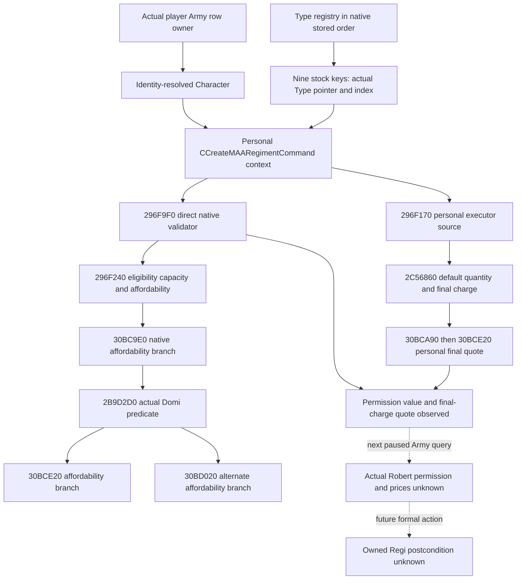

# CK3 1.20.0.3 regular personal MAA creation permission and final price

## Source scope and domain correction

2026-10-05 / W41. Exact build: CK3 1.20.0.3, Steam25652598, EXE SHA-256 `94B55397ABB687A3DCD436805A5D885E6BE90FA6C693FEB44A9E3BBEEADE02A6`. The publisher projection preserves current upstream composition and character numeric fields. Stock siege-engine script conditions remain in [siege-efficiency-inputs-12003.md](siege-efficiency-inputs-12003.md).

RTTI identifies `CCreateMAARegimentCommand` at TypeDescriptor `5A10390`, primary vtable `476A768` and secondary `476A800` at object+18. Its actual regular constructor, validator and charge producer bind this reader. The earlier View F4==0 / `2970210` interpretation was wrong: that class is `CUpgradeHordeRegimentCommand`, TypeDescriptor `5A104E0`. The old two static projection cases remain genuinely GREEN but grant no ordinary purchase capability. Root made no mutation, observer build, SDK query or Create with that package; its single apply-check RED was separately retained. Correction `ab2a89e4` supersedes the wrong-domain interpretation in source-catalog commit `5c94c668`.

This observer publishes actual personal regular permission and final-charge quote through existing `ck3_query_army_strengths` player rows. It does not submit Create or construct a GUI window. Future command acceptance is distinct from resulting owned-Regi state.

## Native tree

The native validator consumes its own affordability branches. This code does not guess the owner predicate, replace it with false or copy policy logic. The observed final-charge quote follows the formal personal executor, which is a separate source path.

## Formal constructor and readonly input

`1338F90` constructs the actual 0x38-byte command. Its mode receiver reads only an i32 at +F0. For personal mode -1 it reads the current player full ID at `image+54DBC00`; title mode is separate. The readonly helper uses only the direct validator's proved personal payload, not a submit-ready object:

| Primary offset | Native value |
| --- | --- |
| +20 | i32 creation kind 1 |
| +24 | i32 title full ID -1 |
| +28 | i32 owner Character full ID |
| +2C | i32 Type registry index |
| +30 | i32 requested quantity -1 |
| +34 | u8 pay cost 1 |

Kind1 is a creation-mode enum, not a quantity. Negative quantity resolves to the actual Type+70 stack quantity. The regular path does not use the Horde provided-Regi selector `2B9D6A0`.

Direct permission ABI is `bool296F9F0(command, nullableReason)`. Personal Character input dispatches to `296F240`, which checks native collection, type eligibility, nonzero/effective quantity, affordability when pay=1, actual owned-count capacity and optional per-type cap. A completed false is an observed native permission result; failed callback execution remains unavailable.

## Final price identity

Personal executor `296F170` resolves Type and Character, then tail-calls `2C56860(Character,Type,requestedQuantity,payCost)`. Default quantity uses Type+70. After allocation and owner attachment, pay=1 calls `30BCA90(Type,Character,effectiveQuantity*100000,false)`. That path calls:

`30BCE20(Type*, out80, Character*, abs(quantityFixed), titleScope=false)`

The producer returns caller-owned out80 containing ten signed i64 resources, Q100000. Personal GUI price uses the same producer and arguments. The reader calls it once per matched type, retaining that exact personal context. Title creation uses a separate true scope flag and is outside this personal port.

`30BC9E0` affordability can choose `30BD020` when its real `2B9D2D0` predicate is true. Therefore the statement that regular final charge uses `30BCE20` does not mean every regular validator consumer excludes `30BD020`. Native CanCreate performs the entire branch directly; no additional theoretical readiness gate is introduced.

| Raw slot | Native resource |
| --- | --- |
| 0 | gold |
| 1 | prestige |
| 2 | piety |
| 3 | dynasty_prestige |
| 4 | influence |
| 5 | herd |
| 6 | treasury |
| 7 | conditional gold-or-treasury |
| 8 | merit |
| 9 | barter_goods |

The 80-byte raw cost ABI is distinct from the 120-byte formatted argument temporary. Slot7 remains lossless; it is not silently merged into gold or treasury. Stock base gold costs and Army monthly expenses do not replace this final native quote.

## Directory and same-MCP fields

Type registry slot `5C67558` supplies the +50 pointer array and +5C count. Type+10 is its native index; +38 is the GDbo tag. Type+18 key string, +28 length and +30 capacity follow the exact `30BB270` key accessor. Actual registry matches are published in native stored order for `onager`, `mangonel`, `trebuchet`, `bombard`, `torch_bearers`, `ballista`, `cloud_ladder`, `siege_tower`, `cannon`. Missing keys are reported only after the complete native registry lookup; stock files cannot supply invented live Type pointers.

Player rows optionally mount `native_maa_recruitment_inputs_v1`. The block preserves `owner_character_id`, `creation_kind`, `creation_scope`, `command_class`, `title_id`, `requested_quantity`, `pay_cost`, `catalog_observed`, `types_in_native_order` and `missing_type_keys`. Each type preserves its index, actual `effective_quantity`, `can_create`, `inputs_ready`, failure reason and `regular_personal_quote` with context/status/Q scale/ten resources. The block omits obsolete Horde selector and reuse fields.

Type `inputs_ready` requires an observed CanCreate value and the real regular final quote. A legal permission false is still observed input; raw zero, absent field, null and native read failure remain distinct. Same-query player rows reuse the same owner observation. Nonplayer rows and builds without the exact .3 binding can omit this optional leaf.

## Qualification and actual next step

Regular source, reader and publisher qualification passed exactly two new cases in their first executable invocation, producing two native frames, four player rows and two whole-war normalization frames. The first case checks the actual 56-byte regular payload and five-argument price producer with Type+70 quantity and personal scope false. The second preserves native false as observed ready input and independently makes another type quote return an invalid output pointer, which remains unavailable/null and unready. Four affected publisher TUs and the one corrected native TU first strictly compiled GREEN. The fixture exercises the actual .3 binding, production row attachment, regular reader, Army row serializer and whole war normalizer, not the baseline native health getter or registered MCP ingress. The fresh single game-contract preimage preserves upstream raw numeric structures from `64c1a452`. Historical wrong-domain cases, the unnecessary repeated old native compilation and first BOM-context apply-check RED are retained separately; they are not counted as regular or live qualification. This package executes no SDK query, purchase or date advancement.

Root's unified strict build and fresh paused Army query must verify actual block presence, command class, owner/title/kind/quantity/pay context, current directory keys, type permissions, effective quantities, final resources and source/snapshot binding. Only the sealed actual readback grants production-live primitive credit. Normal purchase additionally requires the formal action and independent owned/type/raised state readback. The source-proved owner attachment writes the new Regi full ID to Character land+108 and Regi+12C owner ID; command queue acceptance alone does not prove that result.

## Formal action construction entry

The separate action source recipe uses a caller-owned receiver of at least 0xF4 bytes with +F0=-1, the actual `1338F90` constructor and actual primary-vtable+40 clone `2977810`. Clone allocates a native heap-owned 0x38-byte command. `37F06F0` receives the embedded manager address `image+5CC1240`, the owning command double pointer and flags0x0E. Both accepted and rejected paths consume that pointer. AL1 means queued acceptance; actor/owned-Regi postconditions remain necessary. This recipe is source-only, not an executed action.

Frozen source entry: `Z:/ck3_mod_rewrite_process_assets/g2-resume-20261005/siege-engine-catalog-current/normal-create-action-source/`. `constructor/ROOT-DELIVERY.json`, `submit-executor/REGULAR-PRICE-CONSUMPTION-ROOT-DELIVERY.json`, `action-constructor-addendum/ROOT-DELIVERY.json` and `regular-native-projection/ROOT-DELIVERY.json` retain the regular class, validator, price, formal construction and current reader provenance.
