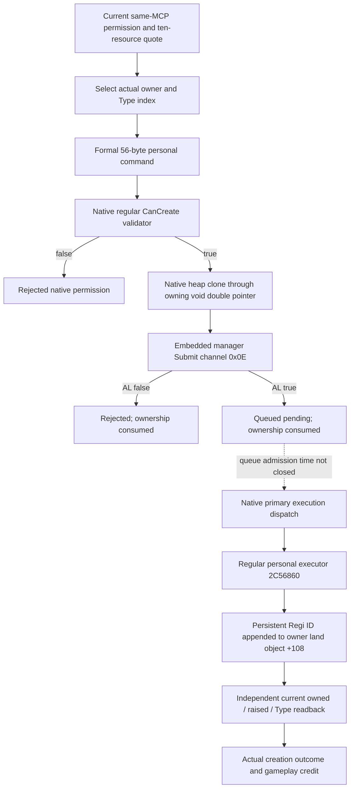
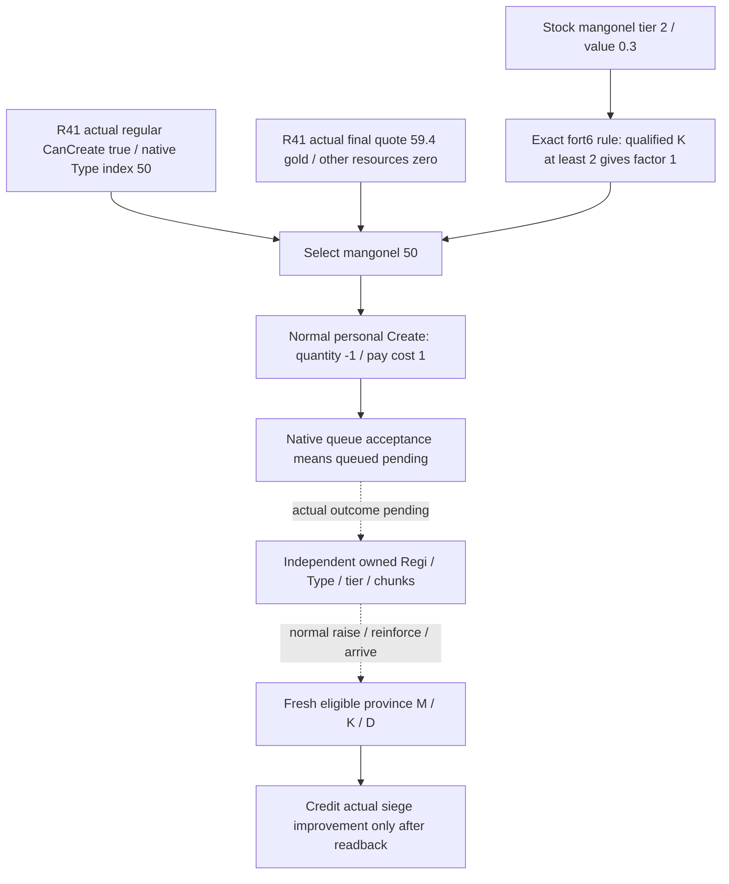

# Regular MAA Create command for CK3 1.20.0.3

Frozen build: CK3 1.20.0.3 / Steam 25652598 / EXE SHA94B55397ABB687A3DCD436805A5D885E6BE90FA6C693FEB44A9E3BBEEADE02A6. This topic describes the normal `CCreateMAARegimentCommand`; the retained earlier Horde projection is a separate wrong-domain attempt.

The formal constructor `1338F90` receives a personal view receiver with `F0 = -1`, a 56-byte command output and an actual native MAA Type pointer. The constructor fixes kind 1, title -1, current player ID, requested quantity -1 and pay cost 1. Default quantity comes from Type+70. Personal execution charges the ten-resource quote produced by `30BCE20` with title scope false. The complete native validator may evaluate its own affordability branch; this action does not replace it with a hand-written wallet policy.

The native clone `2977810` writes an owned heap command through `void**`. The manager is the embedded object at `image+5CC1240`; `37F06F0` receives that owning pointer and channel `0x0E`. Both accepted and rejected queue branches consume ownership. An accepted queue submission is `queued_pending`. It is not proof of creation, payment, raising, a new roster or a completed gameplay loop.

The executor identity and owned-Regi write are closed. The outer queue admission timing remains a concrete source gap; it does not turn queue acceptance into immediate completion. Root owns actual submission and independent current readback. The single new production-chain fixture covers rejected and queued states, command identity, exact native argument and ownership contracts, and production ingress/serialization. It gives no actual gameplay credit.

Implementation ownership: C owns the two new native command files; A owns the existing typed provider and Python action ingress; B mounts adapter, binding and build fragments after the Owned observer freeze; the county-command agent owns the single new action fixture. No old readonly cases are rerun.

## Production action entry

The additive MCP action is `ck3_submit_regular_maa_create(expected_revision, type_index, action_id)`. It uses the existing private application-main typed mailbox and the literal `maa-regular-personal-create-private-v1`; no new private flag or policy gate is introduced. Root supplies the current published revision and a fresh action identity. The Handle passes `NativeAdapter12002(adapter)` to the official free helper, then the exact .3 native binding. The request owner is the current published living player; the new native wrapper independently matches the actual global player identity.

Native submission fields preserve actual false and null: `status`, `reason`, `command_class`, `owner_character_id`, `type_index`, `native_can_create`, `native_submit_accepted`, `command_pointer_consumed`. Status is unavailable, rejected or queued_pending. Current permission denial and queue rejection remain distinct reasons. The serializer and Python chain do not manufacture creation or payment.

## Static qualification and retained attempts

One new fixture case passed on its first invocation, with three source-shaped native callback states: permission false without clone/submit; permitted command with rejected queue and consumed pointer; permitted command accepted as queued_pending. Four affected TUs compiled concurrently under /W4 /WX; the final standalone native module object was reused. Actual adapter factory/public helper, native wrapper, production serializer and Service/NativeDriver/action-leaf/NativeProtocolState ingress execute. Full bridge dispatch, main-thread mailbox Handle, named-pipe/MCP host and original CK3 constructor/queue/executor were not executed by this case.

The native module compile attempt01 failed with C4324 padding; corrected uint64 backing passed attempt02 without changing the 56-byte formal command or F0 contract. The provider Handle originally passed a WorkerAdapter where the official helper requires the base NativeAdapter; that one-line source correction is retained. Old readonly and Owned cases were not rerun. The action is **static-ready**, not an actual purchase loop.

Sole fixture: `Z:/ck3_mod_rewrite_process_assets/g2-resume-20261005/siege-engine-catalog-current/normal-create-action-source/production-chain-fixture/ROOT-DELIVERY.json`, attempt01 RESULT SHA2c42242c1ece03eefc48496242fa6cb63c70a3d3a7be5dd493a8f5c9476ddcde.

# Current mangonel purchase decision

The source ledger precedes this small counter-policy. Stock mangonel is a siege weapon with tier 2, siege value 0.3 and stack 10 (`common/men_at_arms_types/00_maa_types.txt`, captured lines 397..427). Stock onager has tier 1 and siege value 0.2. These are source values, not current raised or post-purchase Type values.

The exact .3 fort helper `251FD60` reads the current province's highest eligible tier through `247EFC0`. Each reached stock threshold `[4,6,11,16,31]` with `K <= threshold_index` contributes a factor 0.7. Fort 6 therefore has conditional factors `K0:0.49`, `K1:0.7`, `K>=2:1`. The source rule proves why tier 2 is useful at this target. It does not prove that buying an unraised regiment immediately changes the province's K or ordinary daily work.

Frozen evidence is reused from `stock-catalog/STOCK-CATALOG.json` and `Z:/ck3_mod_rewrite_process_assets/g2-resume-20261005/siege-efficiency-current-fort6-v65/NATIVE-TREE.md` (SHA `44a1219bd852bb2d20086711b93b3ed3e0641f1571aa6686c2cacea79f6e1b58`). No stock scan, EXE read or test was repeated.

R41's current regular validator and final-price reader actually returned CanCreate true for onager 48 and mangonel 50, each at native quantity 10. Mangonel's final quote is 59.4 gold; the other nine resource slots are zero. The decision selects mangonel 50 because its source tier 2 meets both fort-6 thresholds and its current native permission/price are observed. Native CanCreate already includes its own current permission and affordability checks; no extra finance policy is added.

The action module independently re-evaluates native CanCreate at submission. Root supplies the fresh published revision and action identity. Source quantity 10 is not a statement that ten current soldiers or machines exist after creation. The following eight saved days change the runtime date; they do not alter or duplicate the historical R41 price frame or this lane's zero-day credit.

Action source/qualified patch and Oct5/W41 fields: `Z:/ck3_mod_rewrite_process_assets/g2-resume-20261005/siege-engine-catalog-current/normal-create-action-delivery/ROOT-DELIVERY.json`. This source/topic work advances zero game days and performs zero SDK or Create actions.
