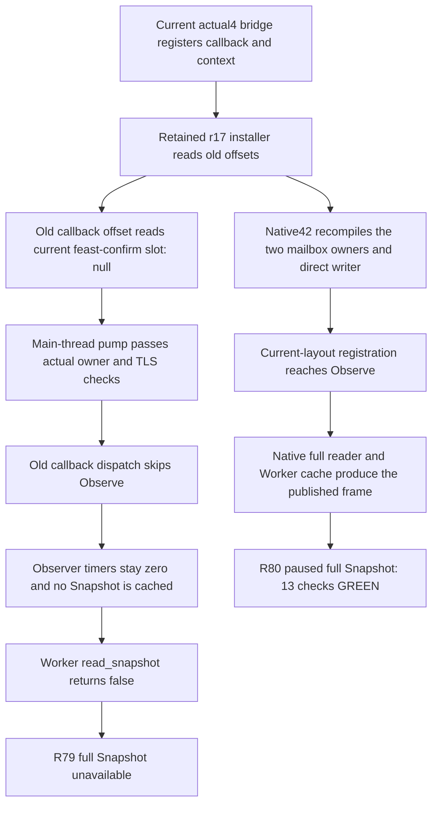

# Main-thread Snapshot observer mailbox ABI in CK3 1.20.0.4

Recorded on 2026-10-09 (Asia/Shanghai), ISO week 2026-W41.

**Status:** R79's missing full Snapshot was traced to a mixed mailbox layout. Native42 rebuilt exactly three existing production owners, and R80's new paused full Snapshot passed all 13 qualification checks. This is a recovered **production-live primitive**. It grants no new day, gameplay action, save, or complete OODA-loop credit.

## Frozen source and failure evidence

The game build is CK3 **1.20.0.4**, Steam build **25734779**, frozen executable SHA-256 `98702f88a547cde2eaf29a85f93b85f68ee4cf8148336a4f7afaeb75319dd518`. The existing [installed-build freeze](Z:/ck3_mod_rewrite/artifacts/migrations/2026-10-07/installed-build/BUILD-FREEZE.json) supplies that identity; this investigation did not reread or hash the EXE.

Native41's actual compiled source was `c928804c8afd61b6ded61c52b191b329e754d2da` at `Z:/gbs-runtime41-person-mcp-source`. Its qualified source was `45ce81348ab7fcdde6900dfa95b9e5fbf546c927` at `Z:/gbs-runtime41-person-mcp-qualified-source`; the latter included the Python signed-Q64 decoding correction.

R79/PID **162496** reached a paused, map-ready core frame for Robert **29829**, raw date **53288568**. The first full `ck3_take_snapshot` still returned "native game state is not available yet" after its ten-second wait. The existing [R79 diagnostics response](Z:/ck3_mod_rewrite_process_assets/g2-background-20261008/managed-full-h9715-r79-coldrestore01/operator/gameplay-responses/002-r79-state-unavailable-diagnostics.json) established:

- Transport connected, semantic state unavailable, zero rejected state frames, no last rejected frame, and no transport fatal error.
- Worker observer `started_ms=0`, `completed_ms=0`, `last_read_ms=0`, `read_in_progress=false`, `last_read_available=false`, and `snapshot_cached=false`.
- The already installed mailbox had **15,738** pump epochs and **15,738** verified-owner epochs. Owner/current thread IDs were both **128248**; TLS initialized and main-thread markers were both **1**. Date, paused state, execution-stamp read, application-main observation, and readiness were valid.

The zero observer times were significant. A normal native full-reader failure inside `WorkerAdapter::Observe` would first store `started_ms` and then `completed_ms`. It could not explain both remaining zero. The actual pump evidence also excluded the owner/TLS rejection paths before observer dispatch. Zero publish diagnostics alone did not prove that the publisher had not run: its read-failed path can return without a full-state publication.

## Production chain and the concrete layout mismatch

The relevant frozen source locations are:

| Node | Source location | Meaning |
| --- | --- | --- |
| Worker lifetime | `native_bridge/src/bridge.cpp:27969-27978` | Selects the actual4 WorkerAdapter and its observer lifetime. |
| Snapshot admission | `native_bridge/src/game_adapter.cpp:316-329`; `src/ck3_12004_adapter.cpp:55` | `supports_snapshot()` checks `game.state.snapshot`, which the actual4 descriptor supplies. |
| Registration | `native_bridge/src/bridge.cpp:11578-11587` | Sets the current Environment observer callback and WorkerAdapter context. |
| Installation | `native_bridge/src/bridge.cpp:11683` | Passes that Environment to the mailbox installer. |
| Observe | `native_bridge/src/ck3_12002_semantic_adapter.cpp:128-155` | Applies descriptor/thread/TLS checks and writes read timers before and after the native reader. |
| Current installer | `native_bridge/src/main_thread_query_mailbox_v1.cpp:1052-1053` | Copies callback/context using the current structure layout. |
| Current dispatch | `native_bridge/src/main_thread_query_mailbox_v1.cpp:1804-1810` | Invokes Observe only when callback and context are non-null. |

The actual Native41 lineage retained both Bridge and Runtime `main_thread_query_mailbox_v1.cpp` objects compiled from **g110-r17**, source `8ffe4001133869da7a3ce4519911b3f9bef20d97`. Bridge, WorkerAdapter, and the actual4 ABI/core-frame binders were already compiled against the newer source.

The shared header had inserted one function pointer in **both** `MainThreadQueryInstallEnvironmentV1` and `MainThreadQueryMailboxV1`:

```cpp
MainThreadQueryExecutorV1 permitted_executor_confucian_assembly12003 = nullptr;
MainThreadQueryExecutorV1 permitted_executor_actor_cached_succession12004 = nullptr; // inserted
MainThreadQueryExecutorV1 permitted_executor_confucian_religious_title12003 = nullptr;
```

On the target x64 ABI this moved the following fields by **8 bytes**. The old installer and pump still used the prior offsets:

| Old compiled field | Field occupying that offset in the current structure |
| --- | --- |
| Environment observer callback | `permitted_executor_feast_stage2_confirm12002` |
| Environment observer context | Current observer callback |
| Mailbox observer callback | `permitted_executor_feast_stage2_confirm12002` |
| Mailbox observer context | Current observer callback |

The current actual4 binder initialized the current Environment, and the actual4 installation branch did not assign `nonwar.feast_stage2_confirm`. Its current feast-confirm slot stayed null. The old installer therefore copied that null as the old observer callback. The old pump continued passing its owner/TLS checks and servicing earlier executor slots, but skipped Observe entirely. This accounted for the connected transport, working core query, and untouched observer timers.

The retained Runtime `ck3_12002_nonwar_mailbox.cpp` was also a direct Environment writer compiled from the older strict07/g109-r7 source. Its late feast-confirm assignment used the old layout. Root included this one direct writer in the same repair; there was no full-owner census or unrelated domain expansion.



The [source findings](Z:/ck3_mod_rewrite_process_assets/g2-background-20261009/r79-full-snapshot-publication-source/observer-source/SOURCE-FINDINGS.json), [actual owner lineage](Z:/ck3_mod_rewrite_process_assets/g2-background-20261009/r79-full-snapshot-publication-source/observer-source/ACTUAL41-DIRECT-OWNER-LINEAGE.json), and [three actual compiler templates](Z:/ck3_mod_rewrite_process_assets/g2-background-20261009/r79-full-snapshot-publication-source/observer-source/ACTUAL41-MAILBOX-COMPILER-TEMPLATES.json) preserve the source/binary basis. The nonwar template came from the actual strict07 Runtime command row; its original raw Windows command and cwd were retained, and the unrelated old test row was excluded.

## Native42: exactly three existing production owners

| Target | Recompiled source | Native42 object |
| --- | --- | --- |
| Bridge | `src/main_thread_query_mailbox_v1.cpp` | `attempt02/o/n42p001.obj` |
| Runtime | `src/main_thread_query_mailbox_v1.cpp` | `attempt02/o/n42p002.obj` |
| Runtime | `src/ck3_12002_nonwar_mailbox.cpp` | `attempt02/o/n42p003.obj` |

The [Root Native42 attempt02 result](Z:/g2-native42-mailbox-abi-build01/attempt02/ROOT-NATIVE42-RESULT.json) records all three compilers, the Runtime archive, and the DLL link **GREEN**. Root used the unchanged compiled source pin `c928804c...`, preserving target-specific flags, actual compiler cwd, and the held MSVC environment.

The resulting owner union stayed **730 = 299 Bridge + 430 Runtime + 1 Protocol**: three replacements and **727 retained** owners, with zero new production owners and zero fixture compilers. The Runtime archive was created from the explicit 430-member list with the two replacements; the DLL retained the 299 Bridge inputs with its one replacement and the actual library order. The repair did not remove guessed archive basenames or recompile the complete owner union.

The successful build stages ran from **2026-10-08 18:08:47.995511 UTC** to **18:08:53.348669 UTC**. Runtime archive time was **0.5134447 s**, and DLL link time was **1.6426062 s**. There were no old FIRST replays or Game/SDK calls in this build. Its receipt correctly recorded `live_pending=true` before the later R80 qualification.

This was a compilation-basis repair of already frozen production source, not a new production code feature. The DLL and Runtime library are under `Z:/g2-native42-mailbox-abi-build01/attempt02/binaries/`; the canonical [Native42 receipt](Z:/ck3_mod_rewrite_process_assets/g2-background-20261007/upstream-build-migration/entry-live-fix42/ROOT-PARENT-RUNTIME-INCREMENTAL-DLL.json) records the adopted artifact identity.

## R80: new paused full Snapshot recovery

The [Root R80 qualification receipt](Z:/ck3_mod_rewrite_process_assets/g2-background-20261008/managed-full-h9715-r80-abi42restore01/operator/ROOT-COLD-H9715-PAUSED-SNAPSHOT-QUALIFIED.json) is **GREEN** at **2026-10-08 18:18:50.431856 UTC** (2026-10-09 02:18:50.431856 Asia/Shanghai).

The new owned game was **PID 65280**, window **4860854**, minimized. Its full Snapshot had native revision **2**, public revision **3**, Robert **29829**, and unchanged raw date **53288568**. All 13 checks passed: restored date, recovery episode, paused/map-ready state, living recovery character, native snapshot identity/revision, military and war collections, exact actual4 version/EXE/adapter, minimized owned window, and owned PID.

The receipt records exactly **one core readiness query and one full Snapshot query**. It references the preserved whole response at `operator/gameplay-responses/001-runtime32-r77-paused-snapshot.json`; the inherited filename does not change the actual R80 run identity. The SDK/bootstrap source was independently `dac47ba428d524ff201c7aeff295c58243cfa820` at `Z:/gbs-runtime43-person-following-source`, while the native qualification source stayed `45ce8134...`. These source identities are intentionally distinct.

The restored baseline was **H9715 / saved normal days 6010**. R80 added **zero days** and no checkpoint save, and its receipt still marked `g2_resume_ready=false`. Recovery of paused full observation does not establish a new gameplay loop or action outcome.

## Boundary with R78

R78's `C0000005` and folded vector destruction/PublishSnapshot stack candidates remain a separate incident. The earlier rich WorkerAdapter fixture and rebuilt Snapshot consumers retain their own offline qualification. This mailbox repair does **not** attribute R78's crash to the observer offset mismatch and does not claim that crash's live root cause is confirmed.

R79 RED and the original attempts remain preserved. R80 supplies the new live recovery evidence for this specific missing-observer failure. Documentation work performed no build, test, hash, Game, or SDK action and introduced no additional gate.
