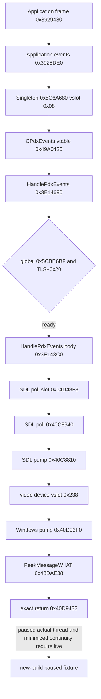

# CK3 1.20.0.2：应用主线程查询 mailbox 迁移

2026-10-06 的 `.3` R0048 executor AV 与后续查询 admission 故障、最小回收候选及独立新 fixture 入口见 [typed-query exception reclaim](typed-query-executor-exception-reclaim-12003.md)。该候选的正式 native 构建／新 CTest 由 Root 执行，不改变本文历史 `.2` 验收事实。

2026-10-01 后台迁移结果：`static-ready`。18 组唯一字节签名、1 组 `CPdxEvents` vtable 前缀和合成对象 fixture 已通过；尚未对新版游戏运行安装、读取进程内存或执行 native callback。旧版 live 证据不能替代新版实机验收。

冻结版本为 CK3 **1.20.0.2 (Crozier)**，Steam build `25588574`，EXE SHA-256 `AE1BA6FF060BA603842F6F4A2DED0AF4B7D3666B3DD271F75FB01B0DA8E81B2D`。离线来源为 `artifacts/migrations/2026-09-30/post-update-1.20.0.2/installation/binaries/ck3.exe`；原始游戏继续由玩家正常游玩。

## 原生链与发生的变化



新版对应位置如下；RVA 均相对于游戏 EXE 的实际模块基址。

| 绑定 | 1.20.0.2 位置 | 静态证据 |
| --- | --- | --- |
| Windows SDL pump | `0x40D93F0` | 唯一 prologue；首个 Peek 调用 `0x40D942C`，返回 `0x40D9432` |
| video device pump | `+0x238` | `0x40F39BB` 将 Windows pump 地址写入此 slot；`0x40C887C` 调用 |
| PeekMessageW | IAT `0x43DAE38` | 首个调用 RIP displacement 指向该 slot |
| TLS initialized global | `0x5CBE6BF` | `0x8545F8` 置 1；`0x3E146AD` 读取并检查 |
| TLS getter | `0x3F784C0` | 返回当前线程 TLS 块内 `+0x3230`；初始化位位于 `+0x3228` |
| application main marker | TLS context `+0x20` | getter 初始写 0；启动 `0x8545FF` 调 getter 后写 1；HandlePdxEvents 检查 |
| native thread identity | thunk `0x40F5210`，IAT `0x43DA598` | `GetCurrentThreadId` 原生导入链 |
| RNG owner diagnostic | slot `0x54DEFC0` | `0x393EE4A` 取 wrapper；`0x393EE5A` 检查 owner；仅保留诊断用途 |
| same paused frame | Jomini slot `0x5C6A520`，GameState slot `0x5C68C50` | 暂停字节 `+0x20` 和日期 int32 `+0x08` 已与 core foundation 交叉闭合 |

SDL 动态 API slot 的文件初值是初始化 stub `0x4090AD0`，不能把文件中的初值误认成真正的 SDL poll 实现。静态默认绑定 `0x4099D96` 把 `0x40C8940` 写入 `0x54D43F8`；它的 `0x40C8973` 调用 pump。运行期是否使用默认 SDL、是否持续在暂停或最小化状态到达此点，留给拥有现场的实机 fixture 观察。

## 实现与集成

`native_bridge/include/xar_bridge/ck3_12002_thread_runtime.hpp` 和对应 `.cpp` 提供 `BindThreadRuntimeImage(base, exact_sha, executors)`。该函数只计算地址、选择 profile 与填写 callback slot，不安装 hook、不发现进程、不读取对象。前 13 个 slot 保持既有 typed query 顺序，第 14 个 `permitted_executor_fourteenth` 供固定 semantic adapter executor 使用。错误 hash、零基址或超过 14 个 callback 返回未绑定环境；空 callback 列表仅启用观测。

现有 `MainThreadQueryInstallEnvironmentV1` 末尾增加 `build_profile`。空 profile 保留完整 1.19.0.6 行为；新 profile 提供 byte verifier、导入/全局/TLS RVA 和 pump 返回点。`MainThreadQueryMailboxV1` 保存实际选定的返回 RVA，其他队列状态机、固定 callback 匹配、两次连续暂停观测、取消/回收和 IAT 生命周期沿用现有实现。

bridge worker 在已经选择新版 adapter 后，用新版 descriptor 的 SHA 调用 binder，再调用既有 `InstallMainThreadQueryMailboxV1`。`TrySubmitMainThreadQueryV1`、`WaitForMainThreadQueryV1`、`ReclaimMainThreadQueryV1`、`UninstallMainThreadQueryMailboxV1` 的类型和调用约定不变。此模块本身不发布新的 gameplay capability；各具体 reader 的可用性由自己的 ABI 迁移和实机结果决定。

新版 full snapshot 使用原生富 getter 与互动合法性 validator，必须由应用 owning thread 读取。因此环境和 mailbox 增加 `snapshot_observer_callback` / `snapshot_observer_context`：只有 exact pump 返回点读取到 initialized=1、当前 TLS marker=1 的有效 stamp 后才调用；调用位置在暂停判定之前，运行中也持续采样。bridge worker 读取 observer 发布的 snapshot 缓存，普通 owner-only 查询/军令使用第 14 个固定 executor。暂停、恢复、速度和 checkpoint 已闭合的 cloned command queue 仍从 worker 提交。

observer 在调用 raw reader 前先将缓存标记为无效，成功后发布当前 snapshot；读取返回 unavailable 时保留无效状态。observer 失败不改 query mailbox failure flags。正常卸载恢复 IAT、排空已经进入的 hook 后清空 callback/context，提供 context 的 worker 必须保留其生命周期到卸载成功。

## 验证与可复现入口

```cmd
py -3.13 ck3_autonomous_player/native_bridge/research/scan_anchors.py ^
  --exe artifacts/migrations/2026-09-30/post-update-1.20.0.2/installation/binaries/ck3.exe ^
  --manifest ck3_autonomous_player/native_bridge/research/ck3_1_20_0_2_thread_runtime.json
```

结果为 `PASS: exact_build=1 unique_signatures=18 vtable_prefixes=1`。C++ fixture 将冻结 EXE 的 section 复制到自己持有的 byte vector，核验运行期 byte verifier；改动 TLS 启动签名一个字节会使验证失败。所有调用只针对合成 IAT、TLS、Jomini 和 GameState 对象。

`ck3_12002_thread_runtime_test.cpp` 覆盖：profile/精确 hash 选择、拒绝旧返回点、运行中 snapshot observer 采样、纯 fixture 暂停 command 交付、两次连续暂停 owner 观测、第 14 个固定 executor 执行与日期/暂停/TLS stamp、等待和回收、observer reader 不可用时仅使缓存无效、取消未执行请求、纯 fixture 恢复 command 后日期前进且继续采样、卸载恢复 fake IAT/read-only 页状态并清空 observer。MSVC 19.51 独立构建与 fixture 退出码均为 0。完整旧版 `main_thread_query_mailbox_v1_test.cpp` 使用保留的 1.19 EXE 和现有 source/ABI/bridge contract 回归，退出码同样为 0。

本次增量编译出现一次 harness RED：native Ninja 的 `msvc_deps_prefix` 缓存为中文乱码，未捕获 `/showIncludes` 头依赖；环境结构追加字段后 legacy fixture object 未重编，报 `initial_install`。完整 clean rebuild 后新旧 fixture 均通过，失败和修复日志保留为 `thread-runtime-rebuild.log` / `thread-runtime-clean-rebuild.log`。后续 Windows 配置与编译固定 `VSLANG=1033`，并将 `CMAKE_CL_SHOWINCLUDES_PREFIX` 设为 `Note: including file: `；最终集成至少做一次完整重编。

中央 bridge 集成后又出现一次独立 harness RED：legacy source contract 从文件开头查找首次 IAT 安装，误取到新增 `InstallNewAdapter` 提前安装 observer 的调用，因而错误判定旧版 `MaybeInstall` 的调用次序。最小修复将查找起点限定在 legacy `MaybeInstall` 内，保留全部旧 source token、暂停状态要求、冻结 EXE 签名和运行期状态机检查，并新增失败阶段输出。中央 CTest 定向回归通过（`1/1`）；原失败与修复日志分别保留为 `main-thread-mailbox-central-red.log` 和 `main-thread-mailbox-central-green.log`。

产物位于 `artifacts/migrations/2026-09-30/post-update-1.20.0.2/build-thread-runtime/`，汇总为同目录上层 `thread-runtime-result.json`。

剩余实机项：在未来由测试拥有的新版暂停现场观察真实线程与连续 pump epoch，执行已经迁移的具体 native reader，验证最小化连续性和正常卸载。当前玩家正在进行的游戏没有参与这些测试。
