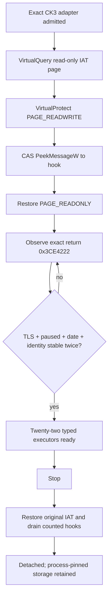
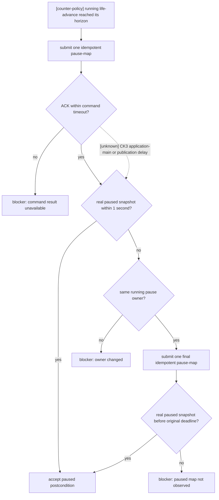

# CK3 1.19.0.6 application-main typed mailbox

## Result and scope

`main_thread_query_mailbox_v1` now has twenty-one bounded production query/action uses plus one exact scoreboard semantic-activation transport whose production capability remains unadvertised pending live postcondition evidence:
`query-war-entry-assessments-v1`, `query-route-contact-horizon-v1-N`,
`query-actual-contact-scope-v1-N`, `query-combat-simulation-inputs-v3-N`,
`query-battle-control-snapshot-v1-N`, `query-battle-transition-v1-N`,
`query-battle-reinforcement-assignment-v1-N`,
`query-battle-terminal-transition-v1`,
`query-campaign-root-context-v1`, `query-loaded-feature-manifest-v1`,
`query-pending-character-interaction-context-v1`,
`query-current-event-window-context-v1`,
`center-map-on-landed-title-v1` and
`query-zhongguo-case-snapshot-v1` and
`query-zhongguo-result-case-snapshot-v1`,
`query-zhongguo-b2-pip-snapshot-v1` and
`query-zhongguo-incident-snapshot-v1`, `query-zhongguo-scoreboard-state-v1`
and `query-zhongguo-workforce-collective-snapshot-v1`, plus
`query-zhongguo-ai-owned-case-snapshot-v1` and
`query-zhongguo-workforce-normal-exit-snapshot-v1`, plus
`activate-zhongguo-scoreboard-v1` in a transport-only slot whose exact
shortcut-manager semantic activation may return a verification-pending ACK,
while its production capability remains unadvertised until an independent
paused later-query artifact proves the postcondition. The candidate identity
remains `application_main_thread_war_entry_v1`; the heartbeat query scope is
`typed_war_entry_route_actual_contact_combat_v3_battle_control_battle_transition_reinforcement_assignment_campaign_root_context_loaded_feature_manifest_pending_character_interaction_context_current_event_window_title_map_navigation_zhongguo_case_snapshot_zhongguo_result_case_snapshot_zhongguo_b2_pip_snapshot_zhongguo_incident_snapshot_zhongguo_scoreboard_state_zhongguo_workforce_collective_snapshot_zhongguo_ai_owned_case_snapshot_zhongguo_workforce_normal_exit_snapshot_zhongguo_scoreboard_action_fail_closed_transport`.
It is not a general native-call, effect, or scripted-VM executor.

The first paused live counter run reached SDL `PeekMessageW` return
`0x3CE4222` continuously. It reported `failure=32` because the application
thread did not own the global RNG wrapper. That result is no longer treated
as a thread rejection: independent call-graph review proved that
`0x356B600` is a scoped RNG-owner acquire, while the same live run passed the
earlier HandlePdxEvents TLS gate. Therefore the application-main boundary is
live-confirmed; RNG owner remains raw provenance only.

The route-contact, actual-contact, combat-v3, ongoing battle-control and
title-map-navigation typed executors have exact-build live results; war-entry
and the new by-CombatID lifecycle query still require their own paused live
acceptance. Title-map navigation completed its paused camera dispatch, cross-pump
settled readback, already-centered and typed unknown-key matrix in the 2026-08-30
ZhongGuo full acceptance. Production admits at
most one request per pump and only twenty-two named callbacks (the twenty-second
is transport-only, may dispatch only the fixed named-widget semantic activation,
and cannot by itself claim a GUI postcondition):
`ExecuteWarEntryAssessmentMailboxQueryV1`,
`ExecuteRouteContactHorizonMailboxQueryV1`,
`ExecuteActualContactScopeMailboxQueryV1`,
`ExecuteCombatSimulationInputsV3MailboxQuery`,
`ExecuteBattleControlSnapshotMailboxQueryV1`,
`ExecuteBattleTransitionMailboxQueryV1`,
`ExecuteBattleReinforcementAssignmentMailboxQueryV1`,
`ExecuteBattleTerminalTransitionMailboxQueryV1`,
`ExecuteCampaignRootContextMailboxQueryV1`,
`ExecuteLoadedFeatureManifestMailboxQueryV1` and
`ExecutePendingCharacterInteractionContextMailboxQueryV1`,
`ExecuteEventWindowContextMailboxQueryV1` and
`ExecuteTitleMapNavigationMailboxV1` and
`ExecuteZhongguoCaseSnapshotMailboxQueryV1` and
`ExecuteZhongguoResultCaseSnapshotMailboxQueryV1`,
`ExecuteZhongguoB2PipSnapshotMailboxQueryV1` and
`ExecuteZhongguoIncidentSnapshotMailboxQueryV1`,
`ExecuteZhongguoScoreboardStateMailboxQueryV1`,
`ExecuteZhongguoWorkforceCollectiveSnapshotMailboxQueryV1` and
`ExecuteZhongguoAiOwnedCaseSnapshotMailboxQueryV1` and
`ExecuteZhongguoWorkforceNormalExitSnapshotMailboxQueryV1`, plus
`ExecuteZhongguoScoreboardActionMailboxV1`. The ZhongGuo readers and the
fail-closed scoreboard transport are
only static/fixture-ready here; none of the newly added providers has a paused
live CK3 artifact yet. War-entry remains limited to
one target per request; route-contact is limited to one controllable subject
and the exact complete hostile scope, at most 64 ArmyIDs.

Frozen build: CK3 `1.19.0.6`; every managed live run uses the project copy
`Z:\ck3_mod_rewrite\Crusader Kings III\binaries\ck3.exe`. The production9
minidump ModuleList independently records that exact path. Its SHA-256 is
`2D00FF3101EF70B566F2FCBAE292F09263199C80E9DC8F139B82D7D96F83DB86`.

## Exact-build chain

| Evidence | RVA / field | Proven meaning |
|---|---:|---|
| PE IAT | `0x3FD2EE8` | `.rdata` import `USER32!PeekMessageW`; runtime page must be `MEM_COMMIT + MEM_IMAGE + PAGE_READONLY` |
| Windows pump | `0x3CE41E0` | SDL Windows video-device event pump |
| Exact boundary | call `0x3CE421C`, return `0x3CE4222` | paused live-confirmed application/startup-main TLS thread |
| Device install | `0x3CFE7AB` | stores `0x3CE41E0` at video-device `+0x238` |
| SDL dispatch | `0x3CD3600` / `0x3CD366C` | calls `[rsi+0x238]` |
| Application chain | `0x351F0D0` -> `0x3555820` -> `0x3555190` -> `0x3A2EC30` -> `0x3A2EE60` -> `0x3CD3730` -> `0x3CD3600` | exact runner-to-pump path |
| TLS initialization | `0x7E7CDE`, `0x7E7CE5`, `0x3B86430` | sets global `+0x57727ED=1` and startup thread TLS context `+0x20=1` |
| HandlePdxEvents gate | `0x3A2EC4D`, `0x3A2EC58` | rejects unless the same global and current TLS marker are active |
| Pause/date | `+0x570F7B8 -> +0x20`; `+0x570E068 -> +0x08` | Jomini pause and game date identity |
| RNG diagnostic | `+0x4FEB1C8 -> wrapper +0x00 -> state +0x10` | scoped owner TID, read only; never readiness or admission |
| War-entry graph | `0x2909D30 -> 0x290E6F0 -> 0x2909EB0`; `0x1878A00`; `0x1879850` | depth-12 direct-call audit found no RNG owner, RNG draw, CK3 TLS getter, effect VM, or RNG global reference |

Hard admission is the intersection of current TID stability, initialized TLS
global, stable TLS context with marker `+0x20 == 1`, stable Jomini/game object
identity, paused state, date, and two consecutive pump epochs. RNG wrapper,
state, and owner are captured in `MainThreadExecutionStampV1` and heartbeat
diagnostics, but are excluded from streak, submit, and post-execution checks.

## Install and process lifetime

The IAT lives on a read-only page. Install and uninstall use the same bounded
protocol: `VirtualQuery`, one pointer-containing page temporarily changed to
`PAGE_READWRITE`, `InterlockedCompareExchangePointer`, and immediate restoration
to `PAGE_READONLY`. A failed protection restore first rolls the IAT pointer
back and then retries page restoration.

The hook calls original `PeekMessageW` first and preserves both its `BOOL`
return and `LastError`. It checks exact return RVA only after the original
call. An atomic reentry guard prohibits SDL reentry from reaching a callback.

WorkerMain owns uninstall on every return path. It stops admission, restores
the original IAT, waits for counted active hooks, and retains the static
mailbox plus original function pointer for the CK3 process lifetime. This is
not a DLL-unload proof; remote `FreeLibrary` remains unsupported. A stop
timeout leaves bridge lifecycle in `stopping`, and `PROCESS_DETACH` signals
only.

## Typed slot and fresh-frame binding

`paused_owner_verified_pump_epochs` retains its ABI name, but now counts
consecutive application-main TLS-verified paused epochs; RNG ownership is not
part of the count. A read failure or unpaused observation resets it to zero.
TID, TLS context, Jomini/game identity, or date drift starts a new streak at
one.

Production install sets `permitted_executor` to
`ExecuteWarEntryAssessmentMailboxQueryV1` and `permitted_executor_secondary`
to `ExecuteRouteContactHorizonMailboxQueryV1`; the tertiary and quaternary
slots are fixed to `ExecuteActualContactScopeMailboxQueryV1` and
`ExecuteCombatSimulationInputsV3MailboxQuery`; the quinary slot is fixed to
`ExecuteBattleControlSnapshotMailboxQueryV1`; the senary slot is fixed to
`ExecuteBattleTransitionMailboxQueryV1`; the septenary and octonary slots are
fixed to `ExecuteBattleReinforcementAssignmentMailboxQueryV1` and
`ExecuteBattleTerminalTransitionMailboxQueryV1`; the nonary and denary slots
are fixed to `ExecuteCampaignRootContextMailboxQueryV1` and
`ExecuteLoadedFeatureManifestMailboxQueryV1`; the undenary slot is fixed to
`ExecutePendingCharacterInteractionContextMailboxQueryV1`; the duodenary
through octodenary slots are fixed to current-event, title-map, ZhongGuo B1,
received-self result, B2 PIP, incident and scoreboard queries respectively;
the novemdenary slot is fixed to
`ExecuteZhongguoWorkforceCollectiveSnapshotMailboxQueryV1`; the vigintary slot
is fixed to `ExecuteZhongguoAiOwnedCaseSnapshotMailboxQueryV1`; the
unvigintary slot is fixed to
`ExecuteZhongguoWorkforceNormalExitSnapshotMailboxQueryV1`.
The duovigintary slot is fixed to
`ExecuteZhongguoScoreboardActionMailboxV1`; it returns either typed unavailable
or `acknowledged_verification_pending`, never a verified postcondition.
`TrySubmitMainThreadQueryV1` rejects every other callback. The war-entry bridge
additionally requires exactly one target. Timeout can cancel a queued request
only. Once state is `executing`, the worker retains the caller-owned context
until a terminal wait and successful reclaim.

Before, middle, and after world samples are fresh native observations. Each
`CaptureWarEntryBridgeFrame` call runs on the application-main thread and
re-reads `GameAdapter::ReadSnapshot`; it compares the complete snapshot with
the worker's expected revision/frame. Declarability is enumerated once by the
worker immediately before submit on that same paused expected snapshot and its
ordered unique target set is frozen into the context. Re-running the global CB
enumerator three times would scan the character database on the application
thread and is deliberately excluded from this one-target bounded path. The
native reader independently revalidates actor, target,
AI-context, power leaves, repeated native output, and the mailbox performs a
post-callback TLS/pause/date/object double sample. Any drift discards the
payload.

## Runtime consumer revision boundary (2026-08-27)

The production one-generation run
`20260827T104548Z-one-generation-5eb950f7` stopped inside a composite
`life-advance` after its runtime consumer observed a public revision turnover
from expected `159` to current `160`. This is a harness/runtime boundary, not
a mailbox-executor failure and not a CK3 AI-policy branch. Immediately before
the blocker the mailbox remained `ready=true`, `failure=0`,
`executor_submission_enabled=true`, with `executed_requests=8`; the existing
typed-query paused-frame and revision bindings therefore remain in force.

The public revision advances only when an ingested normalized
`state_snapshot` changes. Heartbeat, pong, and `command_result` frames do not
advance it. A primitive still sends the current frame's `native_revision` as
its wire `expected_revision`. When a newer public revision appears, a consumer
must not merely replace the old expected value and execute an old plan. It
must re-observe and re-plan, or the owner of a bounded composite must prove
that the current phase is either pre-submission or safely re-entrant and then
verify its intended postcondition. The production artifact does not preserve
the full `159` and `160` frames, so it does not prove which normalized field
changed or which internal primitive first observed the turnover.

A second production continuation,
`20260827T112207Z-one-generation-3c7aa5e2`, proved that the first one-retry
consumer rule was necessary but insufficient. It crossed the old boundary,
completed `106/107` turns and wrote 17 newer checkpoints, then stopped with
`expected 183, current 185`. The last query began from a paused public
revision `180`; CK3's debug log subsequently records real simulation work at
19:42:08--19:42:11, before the blocker at 19:42:13. The failure therefore
occurred after resume while the bounded composite was trying to regain the
paused postcondition. The artifact does not retain the internal refreshed
frames, so it cannot distinguish an active-event change from a speed change;
neither may be asserted.

That observed failure justified a first consumer fix which kept refreshing
only `life-advance`'s `pause-map` phase within the existing command timeout.
Run `20260827T115837Z-one-generation-9bed68f0` production-revalidated the
change across 47 successful turns and seven new checkpoints, but then proved
that a speed-five map can publish public revisions continuously for the whole
10-second window. The run stopped with
`native life-advance pause-map revision convergence timed out`; no pause
request had won the Python pre-submit comparison.

The exact production DLL source at `51fe8cf` closes the native command tree.
`bridge.cpp` dispatches `step == "pause-map"` directly to `SubmitPauseMap`
without parsing or comparing the JSON `expected_revision`. `SubmitPauseMap`
itself performs a fresh `ReadSnapshot`; if CK3 is already paused it returns
`already_paused`, otherwise it validates the command bindings and local
player, constructs the pinned command with `paused = 1`, and submits it to the
native queue. Thus the Python public-revision equality check is not part of
the native pause contract and can starve an otherwise valid, idempotent
control command while the map is running.

The next minimal consumer rule is therefore narrower than a generic retry:
only the internal `life-advance` pause owner may submit `pause-map` without a
Python public-revision equality comparison. It still refreshes once before
submission, sends exactly one real request, records exactly one action only
after ACK, shares the existing command deadline with paused-postcondition
observation, and requires the final real frame to be paused. The wire keeps
the fresh native revision as audit data although this exact handler does not
consume it. Direct planner/user primitives, every query, and every other
action retain their existing revision gates.

The later production run
`20260827T163217Z-one-generation-ace7cbcf` closed a narrower remaining timing
edge. It completed `85/86` turns, including `42` gameplay advances and `14`
verified checkpoints, before one speed-one `life-advance` stopped with
`native life-advance did not observe the paused map`. Its pre-action frame was
still a real paused snapshot at `date_raw=53210712`; cleanup was GREEN. The
exact `pause-map` handler returns `submitted` after placing the idempotent
pause command on CK3's queue, while the immediate `PublishSnapshot` may still
read the running state. The 250 ms heartbeat publisher is responsible for the
later `paused=true` postcondition. This RED therefore proves that the shared
10-second submit-plus-observe deadline can expire after an accepted request;
it does not prove whether CK3 applied the queued pause just after that bound.

An immutable copy of the checkpoint (`F15D383B...35559`) and failure artifact
(`A0BD8C79...A484`) was retained. A clean unmodified `9ff04ae` cold replay from
that exact checkpoint did not reproduce the timeout: two consecutive
speed-one advances reached `date_raw=53210760`, returned paused, wrote
checkpoint `79B71103...85F2`, and cleaned up normally. The failure is therefore
an observed intermittent pause-application/publication timing edge, not a
deterministic world-date branch; the artifact cannot distinguish which side
delayed. The minimum counter-policy keeps the same 10-second absolute
deadline and real paused-frame proof. After the first ACK it observes for one
second; if the latest frame is still running under the same bridge generation,
episode and map-ready owner, it may submit exactly one more idempotent
`pause-map`. The second native call also fresh-reads CK3, so an
`already_paused` result prompts the bridge's immediate snapshot publication.
There is no third request, the deadline is not reset, and no command ACK is
promoted to state. Direct primitives and all other actions remain unchanged.
Failure evidence retains the first/second native ACK statuses, attempted
request count, and the final revision/date/speed/paused tuple; a second-request
timeout is wrapped without discarding the first ACK.

### 2026-08-28: idempotent timeline ACK must force a fresh state frame

The `0ceb7d8` production revalidation first completed `12/12` turns, six
speed-one gameplay days and two checkpoints from `79B71103...85F2`.  The
following formal run
`20260827T171107Z-one-generation-ee8ac4b9` then completed another `25`
gameplay days and eight checkpoints before a `resume-map` ACK was followed by
`native life-advance did not observe the running map`.  The pre-action state
was paused at `date_raw=53211504`; CharacterID `29829` remained alive and
cleanup was GREEN.  `dedicated_server.log` recorded the same interval as
`paused=true` followed by `paused=false`, so this failure occurred after CK3
had applied resume, not before submission or before ACK.

A clean unmodified cold replay from the still-valid checkpoint
`date_raw=53211480 / FBC40774...D9E9C` reproduced the observation fault on the
opposite edge.  CK3 advanced exactly one day to `53211504`; the first
`pause-map` ACK was `submitted` and the one allowed retry returned
`already_paused`, while Python's last semantic snapshot remained
`paused=false / native_revision=5`.  The dedicated log recorded
`paused=false -> paused=true` in that second, proving the exact handler saw
and CK3 held the requested paused state.  This artifact does not identify
whether the state frame was lost in the pipe, rejected by ingress, or
otherwise missed; it does rule out an unapplied pause command.

The exact-build source explains why one lost state frame can remain invisible.
`SubmitPauseMap` and `SubmitResumeMap` fresh-read CK3 and return
`already_paused` / `already_running` when the target state already holds.
`PublishSnapshot`, however, suppresses a frame when its internal
`previous_snapshot` already equals the fresh snapshot.  Python still has no
consumer acknowledgement in that comparison and correctly refuses to treat
a command ACK as state.  Therefore an idempotent retry can confirm the native
state yet fail to repair a stale consumer cache.

The minimum blocker-removal has two coupled parts:

1. only after an idempotent `already_paused` or `already_running` result, the
   bridge clears `previous_snapshot` before its existing fresh
   `PublishSnapshot` call, forcing one new native revision and real state
   frame; an initial `submitted` result retains normal change publication;
2. the composite-owned resume edge receives the same bounded rule as pause:
   observe for one second, then submit at most one more idempotent request
   under the same bridge PID/generation, episode, map, speed and event owner,
   using the original 10-second absolute deadline.

Neither ACK is a postcondition.  The driver still succeeds only after a real
`paused=false` or `paused=true` semantic snapshot.  Direct primitives,
queries and other actions keep their existing revision gates.  No broader
transport audit or defensive protocol is justified by these artifacts.

Combat-v3 binds the caller's positive `expected_revision`, the complete last
published paused snapshot, and its full-generation encounter IDs before
submission. Its executor re-reads that snapshot on application-main, requires
the mailbox date/pause stamp to match, performs the entire
`ReadCombatSimulationInputsV3` call once, and then repeats the full snapshot
comparison. The worker repeats revision and snapshot checks before publishing
the result. Before entering the phase reader it also reads the exact-build
accolade scripted-rules singleton slot `module+0x57C2060` (absolute
`0x1457C2060`) and AccoladeType DB
backing slot `module+0x570C030`, then requires the already-registered `owner`
named-key ID at `module+0x57EB620` to differ from `-1`. These raw reads happen
before any snapshot/Character resolution and never call the lazy constructor
or key interner. If a prerequisite is unavailable, the executor does not enter
the phase reader: it reads only the already-safe base slice and publishes typed
`phase_inputs_unavailable`.

Battle-control binds the caller's positive `expected_revision`, one positive
full-generation public CUnitID and the complete last published paused snapshot.
Its fifth executor re-reads that snapshot before and after the exact ongoing
`CCombat` projection, requires the subject to remain controllable, in combat
and non-retreating, and accepts only the reader's complete double-sampled
identity/ledger frame. The worker repeats revision and full snapshot equality
before serialization and reclaims the ticket before releasing caller-owned
storage. Non-main regiment reserve remains typed hard-casualty unavailable;
the mailbox never turns `starting-current-soft` into fabricated hard loss.

### Why combat-v3, `can_be_acclaimed`, and local sides stay on application-main

[static-confirmed] `0x28A4870` has ABI
`bool(CCharacter*, PotentialAccoladeRows* optional_out, std::string* optional_diagnostic)`.
The stock compiled leaf and GUI getter pass `(character,nullptr,nullptr)`, but
that does **not** make it a scalar getter. The closed control tree validates
identity/alive, rejects current/successor accolade occupancy, resolves owner,
builds a real Character scope with named `owner`, evaluates the global
accolade rules, traverses the complete AccoladeType database, evaluates
candidate triggers/weights, and constructs/sorts temporary rows before
returning the bool. The exact trigger bodies and sort comparator remain outside
the current evidence; the mailbox does not infer them.

[live-confirmed failure boundary, 2026-08-26] Managed paused diagnostics that
called `0x28A4870` directly from the bridge worker hung or exited CK3. With only
that leaf forced to `false`, the same detached reader progressed through all
Character rows and ultimately returned phase inputs available. This A/B result
proves the worker path affects actual use; it does not validate the forced bool.
The bounded repair is the application-main executor plus the three existing-
state gates at `+0x57C2060`, `+0x570C030`, and `+0x57EB620`. The corrected
shared mailbox has now run this real helper in paused CK3; the acceptance below
returned 10 true and 17 false `can_be_acclaimed` leaves, so no diagnostic
constant remained in the published payload.

The address distinction is exact-build significant. `0x28A4870` calls
accessor `0x1B36670` unconditionally at `0x28A4C04`; that accessor reads
absolute `0x1457C2060`, calls lazy constructor `0x3B98000` when null, and then
re-reads the slot. The mailbox prerequisite deliberately performs only the raw
read. `module+0x5702060` is a different, incorrect address and must not be
accepted as an alias.

[static-confirmed] The advantage shell has a second application-main reason.
`0x23C7D30(CCombatSide*,CCombat*)` constructs a local side; the byte at
`module+0x4F3CF81` is the saved-variable-slot enable flag and is statically `1`
in 1.19.0.6, not a debug-ID rejection gate. Each constructor therefore borrows
a side saved-variable slot. The complete destructor `0x2303B00(CCombatSide*)`
must run in reverse construction order inside the same paused callback and
return it. The whole synchronous lifecycle is
`construct -> populate -> select -> 0x2308D50 -> read -> complete destroy`.
No side, slot, engine pointer, or local shell may cross back to the worker.
Before/after full Snapshot equality and revision checks reject any visible
frame drift. This is query-level non-persistence, not a claim that the engine
allocator/manager is untouched.

The strength equality gate belongs after `0x2308D50`, not merely after side
population. In the detached paused frame, attacker `0x23CC340` returned
`124831` before finalize while the independent mirror was `129975`; after
`0x2308D50` it returned `129975`, matching the mirror. The final defender value
was `65172`. The early value is an intermediate materialization state, not an
observation failure.

[detached-live evidence only] A diagnostic artifact with SHA-256
`4E50F1FEA510A92F9155F05A1844196D69C9A66540A6AFEC94EE15CA2F4094D2`
returned 27 Character rows, 3 Army rows, 15 constructor-source rows,
base `-500000`, resolved/helper `-2500000`, and final side strengths
`129975/65172`. It bypassed real `can_be_acclaimed` and retained two now-known
wrong `recently_disembarked` labels for the `CArmy+0x5C`/DB `+0xF18`
gathering source. It therefore supports the local lifecycle and helper timing,
but is not live acceptance of the shared application-main/corrected-schema
path.

[live-confirmed, 2026-08-26] The first shared run exposed the RVA typo rather
than a CK3 initialization failure: gate `+0x5702060` returned null and produced
typed `native_phase_accolade_scripted_rules_singleton_uninitialized` while the
managed session still stopped cleanly. That negative artifact has SHA-256
`B706AD1FC82201A7B2EB5127426111FA7CAC2414EBD3EE0ABF0E4A27EBFA8737`.
After correcting the gate to `+0x57C2060`, the same unchanged checkpoint
(`12FD30A079982E3B01FAD6442574D7938E795A84A59B4EBDD53023135B04F37D`)
returned shared `status=available`, phase available, and
`phase_event_inputs_ready=true` on date `53177976`.

The successful artifact
`combat-v3-shared-main-thread-paused-live-acceptance.json`, SHA-256
`EBEA36EC41811C7736B0819DC31A2D0B0ABE7205D4FBA76D1FBD7AE629535DA5`,
contains 27 Character rows, 3 Army rows, 15 constructor-source rows, all
`132 = 81 native + 51 offline` refs, corrected gathering raws `0/0`, owner
debt selectors `-1/-1` (valid “no debt effect”), base `-500000`,
resolved/helper `-2500000` with equality, and side strengths
`129975/65172`. Managed stop reported cleanup true and zero CK3 processes.
This accepts the bounded application-main executor, real `0x28A4870`, all
three singleton/named-key prerequisites, corrected gathering schema, and the
same-callback local-side lifecycle for this combined-defensive paused frame.
It does not accept transition/RNG fidelity: `monte_carlo_ready` remains false
for `damage_to_casualty_allocation`, `pursuit_transition`,
`battle_end_and_retreat_transition`, `phase_event_rng_and_effects`, plus the
loaded-playset/AST/original-trace fidelity gates. That false gate does not
negate this raw observation milestone and must not be rewritten as phase-input
unavailability.

```mermaid
stateDiagram-v2
    [*] --> detached
    detached --> idle: exact install
    idle --> publishing: one typed worker request
    publishing --> queued: release context and ticket
    queued --> cancelled: timeout before execution
    queued --> executing: exact SDL return and hard gates
    executing --> completed: typed reader true and post-sample stable
    executing --> executor_failed: typed reader infrastructure failure
    executing --> infrastructure_failed: reentry or identity drift
    completed --> idle: terminal consume and reclaim
    cancelled --> idle: reclaim
    executor_failed --> idle: reclaim
    idle --> detaching: WorkerMain cleanup
    detaching --> detached: original IAT restored
```

Heartbeat metadata remains outside command capabilities. Its fixed object
`main_thread_query_mailbox_v1` exposes `candidate_id`, `query_scope`,
`installed`, `stop`, `failure`, `pump_epochs`, `consecutive_verified`,
`owner_tid`, `current_tid`, `rng_owner_tid`, `tls_global`, `tls_context`,
`tls_marker`, `jomini_state`, `game_state`, `date_raw`, `paused`,
`stamp_read_success`, `executed_requests`, `executor_submission_enabled`, and
`ready`.

The sibling diagnostic-only object `startup_particle2_null_guard_v1` exposes
`installed`, `failure`, `suppressed_count`, `suppressed_index_mask`, and
`last_suppressed_index`. It is not a capability and authorizes no command.
The later-consumer containment object
`startup_particle2_consumer_null_guard_v1` likewise exposes only `installed`,
`failure`, `suppressed_count`, and `missing_slot_mask`; it grants no command or
readiness by itself.
The opt-in, no-suppression object `startup_particle2_stage_recorder_v1` exposes
`installed`, `patch_mask`, `failure`, and the source-, variant-, and
backend-null counters. It is diagnostic metadata only and likewise grants no
capability, command, or readiness.

## No-DLL startup control (2026-08-25)

[live-confirmed] A one-shot control loaded the same immutable checkpoint from
`%TEMP%\xar-war-entry-production6b-state\profile` (SHA-256
`5BA2136911EAD0CAF1F7D2F3DE02EAFBD8039861C46F01F35F698B3B5CFFFC5F`)
through the existing managed Job, detached watchdog, and `stop_tracked`
cleanup path. Before `launch`, the control forced bridge mode to `disabled`
and removed the inherited pipe, DLL, and injector variables. It did not start
the bridge host or MCP server and issued no game input.

CK3 still crashed while loading that checkpoint with `C0000005` at exact-build
RVA `0x1DABD89`. The new bundle was
`crashes\ck3_20260825_150943`; `minidump.dmp` has SHA-256
`C865DBCFB576277882A46BC830AF97EEF73B74F261FBD63E0CB4A795F4BA49D2`,
and `exception.txt` has SHA-256
`C6831B51B05DEF2537042EBA7BCD6E60BD86EE5B8D16707CDE8E615F277084FC`.
Managed cleanup completed, the final CK3 inventory was empty, and the complete
`save games` tree plus `last_save.ck3` matched their prelaunch hashes.

This control excludes the entire DLL injection/host/MCP path as a necessary
cause of the reproduced startup crash. It does not identify the remaining
CK3/profile/checkpoint cause and does not validate the war-entry executor.
The control report's top-level `ok=true` means only that one diagnostic
terminal outcome was recorded with cleanup proven and the save tree unchanged;
it can intentionally coexist with `exit_reason=process_exit`. The schema marks
`acceptance_claim=diagnostic_outcome_and_cleanup_only`,
`gameplay_functionality_claimed=false`, and `map_ready_claimed=false`; no
gameplay or map-ready success may be inferred from it.

### Full known-good profile clone control

[live-confirmed] A second no-DLL control replaced the prepared profile with a
complete clone of the external profile that had reached the map in the earlier
production4 session. The clone retained the profile settings, DLC signature,
UI state, `continue_game.json`, all 4,984 shader-cache files, and all 13 save
files; only volatile locks, logs, crashes, and prior control records were
excluded. It then loaded the same checkpoint through the same managed launch,
Job, watchdog, crash-capture, and cleanup path, with no host, MCP, DLL, or game
input.

CK3 PID 145444 still failed after 17.117 seconds with `C0000005` at the same
exact-build RVA `0x1DABD89`. The crash bundle was
`crashes\ck3_20260825_151501`; `minidump.dmp` has SHA-256
`3E2FBC99C97358F512A14487764404327445BA37C3A825E7182E619C3DACD2E4`.
The exception thread, 106-thread inventory, and null eight-slot registry at
global RVA `0x570F908` matched the first no-DLL dump; no XAR bridge module was
loaded. Managed cleanup was proven and the save tree remained byte-identical.

This stronger control excludes missing prepared-profile files—including the
shader cache, DLC signature, continue-game state, and UI state—as a necessary
cause of this exact crash. Together with the first no-DLL control it leaves
the CK3 startup/save-load path itself as the active diagnostic boundary. It
still does not prove that `-loadsave` is causal; the independent main-menu
survival control must omit every save-loading argument to answer that question.

### Main-menu survival control

[live-confirmed] The independent control launched that same full known-good
profile with no `-loadsave` or `-continuelastsave` argument, no DLL/host/MCP,
and no game input. It used the same managed Job, watchdog, crash capture,
save-tree invariant, and cleanup path. PID 16236 exited after 17.85 seconds,
before the required 30-second visible-window interval could complete. The new
bundle was `crashes\ck3_20260825_153302`; `minidump.dmp` has SHA-256
`B07886CD3BA4CC49A9100A21AC40984B851C0922A9AD6D6F70C6CFA73E86C0A3`.
The save tree was unchanged and managed cleanup was proven.

Read-only dump parsing bound CK3 at image base `0x7FF751390000` and the
exception at `0x7FF75313BD89`, again exact RVA `0x1DABD89`, attempting to read
address `0x244`. Exception thread `0x13580` is the application-main thread
(start RVA `0x3E26460`); its captured context has `RBP=0` and `R14=0x1F8`.
Return-address candidates on that stack again include RVAs `0x1D8E124`,
`0x1D8EA60`, and caller `0x7E892E`.

Global RVA `0x570F908` pointed to `0x2BC16A29B30`, whose eight category slots
at offsets `+0xA8..+0xE0` were all null. The registration vector at RVA
`0x4FEBC50` had null storage, count zero, and capacity zero (its allocator
pointer remained non-null at `0x7FF75637BD38`). The dump contains 107 threads
and 132 modules, with no XAR/bridge module. Relative to the full-clone
checkpoint dump it adds no module; only `TextShaping.dll` is absent.

Therefore neither native-bridge installation nor a save-loading command is a
necessary trigger for this exact crash. The failure is in CK3's common startup
path before the console-command category registry is populated. This control
records only a diagnostic crash plus cleanup/save invariants; it does not
claim main-menu survival, map readiness, or gameplay acceptance.

[static exact-build, corrected] The root constructor is not waiting for later
category producers to populate the slots consumed by the crashing function.
Caller RVA `0x356626D` allocates the `0x1D8`-byte particle2 root, calls
constructor RVA `0x3999800`, and publishes it to global `0x570F908` at
`0x3566273`. Before returning, the constructor unconditionally calls
`0x39C62A0`. That helper synchronously builds the particle2 shader resources
and writes the 16 slots at root offsets `+0x68..+0xE0`. The main-menu dump has
valid earlier resources at `+0x58/+0x60`, but all 16 of these derived slots are
null.

The first failed build is the call at `0x39C658A` to `0x3A88920`, with variant
`ParticleColor` and source `gfx/FX/cw/particle2.shader`; the returned pointer is
null and is written to root `+0x68`. The downstream factory at `0x3A866D0` has
three distinct null exits: source/VFS lookup (`0x3A86772`), variant-table lookup
(`0x3A867B0`), and backend creation (`0x3A867EC`). The post-crash dump cannot
distinguish which exit was taken. The DX11 master context and its principal
children are already non-null, so this is not a missing graphics-global or
missing DX11-module failure.

The independent runtime category vector at `0x4FEBC50` is also empty, but its
records populate other root tables and do not build the `+0x68..+0xE0`
resources. There is no later retry of `0x39C62A0`: waiting longer cannot repair
these slots. Startup later calls `0x1DABD50` eight times for indices 0 through
7; it reads `root + 0xA8 + index*8`, adds `0x1F8`, and dereferences without a
null check at `0x1DABD89`.

[implementation offline-verified; live acceptance pending] The bounded
containment therefore
guards the single consumer rather than fabricating a renderer resource. After
the original function prologue, exact RVA `0x1DABD6D` is patched only while the
new process primary thread is still suspended. The guard validates index
`0..7`, root `0x570F908`, and the selected slot; a null input follows the
function's normal epilogue without registering that debug/console category,
while a non-null slot resumes the untouched native body at `0x1DABD82`.
Unsupported builds, byte-anchor drift, or a non-suspended installation fail
closed. This is startup-crash containment only: it does not claim that the
missing particle2 resources are repaired, and gameplay/native capabilities
remain subject to their existing readiness gates.

The merged fresh MSVC Release build is
`ck3_autonomous_player/.build-startup-guard-production8e-msvc`. Its bridge DLL
is 579,584 bytes with SHA-256
`4614CF951F28FB063BB72ADBE521E6BD7E20FC71305B29819B1944A5BD378CC6`;
the injector SHA-256 is
`26F09E40F032B1C4B161E5886F3908FB6DBCA4385FE38E3978C698855D02E2FC`.
All 18 native CTest cases pass, including the executable synthetic guard,
suspended cold injection, unsupported-build no-op, and running-attach
isolation. The exact-build scanner passes 138 unique signatures and 23 vtable
prefixes. An independent fresh rebuild and review reported no BLOCKER/HIGH.

### First-guard live result and later consumer

[live-confirmed] The single managed production8e cold start used the project
copy of `Crusader Kings III/binaries/ck3.exe`, the explicit checkpoint SHA
`5BA2136911EAD0CAF1F7D2F3DE02EAFBD8039861C46F01F35F698B3B5CFFFC5F`,
and issued no MCP query, input, or gameplay action. The first guard installed
with `failure=0` and suppressed all eight native calls (`count=8`, mask `0xFF`,
last index `7`). The former `0x1DABD89` fault was removed as designed.

Startup then reached the immediately following chain
`0x7E8933 -> 0x1FCCB20 -> 0x1FCC100` and failed at RVA `0x1FCC14C`, again from
the same null particle2 root slot plus `0x1F8+0x4C`. The new crash bundle is
`crashes\ck3_20260825_163642`; its minidump SHA-256 is
`6CC80D342AF1D8B0602296B546C960037883E8139245243AFAF35D62FDA9A614`.
Managed cleanup completed and no CK3 or watchdog process remained.

[implementation and containment live-confirmed] The later function
`0x1FCC100..0x1FCCB1D` has exactly two direct callers (`0x1FCCCED` and
`0x1FCCF66`), both of which ignore its void-style result. It consumes all eight
root slots `+0xA8..+0xE0`; skipping its wider caller would also discard unrelated
GUI gfx factory registration. The second containment instead patches only the
15-byte function entry while the primary thread is suspended. Its leaf stub
checks the root and all eight slots before any original prologue instruction:
all present replays the three overwritten stores and resumes at `0x1FCC10F`;
any missing slot atomically records a mask/count and returns without building
native scratch containers. It never fabricates a resource or writes gameplay
state.

The executable fixture covers healthy continuation, each individual missing
slot, null root, W^X transitions, and rollback failures. Frozen-source checks
bind the exact EXE SHA, PDATA range `0x1FCC100..0x1FCCB1D`, unwind prologue size
`0x2A`, all eight slot loads, and the only two direct xrefs. A fresh full MSVC
build passes 19/19 CTest cases; the exact-build scanner remains 138 unique
signatures and 23 vtable prefixes.

The subsequent single managed cold start confirmed the later guard installed
with `failure=0` and suppressed its one invocation with missing mask `0xFF`.
The earlier guard again reported `failure=0`, count `8`, mask `0xFF`, and last
index `7`. Startup passed both known dereferences but then failed at new exact
RVA `0x3B0AE5F` (read address `0x90C`) before any map/mailbox snapshot. The new
bundle is `crashes\ck3_20260825_171910`; no MCP query, input, or gameplay action
was issued, and managed cleanup left no CK3/watchdog process. Its minidump
SHA-256 is
`A0430F36B9C291792EF04F831C60EE43FF6E2CBCF1DE441798DA5F054C84D329`;
the exception report SHA-256 is
`F81C1BB8D916A255E5F8811D9C7BB6AE05B9B87B62EA82CEB8C19BA9A01061BD`.
The checkpoint, profile `last_save.ck3`, and crash-copy `last_save.ck3` remain
byte-identical at 66,594,755 bytes with SHA-256
`5BA2136911EAD0CAF1F7D2F3DE02EAFBD8039861C46F01F35F698B3B5CFFFC5F`.
This is not a war-entry result: static closure of the new startup fault is the
next gate.

[static exact-build] PDATA unwind and MSVC RTTI identify the new chain as a
Clausewitz graphics-worker draw from `CJominiLoadScreenGraphics` into
`CGfxDX11RenderContext`, not a bridge or mailbox thread. The faulting pre-draw
flush observed `this+0x1938 bit0 = 1`, loaded the current shader-state pointer
from `this+0x1940` as null, and then read state offset `+0x90C`.

That pair is a legal constructor transition: the DX11 render-context
constructor initializes `+0x1940=null` and then `+0x1938=0xFFFFFFFF`; its setter
later writes only `+0x1940`, deliberately retaining dirty for the first valid
binding flush. The helper has four draw frontends, but only the first wrapper
`0x3B0B0F0..0x3B0B14F` occurred live. Its caller ignores the void draw result.

The implemented exact-build patch covers only that wrapper's complete 15-byte
prologue. A 62-byte leaf preflight returns before the prologue only for
`dirty.bit0 && state==null`, atomically records the suppression, and preserves
dirty. Otherwise it replays the original bytes and resumes at `0x3B0B0FF`.
Patching the shared helper to clear dirty was rejected: the wrapper would still
issue an unbound backend draw, and the later valid state would lose its required
first flush. No other draw frontend is included without live evidence.

The executable fixture covers the live transition, clean/null and
dirty/non-null healthy paths, exact dirty preservation, W^X, and recoverable
and unproven rollback. Frozen-source checks bind the EXE SHA, PDATA range
`0x3B0B0F0..0x3B0B14F`, unwind prologue size `0x0F`, the helper predicate,
RTTI, and the observed vtable `+0x130` callsite. `PrepareStartup` installs this
guard after the two particle2 guards while the new primary thread remains
suspended; failure unwinds the earlier guards in reverse order. A fresh Release
build passes 20/20 native CTest cases and the exact-build scanner remains 138
unique signatures / 23 vtable prefixes. The production9 candidate DLL is
588,288 bytes with SHA-256
`7F3052C9B37F77AFB90BAA7F9A8D748531BDDF8C7641E8B156E7318EB9CA6DAF`.

The one managed production9 cold start then proved all three startup guards
live. The first two retained their expected `8/0xFF` and `1/0xFF`
count/mask values; the DX11 draw guard reported `installed=true`, `failure=0`,
and `suppressed_count=1`. Startup therefore passed the live draw transition,
but failed later at new RVA `0x3A70610` (read address `0x40`) before the mailbox
was installed. Its mailbox state remained detached with zero pump epochs and
zero executed requests, so no MCP query, input, or gameplay action occurred.
The new bundle is `crashes\ck3_20260825_181347`; minidump SHA-256 is
`0408F46AEEDCEA33A3930067254B485FA64A7EE4FBA4D340FDE9976D116DA7E1`.
This fourth startup fault is now the next exact-build gate; the game was not
restarted.

[static exact-build] The fourth fault is on the application startup thread,
not a graphics worker. `LocalizeInit` allocates and zeroes a 0x40-byte state,
publishes it through RVA `0x57DFA28`, and legally leaves its active/current
language root at `state+0` null. A later language-select producer writes that
root. The `TPdxNullObject<CSiege>` startup callback consumed the state between
those two phases while localizing `ACCLAIMED_KNIGHTS_IN_ARMY`.

The owner lookup at `0x3A6A410` already has a native miss path:
`0x3A6A51A` builds an unavailable descriptor and `0x3A6A67F` returns the raw
localization key as a valid string. The implemented guard therefore covers the
13-byte body window at `0x3A6A4D6`: a non-null current root replays the original
load and resumes at `0x3A6A4E3`; a null root records the event and jumps to the
existing miss path without changing localization state. The generic hash leaf
at `0x3A70610` has 128 direct callers and is intentionally left unchanged.

The 64-byte leaf stub preserves `RCX` and `RDX`, uses only `R11`, `RAX`, and
`RBX`, and records only the live-observed `state != null && state+0 == null`
transition. Startup preparation installs it fourth, after the two particle2
guards and the DX11 first-draw guard; installation failure unwinds the earlier
three in strict reverse order while the primary thread is still suspended.
The executable fixture covers healthy lookup, native miss/raw-key fallback,
register and XMM preservation, W^X, and both recoverable and unproven rollback.
Frozen-source checks bind the EXE SHA, the 13-byte window, PDATA/unwind row,
native miss flow, generic-lookup owner edge, and both localization producers.

A fresh Release production10 build passes 21/21 native CTest cases, and the
exact-build scanner remains 138 unique signatures / 23 vtable prefixes. The
candidate artifacts are `xar_ck3_bridge.dll` (592,384 bytes, SHA-256
`EB10D9D9A6C89B5DFB3680179A5B5C9D2CCFF210F1D5C62BCA4F5B4E45B4CE2F`),
`xar_ck3_bridge_injector.exe` (SHA-256
`F928C93654085E7C2FC94CBDFAF9E1222A3A6A6C3E2E20CD2BCA51DB9BBA602E`),
and `xar_ck3_bridge_host.exe` (SHA-256
`8CE6BCA7214F7C6F0025511C8A7F36D84AFA7DC0A9E36047FA983E609D723450`).
The single managed production10 cold start live-confirmed all four guards with
`failure=0`: particle2 producer `8/0xFF`, particle2 consumer `1/0xFF`, DX11
first draw `1`, and localization native miss `5`. It crossed the fourth fault
but failed later on the application main thread at new RVA `0x369CB58`, where
null `RSI` was read at `+0xD0`. The mailbox remained detached with zero pump
epochs and zero executed requests, so no snapshot, MCP gameplay query, input,
or action occurred. The process was not restarted; managed cleanup proved the
job empty and checkpoint/history bytes unchanged. Bundle
`crashes\ck3_20260825_190705` has minidump SHA-256
`26BBE695A818794D221F7B5B4D47B79C2AB30CA937C4D17C093768C8C98A36`.
This fifth live startup fault, rather than any war-entry query result, is the
next exact-build gate.

[provisional environmental finding, 2026-08-25] The operator identified
Kaspersky as a process killer/interfering component. Local read-only evidence
confirmed one concrete antivirus event: `avp` was active and Kaspersky's
quarantine store gained an object belonging to an older combat-detour test,
while the project CK3, bridge DLL, injector, and host retained their expected
hashes. This was sufficient reason to stop the guard sequence and require an
original-byte rerun after antivirus recovery. It was not yet evidence that
Kaspersky caused every CK3 null-state failure.

All four exact-build guards remain in-tree as reproducible diagnostic fixtures,
but production startup now freezes
`kStartupFailureContainmentEnabledV1=false`. `XarCk3BridgePrepareStartup`
performs adapter admission and returns without changing CK3 bytes; heartbeat
publishes `startup_failure_containment_enabled=false`. A Release disassembly of
the export confirms that no guard installer is called on this path. The ensuing
control was therefore required to wait until Kaspersky had restored/allowed the
CK3, DLL, injector, host, and managed profile paths and to start from original
executable bytes rather than any of the four containment patches.

Fresh production11 evidence for that unpatched path: Release CTest 21/21,
exact-build scanner 138 signatures / 23 vtable prefixes, and direct disassembly
of `XarCk3BridgePrepareStartup` shows only adapter selection/status/release and
return. Artifacts are DLL 577,024 bytes, SHA-256
`F3A6634E2C8808462E9A75066E9FE2D1C391F49D6D653DE9AB1941CB6FE36A8C`;
injector SHA-256
`3CE544C424CCF778853D987B069C5D837A159ECF7C6A433CC466DA6E75677088`;
host SHA-256
`9B29AEB618795BF9D00E8B1DEC8D5AFED1F441E471F9C09AFD5D2EB129487F8A`.
These hashes are not a live-success claim.

### Antivirus-cleared original-byte rerun

[live-confirmed, 2026-08-25] After the operator restored/allowed the relevant
paths, read-only preflight showed Kaspersky file monitoring and protection no
longer active, no CK3/bridge process present, and no new quarantine object. One
managed production11 cold start then used the project executable at
`Z:\ck3_mod_rewrite\Crusader Kings III\binaries\ck3.exe`, the immutable
checkpoint above, all four containment guards disabled, and no gameplay query
or input. CK3 exited after 17.633 seconds; there was no retry. The managed Job
transitioned from one process to zero, the watchdog was absent, and the process
tree was empty.

The resulting `ck3_20260825_200506` dump (SHA-256
`DE594C85F7E9BDE1463F618156BF6CD21773072B27642D43AC4E91F6FBFADC35`)
again records `C0000005` at exact RVA `0x1DABD89`, reading address `0x244` on
the application-main thread. Its exception context is `RDX=0`, `RBP=0`,
`R14=0x1F8`, and `RAX=0x18DD5E37B60`; that `RAX` is the particle2 root read
from global RVA `0x570F908`. Root slots `+0x68..+0xE0` are all null, including
the eight consumed slots at `+0xA8..+0xE0`. PDATA unwind closes the return chain
through RVAs `0x1D8E124` and `0x7E892E`.

The dump itself contains heartbeat sequence 5 with
`startup_failure_containment_enabled=false`, mailbox `installed=false` and
zero pump epochs. All four bridge guard states have `installed=0`, zero failure
and counters, and null patch/stub pointers; the captured producer patch window
at `0x1DABD6D` is byte-identical to CK3. Therefore Kaspersky was not a necessary
trigger for this rerun's particle2 fault. This does not negate the earlier real
quarantine event, but the new crash must not be classified as an antivirus
kill. Post-crash state still cannot distinguish the factory's source/VFS,
variant-table, and backend-creation null exits. The next bounded diagnostic is
an explicitly enabled, no-suppression stage recorder at those three exact
exits; it must preserve native control flow and may not become another guard.

### No-suppression particle2 stage recorder

[implementation and live diagnostic confirmed, 2026-08-25] The bounded
recorder is implemented behind the default-OFF CMake option
`XAR_CK3_ENABLE_STARTUP_PARTICLE2_STAGE_RECORDER_V1`. It is mutually exclusive
with startup failure containment and is installed only for the frozen exact
build while the new primary thread remains suspended. Its three leaf stubs at
RVAs `0x3A86769`, `0x3A867B0`, and `0x3A867EC` only increment preallocated
atomics, replay overwritten instructions, and jump to the original native
targets. They perform no call, allocation, logging, resource fabrication,
branch suppression, or gameplay action.

The deterministic executable fixture covers the six healthy/null paths,
single RW-to-RX stub allocation, three exact target transactions, reverse-order
uninstall, W^X, and rollback faults. The covered unproven installation rollback
retains ownership, state, patch mask, and executable stub; its caller-proven-
quiescent uninstall retry re-flushes original bytes and restores the captured
executable page protection before releasing them. Fresh Release CTest is 22/22
and the exact-build
scanner remains 138 signatures / 23 vtable prefixes. The enabled production12
artifacts are DLL SHA-256
`DD0833B66F8EADE4564BA83C23A26752D55A1FCF3D2D52BCE56E9A1CC127CB36`,
injector `17CD90A44BE641AC538F6431AD6FC258376349A06F41EB36974643632E89F824`,
and host `ED68911826C76ECB7055AC71522994B93C45414B323FA463E901CB735F877F77`.
A separate default-OFF DLL has SHA-256
`D48A45CA043F91A2E0927BC620694EF854B946A8D6A267B68E580F9696C48702`;
its Prepare export contains no recorder-install call.

Three managed exact-build launches used the immutable checkpoint SHA-256
`5BA2136911EAD0CAF1F7D2F3DE02EAFBD8039861C46F01F35F698B3B5CFFFC5F`
without an MCP query, gameplay command, or input. The first two remained alive
until their 91.685-second and 62.287-second timeouts. During the third launch,
read-only process-memory sampling of PID 62888 proved `installed=1`, patch mask
`7`, `failure=0`, exact frozen module/target relationships, and all three
installed absolute-jump byte sequences. Across a 13-second sample interval,
source-null stayed `0`, variant-null increased exactly from `20874` to `21071`
(delta `197`), and backend-null stayed `0`; CK3 remained alive until the managed
stop at 72.668 seconds. Those values count branch executions, not unique
variants, resources, or errors. A zero source/backend counter means only that
its corresponding null outcome was not observed while the recorder was active,
not that the stage was never called. None of the three attempts added a Paradox
crash bundle. After all three attempts,
cleanup had converged with no CK3/bridge process, no control entry, and no
unsafe-cleanup marker; checkpoint, `last_save`, and driver-state bytes remained
unchanged.

The live result proves only that the recorder was active and that the frozen
variant-null branch was taken repeatedly during this bounded startup interval.
The original predicate means source resolution succeeded but exact requested-
name lookup in that source's variant table returned null; whether a particular
miss is expected or benign remains unproven. The counters aggregate their
respective null-branch executions across calls to factory `0x3A866D0`; they do
not cover its earlier graphics-global-null exit and do not tie any increment to
the earlier `ParticleColor` / `particle2.shader` request. The first instrumented
launch populated the isolated shader cache, so the later samples also are not
pristine-cache controls. Every increment is a locked atomic RMW, which preserves
native branch outcomes but can still perturb cache contention and scheduling.
No map-ready or mailbox milestone was observed, and the run neither proves that
the former fault is resolved nor justifies a production guard. Containment stays
disabled and the recorder stays default-OFF. If the original fault recurs, the
next bounded observation should correlate only the specific
`gfx/FX/cw/particle2.shader` + `ParticleColor` tuple (or retain this recorder
state in its dump) without suppressing the native result.

### Default-OFF map-ready value loop and checkpoint recovery

[live-confirmed, 2026-08-26] The separately rebuilt production12 candidate was
then exercised on the gameplay path with both startup containment and the
particle2 stage recorder disabled. The exact artifacts used were DLL
`D48A45CA043F91A2E0927BC620694EF854B946A8D6A267B68E580F9696C48702`,
injector
`7D4F39C650F14A2B0B16DCCD02DA2406205A3CA972BC971C670545F52A7ECB14`,
and host
`4CFF5AC0A58C83C9EDC9077163FC982DCB081DBABD4E7FC4401B5AD4988AF54F`.
The isolated profile already contained a populated shader cache, so this is a
production-path value result, not a pristine-cache reproduction of the old
particle2 fault.

The first managed cold start loaded the 66,594,755-byte checkpoint SHA-256
`5BA2136911EAD0CAF1F7D2F3DE02EAFBD8039861C46F01F35F698B3B5CFFFC5F`.
PID `65736` reached a native paused snapshot and heartbeat with
`semantic_state_available=true`, mailbox `installed=true`, `failure=0`,
`ready=true`, `executor_submission_enabled=true`, containment false, and
recorder false. The planner first selected the read-only
`query-war-termination-options-16777290`, which returned `available` for the
same paused revision, then selected `life-advance`. The composite action
accepted `set-speed-1`, `resume-map`, and `pause-map`; `date_raw` advanced from
`53175816` to `53175840`, `progress_status=postcondition`, and the final
snapshot remained paused, map-ready, alive CharacterID `29829`, and the same
episode. Managed stop proved an empty process tree.

A second independent PID (`40940`) restored the same old checkpoint and ran 24
planner turns: 12 same-frame termination observations interleaved with 12
one-day native gameplay actions. Every `life-advance` returned
`postcondition`; the date advanced from `53175816` to `53176104`, and player
ArmyID `83886341` moved from Province `2596` with route
`[2595,2603,2604]` to Province `2603` with route `[2604]`. While paused and
map-ready, native `save-checkpoint` materialized a new 66,426,917-byte save,
SHA-256
`6F4970AEACBEEEA18E7F2502D63A4E31D1163A2F0F211AD9C7137A090EC1DD16`,
anchored at history index `158` and `date_raw=53176104`.

A third independent PID (`46344`) cold-loaded those exact new bytes. Its first
ready paused snapshot and mailbox agreed on `date_raw=53176104`; CharacterID
`29829` was alive, ArmyID `83886341` was in Province `2603` with route
`[2604]`, and history row `159` recorded a successful process-level
`restore-checkpoint`. All three sessions ended through the managed supervisor
with cleanup proven. The Paradox crash-bundle count stayed at nine and the
newest bundle remained `ck3_20260825_200506`; no unsafe-cleanup marker was
left behind.

This closes the default-OFF startup, native observation, planner, action,
postcondition, save, and cold-restore path for this exact checkpoint. It does
not qualify the still-unexecuted typed war-entry mailbox request: the live
turns used the already-supported termination-options reader, and the readiness
ledger below therefore keeps the one-target war-entry result pending.

The final save in that 24-turn run was an explicit controller command, not an
automatic planner checkpoint. The twelve successful active-war
`life-advance` rows exposed that the war branches return before the generic
three-cycle checkpoint clause. The production `native-auto-run` owner therefore
keeps a separate cadence over successful, semantically visible
`postcondition` advances and materializes a checkpoint after the third; query
turns and same-frame ACKs do not advance that counter. File bytes and the
native history anchor are rechecked before the next gameplay action.

### Route-contact delayed-pump diagnosis and live acceptance

[live-confirmed, 2026-08-26] The first route-contact replay at paused date
`53176176` failed before native execution: its ticket remained queued until the
generic 2 s wait cancelled it. The exact CK3 executable SHA, adapter admission,
snapshot revision, hostile-scope gate, and native timing bindings had already
passed. The failure therefore localized to the interval between worker submit
and the next verified application-main pump, not to an RVA or reader result.

The route worker now keeps the same queued ticket published for at most
8,000 ms. If the pump has changed it to `executing`, the worker keeps the
caller-owned context alive and joins in 2,000 ms slices until a terminal
result, preserving the existing no-dangling-context rule. The fixture delays a
verified drain by 2,200 ms and asserts that the original ticket executes once,
reclaims, and leaves the mailbox idle; it does not replace the production live
check.

[live-confirmed] Production DLL SHA-256
`7AF3472A67218BDC407693D93A51826E2D99E29DB101EF724DC0B10FA60DC524`
replayed the same checkpoint and returned the route-contact query `available`
in 2.466 s; heartbeat `executed_requests` changed from `0` to `1`. The result
covered both hostile ArmyIDs and authorized exactly one contact-free day,
`53176176 -> 53176200`, executed at speed 1 and ending paused. The before/after
war projection changed, and the controller materialized checkpoint SHA-256
`51A3C202D6785988F3E3E7F028B64C4F0949DD83A4E32F3222E286B110224BE8`.
Managed cleanup was proven normally. This accepts the typed mailbox for native
arrival timelines and the bounded one-day route-contact predicate only;
same-day contact candidate/stored order and actual contact sides remain
unobserved.

## Readiness ledger

| Gate | Current | Evidence / next step |
|---|---:|---|
| Exact EXE, import, byte anchors | true | source contract and frozen SHA |
| Read-only IAT CAS and process-pin lifecycle | true | MSVC fixtures |
| Application-main paused boundary | true | live pump plus TLS gate; RNG mismatch recorded as provenance |
| War-entry direct-call graph excludes RNG/effect VM | true | independent depth-12 review |
| Fresh before/middle/after frame capture | true in build | deterministic source/fixture checks |
| Only permitted executors | true in build | twenty-two fixed slots plus submit identity gate; slot 22 is the unpromoted scoreboard action transport |
| Ongoing battle-control executor | true | fifth typed slot; cold checkpoint maneuver→main ledger acceptance and managed cleanup are live-confirmed in [ongoing-battle-frame.md](ongoing-battle-frame.md) |
| By-CombatID lifecycle executor | true in build | sixth typed slot; direct full-ID combat resolution, stable double sample, phase/winner/result and ordered sides; live acceptance pending |
| Campaign-root executor | true | ninth typed slot; exact-build player/title/capital/liege/government/rules query is production-live confirmed in [campaign-root-context.md](campaign-root-context.md) |
| Loaded-feature executor | true | tenth typed slot; production-live double query returned all 44 effective feature gates and 29 runtime `has_dlc` keys, while entitlement stayed typed unavailable; artifact `2B1C8CA4...C2F2D` |
| Pending-interaction context executor | true | eleventh typed slot; full generation-bearing pending ID, stable definition/roles/options/route/deadline/legality are sampled on paused application-main; ordinary recipient white-peace cold-reload double query is production-live, while intermediary/notification fixtures remain pending |
| Current-event-window context executor | true in build | twelfth typed slot; exact-build read-only current event context; live scope is tracked in [current-event-scopes.md](current-event-scopes.md) |
| Title-map navigation executor | fixture-live | thirteenth typed slot; stable key resolution, recursive title bounds, stock camera dispatch and fresh-pump bit-exact settled readback passed the 2026-08-30 ZhongGuo full-acceptance matrix for `c_bianzhou`, `b_kaifeng`, repeated `already_centered` and unknown-key typed RED; formal path used zero OCR/input fallback |
| ZhongGuo B1 case snapshot executor | static/fixture-ready | fourteenth typed slot; fixed B1 allowlist and exact-build character-variable ABI, with no live claim; persisted-date value kind remains unclosed and both date fields stay typed unavailable |
| ZhongGuo received-self result snapshot executor | static/fixture-ready | fifteenth typed slot; the paused played character is the only subject, the actual superior comes from the fixed kind-4 result owner row, and the required owner input is only an equality filter; no live claim |
| ZhongGuo received-self B2 PIP snapshot executor | static/fixture-ready | sixteenth typed slot; fixed 73-key player-subject allowlist plus one owner-capacity key after exact owner binding; D+180/D+365 ticket dates and modifier presence remain typed unavailable; no live claim |
| ZhongGuo received-self Incident X/Y/Z snapshot executor | static/fixture-ready | seventeenth typed slot; three fixed 50-key profiles, player-only subject, expected-owner equality filter, exact N/A/incident/KPI unions and Q100000 resource payloads; no live claim |
| ZhongGuo scoreboard-state snapshot executor | static/fixture-ready | eighteenth typed slot; fixed scoreboard variables and stable row identity; no live claim |
| ZhongGuo Workforce collective/rolling-three-cycle snapshot executor | static/fixture-ready | nineteenth typed slot; fixed subject/owner allowlists, route A/B/C conservation, ordered three-cycle receipts and #361 charter gate; no live claim |
| ZhongGuo AI-owned B1 case snapshot executor | static/fixture-ready | twentieth typed slot; proves a living AI `celestial_government` duke+ owner and direct subject, then returns the fixed B1 identity/stage/background route/roster-lock receipt projection; no live claim |
| ZhongGuo Workforce normal-exit/HC-partition snapshot executor | static/fixture-ready | twenty-first typed slot; player-subject received-self lifecycle projects pre, migrating, sealed and rehire-captured states with an immutable receipt and independent current-HC match; no live claim |
| ZhongGuo scoreboard named-widget action executor | static/fixture-ready | twenty-second typed slot; exact shortcut-manager semantic activation, callback-group/modal admission and provider-observation binding return only verification-pending ACK or typed unavailable; production capability and paused later-query evidence remain absent |
| First-live one-target result | pending | deploy this artifact and query one declarable target while paused |
| First-live route-contact result | true | 2.466 s available result; `executed_requests 0 -> 1`; one-day advance completed |
| Actual contact sides/order | true | P0 live frame and cold restore preserve CombatID, Province and native side order |
| First-live combat-v3 application-main result | true | shared artifact `EBEA36EC...535DA5`; real can-be, 132/132 refs, corrected gathering, helper equality, cleanup proven |
| General native evaluator | false | intentionally unsupported |

Machine-readable authority:
`native_bridge/research/main_thread_query_mailbox_v1_abi.json`; fixture:
`native_bridge/research/fixtures/main_thread_query_mailbox_v1_source_contract.json`.
