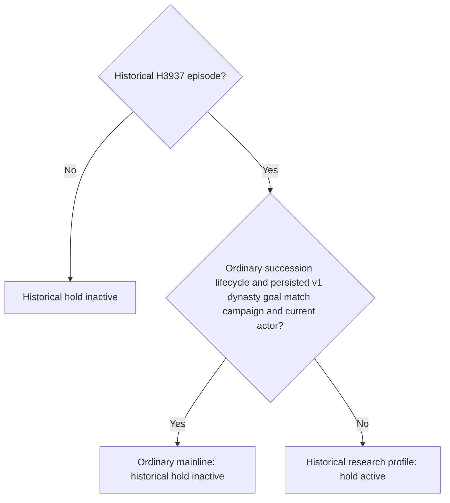

# Robert mainline and the historical H3937 date hold

Status on 2026-10-02: **production-live capability projection restored; execution scope repair static-ready; live clock verification pending**. Robert's original ordinary campaign remains the only current test entry. This change addresses an observed failure to advance the existing campaign; it does not add a war feature or complete a G2 milestone.

## Observed failure

The actual formal turn at `artifacts/g2-maintainer-2026-10-02/resume-12003/m4-council/robert-formal-once-01/turn-001/result.json` submitted no plan and advanced **0 game days**. The native driver removed timeline controls because `h3937_date_hold_active` matched only episode `native-29829-2bc2d599f7f9`. The ordinary campaign had retained that episode identifier from the historical H3937 checkpoint. Consequently, the old read-only research hold also froze the resumed mainline.

The already-captured `m7-robert/robert-mainline-v16-fallback-review-01/paused-intent-01/first-paused-01/049-internal-before-government.json` supplies the distinction:

| Existing persisted/frame field | Actual value |
| --- | --- |
| `episode_run_id` | `native-29829-2bc2d599f7f9` |
| `played_character.character_id` | `29829` |
| `date_raw` | `53220000` |
| `succession_lifecycle.lifecycle` | `ordinary_campaign_succession` |
| `succession_lifecycle.xar_enabled` | `xar_off` |
| `campaign_goal.format_version` / `goal_key` | `1` / `dynasty_continuity` |
| `campaign_goal.campaign_id` | Same as `episode_run_id` |
| `campaign_goal.current_character_id` | Same as the actual played actor, `29829` |

This frame comes from CK3 **1.20.0.3**, Steam build **25652598**, executable SHA-256 `94B55397ABB687A3DCD436805A5D885E6BE90FA6C693FEB44A9E3BBEEADE02A6`. It is existing paused evidence, not a new live run of this repair. Frame SHA-256: `6dd1790df8ee0fded8934c451e54853455bb8004605b53b50a09670d9e2be8e8`.

## Scope correction

`bridge/h3937_date_hold.py` now distinguishes the historical research profile from the migrated ordinary campaign using the existing lifecycle and typed goal. For the H3937 episode, the hold is inactive when the ordinary succession lifecycle is bound, the v1 `dynasty_continuity` goal belongs to that episode, and its current character matches the actual played character. Other H3937 frames retain the old hold, including those without the persisted ordinary goal. Source date, army and war observations remain audit anchors; changing them does not release the historical research profile.

The date and army-move classifiers are unchanged. This shared predicate corrects their existing profile scope; it does not supply a war plan, bypass a separate war contract, change feature flags, or reopen the historical H3937 research operator. No new CLI override, release bit, permission protocol or extra gate is introduced.

The earlier [H3937 static research audit](h3937-safe-first-hop-static-audit-2026-09-29.md) describes that historical checkpoint and its read-only research scope. Its episode identifier is not a permanent instruction to freeze a later explicitly resumed ordinary campaign. The mainline lifecycle and continuity intent are described in [the Robert campaign topic](robert-1066-ordinary-seed.md).

## Verification and remaining work

The single offline actual-frame regression is GREEN: the captured ordinary frame has no historical hold; the same frame without its typed goal retains the hold. Receipt: `artifacts/g2-maintainer-2026-10-02/resume-12003/robert-mainline-date-hold-fix-01/actual-frame-regression.json`. It issues no SDK query, gameplay operation, input or window action.

The existing five-test `test_h3937_date_hold.py` file was run once. All three module/classifier tests passed. Its two planner tests failed in eight subcases because the current strategy no longer contains their expected historical hold phases. A separate baseline run of only those two tests with the unchanged frozen v16 module reproduced the same eight failures, establishing that these failures precede this scope repair. The tests and strategy were left unchanged. Receipts and the baseline traceback are retained alongside the actual-frame regression as `legacy-tests-result.json`, `original-planner-baseline.json` and `original-planner-baseline.log`; the initial baseline harness import failed before running tests, then its package-initialization order was corrected.

The coordinated Python repair was published at `dd4772c02b8183b9e7c5efe72fe01649e4f67be1` and frozen as `production-source-dd4772c0`. The official MCP stdio capture `artifacts/g2-maintainer-2026-10-02/resume-12003/robert-sdk-history-export-01/actual-stdio-01/004-ck3_get_capabilities.json` reports the existing owned bridge PID `109676` and restores `life-advance`, `resume-map` and `set-speed-1` through `set-speed-5` in actual `action_steps`. This verifies the capability projection in the running campaign. It is not proof of a completed timeline command.

The subsequent normal formal turn at `robert-mainline-date-hold-fix-01/actual-normal-turn-01/` closed with `bounded-turn-returned` using that frozen source. The service consumed `private-query-assign-councillor-receipt-v1` with typed status `applied`, then saved a checkpoint. Its six sent packets contain root/government queries, the Council receipt/status reads and the save; they contain no timeline command. Before and after remain raw date `53220000`; the final frame is paused, Robert remains actor `29829`, and the same typed continuity goal is retained. `actual_advanced_game_days=0` and `continue_existing_turn=true` mean this attempt resolved the existing Council continuation rather than advancing a day.

## Actual execution failure and bound-context repair

The following real attempt, `robert-mainline-date-hold-fix-01/actual-normal-following-01/result.json`, selected `life-advance` in the normal service route but failed with `BridgeUnavailableError: H3937 date hold: physical hostile inventory and formal war/cash policy remain uncertified`. The frozen `production-source-dd4772c0` traceback reaches `_execute_step_unrecorded` at `native_driver.py:6763`. Thus actual capability presence and actual execution admission disagreed: capability projection used the corrected full-frame predicate, while the execution entry retained a direct episode-only comparison. This RED is preserved and supersedes any inference that the capability capture verified a clock command.

The driver repair adds `_h3937_date_hold_active(snapshot=None)`, a single wrapper over the existing module predicate. It reads the already-bound lifecycle and persisted campaign goal under the existing episode lock. When a snapshot is supplied, it preserves that frame's actual episode and played actor; for the early execution check, it uses the existing in-process episode and actor binding. It adds the same bound profile in both cases without taking another frame or changing stored state. All six snapshot callers and all three early episode-only denies now use this wrapper. Other admission, revision and postcondition checks are unchanged.

One offline regression calls the real production `_execute_step_unrecorded("life-advance")` entry using the captured Robert context. The old profile without a goal still raises the H3937 hold before any native observation. With the actual ordinary goal bound, the call passes that hold and reaches the normal native-observation method, where the test intercepts it. A frame containing only episode/actor/date also obtains the existing bound profile through the wrapper. Receipt: `robert-mainline-date-hold-fix-01/production-execute-scope-regression.json`. This test executes no endpoint operation and does not claim a completed clock turn; the old five-test suite and baseline tests were not repeated.

The driver scope hunks are handed off as `NATIVE-DRIVER-H3937-SCOPE-ONLY.patch` beside that receipt, so the coordinator can retain other already-published source changes when assembling the new frozen runtime. The executed dd4772c0 failure remains historical evidence; the driver repair still needs adoption and live confirmation.

Next, the coordinator must verify an ordinary paused → advance → paused turn with the repaired driver. Only a submitted timeline command and observed date delta can establish that the old clock rejection is gone. G2 stays **4/8 (50%)**; the capability restoration and Council receipt read supply no new game-day or milestone credit.
