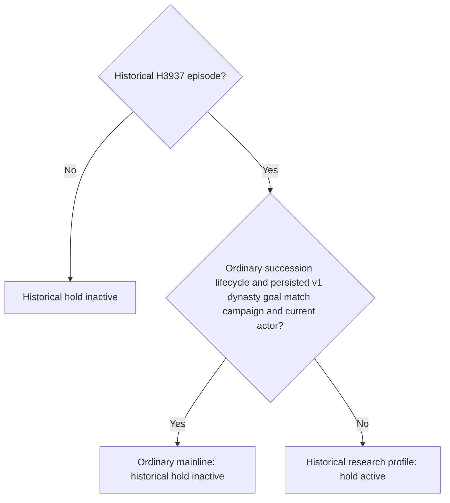

# Robert mainline and the historical H3937 date hold

Status on 2026-10-02: **static-ready scope repair; live clock verification pending**. Robert's original ordinary campaign remains the only current test entry. This change addresses an observed failure to advance the existing campaign; it does not add a war feature or complete a G2 milestone.

## Observed failure

The actual formal turn at `artifacts/g2-maintainer-2026-10-02/resume-12003/m4-council/robert-formal-once-01/turn-001/result.json` submitted no plan and advanced **0 game days**. The native driver removed timeline controls because `h3937_date_hold_active` matched only episode `native-29829-2bc2d599f7f9`. The ordinary campaign had retained that episode identifier from the historical H3937 checkpoint. Consequently, the old read-only research hold also froze the resumed mainline.

The already-captured `m7-robert/robert-mainline-v16-fallback-review-01/paused-intent-01/first-paused-01/049-internal-before-government.json` supplies the distinction:

| Existing persisted/frame field | Actual value |
| --- | --- |
| `episode_run_id` | `native-29829-2bc2d599f7f9` |
| `played_character.character_id` | `29829` |
| `date_raw` | `53220000` |
| `succession_lifecycle.lifecycle` | `ordinary_campaign_succession` |
| `succession_lifecycle.xar_enabled` | `xar_off` |
| `campaign_goal.format_version` / `goal_key` | `1` / `dynasty_continuity` |
| `campaign_goal.campaign_id` | Same as `episode_run_id` |
| `campaign_goal.current_character_id` | Same as the actual played actor, `29829` |

This frame comes from CK3 **1.20.0.3**, Steam build **25652598**, executable SHA-256 `94B55397ABB687A3DCD436805A5D885E6BE90FA6C693FEB44A9E3BBEEADE02A6`. It is existing paused evidence, not a new live run of this repair. Frame SHA-256: `6dd1790df8ee0fded8934c451e54853455bb8004605b53b50a09670d9e2be8e8`.

## Scope correction

`bridge/h3937_date_hold.py` now distinguishes the historical research profile from the migrated ordinary campaign using the existing lifecycle and typed goal. For the H3937 episode, the hold is inactive when the ordinary succession lifecycle is bound, the v1 `dynasty_continuity` goal belongs to that episode, and its current character matches the actual played character. Other H3937 frames retain the old hold, including those without the persisted ordinary goal. Source date, army and war observations remain audit anchors; changing them does not release the historical research profile.

The date and army-move classifiers are unchanged. This shared predicate corrects their existing profile scope; it does not supply a war plan, bypass a separate war contract, change feature flags, or reopen the historical H3937 research operator. Direct native-driver episode comparisons must use the same profile distinction as part of the coordinated repair. No new CLI override, release bit, permission protocol or extra gate is introduced.

The earlier [H3937 static research audit](h3937-safe-first-hop-static-audit-2026-09-29.md) describes that historical checkpoint and its read-only research scope. Its episode identifier is not a permanent instruction to freeze a later explicitly resumed ordinary campaign. The mainline lifecycle and continuity intent are described in [the Robert campaign topic](robert-1066-ordinary-seed.md).

## Verification and remaining work

The single offline actual-frame regression is GREEN: the captured ordinary frame has no historical hold; the same frame without its typed goal retains the hold. Receipt: `artifacts/g2-maintainer-2026-10-02/resume-12003/robert-mainline-date-hold-fix-01/actual-frame-regression.json`. It issues no SDK query, gameplay operation, input or window action.

The existing five-test `test_h3937_date_hold.py` file was run once. All three module/classifier tests passed. Its two planner tests failed in eight subcases because the current strategy no longer contains their expected historical hold phases. A separate baseline run of only those two tests with the unchanged frozen v16 module reproduced the same eight failures, establishing that these failures precede this scope repair. The tests and strategy were left unchanged. Receipts and the baseline traceback are retained alongside the actual-frame regression as `legacy-tests-result.json`, `original-planner-baseline.json` and `original-planner-baseline.log`; the initial baseline harness import failed before running tests, then its package-initialization order was corrected.

Next, the coordinator must bind the changed Python source to the managed Robert session and verify an ordinary paused → advance → paused turn. Until the resulting date delta and state are observed, this repair remains **static-ready**. G2 stays **4/8 (50%)**; this offline result supplies no new game-day or milestone credit.
