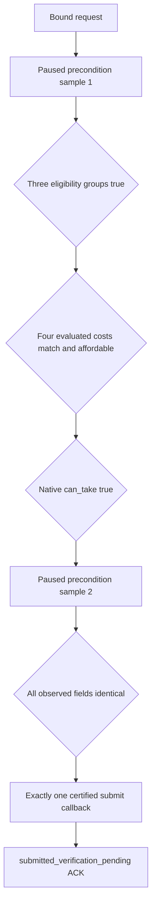

# Found Kingdom private action core v1

Status: `static-ready`, private and unregistered. This contract is bound to
CK3 `1.19.0.6`, executable SHA-256
`2D00FF3101EF70B566F2FCBAE292F09263199C80E9DC8F139B82D7D96F83DB86`,
and `found_kingdom_decision`. It does not provide a native submit binder,
shared bridge route, schema, MCP command, or live CK3 evidence.

The core turns the read-only observation delivered by DECISION2 through
DECISION4 into a narrow submit lifecycle. Its request freezes the played
character, decision database identity/generation, decision definition
identity/generation, current primary title identity/generation, snapshot and
native revisions, proof epoch, game date, world identity/generation/revision,
and all four
evaluated resource costs. Raw native addresses never enter the request, ACK,
or receipt.

## Submit transaction

Both samples must be complete application-main paused observations. They must
bind the exact request identity, generations, proof epoch, date, primary title,
world revision, eligibility results, evaluated gold/treasury/prestige/piety
cost, affordability, and `can_take`. A known `false` is a real precondition
failure. An unknown field, a changed field, or an unavailable callback rejects
before submit.

Only one submission may be pending in an action state. A second execute call
cannot invoke submit until a valid receipt closes the first ACK. The successful
submit callback is called once, and its ACK says only that verification is
pending. It never says that the decision ran.

Production submission requires a nonzero module base and a separately
certified submit ABI. This work package supplies neither. The standalone test
uses the explicit zero-module offline fixture switch; that switch cannot admit
a production configuration.

## Fresh receipt

A receipt must use an independent post-action observer and satisfy all of the
following:

- snapshot, native, and world revisions are strictly newer;
- proof epoch, game date, played character, and decision database
  identity/generation still match the ACK;
- the decision definition is absent, or the same definition is observed with
  a known false `can_take` result;
- a different, fully identified dynamic kingdom is the played character's
  primary title, its holder is the played character, and all title identity
  round trips succeed;
- the new title is registered in a newer world state and the title/world index
  round trip succeeds while world identity/generation remain bound.

A failed postcondition preserves the pending ACK so a later fresh paused
observation can close it. It remains a capability failure until a receipt
passes. A passing receipt proves only the observed decision, title, and minimal
world outcome described above.

## Effect boundary

DECISION1 froze the authored effect tree, but DECISION2 through DECISION5 do
not expose an effect preview. Both ACK and receipt therefore keep
`effect_preview_available=false` and `exact_benefit_claimed=false`. The core
does not claim an exact title/vassal delta, exact de-jure migration set, event
outcome, or net resource benefit. Those claims require later independent live
observation.

## Standalone validation

The standalone test covers the successful two-sample submit and fresh receipt,
single pending submission, eligibility/resource/affordability/`can_take`
rejections, proof and generation binding, sample drift, uncertified submit,
one failed submit attempt, stale receipt, decision state, title state, world
state, and a later fresh retry. It is compiled and executed in normal,
optimized, and strict `/permissive- /W4 /WX` configurations. These fixtures are
static evidence and do not upgrade the capability to production-live.
