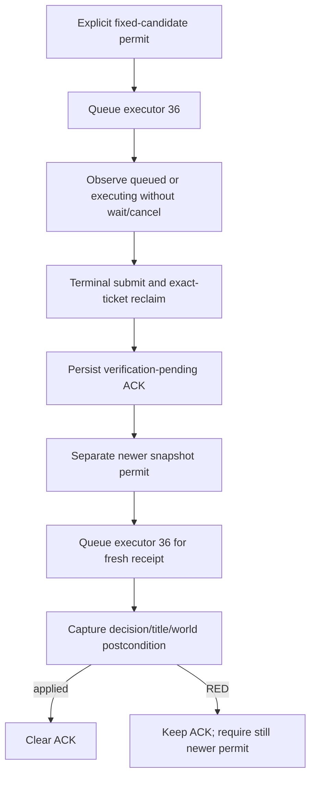

# Found Kingdom private internal route v1

Status: `private static-ready route / production capture binding missing`.
DECISION8 adds a candidate-internal permit and asynchronous submit/receipt
driver around DECISION7. It remains default OFF and advertised `false`. It does
not add a protocol command, capability token, public schema, MCP tool, or
planner action.

The route has one compile-time request identity and one compile-time decision
identity, `found_kingdom_decision`. A process-lifetime caller may grant a
monotonically newer submit permit only with a complete concrete precondition.
The application-main executor captures the candidate three times (the
DECISION7 concrete capture plus DECISION5's two immediate captures), and every
capture must exactly equal that permitted candidate before the exact native
submit can run. Candidate drift remains RED and the engine queue is not called.

`DriveMajorDecisionFoundKingdomInternalRouteV1` does not call
`WaitForMainThreadQueryV1`: a queued or executing transaction stays in flight
across heartbeats. Only a terminal state with the exact published and completed
sequence is reclaimed. `mailbox_busy`, `paused_main_thread_not_observed`, and
`application_main_not_observed` retain the permit for retry. Other transport,
ticket, or executor failures remain terminal RED.

The receipt has its own permit and mailbox ticket. Its announced snapshot
revision must be newer than the ACK precondition and every earlier receipt
attempt; the application-main postcondition capture must be at least that
fresh. A semantic receipt RED preserves the ACK and requires another newer
permit, so no failed result is silently accepted or repeatedly polled against
the same observation.

## Honest production boundary

The route is compiled into the shared DLL, while the CMake option
`XAR_CK3_ENABLE_G2_MAJOR_DECISION_FOUND_KINGDOM_INTERNAL_ROUTE_V1` remains OFF
by default. Even an enabled build cannot arm the route until both production
capture callbacks exist. Missing callbacks yield `missing_capture_binding` and
queue nothing.

The current DECISION3 source result does not contain the database/definition,
primary-title, and world identities/generations required by the DECISION5
precondition. The repository also has no production implementation of the
DECISION5 postcondition capture. Offline fixtures supply those callbacks only
to test the route; they are not live evidence.

The one next paused-live candidate step is therefore: bind exact-build
production precondition and independent postcondition captures to this route,
freeze one observed `found_kingdom_decision` candidate, then enable the private
build for one paused submit and one later fresh receipt. Until those capture
bindings exist, readiness stays `private static-ready`; no CK3 run should claim
candidate-ready, receipt-ready, or production-live behavior.

## Focused validation

The focused C++ fixture uses the real DECISION2-DECISION8 sources, exact submit
binder, fixed mailbox executor, and offline command ownership adapter. It covers
missing capture bindings, fixed-candidate submit plus independent fresh receipt,
queued in-flight observation, retryable mailbox contention, candidate drift
before native submit, and receipt RED followed by a newer successful receipt.
The test is compiled with MSVC `/W4 /WX /permissive-` in Debug and Release. The
enabled Release DLL is also linked to prove the internal route is present in the
shared native bridge. These checks do not start CK3.
