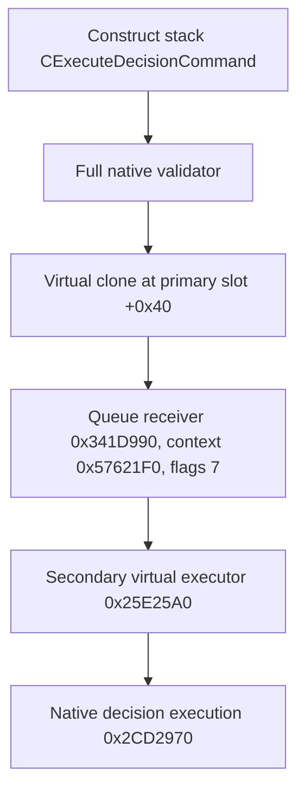

# Found Kingdom native submit ABI v1

Status: `static-ready`, private and unregistered. This work closes the exact
CK3 `1.19.0.6` production submit ABI for `found_kingdom_decision` and provides
the private adapter that DECISION5 can call after its two paused precondition
samples. It did not change CMake, a shared bridge, schema, planner, or MCP, and
did not launch CK3 or perform a live decision submission.

The machine-readable evidence is
[`major_decision_found_kingdom_native_submit_abi_v1.json`](../../ck3_autonomous_player/native_bridge/research/major_decision_found_kingdom_native_submit_abi_v1.json).
The standard-library-only verifier is
[`verify_major_decision_found_kingdom_native_submit_abi_v1.py`](../../ck3_autonomous_player/native_bridge/research/verify_major_decision_found_kingdom_native_submit_abi_v1.py).
Both bind executable SHA-256
`2D00FF3101EF70B566F2FCBAE292F09263199C80E9DC8F139B82D7D96F83DB86`
and the frozen decision block SHA-256
`4AA72233FD9266CD36C18DF10E9DBFC21B967003201F61B575C687FAA380C7DF`.

## Exact command identity and layout

MSVC RTTI identifies the object as `CExecuteDecisionCommand`. Its primary
vtable is at RVA `0x43237F8`, with complete-object locator `0x4963258`. Its
secondary vtable is at RVA `0x43237C8`, with locator `0x4963230` and subobject
offset `0x18`. Both locators bind type descriptor `0x54C1968` and the decorated
name `.?AVCExecuteDecisionCommand@@`.

The command occupies `0x38` bytes:

| Offset | Exact field |
|---:|---|
| `0x00` | primary vptr |
| `0x08` | base command flags |
| `0x0C` | sequence written by the queue receiver |
| `0x18` | secondary vptr |
| `0x20` | full played `CharacterID`, including generation bits |
| `0x28` | `CDecisionType*` definition |
| `0x30` | owned nullable decision-context pointer |

The constructor at RVA `0x25E2040` uses Microsoft x64 argument registers as
`(command_this, full_character_id, definition, pointer_to_owned_context)`. It
moves the owned context into offset `0x30` and clears the caller's owner. The
private found-kingdom adapter passes a null owner. The exact source block has
no authored decision option or widget context, and both the validator and
queued executor branch correctly around a null context. This is an execution
context boundary; it is not an effect preview.

A non-null generic decision context is `0x110` bytes in the observed factory
path. The command clone at `0x25EC440` deep-clones it through `0x1356BF0`.
The command destructor at `0x25E1FE0` invokes the context-owner destructor at
`0x0BFEAB0`; flags `0` destroy a caller-owned stack command, while flags `1`
also free the `0x38` command allocation.

## Validator and real execution route

The full validator is RVA `0x25E2350`, called as
`bool(command_this, optional_failure_sink)`. The stock submit path passes a
null failure sink. The validator invokes its preliminary validator at
`0x25E24E0`, re-resolves the full played-character identity, constructs the
character root scope, calls native `can_take` at `0x2CD2260`, selects the
evaluated cost at `0x1354E00`, and calls native affordability at `0x2CD9C70`.

The secondary vtable slot `+0x08` points to RVA `0x25E25A0`. It recovers the
definition, full character ID, and optional context from the primary object,
re-resolves the character, and calls the actual decision execution routine at
RVA `0x2CD2970`. The adapter therefore submits the exact engine command; no
injected execution callback or `unknown` result stands in for production.

## Queue ownership

The stock AI decision callsite at RVA range
`[0x188264E, 0x188273C)` performs this chain:



The receiver writes its sequence from receiver offset `0x3EC` to command
offset `0x0C`, clears the caller's owning pointer, and enqueues at RVA
`0x08154D0`. Receiver rejection paths call the command's virtual destructor
with flags `1` and also clear the owner. A `true` return and a cleared owner
mean the one command was accepted.

The private adapter follows the same lifecycle. It re-resolves the played
character, decision database, and exact `found_kingdom_decision` definition;
recomputes the DECISION4 database and definition generations; constructs and
validates a stack command; clones it once; destroys the stack command with
flags `0`; and passes the single heap owner to the receiver with flags `7`.
Validation failure destroys the stack object. Clone or layout failure destroys
all still-owned objects. If a queue call leaves the owner non-null, the adapter
destroys it with flags `1` and reports failure.

Production binding inherits DECISION4's 11 read-side function signatures and
six database/definition slots, then adds the 11 submit spans and four command
slots described here. It rejects every operation-table override and calls the exact
functions directly. The operation table is accepted only with the explicit
zero-module offline-fixture switch. The fixture proves adapter admission,
identity/generation rebinding, command layout checks, single clone/queue, and
all cleanup branches. It does not certify these addresses or claim live game
execution; the executable span hashes, RTTI, vtable slots, and decoded call
edges provide the static production ABI evidence.

## Verification and capability boundary

From the repository root, with an authorized exact-build CK3 installation:

```powershell
py ck3_autonomous_player/native_bridge/research/verify_major_decision_found_kingdom_native_submit_abi_v1.py --game-root <CK3-root>
py -O ck3_autonomous_player/native_bridge/research/verify_major_decision_found_kingdom_native_submit_abi_v1.py --game-root <CK3-root>
```

The verifier uses no `assert`. It checks the executable and source block
hashes, 11 complete instruction spans, runtime prefixes, both RTTI
complete-object locators, four command vtable slots, direct call targets,
queue context derivation, command field writes, queue flags, owner clearing,
and destructor allocation size.

The standalone adapter test compiles and runs in normal, `/O2`, and
`/permissive- /W4 /WX` configurations. Passing these checks means the private
production submit ABI and lifecycle wrapper are static-ready. DECISION7 now
compiles and registers the private executor in the shared backend. Effect
preview remains unavailable, exact benefit is not claimed, and production-live
status still requires a narrowly scoped caller or public route plus one
fixed-candidate paused CK3 submission and DECISION5's independent fresh
receipt.
