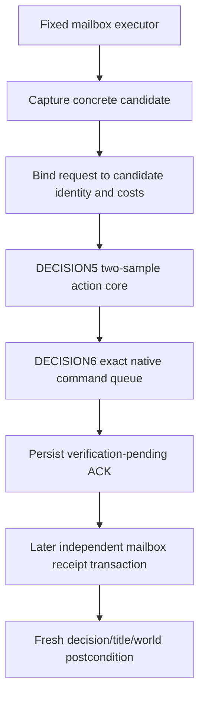

# Found Kingdom shared runtime glue v1

Status: `static-ready shared backend`, private and not advertised. This stage
compiles DECISION2 through DECISION7 into `xar_ck3_bridge.dll` and admits the
DECISION7 executor as one fixed application-main mailbox identity. It does not
add a protocol frame, public schema, MCP tool, planner action, or CK3 live
claim. `kMajorDecisionFoundKingdomSharedGlueCapabilityAdvertisedV1` therefore
remains `false`.

The backend is bound to CK3 `1.19.0.6`, executable SHA-256
`2D00FF3101EF70B566F2FCBAE292F09263199C80E9DC8F139B82D7D96F83DB86`,
and `found_kingdom_decision`. Its submit callback is DECISION6's exact
`CExecuteDecisionCommand` constructor, validator, clone, queue, ownership, and
destructor adapter. Callers cannot substitute a production operation table.

## Shared transaction

`ConfigureMajorDecisionFoundKingdomSharedGlueV1` accepts the existing paused
precondition capture, the exact native-submit environment, and an independent
postcondition capture. It replaces only the upstream submit callback with the
DECISION6 binder. A submit transaction then runs on the verified paused
application-main mailbox boundary:

The concrete candidate must match the mailbox stamp's paused date and retain
all DECISION2-DECISION4 identity, generation, source-hash, evaluated-cost, and
typed eligibility fields. DECISION5 then takes its own two identical fresh
samples before the one native submit. The resulting ACK remains in shared
state across mailbox reclaim. A second submit is typed RED while that ACK is
pending.

Receipt verification is a separate mailbox operation. Capture failure, a
stamp mismatch, or a stale/invalid decision-title-world postcondition remains
RED and preserves the pending ACK for a later fresh attempt. Only a passing
DECISION5 receipt clears it. Neither ACK nor receipt claims an effect preview
or exact benefit.

## Build and validation

The shared bridge CMake target now owns the observer, source adapter, native
binder, action core, exact submit adapter, and shared glue sources. The mailbox
installer copies and validates the dedicated fixed executor slot, and
`bridge.cpp` registers that exact function pointer without exposing a public
command.

The focused C++ fixture covers a successful submit plus fresh receipt, typed
eligibility RED, duplicate-submit RED, stale-receipt RED with retained ACK, and
mailbox-identity infrastructure RED. It also proves that a rejected
reconfiguration disables the prior binding instead of leaving it callable. It
builds with MSVC `/W4 /WX
/permissive-` and runs in Debug and Release. The Release `xar_ck3_bridge.dll`
also compiles and links with the new source set. These are offline fixtures;
no CK3 process is started.

Production-live readiness still requires a narrowly scoped internal caller or
protocol/MCP route, a fixed candidate, and one paused live submit followed by
the independent fresh receipt. Any such public interface is a later contract
change and is outside DECISION7.
