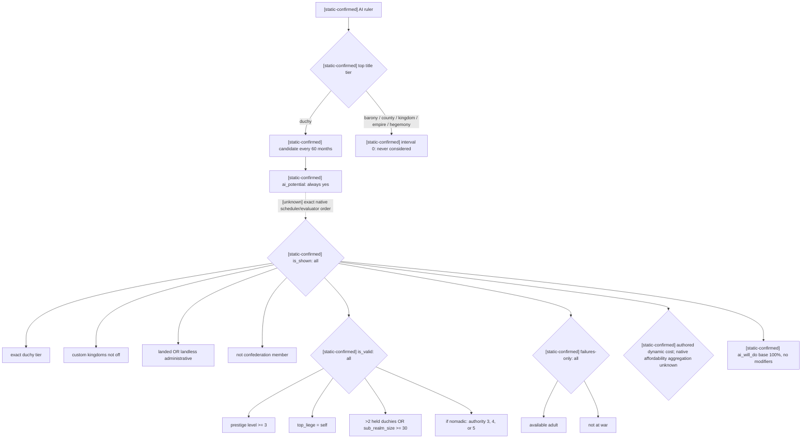
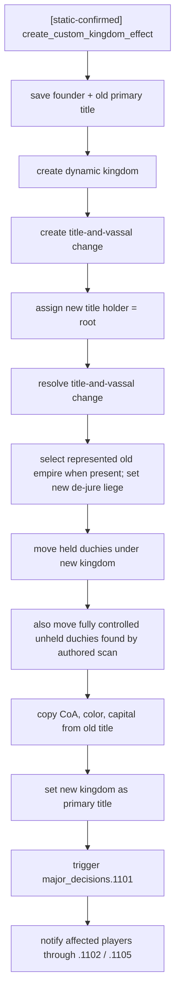

# 原版重大决议：建立新王国

证据状态：`static-confirmed`。本文冻结 CK3 `1.19.0.6` 中非宗教重大决议
`found_kingdom_decision` 的原版候选、eligibility、动态费用、AI 分数和效果树。工作包没有启动、附加或控制
CK3；没有实现 bridge、MCP、planner 或动作。因此本文不构成 `production-live` 观测或决议执行 readiness。

机器证据是
[`major_decision_found_kingdom_1_19_0_6_source.json`](../../ck3_autonomous_player/native_bridge/research/major_decision_found_kingdom_1_19_0_6_source.json)，
最小只读观测输入合同是
[`major_decision_found_kingdom_observer_v1_source_contract.json`](../../ck3_autonomous_player/native_bridge/research/fixtures/major_decision_found_kingdom_observer_v1_source_contract.json)，
离线复验器是
[`verify_major_decision_found_kingdom_source.py`](../../ck3_autonomous_player/native_bridge/research/verify_major_decision_found_kingdom_source.py)。

## P0 选择与边界

`found_kingdom_decision` 是现实的长期统治里程碑：公爵级角色通过扩张到三个公国或 30 realm size，支付资源后创建
动态王国，并把相关公国转入新王国的法理结构。它直接连接扩张、资源储备、停战窗口和 rank progression，且完整定义
不依赖 faith、doctrine、tenet、fervor、改宗或 holy order。

原版费用包含 `piety = 200`。本文只把 piety 当作定义明确的通用资源余额，不解释其宗教来源或用途；宗教域继续是
owner-deferred。`found_empire_decision`、特殊地区建国决议和决议 action 均不在本切片。

## Exact-build 来源

本冻结绑定：

- `binaries/ck3.exe`：`95,206,008` bytes，SHA-256
  `2D00FF3101EF70B566F2FCBAE292F09263199C80E9DC8F139B82D7D96F83DB86`，preferred image base
  `0x140000000`；
- `game/common/decisions/_decisions.info`：SHA-256
  `106977B58220107B66F537AADDA965F5A0602140DFB9BA7C79F3BA8BDD91CD9E`；
- `game/common/decisions/80_major_decisions.txt`：SHA-256
  `4E406B77DCEE8E98DB4875973030AAF0FDB18A9CD6505EAC374B75D481718471`；目标块为第
  `1000..1125` 行，canonical SHA-256
  `4AA72233FD9266CD36C18DF10E9DBFC21B967003201F61B575C687FAA380C7DF`；
- `game/common/scripted_effects/00_major_decisions_scripted_effects_3.txt`：SHA-256
  `725196DDCED6919A1EBCC091B09B5BD716A28EC88760E26E769796212298634D`；目标 effect 块为第
  `242..447` 行，canonical SHA-256
  `11944754762E1683CD11512658CBA527D69AE70E4E8AED90B43F80C2ACC8F4AF`；
- `game/common/scripted_triggers/00_available_for_events_triggers.txt` 与
  `game/common/game_rules/00_game_rules.txt` 分别冻结 landed/admin 展开和 `custom_kingdoms` 默认规则；完整文件、块哈希与
  行锚点在机器合同中。

`_decisions.info` 明确说明：`ai_check_interval_by_tier` 以月为单位，`0` 表示 AI 永不考虑；`ai_potential` 决定 AI
是否查看；`ai_will_do` 返回执行百分比，`100` 表示总是执行。它没有给出 native scheduler 的容器、due-date 状态或全部
evaluator 调用顺序，所以这些内容继续标为 `unknown`。

## 候选、eligibility 与分数

原版没有把该决议设为 `ai_goal`。候选间隔只对 top-title tier 为 duchy 的角色开放：每 60 个月一次；barony、county、
kingdom、empire、hegemony 均为 `0`，即不进入周期考虑。`ai_potential = { always = yes }`，最终
`ai_will_do = { base = 100 }`，没有 authored modifier。



图中的实线记录定义关系，不声称 native 引擎按图的排版顺序调用各 evaluator。只有虚线边表示尚未闭合的 native
调度/求值顺序。

## 动态费用矩阵

脚本把普通金币与 treasury 互斥投影；nomadic 额外免除 piety，且 gold 始终归零。prestige 始终为 500。

| `has_treasury` | nomadic | gold | treasury | prestige | piety |
|---|---:|---:|---:|---:|---:|
| no | no | 300 | 0 | 500 | 200 |
| yes | no | 0 | 300 | 500 | 200 |
| no | yes | 0 | 0 | 500 | 0 |
| yes | yes | 0 | 300 | 500 | 0 |

第三行是原版表达式的直接结果，不推断实际 nomadic actor 是否可能没有 treasury。原版 source info 没有声明多资源
affordability 聚合与 effect dispatch 的精确 native 顺序；observer 必须读取引擎最终 `is_affordable` / `can_take`，不能由
本表本地伪造最终合法性。

## Effect 树

决议入口先调用 `create_custom_kingdom_effect = yes`。该 scripted effect 的 authored 顺序为：



决议自己的尾部另有 player-only 分支：首次 human execution 把 root 与执行后的 `root.primary_title` 分别写入
`global_var:found_kingdom_decision` 和 `global_var:found_kingdom_decision_kingdom`。AI 不进入这个尾部；核心建国 effect
仍对 AI 执行。

本树只冻结 source-authored effect。它不证明 effect preview、动态 title 的预分配 ID、结算后的精确 title/vassal delta 或
event 后置状态。只有后续 paused action artifact 观察到新 kingdom、holder、primary title、de-jure 关系和资源扣除，才能升级
动作 readiness。

## 最小只读 observer 合同

`major-decision-found-kingdom-observer-v1-source-contract` 只允许查询当前 played character 和精确 allowlist
`found_kingdom_decision`。运行时同帧字段为：

- snapshot/frame、played-character identity、definition revision 与 top-title tier；
- `is_shown`、`is_valid`、`is_valid_showing_failures_only`、引擎最终 `is_affordable` 和 `can_take`；
- 引擎求值后的 gold/treasury/prestige/piety 四项费用。

AI interval、AI potential、AI score 与 effect fingerprint 是 exact-source metadata，不伪装为当前 NPC scheduler state。
effect 仅发布 source fingerprint，preview 保持 `unavailable`；查询禁止执行决议、扣费、推进时间或写入 manager/character。
定义缺失、evaluator 不可用和 state changed 均返回 typed unavailable；合法的 predicate `false` 保持 available false。

这份合同使用相对 `game/` 路径与调用时传入的 CK3 root，可迁移到 CodexSandboxOffline 或 Windows 用户 xenoa 的任一
获授权安装；不绑定账号、机器、个人凭据、绝对路径或 CK3 轮次。它是后续 bridge/MCP 实现输入，当前没有改变任何公共接口，
也不要求 open_kaishek 立即适配。

## 复验与未闭合项

从仓库根运行；`<CK3-root>` 必须含 `binaries/ck3.exe` 与 `game/`：

```console
py ck3_autonomous_player/native_bridge/research/verify_major_decision_found_kingdom_source.py --game-root <CK3-root>
py -O ck3_autonomous_player/native_bridge/research/verify_major_decision_found_kingdom_source.py --game-root <CK3-root>
```

两种模式必须同时 GREEN。verifier 不依赖 `assert`，逐项验证 exact EXE、完整 source 文件、行锚点、四个顶层块哈希、
决策语义和 observer 的只读/同帧/allowlist/fingerprint 约束。

下一项可施工入口是静态定位 native decision database、played-character definition lookup、三组 eligibility evaluator、动态
cost 与 affordability/can-take 的 application-main 生命周期；闭合后实现只读 observer 并取得生产 paused 双采样。当前 native
scheduler due-date、RNG call chain、effect preview、动作提交和后置验证均为 `unknown` / pending，不得据此修改 planner 或声称
重大决议已可自动执行。
