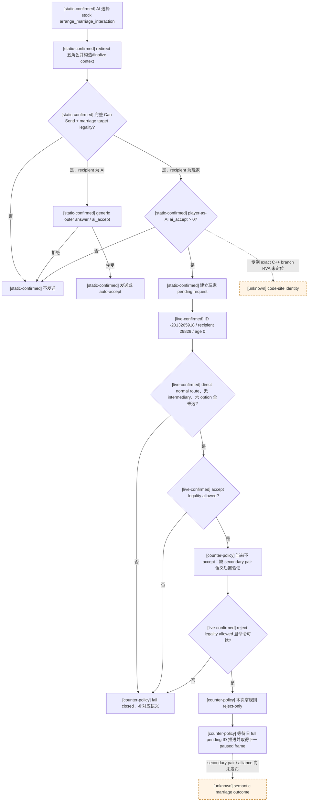

# CK3 1.19.0.6 婚姻与联盟：入站安排婚姻回复树

## 范围与结论

本文只闭合 exact-build CK3 `1.19.0.6` 中 stock
`arrange_marriage_interaction` 的一条真实 **AI → 本地玩家** 入站请求。它不是完整 P6 婚姻/联盟策略，
也不覆盖主动择偶、多候选联合评分、继承规划、遗传、离婚、通用 faith/doctrine 或其它
`special_interaction`。

- [static-confirmed] `arrange_marriage_interaction` 是定义绑定的 marriage special；它的
  `special_data_present=true` 不表示 war special，也不需要按战争 payload 解码。
- [static-confirmed] 原版 definition 的作者注释明确规定：AI 只有在 `player-as-AI`
  `ai_accept` 为正时，才会向玩家发出这项提议；这是该 interaction 的代码专例。
- [live-confirmed] 当前请求已经以完整 signed pending ID `-2013265918` 出现在 paused production frame；
  玩家 `29829` 是直接 recipient，四个婚姻角色齐全，无 intermediary，六个 send-option 均未选择，
  accept/reject/block 合法，acknowledge 非法。
- [counter-policy] 本次一代长跑的最小解除方案不是把它加入 generic ordinary allowlist，也不是凭发送时先验自动接受，
  而是增加一条 **仅匹配上述窄合同的 reject-only** 分支。proposal 的存在确实证明 exact stock AI 在发送时得到
  “玩家侧反事实 `ai_accept > 0`”，但当前不能重验该分数，也不能验证接受后 secondary pair 的婚姻/联盟结果。
  拒绝会写入五年 `player_declined_marriage` 并触发 decline event，因此该选择明确记为非最优的 G1 blocker removal。
- [unknown] 当前 wire 没有保存发送时的具体 `ai_accept` raw/breakdown，也没有发布 secondary pair 的
  marriage/betrothal 或新 alliance 后置状态。因此这条策略只能称为 G1 blocker-removal counter-policy，
  不能称为完整语义最优婚姻决策或完整 marriage outcome 验证。

## 冻结构建与来源

| 证据 | SHA-256 | 本文用途 |
|---|---|---|
| `Crusader Kings III/binaries/ck3.exe` | `2D00FF3101EF70B566F2FCBAE292F09263199C80E9DC8F139B82D7D96F83DB86` | exact-build native context、AI acceptance 与 reply ABI |
| `game/common/character_interactions/_character_interactions.info` | `F360C05B72CD2B0D87885E570FA55E70E41089DEFB4675BE5A82E390940D5D10` | Can Send 顺序与 marriage special 作者合同 |
| `game/common/character_interactions/00_marriage_interactions.txt` | `681A9B669E5A16642A197B6FE16085193DFBB99A398D0E20E86173F5AC6DE219` | stock definition、AI→player 专例、options 与 accept/decline effects |
| `game/common/scripted_modifiers/00_marriage_scripted_modifiers.txt` | `3A16A3957822A6AB682E1594E42921048791237BA65F070E66F815A4ACAD654C` | `marriage_ai_accept_modifier` 输入树 |
| `game/common/scripted_triggers/00_marriage_triggers.txt` | `BA0A8B51E1FECB9CC35EE94DAB5BC9B0C3B264932BAFAC33C77926423B60EB03` | target legality 与 auto-accept tree |
| `game/common/scripted_effects/00_marriage_interaction_effects.txt` | `A19CF10C6E7AA4F6475017B7202EBB06D528B53D8F09B5D4E23BD8F4C6767B6C` | accept effect 的 marriage/betrothal、alliance 与 prestige 路径 |
| fresh production `report.json` | `0D2BBFA638ED2BEC3F27D754DE5B64AE931F2627D4EB51FBC3F03EF125CC77D0` | 当前真实请求、frame 与 cleanup |
| fresh production `first-blocker.json` | `A8DF58EBF6AB25EDF633BFA6596A33ECBB8B6901E9A156F8A79FF5A6951F64D3` | 完整 pending context 与 planner blocker |

artifact 位于：

`C:\Users\xenoa\AppData\Local\Temp\xar-signed-pending-cf98648-state\runs\20260827T184232Z-one-generation-25fe58db\`

该 run 使用 source commit `cf98648b977c0c5c5eee4a425e1efa159239df1b`，bridge DLL SHA-256
`67B7231B55FB55788D1069C984589B91ABC0D25F8540B7E42FF7BFC4703CB535`。run 最终因 planner 对
marriage special 保持 fail-closed 而 RED；managed cleanup 为 GREEN，不能把本次 RED 写成 transport 或进程回收故障。

## 原生 definition 与角色模型

### Marriage special 不是 war special

- [static-confirmed] `00_marriage_interactions.txt:12-21` 把 canonical key 声明为
  `arrange_marriage_interaction`，并绑定
  `special_interaction = arrange_marriage_interaction` 与 `interface = marriage`。
- [static-confirmed] `_character_interactions.info:576-580` 说明该 special data 为婚姻界面和 AI 婚配服务，
  接受后自动令 secondary participants 结婚/订婚，并处理 alliance 与 prestige。
- [static-confirmed] `_character_interactions.info:582-587` 说明 `secondary_actor = marriage`、
  `secondary_recipient = marriage` 会把实际结婚双方与负责答复的 matchmaker 分开；recipient 是决定是否接受的
  matchmaker，不一定是实际配偶。
- [static-confirmed] 因而 generic pending ABI 的 `special_data +0x348` 只能解释为“definition-specific payload
  present”。当 canonical definition 已精确等于本 key 时，正确 domain classification 是 `marriage_special`，
  不是 `unknown_war_special`。payload 内部字段仍保持 opaque。

### `CMarriageOffer` subtype 与 outcome 边界

- [static-confirmed] exact-build RTTI `.?AVCMarriageOffer@@` 的 TypeDescriptor/COL/vtable RVA 分别为
  `0x5190B78 / 0x45F3DE8 / 0x40B0F20`。factory `0xA9DB00` 只分配 8 bytes 并写入 vptr，deleting
  destructor `0x7E65F0` 同样按 8 bytes 释放；所以 special object 是类型标签，不携带角色、option 或婚姻参数，
  也禁止从 payload `+0x08` 以后猜字段。
- [static-confirmed] `0xA87930` 把 factory wrapper `0x40B0660` 注册到 special registry getter
  `0x22828E0` 的 `+0x180` 槽；all-role constructor `0x2C3F000` 从 definition `+0x2A28` 取 special index，
  以 `0x40` stride 调 entry `+0x38` factory，并把结果写入 context `+0x330`，即 pending `+0x348`。
- [static-confirmed] vtable slot 8 `0x2282DE0` 执行婚姻/订婚，slot 12 `0x22836D0` 做 secondary-pair
  special check。实际配偶始终是 context `+0x2E0/+0x2E4` 的 secondary actor/recipient；primary actor/recipient
  是 matchmaker/responder，payload 中不存在另一个 recipient。
- [static-confirmed] slot 8 读取两名 secondary character 的年龄/性别与 context option：只有双方成人且
  `grand_wedding_promise=false` 才走 `0x2660B20` marriage，否则走 `0x2660F40` betrothal。当前 row 0 未选择，
  但 wire 没有两人的 adult bool，因此不能为本请求宣称最终 outcome kind。row 1 `matrilineal=false` 已由 authored
  option 顺序和同一 context vector闭合，不需要先完成 numeric flag → string 通用映射。
- [owner-deferred boundary] 当前 proposal 已通过完整 stock Can Send 与 reply legality，足以消费 opaque final legality；
  不为本 blocker 展开 clergy、same-sex、consanguinity、faith hostility 或 gender doctrine。若以后语义接受成为真实质量
  blocker，最小扩展是在同一 pending query 发布 `CMarriageOffer` subtype、secondary adult/outcome、lineality 与 opaque
  pair-legality，并对任意 secondary pair 补 spouse/betrothed 后置查询。

### Exact native role/context 链

[static-confirmed] 既有 exact-build anchors 给出：

- `0x831890` 取得 `CCharacterInteractionDatabase`，`+0xF48` 为 stock arrange-marriage definition；
  注册 xref 为 `0x2C3EA90`；
- `0x2C3C4C0` 在构造前 redirect actor、recipient、secondary actor、secondary recipient、intermediary
  五个完整 CharacterID；
- `0x2C3F000` 构造 all-role `CCharacterInteractionContext`，五个角色位于
  `+0x2D8/+0x2DC/+0x2E0/+0x2E4/+0x2E8`；
- `0x18FA80E..0x18FA8A1` 是原生 redirect → all-role constructor 调用路径；
- `0x2C40950` refresh、`0x2C40B20` finalize、`0x2C43F00` complete Can Send validator；
- `0x2C44320(context,out_raw)` 以 recipient responder scope 求 definition `+0x1BA8` 的 `ai_accept`
  raw，scale 为 `100000`；`0x2C43B40` 是包含 special seam 与 intermediary/recipient 组合的 outer answer。

这些 native facts 与 [events-and-interactions.md](events-and-interactions.md) 和
[interaction-structured-terms.md](interaction-structured-terms.md) 的 generic reply tree 一致。本文新增的婚姻专例来自
stock 作者合同；其“AI 向玩家发送前反向求玩家侧 `ai_accept`”的 exact C++ branch RVA 仍未独立定位，不能把
`0x2C43F00` 或 `0x2C43B40` 的 generic 分支名字直接冒充该专例地址。

## AI 发送与玩家回复树

### 发送前 legality 与婚姻目标

- [static-confirmed] generic Can Send 顺序先完成 scopes/redirect、range、special is-shown、definition
  `is_shown`、pending duplication、`is_valid_showing_failures_only`、`has_valid_target_showing_failures_only`、
  `can_send`、`is_valid`、`has_valid_target` 与 special can-send，最后才处理 responder acceptance。
- [static-confirmed] `00_marriage_interactions.txt:420-547` 排除 recipient imprisonment、actor/recipient 交战、
  secondary imprisonment 与不忠 regent 等失败；`563-625` 在两名 secondary 均已选择后调用
  `marriage_interaction_valid_target_trigger`，并有 AI guest、hostile-faith、republic 与 culture gates。
- [static-confirmed] `00_marriage_triggers.txt:362-441` 再按 adult marriage 或 minor betrothal调用
  `can_marry_character_trigger`；该 final trigger 内部消费生存、婚姻状态、性别、近亲与必要 faith legality。
  本策略只消费“exact native Can Send 已成功”的最终事实，不发布 doctrine/tenet 或建立通用宗教模型。
- [static-confirmed] `00_marriage_interactions.txt:6-10` 是本 interaction 的特殊作者合同：AI 对玩家发送时，
  会使用同一 `ai_accept`，且 **iff** 把玩家作为 AI actor 得到正值才发出 proposal；计算在代码中完成。
  该 iff **只证明发送瞬间** 的 `player-as-AI ai_accept > 0`，不提供数值、不保存 breakdown，也不自动证明
  查询时仍为正，更不等同于自动玩家自身的长期效用。
- [static-confirmed] `752-756` 把 `ai_accept` 定义为 `base=0 + marriage_ai_accept_modifier`。
  modifier 不只是 opinion：其已命名分区包括 hook/perk、实际结婚者、alliance/hostility、tier/government、opinion、
  dynasty prestige、lineality、faith、procreation、liege/claim/dread/family、court、struggle、grand wedding 与
  player-recipient anti-spam。不得用单一 alliance 或军力字段自行重算它。
- [static-confirmed] 尤其 `00_marriage_scripted_modifiers.txt:2342-2372` 对玩家 recipient 加入三类 `-5000`
  anti-spam：此前拒绝过同一 secondary actor、secondary recipient 不是玩家近亲/王朝、以及弱势低阶 actor 的 offer。
  当前 proposal 的存在说明完整 final sum 在发送时仍为正，但 wire 未给出具体 raw 或 breakdown。

### Auto-accept、正常 pending 与 effects

- [static-confirmed] `00_marriage_interactions.txt:748-750` 的 `auto_accept` 只调用
  `marriage_interaction_auto_accept_trigger`；trigger 在 `00_marriage_triggers.txt:443` 起处理已订婚、grand wedding
  与 strong hook 等分支。auto-accept 和普通 accept 不是同一路径。
- [static-confirmed] `00_marriage_interactions.txt:759-1061` 依次声明六个非互斥 send-option；generic context
  refresh 把 selected byte 注入 option scope。当前 live context 的六个 selected byte 全为 false，所以本请求没有携带
  任一显式 option flag。canonical flag string resolver 尚未闭合，但“全部为 false”不依赖逐项字符串映射。
- [static-confirmed] `694-725` 的 normal accept 调用 `marriage_interaction_on_accept_effect`，随后只在相应 option/
  transient state 存在时处理 herd、grand-wedding pending 与 contact-list cleanup。
- [static-confirmed] `727-746` 的 normal decline 会在 actor != recipient 时触发 `marriage_interaction.0011`，并给
  secondary actor 写入五年 `player_declined_marriage`。因此“拒绝”不是无效果、无长期状态的中性动作。
- [static-confirmed] accept effect 的细节可能依 adult/betrothal、lineality、家族与 alliance state 分支；
  `_character_interactions.info:576-580` 只允许把最终类别概括为 marriage/betrothal + alliance/prestige processing，
  不能据此伪造具体 title、prestige delta 或 alliance CharacterID。

## 当前 fresh live 请求

| 字段 | 观测值 | 证据解释 |
|---|---:|---|
| snapshot / revision | `native:6`, public `7`, native `6` | paused same-frame typed query |
| `date_raw` | `53211504` | proposal 在一日 advance 后出现，查询未再推进日期 |
| pending full ID | `-2013265918` | generation-bearing signed int32；不是 malformed ID |
| actor / recipient | `30287 / 29829` | recipient 等于 local played character |
| secondary actor / recipient | `38993 / 38293` | 实际 marriage/betrothal pair |
| intermediary | `-1` | direct recipient route |
| routing | kind `0`, responder `recipient` | local normal reply channel |
| age / expiry | `0 / 60` days | 未临近 deadline |
| special data | present | exact key 将其分类为 marriage special，不是 war binding |
| send options | count `6`, selected `[false,false,false,false,false,false]` | 没有显式 option flag |
| legality | accept/reject/block `true`, acknowledge `false` | normal reply；不是 notification ACK |
| active war | `33554527`, player attacker, warscore `15` | 与本 pending 没有 WarID binding；不能因同时有战争把它分类为 war interaction |

[live-confirmed] query 本身成功；planner 的唯一 blocker 是
`interaction_war_or_special_semantics_unclassified`。run 随后没有提交 reply，旧 pending 保持不变；报告保存了 immutable
seed，cleanup 全绿。故本专题解除的是当前真实 semantic classification/policy blocker，不新增 transport、WAL 或安全门禁。

`age_days=0` 与相同 `date_raw=53211504` 说明请求生成后尚未经过 pending manager 的下一次 daily aging，且 typed query
没有让游戏再前进一天；all-role IDs、selected options 与 reply legality 又来自同一 frozen pending context。因此
`player-as-AI ai_accept > 0 at send` 可以作为这一个 same-day、zero-option 请求的 accept 先验。它仍不能升级成
“query-time raw 仍为正”：同一 native day 内其它 effect 也可能改变关系/资源，而 wire 没有重放或保存 acceptance evaluator。
更关键的是，当前只能验证旧 pending ID 被消费，不能验证 `38993 ↔ 38293` 成婚/订婚或联盟结果。因此本轮不消费该先验
做持久 accept，而选择可由现有 reply lifecycle 验证的 reject-only unblock。若请求已经跨日、option 改变或 frame binding
不一致，连这条窄拒绝合同也不得复用。

## 最小 G1 blocker-removal 合同

[counter-policy] 只对同时满足以下条件的请求选择 `reject-pending-character-interaction`：

1. exact build、loaded production tree 与 canonical definition key 均匹配当前冻结证据；
2. key 精确为 `arrange_marriage_interaction`，definition domain 分类为 `marriage_special`；
3. current responder 是 local played character 的 direct `recipient`，`intermediary_character_id == -1`；
4. actor、recipient、secondary actor、secondary recipient 四个 CharacterID 均存在，且 frame binding/full pending ID
   仍与 query 完全一致；
5. `auto_accept_notification == false`、acknowledge 非法、reject 原生合法且 reject command 可达；
6. six-row send-option vector 长度与 definition 相等，且本次所有 selected 均为 false；
7. deadline 未到期，并且 action executor 能等待旧 full pending ID 消失/推进到下一 paused snapshot。

命中该窄规则时拒绝的依据与代价是：

- proposal 已经通过 complete Can Send 与 marriage target legality；
- stock AI→player 专例已在发送时证明玩家侧反事实 `ai_accept > 0`，所以拒绝不是语义最优结论；
- 但是发送时 raw/final decision 没有进入当前帧，且接受后的 secondary-pair marriage/betrothal、alliance、prestige
  均没有 typed postcondition；
- 没有显式 option flag，使当前帧形状可以被精确界定，不把规则扩到带额外交易的 proposal；
- decline 的确定结果包括 refusal event 与 secondary actor 五年 `player_declined_marriage`，这些副作用完整记账为质量债；
- 本次目标是解除有 artifact 的 G1 blocker，而不是提前实现完整 P6 婚姻优化器。

这条规则必须标为 `definition-bound reject-only blocker removal`，并保持 `native_ai_equivalent=false`、
`semantic_optimal=false`。若 reject 非法或不可达，必须继续阻断，严禁落入 generic unique-accept；若任一 shape guard
不满足，也维持 observation dependency。不得把规则扩成“所有婚姻一律拒绝”或“所有 special 一律拒绝”。

## 后置条件与剩余债务

- [implementation boundary] 当前 reject reply primitive 已能以完整 signed pending ID 提交并等待旧 ID 推进；这比只信
  command ACK 更强，足以证明该拒绝请求被消费并让 G1 继续。
- [unknown] 真正的 semantic accept postcondition 应观察 `38993 ↔ 38293` 成为 spouse/betrothed，并观察 matchmaker
  alliance/prestige 结果。现有 relationship snapshot 只覆盖 played character 自己的 spouse/betrothed，不能验证这对 secondary
  characters；accept 后这些婚姻/联盟副作用当前完全没有 typed postcondition，因此本轮不选择 accept，也不把
  `marriage_semantic_outcome_ready` 写成 true，也不能用旧 pending ID 消失冒充它们已按预期发生。
- [unknown] 发送时 `ai_accept` raw、breakdown 与 exact special code-site 尚未发布。以后若婚姻请求成为反复质量问题，
  首选复用 engine-owned finalized pending context，在 application-main paused query 中发布 raw + outer status；不要在 Python
  重写约 2800 行 modifier。
- [unknown] option numeric identifier → canonical flag string 尚未闭合。本次仅依赖“全部未选”的 vector invariant；
  任一 selected=true 的未来请求都不进入此窄规则。
- [owner-deferred boundary] faith/consanguinity 只作为 native final legality 与 aggregate acceptance 的 opaque 输入。
  不展开 doctrine、tenet、fervor、改宗或其它通用宗教树。
- [counter-policy] 完整 P6 仍需候选年龄/traits/health/fertility、继承位置、lineality、联盟价值、声望、近亲、接受
  breakdown 与 secondary-pair/alliance postcondition；本次不抢占这些后续工程。
