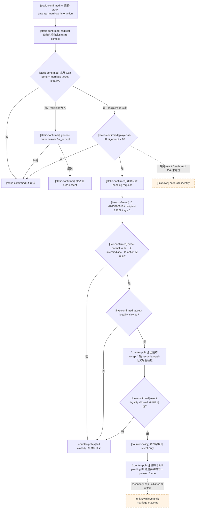
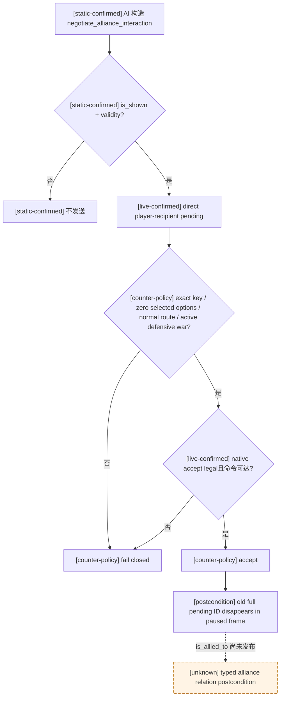
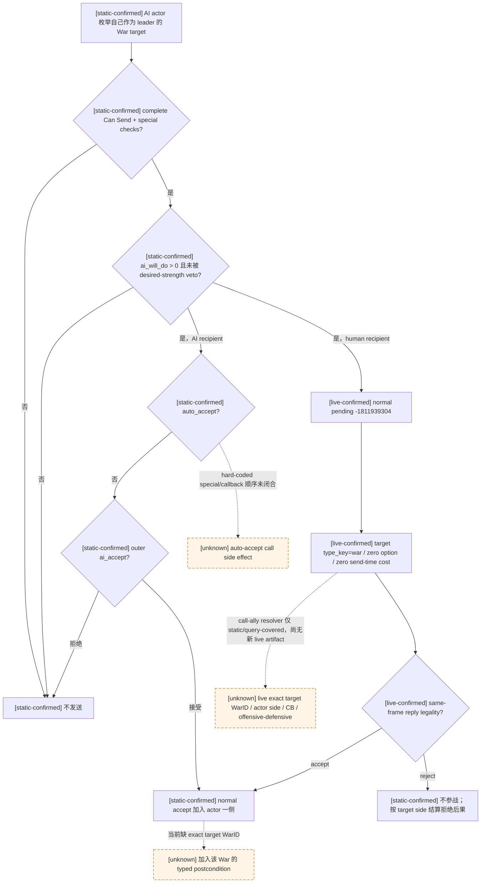
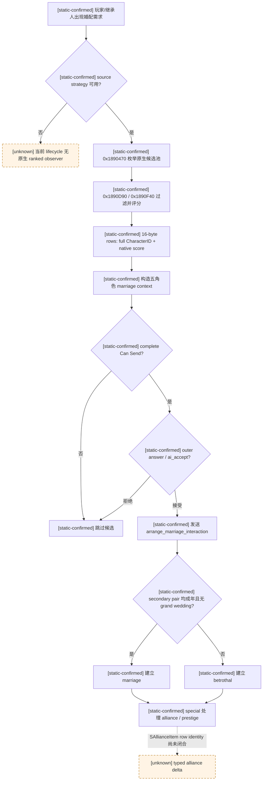

# CK3 1.19.0.6 婚姻、联盟与战争召集：主动婚配与入站回复树

## 范围与结论

本文先按一代长跑中真实出现的 blocker，分别闭合 exact-build CK3 `1.19.0.6` 的 stock
`arrange_marriage_interaction`、`negotiate_alliance_interaction` 与 `call_ally_interaction` 入站回复树；末节再冻结主动择偶的
原生候选发现、评分、合法性、接受度与主要结果树。它仍不是完整 P6 婚姻/联盟/多战争策略，也不覆盖继承规划、遗传、离婚、
通用 faith/doctrine 或其它 `special_interaction`。下列开篇结论先对应 marriage 入站分支；各分支在后文维护独立证据边界。

- [static-confirmed] `arrange_marriage_interaction` 是定义绑定的 marriage special；它的
  `special_data_present=true` 不表示 war special，也不需要按战争 payload 解码。
- [static-confirmed] 原版 definition 的作者注释明确规定：AI 只有在 `player-as-AI`
  `ai_accept` 为正时，才会向玩家发出这项提议；这是该 interaction 的代码专例。
- [live-confirmed] 当前请求已经以完整 signed pending ID `-2013265918` 出现在 paused production frame；
  玩家 `29829` 是直接 recipient，四个婚姻角色齐全，无 intermediary，六个 send-option 均未选择，
  accept/reject/block 合法，acknowledge 非法。
- [production-live loop] 本次一代长跑的最小解除方案不是把它加入 generic ordinary allowlist，也不是凭发送时先验自动接受，
  而是增加一条 **仅匹配上述窄合同的 reject-only** 分支。proposal 的存在确实证明 exact stock AI 在发送时得到
  “玩家侧反事实 `ai_accept > 0`”，但当前不能重验该分数，也不能验证接受后 secondary pair 的婚姻/联盟结果。
  拒绝会写入五年 `player_declined_marriage` 并触发 decline event，因此该选择明确记为非最优的 G1 blocker removal。
- [unknown] 当前 wire 没有保存发送时的具体 `ai_accept` raw/breakdown，也没有发布 secondary pair 的
  marriage/betrothal 或新 alliance 后置状态。因此这条策略只能称为 G1 blocker-removal counter-policy，
  不能称为完整语义最优婚姻决策或完整 marriage outcome 验证。

## 冻结构建与来源

| 证据 | SHA-256 | 本文用途 |
|---|---|---|
| `Crusader Kings III/binaries/ck3.exe` | `2D00FF3101EF70B566F2FCBAE292F09263199C80E9DC8F139B82D7D96F83DB86` | exact-build native context、AI acceptance 与 reply ABI |
| `game/common/character_interactions/_character_interactions.info` | `F360C05B72CD2B0D87885E570FA55E70E41089DEFB4675BE5A82E390940D5D10` | Can Send 顺序与 marriage special 作者合同 |
| `game/common/character_interactions/00_marriage_interactions.txt` | `681A9B669E5A16642A197B6FE16085193DFBB99A398D0E20E86173F5AC6DE219` | stock definition、AI→player 专例、options 与 accept/decline effects |
| `game/common/scripted_modifiers/00_marriage_scripted_modifiers.txt` | `3A16A3957822A6AB682E1594E42921048791237BA65F070E66F815A4ACAD654C` | `marriage_ai_accept_modifier` 输入树 |
| `game/common/scripted_triggers/00_marriage_triggers.txt` | `BA0A8B51E1FECB9CC35EE94DAB5BC9B0C3B264932BAFAC33C77926423B60EB03` | target legality 与 auto-accept tree |
| `game/common/scripted_effects/00_marriage_interaction_effects.txt` | `A19CF10C6E7AA4F6475017B7202EBB06D528B53D8F09B5D4E23BD8F4C6767B6C` | accept effect 的 marriage/betrothal、alliance 与 prestige 路径 |
| fresh production `report.json` | `0D2BBFA638ED2BEC3F27D754DE5B64AE931F2627D4EB51FBC3F03EF125CC77D0` | 当前真实请求、frame 与 cleanup |
| fresh production `first-blocker.json` | `A8DF58EBF6AB25EDF633BFA6596A33ECBB8B6901E9A156F8A79FF5A6951F64D3` | 完整 pending context 与 planner blocker |

artifact 位于：

`C:\Users\xenoa\AppData\Local\Temp\xar-signed-pending-cf98648-state\runs\20260827T184232Z-one-generation-25fe58db\`

该 run 使用 source commit `cf98648b977c0c5c5eee4a425e1efa159239df1b`，bridge DLL SHA-256
`67B7231B55FB55788D1069C984589B91ABC0D25F8540B7E42FF7BFC4703CB535`。run 最终因 planner 对
marriage special 保持 fail-closed 而 RED；managed cleanup 为 GREEN，不能把本次 RED 写成 transport 或进程回收故障。

## 原生 definition 与角色模型

### Marriage special 不是 war special

- [static-confirmed] `00_marriage_interactions.txt:12-21` 把 canonical key 声明为
  `arrange_marriage_interaction`，并绑定
  `special_interaction = arrange_marriage_interaction` 与 `interface = marriage`。
- [static-confirmed] `_character_interactions.info:576-580` 说明该 special data 为婚姻界面和 AI 婚配服务，
  接受后自动令 secondary participants 结婚/订婚，并处理 alliance 与 prestige。
- [static-confirmed] `_character_interactions.info:582-587` 说明 `secondary_actor = marriage`、
  `secondary_recipient = marriage` 会把实际结婚双方与负责答复的 matchmaker 分开；recipient 是决定是否接受的
  matchmaker，不一定是实际配偶。
- [static-confirmed] 因而 generic pending ABI 的 `special_data +0x348` 只能解释为“definition-specific payload
  present”。当 canonical definition 已精确等于本 key 时，正确 domain classification 是 `marriage_special`，
  不是 `unknown_war_special`。payload 内部字段仍保持 opaque。

### `CMarriageOffer` subtype 与 outcome 边界

- [static-confirmed] exact-build RTTI `.?AVCMarriageOffer@@` 的 TypeDescriptor/COL/vtable RVA 分别为
  `0x5190B78 / 0x45F3DE8 / 0x40B0F20`。factory `0xA9DB00` 只分配 8 bytes 并写入 vptr，deleting
  destructor `0x7E65F0` 同样按 8 bytes 释放；所以 special object 是类型标签，不携带角色、option 或婚姻参数，
  也禁止从 payload `+0x08` 以后猜字段。
- [static-confirmed] `0xA87930` 把 factory wrapper `0x40B0660` 注册到 special registry getter
  `0x22828E0` 的 `+0x180` 槽；all-role constructor `0x2C3F000` 从 definition `+0x2A28` 取 special index，
  以 `0x40` stride 调 entry `+0x38` factory，并把结果写入 context `+0x330`，即 pending `+0x348`。
- [static-confirmed] vtable slot 8 `0x2282DE0` 执行婚姻/订婚，slot 12 `0x22836D0` 做 secondary-pair
  special check。实际配偶始终是 context `+0x2E0/+0x2E4` 的 secondary actor/recipient；primary actor/recipient
  是 matchmaker/responder，payload 中不存在另一个 recipient。
- [static-confirmed] slot 8 读取两名 secondary character 的年龄/性别与 context option：只有双方成人且
  `grand_wedding_promise=false` 才走 `0x2660B20` marriage，否则走 `0x2660F40` betrothal。当前 row 0 未选择，
  但 wire 没有两人的 adult bool，因此不能为本请求宣称最终 outcome kind。row 1 `matrilineal=false` 已由 authored
  option 顺序和同一 context vector 闭合，不需要先完成 numeric flag → string 通用映射。
- [owner-deferred boundary] 当前 proposal 已通过完整 stock Can Send 与 reply legality，足以消费 opaque final legality；
  不为本 blocker 展开 clergy、same-sex、consanguinity、faith hostility 或 gender doctrine。若以后语义接受成为真实质量
  blocker，最小扩展是在同一 pending query 发布 `CMarriageOffer` subtype、secondary adult/outcome、lineality 与 opaque
  pair-legality，并对任意 secondary pair 补 spouse/betrothed 后置查询。

### Exact native role/context 链

[static-confirmed] 既有 exact-build anchors 给出：

- `0x831890` 取得 `CCharacterInteractionDatabase`，`+0xF48` 为 stock arrange-marriage definition；
  注册 xref 为 `0x2C3EA90`；
- `0x2C3C4C0` 在构造前 redirect actor、recipient、secondary actor、secondary recipient、intermediary
  五个完整 CharacterID；
- `0x2C3F000` 构造 all-role `CCharacterInteractionContext`，五个角色位于
  `+0x2D8/+0x2DC/+0x2E0/+0x2E4/+0x2E8`；
- `0x18FA80E..0x18FA8A1` 是原生 redirect → all-role constructor 调用路径；
- `0x2C40950` refresh、`0x2C40B20` finalize、`0x2C43F00` complete Can Send validator；
- `0x2C44320(context,out_raw)` 以 recipient responder scope 求 definition `+0x1BA8` 的 `ai_accept`
  raw，scale 为 `100000`；`0x2C43B40` 是包含 special seam 与 intermediary/recipient 组合的 outer answer。

这些 native facts 与 [events-and-interactions.md](events-and-interactions.md) 和
[interaction-structured-terms.md](interaction-structured-terms.md) 的 generic reply tree 一致。本文新增的婚姻专例来自
stock 作者合同；其“AI 向玩家发送前反向求玩家侧 `ai_accept`”的 exact C++ branch RVA 仍未独立定位，不能把
`0x2C43F00` 或 `0x2C43B40` 的 generic 分支名字直接冒充该专例地址。

## AI 发送与玩家回复树

### 发送前 legality 与婚姻目标

- [static-confirmed] generic Can Send 顺序先完成 scopes/redirect、range、special is-shown、definition
  `is_shown`、pending duplication、`is_valid_showing_failures_only`、`has_valid_target_showing_failures_only`、
  `can_send`、`is_valid`、`has_valid_target` 与 special can-send，最后才处理 responder acceptance。
- [static-confirmed] `00_marriage_interactions.txt:420-547` 排除 recipient imprisonment、actor/recipient 交战、
  secondary imprisonment 与不忠 regent 等失败；`563-625` 在两名 secondary 均已选择后调用
  `marriage_interaction_valid_target_trigger`，并有 AI guest、hostile-faith、republic 与 culture gates。
- [static-confirmed] `00_marriage_triggers.txt:362-441` 再按 adult marriage 或 minor betrothal调用
  `can_marry_character_trigger`；该 final trigger 内部消费生存、婚姻状态、性别、近亲与必要 faith legality。
  本策略只消费“exact native Can Send 已成功”的最终事实，不发布 doctrine/tenet 或建立通用宗教模型。
- [static-confirmed] `00_marriage_interactions.txt:6-10` 是本 interaction 的特殊作者合同：AI 对玩家发送时，
  会使用同一 `ai_accept`，且 **iff** 把玩家作为 AI actor 得到正值才发出 proposal；计算在代码中完成。
  该 iff **只证明发送瞬间** 的 `player-as-AI ai_accept > 0`，不提供数值、不保存 breakdown，也不自动证明
  查询时仍为正，更不等同于自动玩家自身的长期效用。
- [static-confirmed] `752-756` 把 `ai_accept` 定义为 `base=0 + marriage_ai_accept_modifier`。
  modifier 不只是 opinion：其已命名分区包括 hook/perk、实际结婚者、alliance/hostility、tier/government、opinion、
  dynasty prestige、lineality、faith、procreation、liege/claim/dread/family、court、struggle、grand wedding 与
  player-recipient anti-spam。不得用单一 alliance 或军力字段自行重算它。
- [static-confirmed] 尤其 `00_marriage_scripted_modifiers.txt:2342-2372` 对玩家 recipient 加入三类 `-5000`
  anti-spam：此前拒绝过同一 secondary actor、secondary recipient 不是玩家近亲/王朝、以及弱势低阶 actor 的 offer。
  当前 proposal 的存在说明完整 final sum 在发送时仍为正，但 wire 未给出具体 raw 或 breakdown。

### Auto-accept、正常 pending 与 effects

- [static-confirmed] `00_marriage_interactions.txt:748-750` 的 `auto_accept` 只调用
  `marriage_interaction_auto_accept_trigger`；trigger 在 `00_marriage_triggers.txt:443` 起处理已订婚、grand wedding
  与 strong hook 等分支。auto-accept 和普通 accept 不是同一路径。
- [static-confirmed] `00_marriage_interactions.txt:759-1061` 依次声明六个非互斥 send-option；generic context
  refresh 把 selected byte 注入 option scope。当前 live context 的六个 selected byte 全为 false，所以本请求没有携带
  任一显式 option flag。canonical flag string resolver 尚未闭合，但“全部为 false”不依赖逐项字符串映射。
- [static-confirmed] `694-725` 的 normal accept 调用 `marriage_interaction_on_accept_effect`，随后只在相应 option/
  transient state 存在时处理 herd、grand-wedding pending 与 contact-list cleanup。
- [static-confirmed] `727-746` 的 normal decline 会在 actor != recipient 时触发 `marriage_interaction.0011`，并给
  secondary actor 写入五年 `player_declined_marriage`。因此“拒绝”不是无效果、无长期状态的中性动作。
- [static-confirmed] accept effect 的细节可能依 adult/betrothal、lineality、家族与 alliance state 分支；
  `_character_interactions.info:576-580` 只允许把最终类别概括为 marriage/betrothal + alliance/prestige processing，
  不能据此伪造具体 title、prestige delta 或 alliance CharacterID。



## 当前 fresh live 请求

| 字段 | 观测值 | 证据解释 |
|---|---:|---|
| snapshot / revision | `native:6`, public `7`, native `6` | paused same-frame typed query |
| `date_raw` | `53211504` | proposal 在一日 advance 后出现，查询未再推进日期 |
| pending full ID | `-2013265918` | generation-bearing signed int32；不是 malformed ID |
| actor / recipient | `30287 / 29829` | recipient 等于 local played character |
| secondary actor / recipient | `38993 / 38293` | 实际 marriage/betrothal pair |
| intermediary | `-1` | direct recipient route |
| routing | kind `0`, responder `recipient` | local normal reply channel |
| age / expiry | `0 / 60` days | 未临近 deadline |
| special data | present | exact key 将其分类为 marriage special，不是 war binding |
| send options | count `6`, selected `[false,false,false,false,false,false]` | 没有显式 option flag |
| legality | accept/reject/block `true`, acknowledge `false` | normal reply；不是 notification ACK |
| active war | `33554527`, player attacker, warscore `15` | 与本 pending 没有 WarID binding；不能因同时有战争把它分类为 war interaction |

[live-confirmed] query 本身成功；planner 的唯一 blocker 是
`interaction_war_or_special_semantics_unclassified`。run 随后没有提交 reply，旧 pending 保持不变；报告保存了 immutable
seed，cleanup 全绿。故本专题解除的是当前真实 semantic classification/policy blocker，不新增 transport、WAL 或安全门禁。

[production-live loop] commit `c21c096263325e1d8a13a4b01eebaa38ac88d2dd` 的 fresh cold replay
`20260827T191804Z-one-generation-8c116e3e` 从同一不可变 `date_raw=53211480` seed 恢复。turn 2 推进一日并再次产生
negative full ID `-2013265918`；turn 3 typed query 保持同一 paused frame，turn 4 按
`arrange-marriage-reject-only-v1` 选择 `reject-pending-character-interaction`。native result 明确为
`interaction_result.status=rejected`、instance/sender `-2013265918/30287`，且 after snapshot 与
`remaining_pending_character_interaction` 均为 `null`，不是只信 queue ACK。随后又完成三次日期推进到 `53211576`，保存
periodic/final 两份 checkpoint；最终 checkpoint 76,993,050 bytes、SHA-256
`EEBE541E5C6CA8372E95F294FA3C93B9E7A423D8E8281EE7E0FE9BC4CFB0B57B`。12/12 turns 成功，角色 `29829`
仍存活，只因人为 turn bound 收口；cleanup 全绿且 CK3 进程归零。report SHA-256
`3980E4A2CD7F140A98488184C2095B3B41EF92EC80505B837177200705DD3973`，first-blocker 仅为 bound，SHA-256
`B821A021F42C881865070BDBE6BA0F9C5C7884C549B1DBD13CBEF76C62AB5FA2`。这把本篇窄 reject lifecycle 升级为
production-live loop，但不升级 accept、secondary-pair semantic outcome 或完整婚姻效用。

`age_days=0` 与相同 `date_raw=53211504` 说明请求生成后尚未经过 pending manager 的下一次 daily aging，且 typed query
没有让游戏再前进一天；all-role IDs、selected options 与 reply legality 又来自同一 frozen pending context。因此
`player-as-AI ai_accept > 0 at send` 可以作为这一个 same-day、zero-option 请求的 accept 先验。它仍不能升级成
“query-time raw 仍为正”：同一 native day 内其它 effect 也可能改变关系/资源，而 wire 没有重放或保存 acceptance evaluator。
更关键的是，当前只能验证旧 pending ID 被消费，不能验证 `38993 ↔ 38293` 成婚/订婚或联盟结果。因此本轮不消费该先验
做持久 accept，而选择可由现有 reply lifecycle 验证的 reject-only unblock。跨日自身不会改变这个 reply 的类型或已知
decline 结果；只有 deadline 缺失、类型错误、`remaining != expiration - age`、`age >= expiration`、boundary 已到、option 改变或
frame binding 不一致时，连这条窄拒绝合同也不得复用。

[production RED / static fix pending live replay] R761 的普通 production 长跑在 turn 251 遇到第二个自然
`arrange_marriage_interaction`：pending full ID `-1040187385`，actor/recipient `34676/31853`，secondary pair
`63759/36403`，direct local route，six-row option vector 全未选，reject 仍由同帧 native legality 标为合法且命令可达。
它唯一没有通过既有窄合同的字段是 deadline 已自然老化为 `age=2 / expiration=60 / remaining=58 / not_reached`，策略因此以
`marriage_same_day_deadline_shape_mismatch` 停止。formal report SHA-256 为
`0EF048777C7968A3373BF4B2C4FE56737747926E502BBA3485A224AFC600A649`；最后安全 checkpoint 为
`date_raw=53333040`、index `1116`、save SHA-256
`387C84177A543BB768C5F10A1FB526B15BF3BC31539B310D0DD623D9132EDA3E`。

该 RED 证明原来的 `age=0` 是过窄的 planner shape guard，而不是原生 reply 生命周期要求。exact-build pending ABI 已冻结
`pending+0x5B8` 每日递增、全局 expiry 为 `60`，以及 `remaining=max(0, expiration-age)`；human-owned 请求在
`age >= expiration` 的 daily pass 才进入到期处理。修复后的策略只接受 typed integer、`expiration==60`、
`0 <= age < expiration`、`remaining == expiration-age > 0` 且 boundary 为 `not_reached` 的窗口。它仍保持
definition、四角色、direct route、opaque special、zero-option vector、same-frame legality 和 action reachability 的全部旧门，
也仍禁止落入 unique accept。此差异在新的冻结候选从上述 checkpoint cold resume 并观察旧 pending ID 消失及下一 paused
turn 继续前，只能记为 **static-ready B0 fix**，不能记为新的 production-live reply 证据。

## 最小 G1 blocker-removal 合同

[counter-policy] 只对同时满足以下条件的请求选择 `reject-pending-character-interaction`：

1. exact build、loaded production tree 与 canonical definition key 均匹配当前冻结证据；
2. key 精确为 `arrange_marriage_interaction`，definition domain 分类为 `marriage_special`；
3. current responder 是 local played character 的 direct `recipient`，`intermediary_character_id == -1`；
4. actor、recipient、secondary actor、secondary recipient 四个 CharacterID 均存在，且 frame binding/full pending ID
   仍与 query 完全一致；
5. `auto_accept_notification == false`、acknowledge 非法、reject 原生合法且 reject command 可达；
6. six-row send-option vector 长度与 definition 相等，且本次所有 selected 均为 false；
7. deadline 是内部一致的 stock 60 天窗口：`0 <= age < 60`、`remaining == 60-age > 0`、boundary 为
   `not_reached`；action executor 能等待旧 full pending ID 消失/推进到下一 paused snapshot。

命中该窄规则时拒绝的依据与代价是：

- proposal 已经通过 complete Can Send 与 marriage target legality；
- stock AI→player 专例已在发送时证明玩家侧反事实 `ai_accept > 0`，所以拒绝不是语义最优结论；
- 但是发送时 raw/final decision 没有进入当前帧，且接受后的 secondary-pair marriage/betrothal、alliance、prestige
  均没有 typed postcondition；
- 没有显式 option flag，使当前帧形状可以被精确界定，不把规则扩到带额外交易的 proposal；
- decline 的确定结果包括 refusal event 与 secondary actor 五年 `player_declined_marriage`，这些副作用完整记账为质量债；
- 本次目标是解除有 artifact 的 G1 blocker，而不是提前实现完整 P6 婚姻优化器。

这条规则必须标为 `definition-bound reject-only blocker removal`，并保持 `native_ai_equivalent=false`、
`semantic_optimal=false`。若 reject 非法或不可达，必须继续阻断，严禁落入 generic unique-accept；若任一 shape guard
不满足，也维持 observation dependency。不得把规则扩成“所有婚姻一律拒绝”或“所有 special 一律拒绝”。

## 后置条件与剩余债务

- [implementation boundary] 当前 reject reply primitive 已能以完整 signed pending ID 提交并等待旧 ID 推进；这比只信
  command ACK 更强，足以证明该拒绝请求被消费并让 G1 继续。
- [unknown] 真正的 semantic accept postcondition 应观察 `38993 ↔ 38293` 成为 spouse/betrothed，并观察 matchmaker
  alliance/prestige 结果。现有 relationship snapshot 只覆盖 played character 自己的 spouse/betrothed，不能验证这对 secondary
  characters；accept 后这些婚姻/联盟副作用当前完全没有 typed postcondition，因此本轮不选择 accept，也不把
  `marriage_semantic_outcome_ready` 写成 true，也不能用旧 pending ID 消失冒充它们已按预期发生。
- [unknown] 发送时 `ai_accept` raw、breakdown 与 exact special code-site 尚未发布。以后若婚姻请求成为反复质量问题，
  首选复用 engine-owned finalized pending context，在 application-main paused query 中发布 raw + outer status；不要在 Python
  重写约 2800 行 modifier。
- [unknown] option numeric identifier → canonical flag string 尚未闭合。本次仅依赖“全部未选”的 vector invariant；
  任一 selected=true 的未来请求都不进入此窄规则。
- [owner-deferred boundary] faith/consanguinity 只作为 native final legality 与 aggregate acceptance 的 opaque 输入。
  不展开 doctrine、tenet、fervor、改宗或其它通用宗教树。
- [counter-policy] 完整 P6 仍需候选年龄/traits/health/fertility、继承位置、lineality、联盟价值、声望、近亲、接受
  breakdown 与 secondary-pair/alliance postcondition；本次不抢占这些后续工程。

## G2：入站协商联盟的 exact blocker

本节只处理第二角色长跑中首次真实出现的 stock
`negotiate_alliance_interaction`。它不把通用外交、主动邀请盟友、call-to-war 或完整联盟效用标成完成。

### 冻结来源与 production RED

| 证据 | SHA-256 / 值 | 用途 |
|---|---|---|
| `Crusader Kings III/binaries/ck3.exe` | `2D00FF3101EF70B566F2FCBAE292F09263199C80E9DC8F139B82D7D96F83DB86` | exact build 与 pending reply ABI |
| `game/common/character_interactions/00_alliance.txt` | `919ED408EC735F64ED972E23A376CD618A2E207A0EA273F973C5B1F89440E39D` | definition、options、accept/decline effects 与 AI reply tree |
| attempt02 `report.json` | `E28928785B449BEE6DC545E145EB189A4D70F4100F0993F41A8904D3384C2493` | 657/658 成功 turns 后的 production capability RED |
| attempt02 `first-blocker.json` | `FD2717013C2B917584395AA93D065B2EF8D63FEF177E830603A02548CB180FBD` | exact pending context 与 durable recovery boundary |
| durable checkpoint | date `53247072`, `78FF44A599BC8D65EC5079763CE3B71CCC07E15B492C593BB7F4B9587E7DF874` | cold replay seed |

artifact：

`C:\Users\xenoa\AppData\Local\Temp\xar-marriage-reject-c21c096-state\g2-runs\20260830T135913Z-next-episode-78576354\`

[production-live primitive] pending full ID `-234881021` 在 `date_raw=53247096` 出现：actor `34867` 向玩家
recipient `29829` 提议联盟；无 secondary actor/recipient/intermediary，normal direct route，age/expiry 为 `0/60`；
accept/reject/block 原生合法、ACK 非法。两个非互斥 option 都未选择。玩家当时是 WarID `134217738` 的 primary
defender，warscore `-23`。planner 唯一 RED 是 definition 尚未被显式分类；transport、typed query 与 cleanup 均为 GREEN。

### 原生树与 effect 边界

- [static-confirmed] `00_alliance.txt:1120-1284` 只在双方统治者尚未结盟，且存在近亲/婚姻、hostage oath、
  blood-brother opinion 或 house relation 等原生关系时展示；完整 validity 还排除交战、囚禁、不可游玩与已经拒绝过的组合。
- [static-confirmed] `1292-1331` 只有 `hook` 与行政制 `influence` 两个非互斥 option。`1333-1353` 仅在相应
  option scope 为 true 时消耗 actor 的 hook/influence；本次两个 selected byte 均为 false，所以接受不会消耗玩家资源，
  也不会消耗 AI actor 的这两项显式资源。
- [static-confirmed] `1333-1551` 的 accept 触发 actor event、可能给 shy actor stress，并沿原生关系分支调用
  `create_alliance`；玩家是 recipient，不承担上述 actor stress。`1553-1570` 的 decline 会令 actor 获得针对玩家的
  `refused_alliance_opinion`，并产生 minor clan-unity loss，因而拒绝不是中性动作。
- [static-confirmed] `1581-2299` 的 stock `ai_accept` 从双方亲缘、tier、opinion、traits、军力、claims、house、
  既有盟友、dread、legitimacy 与 actor 是否在战争中等输入求和。faith 只在该原生 final evaluator 内作为 opaque 输入；
  本施工不扩展通用宗教模型。
- [observation boundary] 当前 wire 可以证明 exact definition、roles、零 option、reply legality、command applied 与旧 pending
  full ID 消失，但尚未发布任意两名 ruler 的 `is_allied_to` 后置查询。因此本规则是有明确效用方向的 definition-bound
  blocker removal；live replay 前仍不得把 `alliance_semantic_postcondition_ready` 写成 true。



### 最小 counter-policy

只在以下条件全部成立时接受：

1. exact key 为 `negotiate_alliance_interaction`，`special_data_present=false` 且 war-special binding 明确为 not applicable；
2. 玩家是 direct local recipient，所有 secondary/intermediary ID 均为 `-1`，pending frame binding 未变化；
3. expiry 为 stock `60` 天且当前 age 为 `0`，两个 definition/context option 行完整且全部 `selected=false`；
4. 玩家是至少一场 active war 的 primary defender，actor 不是任一 active war 的 primary opponent；
5. accept 的 same-frame native legality 为 true，accept primitive 可达；
6. 执行后等待旧 signed full pending ID 消失，并保持 paused snapshot。

这条规则选择 accept 的实际依据是：当前 life 的既定计划把当前世代联盟列为最高优先级；本次没有玩家支付项；玩家正在防御战争中；
而 stock decline 有确定的 opinion/unity 负效应。它保持 `native_ai_equivalent=false`、`semantic_optimal=false` 和
`semantic_decision_ready=false`。若任一 shape guard 不满足，不能回落到 generic ordinary reject/unique-accept。

[production-live loop] attempt03 从上述 durable checkpoint cold resume 后，在同一 `date_raw=53247096` 重现 exact
definition/roles/options。cold reload 后 full pending ID 合法地变为 `-637534207`；第二个 option 的 numeric flag identifier 也从
attempt02 的 `7218` 变为 `7075`，再次证明该 numeric identifier 不能跨进程充当 canonical option key。本规则只依赖 authored
row count/index 与 `selected=false`，没有依赖这两个不稳定数字。turn 974 的 typed query 后，turn 975 选择
`accept-pending-character-interaction`；native result 为 `status=submitted`、`interaction_result.status=accepted`，after
snapshot `native:8/revision:9` 保持 paused，且 `remaining_pending_character_interaction=null`。随后日期继续推进并在
`date_raw=53247432` 保存新的 durable checkpoint，证明 blocker 已解除。该证据只把 exact accept reply lifecycle 升级为
production-live loop；由于 wire 仍无 `is_allied_to`，不升级联盟关系 semantic postcondition。

下一步质量升级是在真实 gameplay 再次证明联盟关系观测会改变决策时，新增最小只读 `is_allied_to(actor, recipient)` MCP；
在那以前只诚实声称“accept reply lifecycle GREEN”，不声称完整联盟语义已观测。

## G2：入站战争召集的 exact blocker

本节只处理同一第二角色长跑在 turn 79 首次真实出现的 stock `call_ally_interaction`。它是
**war-bound normal recipient pending**：不是上文的联盟建立提议，也不是三个 war-exit special，更不能加入
`ordinary-reject-unique-accept-v1` 的非战争 allowlist。当前只完成原生 definition、AI 发送/接受树、动态代价和拒绝后果的
exact-build 账本，并已将最小 counter-policy 与 reply 后置门落入 Python planner/runner；尚未重新启动 CK3，因而本节仍是
`static-ready`，不是新的 production-live reply 证据。

### 冻结来源与 production RED

| 证据 | SHA-256 / 值 | 用途 |
|---|---|---|
| `Crusader Kings III/launcher/launcher-settings.json:6-7` | `1.19.0.6 (Scribe)` | 安装包版本 |
| `Crusader Kings III/binaries/ck3.exe` | `2D00FF3101EF70B566F2FCBAE292F09263199C80E9DC8F139B82D7D96F83DB86` | exact-build pending/reply ABI |
| `game/common/character_interactions/_character_interactions.info` | `F360C05B72CD2B0D87885E570FA55E70E41089DEFB4675BE5A82E390940D5D10` | Can Send 顺序、compiled `cost` 语义与 callback 边界 |
| `game/common/character_interactions/00_alliance.txt` | `919ED408EC735F64ED972E23A376CD618A2E207A0EA273F973C5B1F89440E39D` | `call_ally_interaction:1-1104` 完整 definition |
| `game/common/scripted_triggers/00_war_and_peace_triggers.txt` | `4E3D7DB2931B313F132D5228BABDBB60A67DD28E9898A337BE78B2FC1DEF862E` | 可召性与跨战争冲突门 |
| `game/common/scripted_effects/00_interaction_effects.txt` | `7B426465FCED71A6D6AA96B34C8924B91990D0BE144FE4BFAA57681BB7FA6EA5` | 加入目标战争与接受后动态付款 |
| EXE `war` generic resolver | `0x201CF10..0x201CF7F`, `3AE7200E0E195A6D1A511FF2670F1F8AC5DC507D69F8D96895E5FCB8C84131FA` | type-16 token → generation-safe active `CWar` |
| production `report.json` | `142AD4E357733C575453181A7B06AC044B28A299CAFCD82F388F59D0DD11E50C` | 79-turn run、当前战争与 cleanup |
| production `first-blocker.json` | `2083D51CCEC9E0BF1CE0F16ACD854C8BA616E7C6A91B05607A270AFD7FFD2E50` | turn 79 exact planner blocker |
| production `native-session/driver-state.json` | `BDC7353DFA9BF40D2B5CB564901579FBDD5818740E5ABBA53460D65066AE6FE3` | application-main typed pending query 与 raw target token |

artifact：

`C:\Users\xenoa\AppData\Local\Temp\xar-g2-altseed-after-embarked-fix-20260831-0937\runs\20260831T015622Z-one-generation-a809dec5\`

[production blocker live] run 从 `date_raw=53218176` 推进到 `53223096`，79 个 attempted turns 中 78 个成功，
即先推进了 205 个游戏日；随后 exact pending `-1811939304` 在 paused `native:326 / public revision 327` 阻断 planner。
actor `30287` 向本地玩家 recipient `29829` 发出 `call_ally_interaction`；无 secondary role、无 intermediary，age/expiry
为 `0/60`，definition deterministic key hash 为 `936306703`，zero send options，normal recipient channel。
accept/reject/block 原生合法，ACK 非法；planner 没有提交 reply，cleanup 全绿。玩家同时正在 WarID `50331699` 中作为
primary attacker 作战，warscore `-48`。

同帧 target 明确为 `type_key=war`，raw token 为 `10000000000000005200000400000000`；但
`typed_identity_status=unavailable / generic_scope_payload_identity_not_closed`。`special_data_present=false`、
`special_war_binding_not_applicable` 只说明它不是 war-exit special；不能据此把 target 绑定到玩家唯一 active WarID，
也不能让 Python 把 raw token 中某个 dword 猜成 WarID。live structured send-time costs 的十个资源槽均为零，但 effect preview
仍 unavailable。

上面保留的是该历史 blocker artifact 的原始观察结果：当时 production query 还没有接入 `war` resolver。当前
`pending-character-interaction-context-v1` reader/serializer 已增加 definition-bound 的窄例外：仅
canonical `call_ally_interaction` 且 `type_index=16/type_key=war` 时读取 envelope `+0x08` signed WarID，调用
generation-safe active-CWar resolver 并回读 `CWar+0x08`；只有完整 ID 相等才发布 `typed_identity=war:<id>`。
其它复用 type-16/war 的 definition、非 war/未知类型和 resolver 失败仍返回 generic/专用 unavailable。该路径目前
有 synthetic/native query 与 source-contract 证据，但没有新的 paused production live artifact，故不提升 live readiness。

### 原生 War target 与 Can Send 树

- [static-confirmed] definition `00_alliance.txt:1-12` 绑定 `interface = call_ally`、
  `special_interaction = call_ally_interaction`，收信时 popup 并暂停。完整 block 没有 `target_type`、`cost`、`send_option`、
  `on_send` 或 `on_blocked_effect`；zero option 与 zero compiled/send-time cost 因而与 live query 一致。
- [static-confirmed] `:14-74` 要求 actor 已在战争中，并把 recipient 限定为 ally、可参战 diarch、带强制参战契约的
  liege/suzerain/tributary 等路径；如果 house-member call 有效，则隐藏普通 call-ally。这个 special tag 还被 house-member、
  dynasty-member 与两个 FP2 definition 复用，所以 domain classification 必须同时匹配 canonical definition key，不能只认 tag。
- [static-confirmed] `:76-134` 与 `:198-265` 要求 target 存在、actor 是该战争 war leader、recipient 尚未参加 target war，
  并排除 recipient 与目标战争任一侧已经存在的敌对/同侧战争冲突。GUI
  `game/gui/interaction_call_ally.gui:84-123,152-158` 又以 `GetWarItems -> GetWar -> OnClick -> Send` 选择 War 对象；
  因而脚本/GUI 已证明 target 的业务类型是被选战争。
- [static-confirmed] exact-build type-16 `war` generic value 注册器 `0x3FEB30..0x3FEBED`（SHA-256
  `1FC898DABB3A0BF0AC17D2A6CFB8BF5119C0908F4F550D25217165515825AE74`）安装 resolver
  `0x201CF10..0x201CF7F`。resolver 要求 token type 为 `16`，读取 token `+0x08` 的完整 signed-int32 WarID，
  以 low-24 slot resolve 后再核对 `CWar+0x08` 的完整 generation-bearing ID 与 active predicate。于是 raw frame 的候选值可以
  冻结为 `0x04000052 / 67108946`。历史 blocker query 没有调用 resolver；当前 reader 仅在 canonical
  `call_ally_interaction` 组合下接入该 resolver，并以 `war:<id>` 发布通过 full-ID 回读的 typed result。
  非 allowlisted definition 即使携带同一 type-16/war envelope 仍保持 generic unavailable；当前只有 synthetic/native
  query 证据，planner 的历史 fallback 仍不消费 raw hex。
- [static-confirmed] `00_war_and_peace_triggers.txt:59-164,166-221,613-663` 分别闭合跨战争 participant 冲突、
  普通 vassal/liege 禁召及契约例外、liege/vassal 已在敌侧的排除门。Great Holy War 的 faith 条件只作为当前 war legality
  的最小 opaque 输入保留；本节不借此扩展通用宗教系统。
- [static-confirmed] `_character_interactions.info:676-692` 证明 special interaction 还会在脚本 shown/valid 前后插入两道
  硬编码检查。它们的 call-ally 专用 C++ 语义仍 unknown，所以本文只消费已经通过 complete Can Send 的 live pending，
  不把脚本树冒充完整 legality。

定义的 `:198-211` 明确要求 recipient 不在 target war。因此在这个 age-0 paused frame 中，该 call 的 target 不是玩家已经参加的
WarID `50331699`；接受会尝试把玩家加入另一场战争。这个“另一场战争”结论不依赖猜 raw WarID。typed observer
现在可在窄的 call-ally definition-bound query 中发布目标 WarID，但该历史 live frame 没有这项结果；CB、actor side、
战争攻防性质与 religious flag 仍未观测。

### 原生 AI 发送、接受与 reply

- [static-confirmed] `auto_accept`（`:487-528`）只覆盖 AI recipient，且 actor/recipient 是配偶或互为近亲 player heir；
  当前 human recipient 的 live `auto_accept=false`，所以它走 normal pending reply。call-ally 的 `on_auto_accept:267-299`
  自身没有调用 scripted join effect；auto-accept、hard-coded special side effect 与 callback 的 exact 顺序仍 unknown，
  不能从 normal accept 路径外推。
- [static-confirmed] recipient AI 的 `ai_accept`（`:530-1021`）base 为 `20`。六项近似硬拒绝 modifier 各 `-1000`：conqueror、
  较高阶 recipient 在纯 AI 战争中保留建设资金、无意义 border raid、对 heir/spouse、obedient recipient 对其 suzerain。
  其余输入包括完整 opinion、非负 honor、防御战 `+50`、语言/court language `+5/+10/+30`、serious diarch `+50`、
  zeal，以及盟友/同信仰、friend/lover/soulmate、tributary、hostage、house confederation、Mandala guarantee 与 struggle 修正。
  generic outer answer 和最终 status 仍必须走原生 evaluator；不能在 Python 把这些项手抄成 comparator。
- [static-confirmed] actor AI 的 `ai_will_do`（`:1023-1103`）是另一棵树：base `100`；对已经在防御战中的 human 发
  offensive call、human 负债、目标敌方是 human heir/spouse、recent-ally/war-days 条件以及 offensive target 同时是
  recipient ally 时乘零；Mandala guarantee 路径 `+500`。作者注释还明确 score 大于零后仍受
  `DESIRED_WAR_SIDE_STRENGTH` veto。当前 proposal 的存在只证明发送树已通过，不提供 recipient 玩家应接受的效用结论。
- [live-confirmed] 对当前 human pending，已有 generic exact-build query 足以冻结 full ID、stable key/hash、roles、route、deadline
  与四路 native legality；accept/reject command 也都可达。历史 live artifact 缺失 War target identity；新的
  call-ally typed decoder 仅 static/query-covered，仍缺 paused live artifact 与 action-specific semantic postcondition，
  而不是按钮可点性。



### 接受付款、结果与拒绝后果

[static-confirmed] definition 没有 compiled `cost`；但这不等于回复无代价。normal accept `00_alliance.txt:301-351`
调用 `00_interaction_effects.txt:3103-3239`：target 仍存在且 recipient 未与目标两侧交战时，先在目标 War 上
`set_called_to = recipient`，actor 是 attacker 就 `add_attacker`，否则 `add_defender`。接受还会给 actor→recipient
potential-friend 并触发 accepted letter。关键是前述 join guard 失败时，外层 `on_accept` 仍可能继续写 scope flag、
potential-friend 和 accepted letter；所以这些信号与 pending 消失都不能代替 participant postcondition。可见脚本没有创建新
alliance；成功的 call 结果是加入既有 target War。

动态付款只发生在 offensive join，且由 actor 支付，不由收到请求的玩家 recipient 支付：

- Mandala actor 召自己的 tributary 时，按 recipient tier 扣 actor piety：barony/county/duchy/kingdom/empire/hegemony
  分别为 `100/200/500/750/1500/2500`；
- 其它非 blood-brother offensive call 按 recipient tier 扣 actor prestige：barony `10`、county `75`、duchy `150`、
  kingdom `350`、empire `750`；
- defensive join 没有这段 actor 资源付款。

[static-confirmed] normal decline `00_alliance.txt:353-485` 在 target 仍存在时按 actor 的 target side 分流：

- offensive call：actor 对 recipient 获得 `rejected_call_to_offensive_war`，即 opinion `-20`、10 年衰减；
  recipient 通常损失 `350` prestige experience（Mandala recipient 例外）；
- defensive call：actor 对 recipient opinion `-50`、25 年衰减；recipient 通常损失 `750` prestige experience，
  Mandala recipient 改为 `350` 并降一 piety level；
- blood-brother 还会额外损失 `500` piety experience、获得 25 年破誓 modifier、解除 blood-brother 并成为 rival；强制参战/保证路径可取消
  obedience 或结束 tributary；另有 clan-unity 与 house-relation 伤害；最后 target 仍会 `set_called_to`，阻止把同一次拒绝当作
  可无限重试的中性选择。

数值来自 `game/common/script_values/00_basic_values.txt:997-1031,1118-1150` 与
`game/common/opinion_modifiers/00_war_opinions.txt:69-80`。当前 target side、recipient government、blood-brother/
contract/house 状态均未发布，因此本次不能声称实际拒绝代价已量化；live zero structured costs 也不能覆盖这些 reply-time effects。

### 最小 counter-policy 与后置门

[evidence boundary] `opening_smoke.py:591-614,2054-2134` 的历史 `honor_current_life_alliance-v1` 只按中文可见文本识别
call-to-war，并用 UI 快捷键无条件接受；它只验证弹窗消失、回到 map 且暂停，没有 exact definition、WarID、native legality 或
participant postcondition。因此它可以说明早期产品倾向，却不能作为当前 typed/native accept policy 的证据。

[static-ready counter-policy] 当前 definition 分类为 `war_call`，绝不加入 ordinary/nonreligious allowlist。为只解除这个已经有
production artifact 的 blocker，Python planner 实现一条 definition-bound `call-ally-busy-reject-v1`，仅在以下条件全部成立时拒绝：

1. exact build、canonical key `call_ally_interaction`、deterministic key hash `936306703`、full pending ID 与 same-frame
   binding 完全匹配；runtime ordinal 不得跨进程作为身份；
2. 玩家是 direct local recipient；secondary/intermediary 均为 `-1`；normal channel、非 auto-accept notification；
3. target present 且 stable `type_key=war`，zero options，`special_data_present=false`；这条历史 fallback 即使 typed observer
   可用也不消费 raw 16 bytes/WarID；
4. 玩家已经至少参加一场仍 active 的战争，且本 call 的 target 由原生 definition 保证不是其中任何一场；这把规则严格限定为
   “避免在尚不支持 multi-war OODA 时再加入第二战”，不扩成所有 call-ally 一律拒绝；
5. 先保留现有 100% enforce-demands 优先级；没有该动作后，reject 原生合法且 command 可达，deadline 未到期；
6. reply 后等待旧 signed full ID 消失，并在下一 paused snapshot 验证玩家 active WarID signature 没有新增 target war；
   若 pending 未推进或 active wars 意外增加，立即 capability RED，而不是只信 ACK。

[static-ready] `strategy.py` 只按 exact build、canonical definition/hash、同帧角色/路由、稳定 `war` type key、零 option、
非 special、未过期 deadline、已有完整 active-war signature 与 native reject legality 进入本规则；runtime ordinal 与 target raw
16-byte token 均不参与身份或 WarID 推断。`native_auto_run.py` 在 typed old-pending lifecycle 之外，把计划时完整 active-war
signature 重新绑定到 reply 前观测，并要求下一 paused frame 的 WarID 集合不得出现任何新成员。相关 planner/runner 测试的
normal 与 `python -O` 矩阵均为 GREEN；这只是确定性 L0，不替代从上述冻结 checkpoint 做一次 fresh production replay。

该规则明确选择“继续当前 WarID `50331699`、暂不进入第二战”，因此能解除本次 G2 blocker；同时必须记录已知但未量化的
opinion/fame/contract 代价，并保持 `native_ai_equivalent=false`、`semantic_optimal=false`、
`interaction_semantic_decision_ready=false`。若玩家当时没有 active war、reject 非法、shape 不匹配，或未来已经具备 multi-war
策略，就不得复用这条 busy-reject fallback，也不得落入 generic unique-accept。

[observation dependency] type-16 `war` resolver 已接入 application-main query 的 static/native fixture 路径，并绑定
canonical `call_ally_interaction`；production paused live artifact 仍待补。下一步是在真实 query 中互证稳定 WarID、active
`CWar`、target active/leader、actor side、primary attacker/defender、CB identity、玩家未参战、offensive/defensive、必要的最小
opaque religious-war 标志与当前 reply effect preview。accept 后必须在 paused snapshot 看到玩家以 actor 同侧 participant 加入
**该 exact WarID**；否则旧 pending 消失也不能冒充 call 语义成功。通用 transport 边界见
[`events-and-interactions.md`](events-and-interactions.md)，完整战争效用输入见
[`player-war-entry-policy.md`](player-war-entry-policy.md)；这个 decoder/query 是把本节从 blocker-removal 升级为真正
call-ally utility policy 的替换入口。

## 主动择偶：候选发现、接受度与结果树

### 范围和当前结论

本节补上开篇明确排除的主动择偶链。范围只到“为玩家本人寻找直接配偶候选 → 消费原生候选分与最终互动判定 →
验证配偶/订婚及联盟结果”。为亲属安排婚姻的四角色策略、继承规划、遗传性状效用、离婚、侧室和通用宗教模型仍不在本切片。

- [static-confirmed] exact build `1.19.0.6` 已找到一条由调试 UI 和生产 AI **共同调用**的候选枚举与评分链：
  `0x1890470` 构造初始候选池，`0x1890D90` 评分/过滤；调试调用点是 `0x101AC13/0x101AC37`，生产 AI
  调用点是 `0x18FA4C3/0x18FAF36`。这比按全场角色盲扫后只跑一次 Can Send 更接近原版主动择偶行为。
- [static-confirmed] 每个评分结果以 16-byte 条目保存，`+0x08` 是完整 generation-bearing CharacterID，`+0x0C`
  是 signed-int32 原生候选分。`0x1890F40` 按完整 ID 去重，并在分数达到调用方阈值后才写入结果。
- [static-confirmed] 生产链随后构造五角色 marriage context，刷新并 finalize，走 complete Can Send 与原生 responder
  answer/`ai_accept`；它没有只凭候选分直接发送。`0x18FAB4C` 是发送前完整 Can Send 调用点，`0x18FA932`
  是同一生产链中的 raw `ai_accept` 调用点。
- [static-confirmed] `CMarriageOffer` 的结果仍由 actual secondary pair 决定：双方成年且没有 grand-wedding promise 时，
  `0x2282F1D → 0x2660B20` 建立婚姻；否则 `0x2283057 → 0x2660F40` 建立订婚。原版作者合同还明确声明，
  该 special 会处理 alliance 与 prestige。
- [evidence boundary] 本工作包没有启动 CK3，状态是 exact-build `static-confirmed` 与 observer `static-ready`，没有新增
  paused live artifact。它也不把调试 UI 的可见列表冒充生产 AI 调度时机，不把尚未命名的 native score term 猜成某个具体玩法权重。

当前 `game.command.query-arrange-marriage-choices` 已经能盲扫 live Character storage，为“玩家本人 ↔ 候选本人”构造
interaction context，并返回通过 native validation 的两个 ID。它解决了无界面可发送性，却没有原生排序分、接受度、结果类型或
联盟预览；因此不能支撑“从多个合法对象中选择更好的一个”。下一步应替换它的候选发现源并扩展只读结果，而不是在 Python
重写原版评分器。

### 冻结证据和复核入口

| 证据 | SHA-256 | 本节用途 |
|---|---|---|
| `Crusader Kings III/binaries/ck3.exe` | `2D00FF3101EF70B566F2FCBAE292F09263199C80E9DC8F139B82D7D96F83DB86` | 调试绑定、生产候选链、最终互动判定和 outcome dispatch |
| `game/gui/debug/window_watch_ai.gui` | `8539831B5C6A14A690C12F668F50C45D204900C9ABDAB244929A29574D6CBC2C` | `CalculateSpouseCandidates`、`GetTargetItems` 与候选 Character 投影 |
| `game/gui/interaction_marriage.gui` | `5DD66BB90983A4841EF9BA53F3B24D65AB5108882EEA10B466A8F40C4DCCE5BF` | 玩家候选列表、联盟项与筛选界面边界 |
| `game/common/important_actions/00_marriage_actions.txt` | `6AEB17045C010AF5CD01388A9FC655E3C021FBDBDAE73F97832B6A4F5C4DA724` | 玩家、继承人、近亲与已订婚者的提醒入口 |
| `game/common/character_interactions/_character_interactions.info` | `F360C05B72CD2B0D87885E570FA55E70E41089DEFB4675BE5A82E390940D5D10` | marriage special 的角色和结果作者合同 |
| `game/common/character_interactions/00_marriage_interactions.txt` | `681A9B669E5A16642A197B6FE16085193DFBB99A398D0E20E86173F5AC6DE219` | 列表来源、target legality 与 `ai_accept` |
| `game/common/scripted_modifiers/00_marriage_scripted_modifiers.txt` | `3A16A3957822A6AB682E1594E42921048791237BA65F070E66F815A4ACAD654C` | `marriage_ai_accept_modifier` 输入树 |
| `game/common/scripted_triggers/00_marriage_triggers.txt` | `BA0A8B51E1FECB9CC35EE94DAB5BC9B0C3B264932BAFAC33C77926423B60EB03` | adult/betrothal 与必要合法性门 |
| `game/common/scripted_effects/00_marriage_interaction_effects.txt` | `A19CF10C6E7AA4F6475017B7202EBB06D528B53D8F09B5D4E23BD8F4C6767B6C` | accept effects 与既有 betrothal/alliance 清理语义 |

机器可读的 RVA、bounded byte-range hash、direct-call edge 和 source anchor 在
[`research/marriage-matchmaking-1.19.0.6.json`](research/marriage-matchmaking-1.19.0.6.json)。任意获授权机器可用自己的安装根复核：

```text
py docs/ck3-native-ai/research/verify-marriage-matchmaking.py --game-root "D:\Games\Crusader Kings III"
```

该 verifier 只读 PE 与 stock source；也支持 `CK3_GAME_ROOT`，没有固化 `xenoa`、盘符、轮次或个人凭据。

### 脚本和界面能证明什么

- [static-confirmed] `00_marriage_actions.txt:1-230` 会为未婚的成年玩家继承人、成年统治者、十岁以上未成年统治者、
  已可完婚的订婚者和可婚近亲创建提醒。这证明玩家侧的“何时值得处理婚姻”入口，但不证明生产 AI 的 scheduler cadence。
- [static-confirmed] `00_marriage_interactions.txt:162-268` 的 `populate_actor_list` 从 actor、廷臣、离廷廷臣和一定范围子孙构造
  可安排的一侧，`populate_recipient_list` 从 recipient、廷臣、离廷廷臣和子女构造另一侧。这是 marriage UI/interaction
  的角色来源合同；主动为玩家本人择偶只需其 direct subset。
- [static-confirmed] `interaction_marriage.gui:353-579` 把 `MatchmakerInteractionWindow.GetCharacterList →
  CharacterSelectionList.GetList` 暴露为候选列表，并提供 age、fertility、health、religion、culture、trait、sexuality、gender、
  alliance、prestige、ruler、dynasty 与 claim 筛选。候选 row 的 `CharacterListItem.GetOtherCharacterItems` 还投影联盟相关角色。
  这些是玩家查看和筛选能力，不是生产 AI 对各项权重的逐项证明。
- [static-confirmed] `_character_interactions.info:576-587` 是比界面命名更强的作者合同：marriage special 既供 UI 使用，
  也供 AI 选择用哪项 interaction；actual pair 是 secondary participants；special 自动结婚/订婚并处理联盟与 prestige。

### exact native 候选发现与评分链

`AIWatchWindow.CalculateSpouseCandidates` 字符串 RVA 为 `0x4114F10`，注册点 `0x136DAD` 绑定 wrapper
`0x101EF00`，再调用 core `0x101AA70`。core 清空结果，按完整 ID 解析被观察角色，读取
`CCharacter+0x1A8 → +0x278` 的 strategy，并要求 strategy `+0x20` 有效；它从 strategy `+0x18` 取得 source Character，
从 interaction database `+0xF48` 取得 `arrange_marriage_interaction` definition。

core 在栈上建立候选参数：definition、两份 source Character、source 是否小于 30 岁的 bool、最低候选分 `1`。随后：

1. `0x2601F90(source)` 选择一项 native tier/cap 输入；
2. `0x1890470(strategy, 0, true, cap, pool)` 构造有界初始候选池；
3. `0x1890D90(strategy, parameters, pool, scored)` 评分、过滤并输出 16-byte rows；
4. `0x101FD80` 物化结果，core 把每行 `candidate_character_id/native_score` 复制到 `AIWatchWindow+0x1B8` 的
   8-byte UI 结果数组，并更新 `+0x1C0/+0x1C4` capacity/count；
5. `window_watch_ai.gui:500-543` 通过 `GetTargetItems` 和 `SAIValueInfo.GetCharacter` 显示这些角色。

这条链之所以可以作为原生 AI 的输入，而不只是调试便利，是因为生产调用点也直接进入相同 helper：

- `0x18FA4C3 → 0x1890470` 枚举候选；
- `0x18FAF36 → 0x1890D90` 生成 scored rows；
- `0x18FB170..0x18FB270` generation-safe 解析 row `+0x08` 的 CharacterID，构造/redirect/finalize pair context；
- `0x18F9C40..0x18F9D1D` 按当前 native mode 重跑 complete Can Send 和 outer answer；
- 另一路发送构造在 `0x18FA80E..0x18FA9DB` 建立五角色 context，并两次读取 raw `ai_accept`；
- `0x18FAB04..0x18FACE8` 再建立最终 proposal context，`0x18FAB4C` 通过 complete Can Send 后才进入 command queue。

`0x1890F40` 可以安全命名的候选门只有：目标性别字节、一个返回非零即拒绝的 unknown predicate、已有 relationship identity、
native minimum age、一个来自 living data 的 unknown penalty、最低总分和完整 ID 去重。分数至少包含 `0x1891150` 的亲属/婚姻网络
贡献、一次 `0x2283990` 结果的缩放项以及年龄差惩罚。未完成符号/行为互证的项保持 unknown；本节不把它们硬命名为健康、
生育力、同盟强度或某个 trait utility。



### 合法性、接受度和宗教边界

候选分、合法性与接受度是三个不同事实，observer 不得把它们折成一个 `is_good`：

1. `native_candidate_score` 表示原版候选发现器的内部排序输入；它不保证 proposal 可发送；
2. pair context 经 redirect、refresh、finalize 后，complete Can Send 才是当前 options/roles 下的最终发送合法性；
3. `0x2C44320(context,out_raw)` 给出 recipient responder scope 的 `ai_accept` raw，既有 ABI 已证明 scale 为 `100000`；
4. `0x2C43B40` 的 outer answer 还会处理 special/intermediary/responder 组合，最终 answer 不能只按 raw 正负自行仿制；
5. 对 human recipient，原版作者专例会在发送时反向把玩家当 AI 计算一次，只有正值才向玩家提出婚约；查询时必须标记
   `evaluation_perspective`，不能把对方会接受与玩家应接受混为一谈。

`marriage_interaction_valid_target_trigger` 和下游 `can_marry_character_trigger` 确实会消费必要的 faith legality，
`marriage_ai_accept_modifier` 也有 faith 分区。本切片只发布原生 final legality、raw/final acceptance 与 opaque failure status；
不发布 faith/doctrine/tenet/fervor，不在 Python 复刻宗教判断，也不借婚姻例外建立通用宗教树。

### 结果与后置状态

`0x2282DE0` 从 context `+0x2E0/+0x2E4` 取 actual secondary pair，generation-safe 解析两名 Character；它按双方 adult
状态和 grand-wedding option 分流到 marriage 或 betrothal。随后 special 继续做 alliance/prestige follow-up。因而一次成功 ACK、
pending 消失或 command queue 接受都不是语义成功：

- direct adult path：候选完整 ID 必须出现在玩家 `spouse_ids`，并与 `primary_spouse_id`/多配偶状态一致；
- direct minor path：玩家 `betrothed_id` 必须等于该候选完整 ID；
- four-role path：必须查询 actual secondary pair，不能拿 matchmaker 的婚姻状态代替；
- alliance：必须发布或查询具体双方完整 CharacterID 的 alliance relation，并把 before/after pair set 做差；作者合同只说 special
  “sets up alliances”，不保证任意合法婚姻必然新增一条联盟；
- prestige：只有在后续策略实际用它比较候选时再补 typed delta；当前不以它阻塞最小择偶 OODA。

既有 snapshot 已有玩家 `betrothed_id`、`primary_spouse_id` 和 `spouse_ids`，所以 direct 玩家路径的关系后置可直接复用。
它不覆盖任意 secondary pair，也没有 `is_allied_to(a,b)`；这两个缺口必须明确保留，不能用 `null` 或空数组冒充完成。

### 下一最小只读 native/MCP observer 合同

建议新增 `marriage-matchmaking-observer-v1`，只在 paused application-main 执行，一次最多返回前 8 个原生 ranked rows。
MCP 参数只含 `subject_character_id`、`limit<=8` 与可选 `candidate_character_id` 精确复核；不得暴露 native pointer、低 24 位 slot
或 runtime ordinal。每行最低字段如下：

| 字段 | 来源 | readiness 作用 |
|---|---|---|
| `subject_character_id` / `matchmaker_character_id` | generation-safe CharacterID | 绑定实际求偶者与答复人 |
| `native_candidate_rank/score` | `0x1890D90` 16-byte row | 取代当前无序 storage scan |
| 五个 role IDs | redirect 后 context | 防止把 matchmaker 与 actual pair 混淆 |
| `complete_can_send` + opaque status | `0x2C43F00` | 最终 pair/options 合法性 |
| `recipient_ai_accept_raw` | `0x2C44320` | 保存原生接受度，不在 Python 重算 |
| `recipient_answer_status` | `0x2C43B40` | 区分 raw 与 special-aware final answer |
| `outcome_kind` | adult + grand-wedding native branch | 选择 spouse 或 betrothed 后置门 |
| `relationship_postcondition` | 既有 direct relationship reader；后续扩任意 pair | 验证 actual secondary pair |
| `alliance_pairs_before/after` | 待闭合 `MarriageInfo.GetAllianceItems` row/relation getter | 验证具体联盟 delta |

#### G2-M5-MARRIAGE2 私有核心

[static-ready] `marriage_matchmaking_observer_v1` 已在私有、未注册状态实现第一段可集成核心。它固定
`0x1890470 / 0x1890D90 / 0x1890F40` 候选与总分入口，以及 `0x2C43F00 / 0x2C44320 /
0x2C43B40 / 0x2282DE0` 的 complete Can Send、raw `ai_accept`、special-aware answer 与 outcome
入口；一次最多复制八个 16-byte ranked row，并分别保留原生 rank、完整候选 CharacterID 和 signed score。

核心强制 direct 玩家本人范围：`subject_character_id == matchmaker_character_id`，逐行结果同时保存 subject、
matchmaker、candidate 与 redirect 后五角色完整 ID，防止把答复人和实际结婚双方混为一谈。候选源与逐行判定是两个独立的
native adapter seam；两次完整读取必须相同，且前后 paused frame 的 snapshot、revision、proof epoch、日期和玩家 ID
必须不变，才会原子发布。strategy 不可用返回顶层 `ranked_source_unavailable`，不能伪装成可用空列表；指定候选过滤仍保留
其原生 rank。

宗教边界没有扩大：序列化只说明 `native_final_results_only`，只消费原生 final legality/acceptance 的 bool、raw 或
opaque status，不发布或重算 faith、doctrine、tenet、fervor。此处记录的是 MARRIAGE2 当时的边界：私有核心、ABI 与独立 fixture
test 位于 `ck3_autonomous_player/native_bridge/{include,src,research}`，当时尚未接入共享 CMake、`bridge.cpp` 或公开 schema，也没有
新增 MCP capability 或 live artifact。后续 MARRIAGE3–MARRIAGE7 的现行集成状态见下节。

第一项可直接施工的 P0 切片是：在现有 `query-arrange-marriage-choices` 旁增加只读 ranked query，按本次冻结的 strategy
入口调用 `0x1890470 → 0x1890D90`，复制前 8 个完整 ID/score，再为每行构造 direct five-role context，发布 complete Can Send、
raw/final acceptance 和 marriage/betrothal 预期。若 human player 在某 lifecycle 没有可用 strategy，返回明确
`ranked_source_unavailable` 并保留现有 native-validation query 作为有序能力尚未就绪的诊断，不得伪造分数或长期写 `null`。

同一工作包的紧接切片是从已定位的 `MarriageInfo.GetAllianceItems`（字符串 RVA `0x412BE58`、注册点 `0x1C0135`、
callback `0x1274610`，后者把 `CMarriageInfo+0x50` 投影为 data model）继续闭合 `SAllianceItem` row 的双方完整 ID，或定位任意
两角色的原生 alliance relation getter，再把具体 pair set 接入 before/after。完成这一步和一次 paused live 查询/提交/关系+联盟后置验证后，direct 玩家择偶才可从
`static-ready` 升为 `production-live primitive`；由需求检测、候选排序、提交、pending 回复、后置验证和失败恢复组成的完整循环跑通后，
才能称为婚姻 `production-live loop`。

#### G2-M5-MARRIAGE7 shared application-main glue

[shared-build-ready / application-main adapter static-ready] MARRIAGE3–MARRIAGE6 的 source adapter、proposal action core、exact native
binder、ranked-container lifecycle、native outcome、任意 pair alliance readback 与 proposal-resolution journal 已登记进共享 native bridge
CMake；`marriage_shared_glue_v1` 以同一 module base、exact EXE SHA 和 fixture/production mode 为一个安装单元，向 binder 提供这些经过认证的
callback。resolution detour 的安装和卸载仍要求主线程暂停证明，失败保持 typed failure；proposal arm 会先清空上一帧 receipt，避免把提交
ACK 或旧 observation 当作本次结果。

`marriage_application_main_receipt_v1` 只接受与该 binder 相同 module base 的既有 main-thread mailbox。发布点必须正处于
`executing`，并逐项匹配当前 Win32 thread ID、mailbox owner、TLS initialized/main marker/context、pump epoch、Jomini/game-state
identity、paused flag、date 和至少两个 paused-owner verified epochs。调用者还必须提供非零、已经发布的 native snapshot revision；adapter
据此构造 `native:<revision>`，并把相同 public/native revision、pump proof epoch 与 date 写入 receipt frame。公共 worker ACK、command queue
ACK 和非 application-main 线程均没有创建 receipt 的入口。

这一层已经通过 MSVC x64 C++20 Debug (`/Od`) 与 Release (`/O2`) 的 `/W4 /WX` focused CTest；Release CMake 也成功把全部 marriage
translation units 链入 `xar_ck3_bridge.dll`。exact-build source/ABI verifier 在 Python normal/`-O` 均为 GREEN。本包没有在
`bridge.cpp` 实例化 glue，没有注册公共 schema/MCP，也没有启动 CK3 或生成 paused live artifact；因此当前状态仍不是
`production-live primitive`。下一工作包应在既有 application-main mailbox 的婚姻专用 executor 中持有该 state，完成安装/卸载生命周期、
只读 ranked query 与一次 bounded paused live 验收，再单独接公开 serializer/MCP 和 semantic submit/postcondition。

### 保留的 unknown 与施工顺序

1. [unknown] production matchmaking scheduler 的 cadence、owner 选择与重复尝试冷却；先不阻塞显式玩家决策触发的 query。
2. [unknown] `0x1890470` 遍历的每一类 universe/list 的业务名；P0 直接调用原生 helper，不复制其集合逻辑。
3. [unknown] `0x1890F40/0x1891150` 每个 score term 的名称和单位；P0 发布总分与 rank，不伪造 breakdown。
4. [unknown] human-controlled Character 在全部 lifecycle 是否始终具有可用 strategy；以 paused live 的 readiness/status 互证。
5. [unknown] `CMarriageInfo+0x50` 后的 `SAllianceItem` row layout 与 alliance pair identity；getter callback 已闭合，row 是 ranked
   observer 后的首个 P0 native 逆向项，闭合后立即接任意 pair `is_allied_to` 后置查询。
6. [unknown] 并列 score 后的最终 tie-break 与 option-combination search；先保持 native 返回顺序，不在 Python 二次随机排序。

施工顺序固定为：ranked ID/score → per-row final legality/acceptance/outcome → alliance pair getter → paused live query → 选择并提交一项 →
spouse/betrothed 与 alliance before/after 后置验证。任何一步 RED 都只保留该婚姻切片的 RED；无需扩大成通用宗教研究或全仓安全审计。

#### G2-M5-MARRIAGE8 internal application-main route

[static-ready candidate] `bridge.cpp` 现已在 injector 保持 primary thread suspended 的启动窗口安装 marriage shared glue 与 proposal-resolution journal，并在 WorkerMain 安装固定 application-main mailbox 后配置内部 candidate route。该 executor 是 mailbox 的固定函数身份，不来自协议输入；当前没有新增公共 schema、命令或 MCP capability。

内部 query 只接受已发布 paused snapshot 的 revision、date、player identity 与 candidate filter。application-main executor 会先用 MARRIAGE7 adapter 发布同一 `native:<revision>` receipt frame，然后二选一执行：候选模式调用原生 ranked source 与逐行 final legality/acceptance/outcome observer；后置模式调用 binder 的 actual bilateral relationship reader，并同时读取双向 spouse/betrothed、双向 alliance 与 proposal-resolution journal。action ACK 不属于 query input，也没有生成 receipt 的 callback，因此 command queue 接受仍只能表示 `receipt_pending`。

本切片的 fixture 覆盖 available candidate、actual bilateral receipt、业务 unavailable 仍返回成功 executor，以及 mailbox identity drift 作为 infrastructure RED；Debug/Release focused test、DLL link 与 Python normal/`-O` 验证结果由对应工作包 commit 记录。它仍是 paused-live candidate：下一步必须在固定候选 DLL 上启动新 CK3 轮次，先等待稳定 paused snapshot，再提交内部 candidate query；选定候选并提交后必须等待新 revision，再执行 bilateral receipt query，只有 spouse/betrothed、alliance 与 terminal resolution 一致时才能升级为 `production-live primitive`。ACK、pending 消失或单侧关系都不能作为成功证据。

#### G2-M5 联合候选入口的现行边界（2026-09-15）

[static-ready / no new live evidence] Python 增加了私有 ranked observation 的同帧 typed consumer 和婚姻/宣战原生合法候选台账。它按真实候选 ID 去重，只有 `complete_can_send=true` 且 `recipient_answer_allows_send=true` 的婚姻 row 才计入合法候选；宣战 row 仍由公开 native declarable 列表的冻结 identity 合同校验。指定 candidate filter 可保留原生 rank（例如单行 rank 4），不能重排为 rank 1；五角色中的 intermediary 是原生 `uint32`，默认 sentinel 序列化可为 `4294967295`，不能按 signed CharacterID 下界误拒。

这张台账只判定是否**实际观察到**至少五个不同的原生合法候选，绝不把五候选场景或静态 fixture 写成 M5 的联合评分通过。现有公开婚姻查询仍只有 ID，私有 ranked route 尚无 paused production 查询和公开 MCP；战争 power assessment 的 `eu_lower_raw` 仍为 `null`。联盟及长期承诺价值、战争参与者/补给、战役成本与结束语义、共用预算/多战争机会成本尚未进入同一可比较的 campaign utility 域，因此当前不能诚实提交跨域最优动作。下一可施工入口是先在固定 DLL 上完成 ranked/internal route 的 paused live 验收，再让公共只读 query/MCP 返回同版本 typed rows；取得独立联盟/关系后置状态和战争风险成本后，才接正式联合策略选择与一个 typed action。

#### G2-M5-JOINT3 受控 ranked 查询传输

[static-ready / paused-live 待验] 私有 native step `query-ranked-marriage-candidates-v1-private` 只在带显式 CMake 开关的候选 DLL 中接通；正式 hello、action step 注册和公共 MCP 广告保持关闭。application-main mailbox slot 38 在发布的 paused native revision 上执行 MARRIAGE8 candidate route，worker 记录 submit、wait、reclaim、completion 与 executor invocations；`available` 只携带同帧 typed ranked observation，`unavailable` 保留具体原因，mailbox/执行器基础设施失败保留 RED。Python `NativeHeadlessGameplayDriver.query_ranked_marriage_private_v1(expected_native_revision=...)` 是受控 paused 验收入口，校验原生 serializer 的 exact build `1.19.0.6`、直接玩家 pair roles、原生最终合法性与接受度、查询前后同一 paused frame。版本 fixture 用真实 serializer 的字段名，不用公开的 ID-only 婚姻 choice 代替 ranked score。

这一切尚未产生 CK3 paused artifact。下一步由单实例负责人以冻结的 CK3 EXE/build、候选 DLL 和普通 production paused 存档提交一次私有查询，并保存非空合法 row、独立后续 native frame 和日志；只有该 live gate 与 bilateral action/result 门分别通过，才考虑公共只读 MCP 查询和正式策略消费。五个合法候选不足时如实记录，不复制或添加非法 row；联合评分仍受战争和长期承诺观测缺口阻塞。

#### R714 paused query RED：应用主线程尚未执行 slot 38

[production live RED / 2026-09-15] 标准封建 dev3b_r639.ck3 的受管 R714 使用 CK3 1.19.0.6 EXE SHA-256 2D00FF3101EF70B566F2FCBAE292F09263199C80E9DC8F139B82D7D96F83DB86、agent/source 99fbe6a8、私有开关 ON 的 Release DLL SHA-256 3E8CC3C223C2AE2A812B692F81E69DE53F18B848FA1CAC1D310044C6DCFBB44E。同一 paused frame 的公共 query-declarable-wars 返回 30 个经原生 identity 合同去重的宣战 row；公共 query-arrange-marriage-choices 返回 0 个 ID-only row。随后的私有 ranked 查询失败：submit=0 是 mailbox 已提交，wait=4 是五秒后在执行前取消，reclaim=0 已回收，completion=0、executor_invocations=0、route_failure=0、same_frame_after=true。它没有返回 ranked row，不能据此说婚姻候选不存在或通过 M5 联合选择。CK3 树已回收，源与目标游戏存档 SHA-256 均仍为 9104CCB8AE9D5776166FBBAEDA9B43BD08CBAA2CB5C057332EB8B7A1A212CC63；完整失败报告在独立 R714 artifact 中保留。

本次已证明的阻塞是查询队列在应用主线程执行前过早届满；应用主线程为何在五秒内没有再次 pump 尚待新版本聚焦实机核验。相同 R695 paused application-main 议会查询耗时 12.56 秒，故将 M5 队列等待界限定为 20 秒，仍在私有请求的 30 秒与 480 秒受管窗口内，并在失败报告中记录提交前后 pump_epochs、paused_owner_verified_pump_epochs。这只影响未注册私有只读查询；slot 38 仍是婚姻，M4 slot 42 是独立 feature-ON 路径，FEUDAL-START-GAME 修改的是不相交的 frontend 路由。新 DLL 需要与 R714 制品分别封存、通过 native Debug/Release 聚焦验证及新 paused short replay；只在真实 ranked rows 可用、双向后置与正式策略完成时才考虑公开查询/MCP 广告。M5 权威状态仍为 not_started。

#### R718 paused query RED：executor 已进入，observer 失败原因尚未传出

[production live RED / 2026-09-15] 同一标准封建 R695 paired save 在 R718 的受控只读候选中恢复，CK3 exact EXE SHA 与 R714 相同；agent/source 是已集成 master 8e07eac7，独立 Release DLL SHA-256 5FEE49234499AF6A9310419A5D0D7DFAC996CA0DB526FE8CE4308EBBC71FC9C，私有 ranked 开关 ON 且公开广告 OFF。公共宣战查询仍给出 30 个不同的原生 declaration row，公共婚姻 ID-only 查询仍给出 0 个 row。私有查询 submit=0、wait=0、reclaim=0，executor_invocations=1，pump_epochs 7001→7003、paused owner epochs 2→4，same_frame_after=true；completion=3 是 query_unavailable，route_failure=8 是 candidate_observer_unavailable。R714 的五秒排队取消已解除，但 observer 返回 false，不能将 30 个战争 row 写成 M5 联合评分通过，也不能推断婚姻候选为零。R718 runner CLI1，零游戏动作、UI 输入或日期推进；CK3 PID 56492 被证明回收，源/目标存档 SHA-256 均未变（9104CCB8AE9D5776166FBBAEDA9B43BD08CBAA2CB5C057332EB8B7A1A212CC63）。失败报告保留在独立 R718 artifact。

observer 的细分 `MarriageMatchmakingObserverFailureV1` 已由 native callback 写在 `query.candidates.unavailable_reason`，source adapter 的最后失败枚举也在 route state；现有私有 RED 字符串只打印聚合 route_failure=8，因而无法据实判定 frame、ranked source、候选集合或 pair evaluation 哪一段失败。最小下一版只把 observer failure key 及 source adapter 提交前/完成后 failure key 加到未广告的私有失败诊断；不改变成功结果、游戏动作、公开协议或验收。由单实例负责人在新的冻结 DLL 上对同一 paused save 做一次短只读复验，得到确切失败阶段后修该阶段。若此路径未来接公共查询/MCP，事件与候选采集诊断须版本化为可迁移只读资产；当前此项仍未完成，open_kaishek 不受这次内部诊断字段影响。
