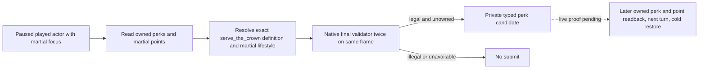

# NW-LIFE: authority tree first perk (source candidate, 2026-09-28)

The frozen game target is CK3 1.19.0.6-steam23530548, EXE SHA-256
`2D00FF3101EF70B566F2FCBAE292F09263199C80E9DC8F139B82D7D96F83DB86`.
The original `game/common/lifestyle_perks/00_martial_2_authority_tree_perks.txt`
(SHA-256 `738E9097253F25CFF7F8473832D2E2374815A75139EA8B442F855A33BCFA6E28`)
defines `serve_the_crown_perk` at lines 1–41 as the first authority-tree node,
without a parent. For a landed non-adventurer it adds `0.3` monthly county
control growth and `15` dread baseline. Its AI weight starts at `11`, adds
`1989` for martial education, and multiplies by `5` for
`martial_authority_focus`. These are value and original AI inputs; they are
not a final legality verdict for the played actor.

The exact-build private stock-perk path resolves the definition by stable key,
checks the native `Perk+0x468` lifestyle pointer, reads the played actor's
martial XP, points and ownership, then calls the native final perk command
validator at RVA `0x25DFAF0` twice on the same paused frame. A legal result
can feed the existing typed submit and independent later receipt. The policy
target is this one perk only while the current lifestyle is martial. If it is
owned or native-illegal, the policy does not invent another target.

R757 observed actor `29829` with `martial_authority_focus` and one unspent
point, but its LIFE2-only step made zero gameplay actions and did not query
final perk legality. Its documented report was on `C:`; a search of the
current `Z:/ck3_mod_rewrite_process_assets` found no R757 artifact or
save/driver pair. Current Robert H3388 has zero unspent points. This candidate
therefore has source/static scope only until a matching official pair supplies
a real one-point paused scene, followed by final legality, typed action,
independent postcondition, next turn and paired cold restore. Public LIFE
registration and advertisement remain OFF.

Focused source verification on this candidate: Python minimum-policy 15/15
and formal-consumer 38/38 in normal and optimized mode; exact EXE hash was
checked before MSVC `/W4 /WX` Debug `/Od` and Release `/O2` stock-perk
13/13, precondition 18/18 and native-adapter 9/9 fixtures. The five private
bridge objects compiled in both modes. This is no-launch verification and
does not upgrade the live status above.
