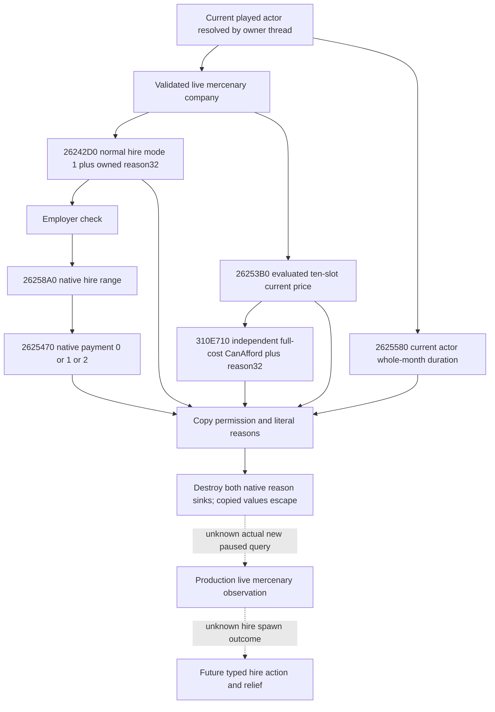

# CK3 1.20.0.3 mercenary final hire terms

File-only increment for the original Robert 29829 campaign. This lane owns
final permission, evaluated cost, payment status, contract length and copied
native reason strings. The collection provider must supply the current played
character and a validated live company. No caller-selected actor is introduced.

Build: CK3 1.20.0.3 / Steam 25652598; EXE SHA-256
`94B55397ABB687A3DCD436805A5D885E6BE90FA6C693FEB44A9E3BBEEADE02A6`.
The previous finance/hire exact-build disassembly and accepted holy-order native
string/CanAfford implementation are reused. No old ABI fixture is rerun.

The real reinforcement need is ROOT's capital 2640 hostile siege with 18 days
remaining, the current Robert army's 87-day transit, and the unavailable fresh
military holy order. Those actual observations justify a current mercenary
price/qualification reader. They do not prove a mercenary can relieve the siege.

| Required input | Producer and ABI | Interpretation |
| --- | --- | --- |
| Current actor | Existing application-main current-player resolver | Current played character, initially Robert 29829; no hardcoded alternate actor. |
| Company | Parallel candidate manager reader | Generation-bearing ID and exact `Merc` type, live company pointer used only on the owner thread. |
| Final normal-hire permission | `26242D0(company, actor, uint32 mode=1, reason32)` returns bool | Final native hire permission. With a non-null reason sink the engine copies multiple failures, including employer, range and payment failures. This is a validator, not command submission. |
| Evaluated immediate price | `26253B0(company, int64 out[10], actor, int32 current_landstate_value)` returns out pointer | Signed ten-resource Q100000 vector. Actual `CC78B0` caller reads actor `+1C0` landstate then `+1D0`, using zero only for absent landstate. The engine writes slot 0 gold or slot 6 treasury. |
| Native payment allowance | `2625470(company, actor, uint32 mode=1)` returns int32 | 0 outside native payment/debt allowance; 1 native permitted-debt branch; 2 full-funds branch. Preserve independently of generic affordability. |
| Independent full-cost affordability | Reused `310E710(cost80, actor, reason32)` returns bool | Reused accepted holy-order ABI; full cost vector, current actor, independent reasons. False does not overwrite final CanHire. |
| Current normal contract | `2625580(company, actor)` returns whole-month integer in RAX | New complete 401-byte span; actor modifier 0xD4, native base/min/max and nearest rounding. RCX/company is unused; RDX is the current actor. This is the evaluated contract, not stock 36 months. |
| Native reason lifetime | Reused 32-byte native string, destructor `856050` | Initialize size 0/capacity 15, copy bytes through size while source is alive; capacity below 16 means inline data, otherwise pointer in slot 0. Destroy each sink after copying. Empty string is available and distinct from failure to read. |

The final hire validator's mode-1 branches are employer `+48`, native range
`26258A0`, and nonzero payment status `2625470`. The separate mode-bit-2 army
branch is not used for a normal hire. The query does not reconstruct native
eligibility from balance or stock text, and it does not submit a command.

The complete cost getter zeros all 80 output bytes and writes a native evaluated
value, so the new component preserves every slot and does not estimate costs
from soldiers or monthly income. Monthly net income and player gold already
exist elsewhere; neither is a company quote. The native debt branch remains a
real game permission, without adding a separate self-imposed debt prohibition.

Reused complete spans and byte hashes are in
`Z:/ck3_mod_rewrite_process_assets/g2-resume-20261003/war-finance/NATIVE-RECIPE.json`:
CanHire `26242D0..26247CD`, SHA
`1124eac1ad9335c500142820dd03286d5a947cad3043313444102978a27118ae`;
quote `26253B0..2625466`, SHA
`a0100b9c1ea5baba8d6dfc871b4820cb75863d96f23b72fa967a6dcbeabae503`;
payment `2625470..262557E`, SHA
`08b0b1bbe63fe51519d3151548d576f666947b9c0cf6ed0eaf7aa27b9199f1b7`;
actual quote caller `CC78B0..CC7A16`, SHA
`17d89a3c56f096265073265c15d326ea5eb2c16bce466e855ae8a9999593ee07`.
New duration `2625580..2625711`, SHA
`3880eea2262e63750714b47db3b70dc0098504ff7364abedbc5b404ced54bc28`;
its reused actual GUI caller `CC7A20..CC7AA5`, SHA
`76d5d9f1144b89671e7533adfb4c015725dba38be5bc15fcbb173a3745cd6f92`.

Accepted shared CanAfford/reason source:
`Z:/g46/ck3_autonomous_player/native_bridge/src/ck3_12003_player_holy_order_context.cpp`.
Its exact binding, empty sink, inline/heap copy and destruction are reused;
the new focused fixture covers only this new terms component.

Readiness before the new module fixture: research. Native chooser/ranking,
real company quotes, command submission and material relief remain outside
this lane. No gameplay days, hired soldiers or payments are credited here.

## New focused module validation

The standalone production component `ck3_12003_mercenary_final_terms.cpp` and
its new fixture compiled under MSVC 14.51 with `/O2 /DNDEBUG /W4 /WX`. Its first
run was GREEN: three production-reader scenarios, 45 explicit `Require` checks,
six owned reason sink destructions, and actual production serialized JSON.
The fixture covers permitted native debt while generic CanAfford is false,
normal-hire mode 1, forwarded current landstate input, signed ten-slot prices,
treasury distinct from gold, a valid zero quote, actual month values, and both
inline/heap native reason copies surviving destruction. It reruns no old tests.

Fixture: `Z:/ck3_mod_rewrite_process_assets/g2-resume-20261003/war-mercenary-reinforcement-v45/final-terms/focused-native-01/RESULT.json`.
Actual new production serializer packet: 1076 bytes, SHA-256
`41281fbe2cc03e4c9dbe7d0a6170cc13230238503e98785983e00cce29420394`.
This establishes static-ready for the new isolated terms module. The candidate
collection, application-main query integration and registered MCP acceptance
are the parent package's separate work. No actual CK3 quote, hire, payment,
relief, additional days or new gameplay credit is claimed by this fixture.
