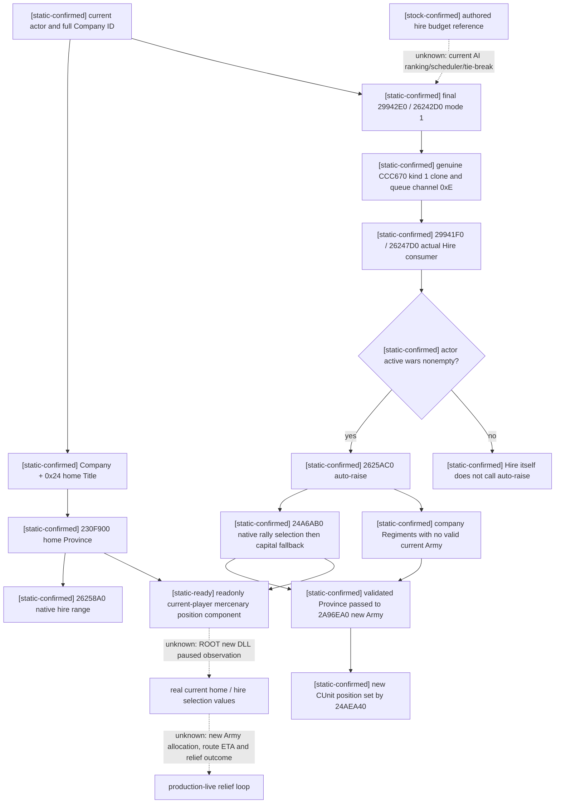

# CK3 1.20.0.3: mercenary home and actual hire auto-raise position

2026-10-03. **static-ready**, exact Crozier 1.20.0.3 / Steam 25652598,
EXE SHA-256 `94B55397ABB687A3DCD436805A5D885E6BE90FA6C693FEB44A9E3BBEEADE02A6`.
This is disk-only research for Robert 29829's original ordinary episode.
ROOT reported capital 2640 siege 95.169%, native ETA 18 days, and the existing
army 83886367 at 2616 in transit with last-frame ETA 87 days. These motivate
the current need for a closer new army; they are supplied context, not fresh
observations made by this package. No game/SDK/window/Git action was performed.

The current military holy order cannot be hired. Mercenary candidates and final
terms belong to sibling components. This topic closes the distinct decision
input: **where a successful normal hire will attempt to raise its unraised
regiments**. Company home, actor capital, generic default raise location and
this actual mercenary selection must remain separate observations.

## Native inputs and complete consumer before policy

Reuse the current [finance/hire tree](ck3-1.20.0.3-war-finance-and-hire.md) and
[support tree](ck3-1.20.0.3-allied-war-support.md). Their native AI authored
budget parameters are already frozen. The complete AI candidate ranking,
scheduler and tie-break remain unknown. This package supplies a native input
for a player relief decision; it does not invent a complete native AI policy.

| Value | Exact source | Meaning |
| --- | --- | --- |
| Company home Title full ID | Company + `0x24` | Home/location used by native hire-range gate |
| Company home Province | `230F900(home Title)` | Follows county-level first-child chain, otherwise Title + `0x338` Province pointer |
| Current normal-hire auto-raise Province ID | `24A6AB0(actual actor)`, int32 EAX | The exact selector consumed by actual company auto-raise |
| Active-war auto-raise branch | actor realm + `0x318` vector count + `0x0C` | `26247D0` calls `2625AC0` only when this vector is nonempty |

The complete `24A6AB0..24A6C7C` native leaf is 460 bytes, SHA-256
`12b3ade7071f0d69d3ba2c2b2097b706da17c7abc9af9c356589882bd5a8ef2f`.
It gets the actor's capital coordinates, then reads the actor's rally-point
collection with `24A4320(actor FullID)`. It considers actual province rows,
rejects the native foreign occupancy branch and native hostile/sieged access
predicate, rejects the two province-data blocked bytes, and applies native
raise legality for the actor's current land-state branch. Among retained rally
provinces it selects the smallest squared distance from capital coordinates.
If none survives, it calls `24A51B0(actor, current capital, 0, -1)` and returns
the selected Province's ID. The native leaves, rather than a Python replay,
remain authoritative for these branch predicates.

The existing `ck3_query_player_default_raise_v1` currently observes
`28B1CD0(actor)` then `24A51B0(actor,capital,0,-1)`. It does **not** read the
preceding rally-point selection. Therefore its observed province cannot stand
in for mercenary auto-raise when a current rally point is retained by the
actual selector. This is the demonstrated implementation difference, not a
speculative gate on the existing normal raise capability.

The company home getter `230F900..230F976` is 118 bytes, SHA-256
`21cbfde5d804e550c0584431331df1fcaea77b7489964e66d6a3520fbc0a9ade`.
The actual range gate `26258A0` resolves Company + `0x24` and implements the
same county/first-child location resolution. Home determines hire-range;
**the auto-raise consumer does not use company home as its new army position**.

## Actual command and allocation ABI

The genuine HiredTroopItem Hire callback is `CCC670..CCC8F1`, 641 bytes, SHA-256
`7417bb5f0063b42616871b5034bb23f004ef55c1481a5e08ce1ee68e2632dadd`.
Its kind 1 branch at `CCC6C5` constructs the normal Mercenary command **inline**.
No guessed constructor address is required:

| Native record slot / function | Exact ABI |
| --- | --- |
| record size | `0x30` bytes; primary vtable + `0`, secondary + `0x18` |
| primary table | image + `476DAF8` |
| secondary table | image + `476DB90` |
| payload | actor FullID + `0x20`, Company FullID + `0x24`, mode uint32 + `0x28` = 1 |
| CanExecute | primary + `0x30` = `29942E0(command, native reason sink)` -> bool |
| clone | primary + `0x40` = `2995570(command, void** out)` -> address of owning pointer storage |
| queue | `37F06F0(manager=image+5CC1240, void** owned, channel=0x0E)` -> AL queue result |
| deleting dtor | primary + `0` = `9D1560(object, uint32 flags)`; flags 1 destroys an owned clone |
| execute thunk | secondary + `8` = `29941F0(command+0x18)` |
| actual hire consumer | `26247D0(company, actor, int32 duration_months, uint32 mode)` |
| current duration source | `2625580(company,actor)` called by execute thunk before consumer |
| actual auto-raise | `2625AC0(company,actor)` when actor active-war vector is nonempty |

The callback moves ownership from clone return storage into the owned queue
argument, then deletes residual owning pointers with the native deleting-dtor.
It already proves the same queue ownership and flags as the shared
`SubmitCommandCopy` implementation. Queue AL is acceptance by the queue and
does not prove employer change, payment, army allocation or battle entry.
The existing final hire validator and payment/quote leaves are reused, not
reimplemented by this location component. This package implements no action.

At `2625AEF` the auto-raise consumer calls `24A6AB0(actor)`, resolves and validates
that Province. It gathers the Company + `0x30` Regiment full-ID vector's members
whose `262D050(regiment)` has no valid Army; separately it includes the captain's
available military characters. If nothing remains, it creates no new Army.
At `262606D` it calls `2A96EA0(manager,selected Province,selected Province,actor,
0,company-name native string)` and receives a freshly allocated CArmy pointer.
The allocator creates a new full Army ID at Army + `0x10`, then creates/binds
the public Unit at Army + `0x124` with a backlink to Army FullID. It invokes
`24AEA40(unit, same selected Province, native position options)` before return.
Company ID, Regiment ID, native Army FullID and public Unit/ArmySnapshot ID
remain distinct. A company ID must never be submitted as a public army ID.

`2A96EA0..2A97194` is 756 bytes from entry through final return, SHA-256
`1a597ddc81ef51fd181d30b2d3fad881a0091e4ccbfdd080c3a22d25b3204e12`.
It has **six adjacent PE runtime-function fragments**, so the individual
`.pdata` spans are fragments, not six complete allocator functions. The bounded
combined span and actual position setter caller close the position use without
invoking any allocator in the query.

The query publishes the current exact selector result and whether normal Hire
would enter its active-war auto-raise branch. It does not promise a new army:
final hire legality, remaining unraised company components, native allocation
and later command consumption still control actual success. Independent
employer/resource/new public Unit ID and position readback remain the required
material postconditions of a future action. A paused quote requires a new
revision-bound read before submitting; this is the existing query/action
contract, not a new project permission or wartime prohibition.

## Implemented independent reader and verification

`ck3_12003_mercenary_position.hpp/.cpp` depend only on standard headers.
Bindings expose the exact two native leaves above. World access receives the
existing current-world read callback and title/province resolution callbacks;
ROOT's combination reuses reviewed ProvinceBindings, full title generation
checks and Province ID/type checks. The leaf reads current actor and company
from the same owner-thread paused query; no UI wrapper or clipboard is used.

Output separates `company_home_title_id`, `company_home_province_id`,
`hire_auto_raise_province_id`, `actor_active_war_count` and
`hire_auto_raise_attempted_in_active_war`, each independent readiness/failure.
An absent home cannot mask an observed selector, and a failed selector cannot
be filled with home or capital. The function's bool represents both positions
ready; callers must retain its partial per-field outputs when false.

One focused production-reader run compiled the real reader and its new fixture
with `/O2 /DNDEBUG /W4 /WX /permissive-`; four cases passed using explicit
`Require`/exceptions: home differs from selected spawn, peace preserves the
selector but reports no auto-raise branch, no valid selection remains absent,
and missing home preserves independent selected spawn. This is a function
fixture, not a native game call or full DLL/live result. Old matrices were not
rerun. OpenKaishek is not applicable to native C++ pointer reads or callbacks.

External evidence root:
`Z:/ck3_mod_rewrite_process_assets/g2-resume-20261003/war-mercenary-reinforcement-v45/position-action/`.
See `NATIVE-ABI.json`, `focused-native-01/RESULT.json` and `ROOT-DELIVERY.json`.
No shared source, frozen worktree, full build, game query, game day, hire/payment,
new army, relief/battle/win, commit/push or G2 completion is credited here.
