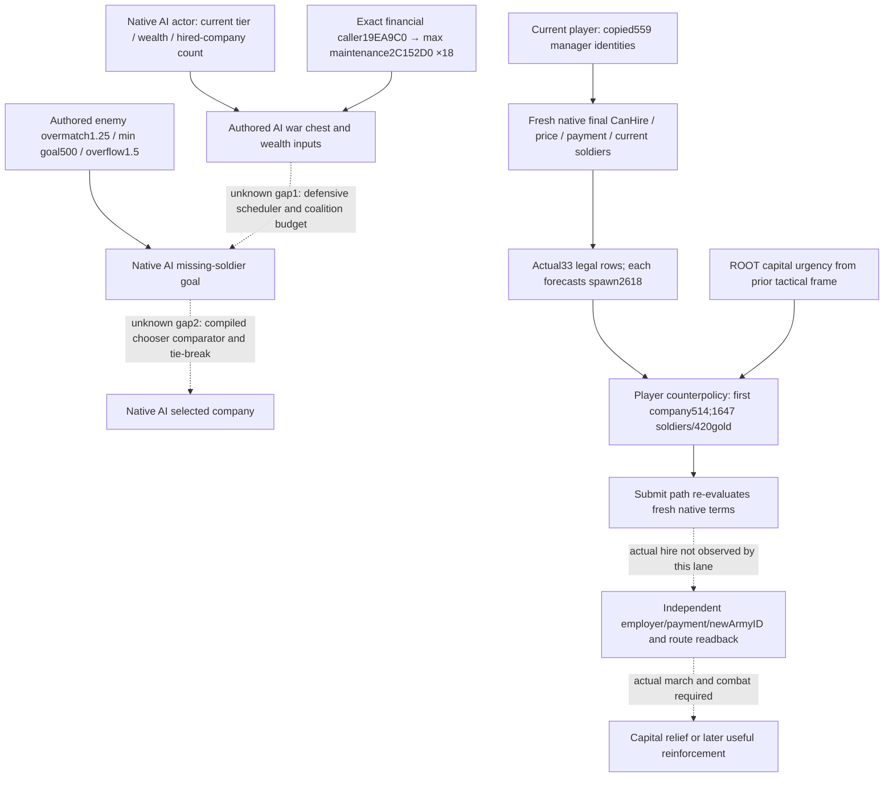

# Mercenary hire inputs and Robert's first-company choice — CK3 1.20.0.3

2026-10-04. This topic records the necessary native input tree before ROOT's
first minimal mercenary hire. It reuses the accepted final permission, cost,
payment, soldiers and auto-raise-location leaves. It does not claim the complete
native AI mercenary chooser has been reverse engineered. ROOT's authorized
deterministic choice can proceed while the two precise quality gaps below
remain recorded. This lane reads files only and changes no runtime source.

Exact game: **1.20.0.3 / Steam 25652598**, EXE SHA-256
`94B55397ABB687A3DCD436805A5D885E6BE90FA6C693FEB44A9E3BBEEADE02A6`.
Current Steam stock is used; the old repository game reference is not a source
for current constants. Native financial/hire spans are reused from
[war finance and hire](ck3-1.20.0.3-war-finance-and-hire.md),
[mercenary candidates](ck3-1.20.0.3-mercenary-candidates-native-query.md),
and the external byte-pinned ABI artifacts referenced below. No old test or
full executable hash is repeated.

## Native AI inputs and player legality have different roles

| Input or branch | Closed evidence | Meaning and boundary |
| --- | --- | --- |
| Native AI minimum war chest | Current `common/defines/ai/00_ai.txt:163–175`: tier floors 25/25/50/100/200/300/400 | Authored AI funding input. This is not a player hire permission. |
| Native AI maximum-maintenance funding reference | Stock lines 178–189: 18 months, allocation 0.6; exact financial caller `19EA9C0..19EADA5`, callsite `19EAA0A` → `2C152D0(out80, actor)` and configuration slot `5C687BC` | Exact compiled consumption of the 18-month funding input is closed. A complete defensive hire scheduler is not established by this caller. |
| Native AI wealth allowance | Stock lines 540–550: effective wealth reduced by 100 per hired company; maximum fraction 0.8 | Authored budget inputs. Current player's final affordability is evaluated separately by native terms; these constants are not imposed as new player gates. |
| Native AI requested reinforcement quantity | Stock lines 552–568: enemy overmatching ratio 1.25; up to 0.7 of war chest; minimum goal 500 | Authored reference to enemy strength and a missing-soldier goal. The exact current coalition aggregate/cadence reaching this calculation is the first gap below. Do not combine unrelated sampled enemies or foreign battles into this goal. |
| Native AI size/ranking reference | Stock lines 570–577: overflow ratio 1.5; comment says choose the most expensive company within the goal bound | Authored chooser intent, not a proved exact compiled comparator. The comment's example says 1000→less than 2000 while the actual constant is 1.5; retain the literal constant and do not compute a bound from that example. It does not say maximize soldiers per gold. |
| Native AI renewal timing | Stock lines 579–583: 3 months before contract expiry | Authored renewal input; no initial-hire or renewal action is inferred from a static constant. |
| Current player's final hire permission | Exact `26242D0(company, current actor, mode1, reason32)` via command CanExecute `29942E0`; native range `26258A0` and payment `2625470` | Real company eligibility, including current employer, native range and payment. A manager row is not an eligible row; CanExecute is not submission. |
| Current player's evaluated price/payment | `26253B0(company,out10,actor,current landstate value)`; payment `2625470` 0/1/2; independent CanAfford `310E710` | Ten signed Q100000 resource costs, native permitted-debt branch separate from full funds. Never replace a quote with wallet balance, soldier count or stock cost. No blanket debt prohibition is added. |
| Company's present soldiers | Exact `2625720..2625802` across three adjacent unwind regions | Native int32 current count includes current regiment adjustments and knights. Headcount is not base power, troop composition or win probability. |
| Normal-hire automatic raise position | Exact `24A6AB0(actor)`, consumed at `2625AEF` in `2625AC0` | Company home and hire spawn are separate. Current selector output 2618 is a real same-frame forecast, not proof that an ArmyID was created there. |
| Capital urgency | ROOT's prior tactical trigger: hostile capital 2640 siege ETA18 days, Robert army transit ETA87 days | The reason to build and use reinforcement observation. These numbers are from ROOT's earlier tactical frame, not re-read or updated by the market packet. Actual march/relief timing must use the newly created army's route. |

The native manager's **559 actual rows are identity enumeration**, with no
native optimum attached to their slot order. Full IDs and slots are retained
for identity only. A tie rule using the full company ID is an explicit player
counterpolicy choice and does not transform manager order into native rank.

## Copied fresh market facts and the chosen tradeoff

This lane consumes only the parent's copied
`war-mercenary-reinforcement-v45/actual-v46/ACTUAL-NATIVE-BODY.json`, SHA-256
`dbbffcec601bedba86de14d8884b60256d41e768c8c73abc9756238a5ca42220`.
It does not reopen SDK call013 or contact the game. The accepted completed
readonly body is actor **29829**, raw **53240928**, native **3** / public **2**,
capture epoch **23172**, normal-hire mode1. It contains 559 actual companies
and **33 final CanHire=true** companies. All 33 have independent CanAfford=true,
native payment2, a quoted 36-month contract and hire auto-raise selector **2618**.
Their evaluated costs use gold only in this frame; this is not a rule that
future mercenary costs cannot use treasury.

| Company | Current soldiers | Quoted gold | Soldiers/gold, derived | Comparison |
| --- | ---: | ---: | ---: | --- |
| 297 | 837 | 202 | 4.14356 | Cheapest and highest headcount/gold ratio among the 33; fewer troops. |
| **514** | **1647** | **420** | **3.92143** | **ROOT's frozen first-company choice.** |
| 294 | 1674 | 428 | 3.91121 | 27 more soldiers for 8 more gold than514. |
| 48 | 2491 | 729 | 3.41701 | Larger immediate headcount at higher cost. |
| 289 | 2511 | 735 | 3.41633 | 20 fewer soldiers and 76 less gold than286. |
| 286 | 2531 | 811 | 3.12084 | Largest headcount among the legal current rows. |
| 403 | 2511 | 864 | 2.90625 | Same headcount as289 for129 more gold; composition is unknown, so this is only a headcount/price comparison. |

The complete 33-row copied comparison and the eight headcount/gold non-dominated
rows are preserved in
`war-mercenary-hire-v46/native-choice/ACTUAL-CANDIDATE-COMPARISON.json`.
Ratios are derived from actual count and current evaluated price; they are not
native scores or measured military efficiency. Contract and selector position
are equal in this frame and provide no company-ranking distinction.

ROOT froze a **single first hire of company514**, using its observed1647 troops
and420 gold as a deterministic quantity/cost fallback. ROOT reports
1066.34828 gold before the planned transaction, leaving **646.34828 gold if the
same420-gold debit is actually applied**. The market body itself has no wallet
field; that balance is an upstream ROOT input, and the remaining amount is
planned arithmetic, not an observed deduction. This package chooses no second
or third company, submits no hire and performs no additional troop raise.

This fallback does not maximize global headcount/gold (297 has a higher ratio)
or total headcount (286 is larger), and it does not copy the stock comment's
most-expensive-within-goal preference. It prioritizes the selected medium-size
reinforcement and leaves current gold for later play. Composition, commander
quality, counters, base power, actual new-army supply and the new army's route
ETA have not been read from this market body. They remain quality differences,
not invented values or permission blockers for the authorized minimal hire.

After the paused market query, ROOT may advance seven assembly days before
Submit. The saved CanHire=true is therefore evidence of this frame's market,
not a future execution gate. The typed Submit path must use its existing fresh
native terms re-evaluation. Material hire requires independent employer,
payment and newly created army readback; capital relief requires actual route,
movement and battlefield/siege outcomes. No such result is claimed here.

## Two concrete remaining native-choice edges

1. **Defensive AI scheduler → requested amount and budget.** Exact18-month
   funding consumption is closed; the caller producing this war's aggregate
   opponent strength, missing-soldier goal and permitted hire budget is not.
   Construction entry: reuse the bounded exact `.3` `19EA9C0..19EADA5` caller
   and `5C687BC` reference; locate the exact `.3` registrations/consumers of
   `MERC_OVERMATCHING_TARGET`, `MIN_HIRING_GOAL`,
   `MAX_WAR_CHEST_EXPENDITURE_MERC_OVERMATCHING`, and
   `MAX_HIRING_GOAL_OVERFLOW_RATIO`, then bind those consumers to the actual
   AI military/war scheduler and same actor's coalition aggregate. This is
   one native decision-tree work package, not a restored player cash gate.
2. **Requested amount → compiled candidate score/tie-break.** Current final
   legality and actual candidate count/price are closed, but no exact `.3`
   caller establishes the chooser's full comparator or any company-quality
   term. Construction entry: take direct callers of existing final leaf
   `26242D0`, price `26253B0` and soldier getter `2625720`, distinguish the
   already-known GUI/command callers from the AI company loop, and follow
   the goal-bound filter into its actual comparator and selected-command
   consumer. If composition/base power enters that comparator, publish that
   necessary input through the same current-player market/army query before
   implementing a policy that depends on it. Existing after-hire army strength,
   route and combat projections can calibrate this first fallback without
   waiting for a complete native chooser.

These unknown edges are explicit research entry points. They do not invalidate
the observed 33 legal offers or delay the single deterministic ROOT choice.
Native AI policy remains research; existing market leaves remain
production-live primitives by ROOT's closed actual query. This file-only
analysis adds **0 game calls,0 days,0 hires,0 payments and0 gameplay credit**.

## Reused evidence pins and Oct4 reporting

Current AI stock file SHA-256:
`3af5d4100789bad56570e05c5852f35783605813957de7a5129d23142a116120`.
Exact financial caller and getter pins:
`artifacts/g2-maintainer-2026-10-02/resume-12003/m6-feast/robert-budget-finance-01/native-finance/REPORT.json`.
Reused final permission/cost/payment:
`war-finance/NATIVE-RECIPE.json`.
Reused actual soldiers:
`war-mercenary-reinforcement-v45/candidates/ABI-LEDGER.json`.
Reused selector and command consumer:
`war-mercenary-reinforcement-v45/position-action/NATIVE-ABI.json`.

New verification is one file consumption and deterministic exact-amount
comparison of the copied native body. No old native/Python matrix is rerun.
Oct4 day/week fields are delivered externally for ROOT's shared-report merge;
commit/push, action execution and subsequent live readiness remain ROOT-owned.
