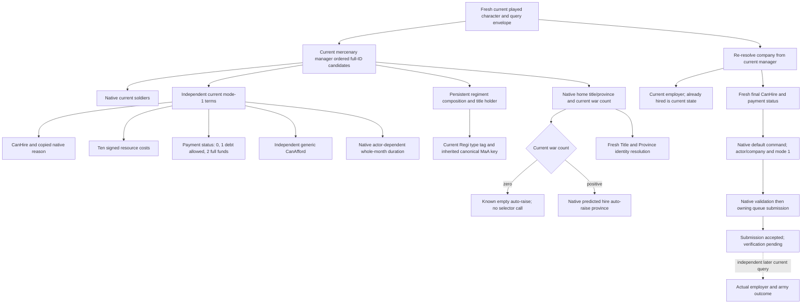

# Mercenary query and ordinary mode-1 hire on CK3 1.20.0.4

Recorded on 2026-10-07, ISO week 2026-W41. This is a source-first migration
ledger, not a new feature or a live qualification. The actual target is Crozier
1.20.0.4, Steam build 25734779, EXE SHA-256
`98702F88A547CDE2EAF29A85F93B85F68EE4CF8148336A4F7AFAEB75319DD518`.
The held .3 source is comparison evidence only. No old image binder or SHA alias
admits the .4 image.

## Native tree before implementation

The bounded source plan is
`C:/codex-ck3-background/packets/holy-order-mercenary-12004-implementation-20261007/mercenary/OWNED-12-MANIFEST.json`.
It declares 12 complete held .3 spans, 6,901 bytes, their original cache paths and
original byte pins before any new capture. The delegated finite mapper uses
held PE/pdata metadata and shared exact-range claims. Boundary ordinal only
locates a candidate; member operands, relative calls and RIP slots must close
before publication. Shared hire helpers and Army/Province/Regi bindings are
owned by their existing source owners. The two position leaves remain excluded
in the initial manifest pending owner clearance. Subsequent position manifests
record their clearance and exact missing suffix/full-span capture before
expanding the source set.

## Input ledger

| Current input | Held .3 source | Actual .4 evidence and binding |
|---|---|---|
| Current signed soldiers | `2625720..2625802` | Complete .4 `2625700..26257E2`; actual call `262570D` gives holder `2626410`, roster pointer+30/count+3C, native signed EAX |
| CanHire(company, player, mode 1, native reason) | `26242D0..26247CD` | Complete .4 `26242B0..26247AD`; same company RCX/player RDX/mode R8/reason R9 and copied SSO ABI |
| Ten signed cost resources | `26253B0..2625466` | Complete .4 `2625390..2625446`; RCX company, RDX 80-byte output, R8 player, R9D land-state value; returns same output pointer |
| Payment status 0/1/2 | `2625470..262557E` | Complete .4 `2625450..262555E`; mode R8B, player+1C0→value+1D0, actual current-cost call `26254E0→2625390` |
| Hire duration(company, actor), whole months | `2625580..2625711` | Complete .4 `2625560..26256F1`; actor RDX becomes RCX at `2625576`, signed whole months returned in RAX |
| Company title holder | `2626430..26264AA` | Complete .4 `2626410..262648A`; exact target from actual current-soldiers direct call; company+2C→Title full ID+10→holder+128→Char full ID+18 |
| Owning default command and validation | `29958F0..2995939`, `29942E0..29943BA` | Complete .4 `29958D0..2995919`, `29942C0..299439A`; native allocation30, primary/secondary vtables, actor+20/company+24/mode+28=1; validator call `299436F→26242B0` |
| Command clone and execution source | `2995570..29955F2`, `29941F0..29942DB` | Complete .4 `2995550..29955D2`, `29941D0..29942BB`; hidden-result clone and secondary receiver offsets retained; execution `2994264→2625560` then tail `29942B6→26247B0` |
| Actual hire and auto-raise source | `26247D0..2624D4C`, `2625AC0..26263FB` | Complete .4 `26247B0..2624D2C`, `2625AA0..26263DB`; war source actor+1C0→vector+318 and nonempty call `26248FC→2625AA0`; selector edge `2625ACF→24A6A90` |
| Generic affordability, reason destruction, owning submission | Parent shared hire source | Parent `ck3_12004_hired_troop_shared_bindings` uses closed current `310E6F0`, retained complete `856050` reason destructor and central actual `.4` owning command binder |
| Province/Title and persistent Regi bindings | Existing Army/Entry owners | Closed actual .4 owner profiles and operands reused; no old image binder alias |
| Native Title→Province getter | Full held `230F900..230F976` | Complete .4 `230F8E0..230F956` 118B; Title+48→template+64 branch, children+110/count+11C full-ID resolution, Province pointer+338; two-instruction 8B tier-use prefix alone is insufficient |
| Native actor hire-raise selector | Full held `24A6AB0..24A6C7C` | Complete .4 `24A6A90..24A6C5C` 460B; caller `2625ACF`, actor RCX, signed Province ID EAX, Province tag+85C and ID+10, native capital/default selector edges |

Existing software DTOs and readers may be reused only for fields whose current
native source operands close. Payment status 1 permits debt even when generic
affordability is false. Native zero counts, signed costs and complete generation
bits retain their meanings. Query enumeration order and duplicate occurrences
are retained. No command acknowledgement proves payment, employment or army
allocation. A zero active-war count does not run the auto-raise selector.

Build, tests, FIRST, project imports and runtime operations are NOTRUN. The
parent owns commit and central qualification. Fresh .4 wire identity must be
rendered through `game::Render12004BuildIdentity` with the actual descriptor.

The first successful owned manifest read 6,779 new bytes in 11 bounded reads.
The holder edge manifest then read only its 122-byte complete leaf, giving
6,901 new bytes in 12 reads, zero old EXE bytes, zero duplicate EXE bytes and no
new PE/pdata reads. Held old bytes total 6,901. A preceding wrong-interpreter
bootstrap failed with missing `capstone` before any source case or EXE read;
`mercenary/BOOTSTRAP-RED.json` preserves that zero-case attempt.

Actual decoded pairs and operands are retained in `mercenary/owned-12-map/`
and `mercenary/holder-edge-map/`, with the selected current ABI instructions in
`mercenary/NATIVE-CONNECTION-EVIDENCE.json`. This is semantic/member evidence,
not an ordinal-only mapping. At .4 `2994354`, native validation tests company
tag+14 equal to `4D657263`; manager slots `5D1DF08/5D1DEF8`, entries+20,
capacity+2C, stride10, object+8 and complete ID+10 are read by that same body.
Native current `CanHire` reads current employer+48. Character slot `5C67568`
and invalid slot `5C67570` are actual validator/execution RIP targets.

The auto-raise body has three concrete image-relative operands, preserved
rather than masked: offset A4 `4744538→4744548`, offset 3BD
`4530188→4530198`, and offset 6F9 `44A1878→44A1888`. Local flow, ordered
edges and remaining member operands match. These concern native vtable
addresses; the readonly observation does not bind or reproduce these stores.
Full army-allocation/transitive lifecycle qualification remains outside this
query migration.

## Actual zero-war branch

The complete current native hire body at `26248DB` loads actor+1C0,
`26248E7` forms the realm+318 war vector, `26248EE` compares vector+0C with
zero, and `26248F4` jumps to `2624901` when empty, skipping the auto-raise
call at `26248FC`. The exact instruction slice is frozen in
`mercenary/ACTUAL4-ZERO-WAR-SOURCE.json`. Thus the actual .4 query reports
known-empty auto-raise position when the current war count is zero:
attempted=false, province=null, position_ready=true, and no selector call.
This describes an actual unattempted native branch, not a failed read.

The existing .3 software position reader called its selector at zero. A
default-false binding flag preserves that historical behavior; only the
actual .4 binder enables the source-derived zero-war branch. The new whole
.4 fixture must exercise that flag and expect zero selector calls in its
peaceful scene. Other hired-state and decision readiness are unchanged.

## Reused current field owners

The Army commander/supply source in
`upstream-build-migration/army-family-12004/commander-supply/` closes
Regi+118→MaA type and type+38 `4744624F` in the complete actual
`support-first01/support_262C700-DETAIL.json` (`262C6E0`, 709B).
The same body proves current owner+12C and Title+128 holder. Complete actual
`support_2C11C10-DETAIL.json` (`2C11BF0`, 954B) explicitly compares Character
full ID+18 and tag+1C `43686172` at `2C11D01/2C11D09` and
`2C11E4D/2C11E55`. These are direct field operands, not inference from an
unchanged global slot. The separate Army BASE reader receipt covers Unit,
Army and ArRg registry roles and is not used as proof of all Regi fields.

The Province owner supplies `ck3_12004_province.hpp/.cpp` and
`ck3_12004::BindProvinceImage12004(base, actual_sha, actual_armies={})`.
An empty Army DTO is supported for the Title/Province resolution used here;
the mercenary query does not read siege-army details or enumerate Title
children. The closed base operands are current Province array+140/count+14C,
Province ID+10/tag+85C, Title storage `5D1DAF8`, and registry
entries+20/capacity+2C/stride10/object+8/full ID+10.
Its finalized receipt is
`g2-parallel-20261007/battle-pursuit/migration-steam25734779/actual4-domain/province-map/PROVINCE-PROFILE-SOURCE-CLOSED.json`.

Complete current Province K getter (`247EFA0`, 522B) loads the signed
MaA siege tier at `247F169`, `mov edx,[r8+2A0]`. Its exact source is
`g2-parallel-20261007/battle-pursuit/migration-steam25734779/actual4-domain/province-map/first01/province_highest_eligible_siege_tier-DETAIL.json`.
The paired old instruction is `247F189`.

Persistent Regi tag+14 `52656769` is directly checked by actual instruction
`2A9867E`, seven bytes `817a1469676552`. The Army field owner's receipt is
`upstream-build-migration/army-world-family/native-main/PERSISTENT-REGI-TAG-SOURCE-CLOSED.json`,
with its `map12/FAMILY-MAP.json` and held complete .3 `2A98590` caller context.
That owner's finite seven-byte capture cost is separate from this lane.
The earlier `2A956B0` leaf proves full ID+10 and byte+141 only and is not cited
as a type-tag witness.

Canonical MaA key reading reuses the actual inherited GDbO definition prefix,
not a guessed MaA-specific name getter. The shared existing law-family source
`upstream-build-migration/function-match-law-active/law_key_string_constructor-DETAIL.json`
contains the complete declared 58-byte constructor witness at actual
`30AE3A4`: key object+18, size string+10 (absolute object+28), capacity
string+18 (absolute object+30) initialized to15, and GDbO tag+38 `4744624F`.
The 14-byte `group_key_string-DETAIL.json` at actual `30B3ABC` reads object+18,
tests string capacity+18 against16, and reads its heap pointer at string+0.
The current Regi type pointer/tag operands identify that same inherited GDbO
prefix; the shared string layout and actual MaA-specific signed tier+2A0 are
independent source inputs. No full image or key constructor was recaptured.

With both position closures, this lane's fresh source cost is 7,471 bytes in
14 bounded reads: 6,779+122+110+460. It reused the new 8-byte Title prefix,
7,479 held old bytes, and existing PE/pdata metadata; old EXE reads, metadata
recapture, full-image reads/hashes and duplicate EXE bytes are zero. The
Province owner's concurrent 120B old plus 120B new suffix recapture is
recorded in that owner's receipt and must be included in shared reporting;
it does not change this lane's own read costs.

## Same-query production connection and central recipe

`ck3_12004_mercenary_bindings.hpp/.cpp` publishes independent actual .4
candidate, final-term, composition, position and ordinary hire-action binding
APIs in `xar::ck3_12004::mercenary`. Existing mercenary mailbox binders select
those APIs only after exact `IsCk3_12004Descriptor` admission, bind actual
`.4` core and province profiles, and retain the existing owning-thread
software reader/provider and executor slots. The same freshly produced whole
results pass through `game::Render12004BuildIdentity` with the real descriptor.

The parent's only new native target is
`xar_ck3_12004_hired_troop_migration_test`; its sole fixture CPP links
`PRIVATE xar_ck3_12002_runtime`, with `/UNDEBUG`. Its argument is one absolute
new `ck3_12004_hired_troop_migration_wire.json` output path. The fixture writes
four fresh whole query/action packets through genuine production readers,
providers and serializers with synthetic native callback/world inputs. It
does not execute native EXE branches or transplant a captured row into an old
wire. The sole compiled-dependent registered MCP consumer is
`test_holy_order_mercenary_12004_registered_mcp_compound.py`, run by Root with
the exact new JSON and immutable integrated source root. All build, native
fixture, consumer and FIRST execution remains NOTRUN here.

The final shared key receipt is
`upstream-build-migration/army-family-12004/shared-roster-layout/GDBO-KEY-LAYOUT-SOURCE-CLOSED.json`.
It also references the independent complete 1,515-byte current GDbO constructor
at `31F1A40`, with actual length initialization `31F1AE5`, capacity initialization
`31F1AE9`, and tag initialization `31F1AFE`. The MaA-specific signed tier is
closed separately above. The Province dependency is committed as
`7e880921efd1b7d53e184ea94afcf67bc82fdc1b` by its source owner. All owned
composition inputs and implementation are now source-connected. The parent
owns the joint English commit; Root owns the first build, sole new whole
fixture/registered MCP qualification and actual Robert 29829 paused snapshot.
No new live or game-day capability is credited by this source-only package.
