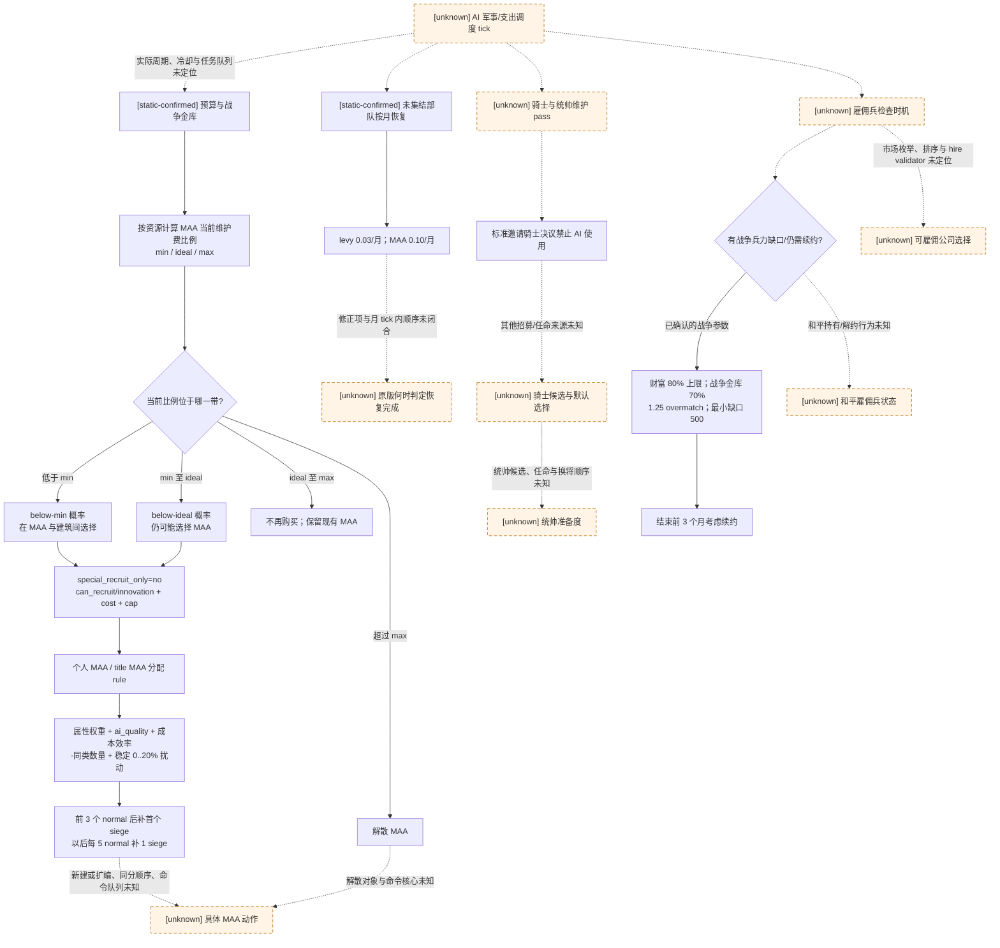
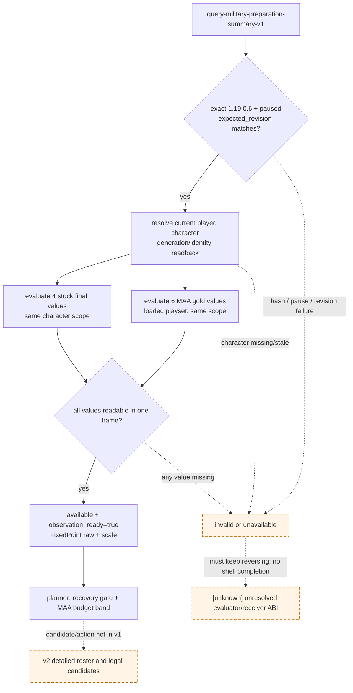

# 和平期军事准备：原生 AI 树与首个只读合同

本文冻结 CK3 **1.19.0.6** 中与和平期军事准备直接相关的最小原生 AI 事实：常备军（Men-at-Arms，以下写作 MAA）的预算带、候选合法性和评分；征召兵恢复；骑士与统帅的可见入口；雇佣兵的已确认战争预算边界。目标是为 G2 和平治理 planner 指定下一项可以真实返回数据的只读 MCP，而不是先猜一套招兵策略。

## 结论与状态

- [static-confirmed] MAA 投资先受按资源计算的 `min / ideal / max` 维护费占收入比例约束。低于 `min` 时原版会更积极地在 MAA 与建筑之间选择；低于 `ideal` 时仍可能选择 MAA；达到 `ideal` 后不再购买；超过 `max` 会解散。gold、prestige、herd、treasury、barter goods 各有独立脚本值。
- [static-confirmed] “是否把这次支出给 MAA”与“具体买什么”是两层。前一层使用 `ai_men_at_arms_chance_expense_below_min` / `below_ideal`；后一层先过兵种的招募合法性与费用，再以战斗属性、围城属性、成本效率、既有同类数量和稳定随机扰动评分；驻扎地点另有一组属性权重。
- [static-confirmed] 普通有地角色的 levy 与 MAA 在未集结时按月恢复，基础速率分别是 `0.03` 与 `0.10`。和平准备的第一价值因此是识别“仍在恢复”与 MAA 投资不足，而不是主动集结 levy。
- [static-confirmed] 标准 `invite_knights_decision` 明确 `ai_potential = always no`、`ai_will_do = 0`。这只排除了原版 AI 使用该玩家决议的路径；不能据此推断原版没有其他骑士来源或任命逻辑。
- [static-confirmed] 普通 barony 至 hegemon 宫廷的开局/继承自动生成统帅数均为 `0`；原版不保证给普通统治者补一个统帅。`Character.GetCommanderAdvantage` 与骑士效率已有 exact-build 只读核心，可复用作后续候选质量观测。
- [static-confirmed] 已冻结的雇佣兵 AI 参数围绕敌军缺口、战争金库和续约：最多花当前财富的 `80%`，目标兵力比 `1.25`，最多动用战争金库的 `70%`，最小雇佣目标 `500`，并在合约结束前 `3` 个月考虑续约。
- [unknown] AI 军事支出 pass 的真实 tick、MAA 行为冷却、同分候选顺序、新建与扩编的先后、骑士/统帅自动选择、和平时仍持有雇佣兵的处理，以及雇佣兵市场枚举/雇佣命令的核心调用点尚未闭合。
- [counter-policy] 下一项施工是 `military-preparation-summary-v1`：在同一 paused revision 返回玩家角色的原版最终军力/骑士脚本值与 MAA gold 预算带。它必须产出真实数值后才能广告，不能以只返回 `unavailable` 的壳收口。

当前状态为 **research / contract-ready**。本文没有实现 planner 策略、native bridge、MCP tool 或游戏动作，也没有 live snapshot。

## exact-build 与证据账本

### 构建身份

| 项 | 冻结值 |
|---|---|
| 游戏版本 | `1.19.0.6` |
| `binaries/ck3.exe` SHA-256 | `2D00FF3101EF70B566F2FCBAE292F09263199C80E9DC8F139B82D7D96F83DB86` |
| 研究方式 | exact EXE 字符串/RVA/xref、exact `game/common`、exact GUI 只读 seam；未启动 CK3 |

### 原版文件

| 文件（相对 `game/`） | SHA-256 | 本文使用的行 |
|---|---|---|
| `common/defines/ai/00_ai.txt` | `C78F9CD8DF9938CC9F38E817BCB6E32CD13720B5BD9DE077B85E3E1C6F030293` | `100-161`, `199-219`, `480-555`, `596-661` |
| `common/script_values/00_ai_values.txt` | `8B248B0AB799ADF356AF71D69994EDCF904F16BDBC4D2B104CC9A1305C04BAA3` | `1561-3073` |
| `common/scripted_rules/00_rules.txt` | `F47917FE70AFC416A536096E8E051287AF567C807A90A43B2E974E8412B495BC` | `1380-1416` |
| `common/men_at_arms_types/_men_at_arms_types.info` | `ADF6304B8540B6936B1AF28B001B1A0F4B14CDD40E376B35F583EF3926368660` | `20-53` |
| `common/men_at_arms_types/00_maa_types.txt` | `0C4E3035F061CC98FD517FFD85B8F854062EB3A0A0FAA60F934EF47164D5CDE5` | 兵种费用、属性、`can_recruit` 与 `ai_quality` 实例 |
| `common/defines/00_defines.txt` | `C1ECA141C71EC1E741CA5336E01BB538EEFAEC05B0684EDEC477CFC9053C3807` | `590-634`, `1176-1202`, `1241-1263` |
| `common/decisions/00_guest_decisions.txt` | `6418DDFE60B8CD22D0EA6AA92CF04B9B6536C4D30C3AFE687F74F58464931F1A` | `2-118` |
| `common/script_values/00_decision_values.txt` | `D08E4C6211DE3BD694420FBF35CDE74A11BC156656BC79B7B2C9DF764029A6DF` | 邀请骑士数量、能力范围与冷却值 |
| `gui/window_military.gui` | `E11830EB6D85E68AF8CD264C6C517A25A365E7FCB3D3DA69EB9029B7C8517384` | `1279`, `1530-1630`, `1940-2246`, `3650-3950` |
| `gui/window_knights.gui` | `16E028CC99769C75B2DA978876A3BEA502738CAD5E06725253DA1BCE32AF3913` | `390-590` |
| `gui/window_menatarms.gui` | `88BB522E6D191EAE2E328F6E5EA438DFBB4A4E4D9278A37E857F1CDC5AD875AB` | `9-208` |

GUI 只证明存在可读模型和合法性/费用 seam，不证明后台 bridge 可以依赖窗口或 widget 的生命周期。正式实现必须从角色/军事组件出发；不得要求玩家先打开军事界面。

### exact EXE 锚点

下表地址均为 image-relative RVA。“注册”只证明 exact build 把名字绑定进脚本/反射系统，不等于已经闭合最终计算核心或 AI 调度循环。名称 RVA 与执行核心必须分开记账。

| 对象 | 名称 RVA / 注册或核心 RVA | 已确认语义 |
|---|---|---|
| `max_military_strength` | name `0x42A3FD8`; registration thunk `0x53B690` | exact 脚本字段已注册；最终聚合包含哪些军事成分仍保持 opaque |
| `current_military_strength` | name `0x43278A8`; registration thunk `0x53B730` | exact 脚本字段已注册；允许读取并比较原版最终值，不把它改名为 soldier count 或胜率 |
| `number_of_knights` | name `0x4392208`; registration thunk `0x546400` | exact 角色脚本值已注册 |
| `max_number_of_knights` | name `0x4392100`; registration thunk `0x5464A0` | exact 角色脚本值已注册 |
| MAA gold 当前绝对维护费 | `monthly_character_men_at_arms_expense_gold` name `0x43A01B8`; registration thunk `0x5498C0` | exact 脚本值入口存在 |
| MAA gold 当前相对维护费 | `character_men_at_arms_expense_gold_relative` name `0x439F9D0`; registration thunk `0x549C80` | exact 脚本值入口存在 |
| MAA gold `min / ideal / max` | names `0x4235658 / 0x4235748 / 0x4235728`; compiled-name registry xrefs `0x1B342CA / 0x1B342DB / 0x1B342EC` | exact EXE 知道三个不可改名的 code-referenced key；消费循环本身未定位 |
| MAA-vs-building chances | names `0x4235CE0 / 0x4235CB0 / 0x4235DC0`; registry xrefs `0x1B343C9 / 0x1B343DA / 0x1B343EB` | 分别对应 below-min、below-ideal、landless；本文 v1 只消费前两个 |
| title MAA rule | name `0x42B18C8`; exact table ref `0x42D1CF8` | 原版脚本 rule 存在；不是购买命令 ABI |
| generic commander advantage | core `0x0BC5410(CCharacter*,-1,false)` | 已由 `combat-simulation-inputs.md` 冻结并在现有 native bridge 使用；不是接战后的最终 advantage |
| knight effectiveness | context `0x2613480`; reader `0x28FD990` | 已由现有 combat input path 冻结；可以复用角色级只读值，不能把 active-battle knight roster 当和平候选 roster |
| MAA expense registry helper | common callee `0x3368E10`（`0x1B342CA` 等调用） | 名称到内部 ID 的注册；不执行脚本值 |

EXE 还保留 `GetMilitaryStrength` (`0x40E4A20`)、`GetMaxMilitaryStrength` (`0x4324B78`)、`GetMenAtArmsStrength` (`0x43BABC0`)、`GetKnights` (`0x4134458`)、`GetNumberOfKnights` (`0x4305480`) 与 `GetAllMercenaries` (`0x4134880`) 等反射名称。本轮没有闭合它们的 receiver、callback 和无 GUI 生命周期，因此它们只作为下一轮定位入口，不能写成已可调用 ABI。

## 原版最小决策树



这棵树表达已确认 gate 的依赖关系，不证明代码逐节点执行的实际顺序。MAA 与 building 的偏好概率说明一次资源竞争，但没有证明全局 AI task scheduler 的具体优先级；merc 参数明确引用敌军和战争金库，因此本文只把它放在战争准备/续约分支，不声称和平 AI 一定不会雇佣或一定立即解约。

## 分域证据

### 预算储备与 MAA 投资带

[static-confirmed] `00_ai.txt:100-161` 将一般收入分给 Reserved、War chest、LongTerm、ShortTerm；默认比例为 `0 / 0 / 0.20 / 0.80`。ShortTerm 的 tier 下限为 `25, 25, 200, 200, 400, 400, 400`；战争金库 tier 下限为 `25, 25, 50, 100, 200, 300, 400`，或 `18` 个月最大维护费，两者取更高目标；金库未满时 `60%` 收入进入金库。这里的 `BUDGET_CATEGORY` 初始 `0` 不代表 Reserved/War chest 永远为零，因为两者另有逻辑。

[static-confirmed] gold MAA 维护费比例的基础带为：

| 边界 | 基础值 | 主要已确认修正 | 原版注释语义 |
|---|---:|---|---|
| `min` | `0.15` | warlike `+0.10`; conqueror `+0.20`; cautious `+0.10`; builder/pious builder `-0.10`; 有效 build-MAA vassal directive `+0.50`; clamp `0..0.90` | 快速尝试投入到该比例 |
| `ideal` | `0.40` | nomad、人格、时代/等级/收入、directive 修正；clamp `0..0.90` | 不购买超过 ideal；收入下降可导致事后高于 ideal |
| `max` | `0.60` | 时代/等级、directive、非 civilian admin 修正；通常 clamp `0..0.90` | 超过则解散；admin/nomad 且 `debt_level <= 2` 时最终可为 `3` |

[static-confirmed] `below_min` 的基础 MAA-vs-building 概率是 `0.40`，`below_ideal` 是 `0.10`；人格、时代、首都建设焦点、省制义务与 vassal directive 会修改，最终 clamp 到 `0..0.90`。这说明低于 min 也不是无条件购买，且低于 ideal 时 MAA 与建筑仍在竞争。prestige/herd/treasury/barter goods 也有各自 min/ideal/max；首个 v1 只读 gold，后续候选查询必须在遇到非 gold MAA 时扩展相应资源，不能拿 gold 阈值代填。

### MAA 候选、评分与替换

[static-confirmed] `_men_at_arms_types.info:20-53` 提供候选的静态入口：

1. `special_recruit_only = yes` 的类型永远不能由 GUI 或 AI 直接招募；
2. `can_recruit` 在角色 scope 求值，并可带 `scope:title`；与 innovation 解锁互斥；
3. `buy_cost` 与 low/high maintenance 支持多种资源；
4. `ai_quality` 在角色 scope 求值，并与引擎基于属性的质量分相加；
5. `fights_in_main_phase = no` 与 `siege_value` 区分围城器械类用途。

[static-confirmed] 引擎公开的评分参数是 toughness `×10`、attack `×10`、pursuit `×3`、screen `×1`、siege `×1000`；每个既有同类 sub-regiment 扣 `20`；同一 character + regiment 的稳定随机加成在 `0..20%`。realm size `<=5` 时考虑属性相对费用，`>50` 时费用完全不影响质量，中间插值。驻扎评分对 size/siege/damage/toughness/pursuit/screen 使用 `0, 0, 2, 1.5, 1, 1`。

[static-confirmed] 原版会在 3 个 normal sub-regiment 后购买第一个 siege，之后按 5 normal : 1 siege 维持；当不能继续招募（费用或 cap）且现有 regiment 比最佳可用类型差 `20` 时可判为 obsolete。上述 define 没有给出基础属性如何归一化、成本插值先后、`ai_quality` 与随机乘区的最终公式，也没有给出同分 tie-break；这些仍是 [unknown]，不能由我方复刻猜测。

[static-confirmed] title MAA 的规则先考虑 personal/title cap、personal 是否买得起以及双方当前维护费：personal cap 为零时走 title；title cap 更大时，在 personal 买不起或 title 维护费不高于 personal 时优先 title；personal cap 不小时，允许 personal 维护费约高出 title `50%`。脚本注释还说明传入的 title 是“仍有空间且当前 title MAA 维护费最低”的头衔；该 title 枚举器仍是 [unknown]。

### Levy、骑士与统帅

[static-confirmed] `NArmy` 基础值为 levy 每月恢复 `3%`、MAA 每月恢复 `10%`，每兵 gold 维护费 `0.003`。这些是基础值，不证明疾病、补员开关、军队已集结、政府或 supply 等修正后的最终恢复；首个查询因此读取原版 final strength 值，而不自行按月份外推。

[static-confirmed] AI 集结参数（`RAISE_LEVIES_COOLDOWN=180` 天、admin army 检查 `360` 天、未集结时至少达到自身最大兵力 `30%` 或敌军 `50%`、已集结时等待可能兵力的 `10%`）属于实际战争动员边界。本文的和平准备合同不触发集结，也不把这些阈值解释成和平 readiness。

[static-confirmed] 骑士单点 combat 参数是每 prowess `50` damage、`10` toughness；原版简化 AI power 以平均 prowess `10` 估算，因此默认每骑士贡献 `1100` power。该简化值不能替代真实候选 prowess 或 combat-effective 值。`MilitaryView.GetKnights` GUI model 能枚举角色、当前 `IsKnight`、`IsAcclaimedKnight`、prowess 与 forced/default/disallow 控制，但其无 GUI backing 尚未定位。

[static-confirmed] 普通统治者的 `GENERATED_COMMANDERS_*` 全为 `0`，mercenary company 与 holy order 才为 `1`。这使“有无合格统帅”成为独立观测，而不能用 title tier 推导。后续候选查询可复用 `0x0BC5410(character,-1,false)` 获取 generic commander advantage；它不含 terrain、crossing、roll 或接战侧修正。

### 雇佣兵

[static-confirmed] 雇佣兵公司规模按文化县数形成三级；基础 levy 为 `400/800/1200`，MAA regiment 为 `1/2/3`，骑士为 `2/3/4`，每团基础 size 为 `3`。基础合约 `36` 个月，允许范围 `11..108` 月，费用由 levy、MAA 与雇主 realm size 共同计算，最多允许相当于 `24` 个月收入的债务，补员速度是普通 regiment 的 `3×`。

[static-confirmed] GUI 的 `MilitaryView.GetAllMercenaries`、`GetHiredMercenaries` 与 `MercenaryCompany.IsHired / IsHiredByLocalPlayer / WillGoInDebt / WillGoInBankruptcy / GetCostDesc` 证明玩家界面能呈现市场、可用性、费用、组成和雇佣状态；这些名字尚未形成无窗口 ABI。原版 AI 的已确认支出树只证明战时 overmatch 和续约参数，未证明完整候选排序。

[owner-deferred] holy order 与通用 faith/religion 域继续暂缓。本文不读取 `NHolyOrder` 形成候选、不把 piety/敌对信仰填进合同，也不将 mercenary GUI 邻接的 holy-order model 当成授权例外。以后只有战争 OODA 的必要圣战窄例外才能提出最小字段，并应优先消费原生最终合法性结果。

## 第一只读合同：`military-preparation-summary-v1`

### 它解锁的实际价值

[counter-policy] v1 只解决两个可独立使用的和平决策：

1. 用原版 `current_military_strength` 与 `max_military_strength` 最终值判断军力仍在恢复，避免在明显未恢复时继续推进依赖军力的行动；
2. 用实际 MAA gold 维护费比例、原版按当前角色求值后的 `min/ideal/max` 与两档偏好概率，判断当前是“明显欠投入、可继续竞争、保持、超过上限”哪一带，为下一次候选枚举提供真实入口。

它不声称已经能购买/解散 MAA、招骑士、任统帅或雇佣公司。骑士 count/cap 同帧返回，使恢复摘要不会把骑士席位缺口藏起来；详细候选留给 v2。

### MCP 与 native step

- native capability：`game.command.query-military-preparation-summary-v1`
- literal native step：`query-military-preparation-summary-v1`
- MCP tool：`ck3_query_military_preparation_summary(expected_revision)`
- scope：当前 played character；不接受任意 CharacterID
- 前置：exact build 匹配、world paused、`expected_revision` 与当前 snapshot 完全一致
- 依赖输入：复用现有 turn bundle 的 played-character identity、snapshot/revision/date 与 resource contract；不复制 gold/income 字段，不引入机器路径、用户账号或 CK3 轮次

建议的 typed response：

```json
{
  "schema_version": 1,
  "status": "available",
  "source": {
    "game_version": "1.19.0.6",
    "executable_sha256": "2D00FF3101EF70B566F2FCBAE292F09263199C80E9DC8F139B82D7D96F83DB86",
    "snapshot_id": "native:N",
    "revision": 0,
    "date_raw": 0,
    "paused": true
  },
  "character_id": 1,
  "stock_final_values": {
    "current_military_strength_raw": 100000000,
    "max_military_strength_raw": 120000000,
    "number_of_knights_raw": 500000,
    "max_number_of_knights_raw": 700000,
    "scale": 100000
  },
  "maa_gold_band": {
    "monthly_expense_raw": 125000,
    "expense_relative_raw": 18000,
    "min_raw": 15000,
    "ideal_raw": 40000,
    "max_raw": 60000,
    "chance_below_min_raw": 40000,
    "chance_below_ideal_raw": 10000,
    "scale": 100000
  },
  "observation_ready": true,
  "unavailable_reason": null
}
```

示例数字只展示编码形状，不是游戏 fixture。`*_raw` 全部保留 CK3 FixedPoint raw，`scale=100000`；消费方可显示换算值，但不得在 native 层提前截断。`current/max_military_strength` 继续命名为 stock final value：当前证据没有证明它等于纯 soldier count、AI base power、combat-effective strength 或胜率。

### 可用性与验收

[counter-policy] 合同规则：

1. `available` 必须同帧取得上例全部十个数值；任何字段未闭合时整次查询为 `unavailable`，`stock_final_values` 与 `maa_gold_band` 都不发半真数据。合法零必须返回 `0`，读取失败才是 unavailable。
2. stale revision、非 paused、played character 缺失或 EXE hash 不匹配为 `invalid`/`unavailable`，不得退回 GUI 文本、OCR、默认脚本值或上一帧缓存。
3. `observation_ready=true` 只表示十个 final value 同帧可用；不表示 MAA candidate、commander、mercenary 或任何 action ready。
4. `min/ideal/max` 必须调用 exact loaded playset 中的原版脚本值，以当前 played character scope 求值；不能只返回本文抄录的基础 `0.15/0.40/0.60`。
5. `below_min/below_ideal` 同样返回当前角色的最终概率；planner 自己的阈值另存为 counter-policy，不能改名成原版必然动作。
6. 第一次广告 capability 前必须有 exact-build paused live snapshot，至少得到一次 `status=available` 且数值能与同帧脚本/GUI 可见值交叉检查；只有 unavailable 样本、schema test 或 command ACK 均不算交付。
7. 连续两次同 revision 查询须逐字段一致；查询前后日期、RNG 与军事状态不变。读取函数不得调用 apply/update、推进日期或触发 UI。
8. 若 final script-value 执行 ABI 尚未闭合，则该工作包继续施工，不能发布一个永久 `unavailable` tool。注册 thunk 只作为定位入口，不是读取实现。



## 后续施工入口：详细观测、动作与后置条件

[counter-policy] v1 live 后按真实游戏价值推进，且每一步仍须先冻结 exact receiver/core：

1. **`military-preparation-candidates-v2`**：角色的 MAA regiment/chunk/cap/维护费；每个可招募类型的 stable key、`can_recruit` 最终结果、buy/maintenance 多资源费用、引擎 final AI-quality raw；当前与最大 levy；骑士候选及 prowess/当前政策；统帅候选及 generic advantage；已雇佣 merc 合约。merc 市场可作为 war-planner 子查询，不阻塞和平 MAA/恢复价值。
2. **MAA 最小动作**：只在 v2 给出确定合法候选后定义 `military-maa-adjust-v1`，输入 exact candidate identity、动作（new/expand/disband）、期望 revision 与费用快照；validator 结果必须与原版相同。queue ACK 仅代表提交。
3. **MAA 后置条件**：下一 paused snapshot 重新查询 v2 与 summary；确认 regiment/chunk、资源、维护费比例和 strength 的预期变化，且命令没有落到另一类型/头衔。只有后置条件通过才算动作成功。
4. **骑士/统帅**：先闭合无 GUI roster 与原版默认选择，再决定是否需要 invite decision 或政策动作；`invite_knights_decision` 的异步 20..40 天事件和多年 cooldown 不能用 ACK 冒充到人结果。
5. **雇佣兵**：留在战争准备子域，先返回原版 `IsHired`、最终费用、debt/bankruptcy 与组成，再绑定 hire/rehire validator 和合约后置条件。和平 planner 不凭本文参数预雇佣。

## 明确 unknown 与非目标

- [unknown] `current/max_military_strength` 最终聚合的成分、缓存生命周期和无 GUI callback/core；v1 实现必须继续逆向，不能镜像脚本数值。
- [unknown] MAA AI scheduler 的 tick、冷却、队列、候选枚举顺序、新建/扩编/替换顺序、最终 score 公式与 tie-break。
- [unknown] title MAA 的“最低维护费且有空间”枚举器和多个 title 同分时顺序。
- [unknown] levy/MAA 月恢复的修正项与月 tick 内顺序；本文不做时间预测器。
- [unknown] 骑士 eligible roster、default-by-prowess 的 exact comparator、强制/禁止与 AI 的关系、其他招募来源；统帅候选与换将策略。
- [unknown] mercenary market 的无 GUI owner、距离/文化过滤调用链、最终费用 core、AI 公司排序与和平合约处理。
- [owner-deferred] holy order、通用 faith/doctrine/tenet/fervor、改宗与宗教改革不在本文和后续通用军事准备合同内；不得借 mercenary 邻接接口扩域。
- [non-goal] 本文不实现猜测策略，不把原版 AI 概率当我方选择概率，不把 GUI presence 当 native ABI，不启动 CK3，也不改变现有 turn bundle、resource contract 或 action protocol。
