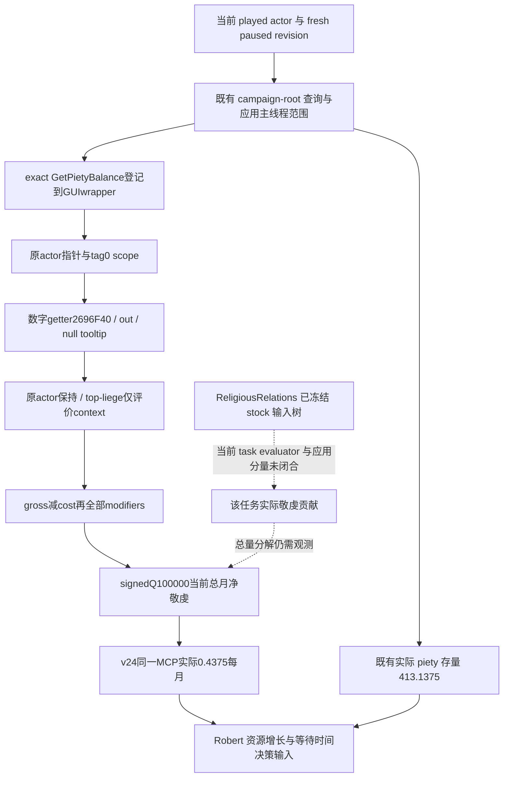

# CK3 1.20.0.3：玩家总月敬虔观测

本页的目标是观察 Robert 当前敬虔余额之外的实际月变化值，供本世资源决策使用。当前状态 **production-live primitive：v24同一MCP已实读Robert总月净敬虔0.4375／月**。此前exact ABI／输入树、唯一生产读数→序列化→Python解码验证均GREEN；现已由真实paused输入解除余额之外的增长观测缺口。这个口尚未组成完整宗教OODA，不任命祭司、切换任务、更改信仰或新增宗教策略。

原输入树见 [ReligiousRelations 任务价值](religious-relations-task-value-native-ai-12003.md)，资源／现任意见事实见该页 v22 实际段。外置研究包为 `artifacts/g2-maintainer-2026-10-02/resume-12003/m4-council/role-coverage/monthly-piety-observation-12003/`。本包不重扫宗教治理的29份 stock 文件，不重跑已 GREEN 的学习包，也不改当前冻结 v23 的源码。

## 构建与已读基线

游戏 CK3 `1.20.0.3 Crozier`，Steam build `25652598`，EXE SHA-256 `94B55397ABB687A3DCD436805A5D885E6BE90FA6C693FEB44A9E3BBEEADE02A6`；直接复用冻结 EXE 与已有版本绑定。最近资源实际包 native/source `b59464e0367bafbdc0d344aeb2c6f9ababcb4716`、PID119508、Robert29829、episode `native-29829-2bc2d599f7f9`、paused raw53222376、native10／public revision2。该包0新日、0动作、0checkpoint。

| 输入 | 当前证据 | 对月增长判断的意义 |
| --- | --- | --- |
| 玩家总敬虔余额 | `played_character_piety={raw:41313750,scale:100000}`，实际 **413.1375** | 资源存量；不能说明每月增加多少 |
| 当前宫廷祭司任务 | freshroot56513／`task_religious_relations`／general／infinite／not frozen | 已读当前职责；不是已读产出 |
| 当前祭司对 Robert 的总意见 | 56513→29829 **+10**，既有最终 getter | 关系事实；不能当作任务意见贡献或 clergy approval |
| 当前有效学习 | v23新PID同一MCP实际56513／effective learning9，见原任务专题 | 技能输入；不能冒充总月敬虔或完整任务贡献 |

上述三项实际输入直接复用 [ACTUAL-VALUES-EXTRACT.json](Z:/ck3_mod_rewrite/artifacts/g2-maintainer-2026-10-02/resume-12003/m4-council/role-coverage/religious-relations-value-12003/ACTUAL-VALUES-EXTRACT.json)，SHA `4aa2f95d51bfb6296161b27186fca15fb100c352d6b505a1e3e1052124681c6d`；本页没有重新查询或解释原 raw。

## 原生入口与语义分界

Exact `.3` `GetPietyBalance` 反射 literal 位于 RVA `0x4806950`，登记点 `0x5B140C` 指向GUI wrapper `0x2BB1500`，后者构造Character scope并调用数字 getter **`0x2696F40`**。wrapper的RDX是真GUI datatype result，它随后通过 `0x9DAE50` 装箱并返回AL bool；它不能当作接收int64输出缓冲的getter调用。

选定的最小数字 ABI 为 `int64_t* __fastcall(const void* scope, int64_t* output, void* optional_tooltip)`，调用时tooltip为null、RAX返回原output pointer。scope实际读取域仅为offset0..7的Character pointer和offset8的tag0；我方可使用零初始化、对齐的16-byte owned scratch承载这9个必要字节，16不是引擎struct总size的断言。原native GUI caller只写ptr与tag，其余9..15未读。调用必须沿现有application-main范围执行，不使用snapshot余额的raw-memory offset替代计算。

Tag0保留原played actor，通过 `0x28BFDA0`取得top-liege评价context，再调用 **`0x2BA5190`**：scope原actor保存于RBX，进入聚合时RDX仍是原actor，R8才是resolver context；gross `0x2BA4520`／cost `0x2BA47F0`也保持原actor。这条链没有把资源owner替换成top-liege。gross减cost后经 **`0x2BB2870`** 全modifier组合得到signed64终值，`0x186A0`与signed除法明确表示 **raw／100000**。合法负值表示当前净减少。

PietyItem的实际consumer将单位和总量语义闭合：topbar刷新 **`0xDF1C70`**取得Topbar+C8的PietyItem scope，经 `0xFD41E0`后在 `0xDF1CDE`调用同一数字getter，结果缓存于Topbar+1F8。当前 `hud.gui`6304–6321显示 `PlayerValueItem.GetBalance` signedCFixedPoint；6852选PietyItem，6899显示这个balance，6892另以 `GetPlayer.GetPiety`显示资源存量。因此新输入是玩家当前**总月净增长率**，不是累计余额。它不是未来月底余额的承诺：一次性获得／支出、modifier变化与实际发放时机仍会改变结果。

`spiritual_fulfillment`、devotion level、Faith fervor、玩家总piety余额与 ReligiousRelations `council_owner_modifier.monthly_piety` 贡献保持各自语义。已知 `GetMonthlyGoldIncome`／`0x2BCA960` 是 gold 的接口，不能套作 piety；已知任务 progress `0x31AB520/0x31AB840` 也不能替代月度产出。完整选定caller spans／register流／consumer证据已冻结在 [EXACT-12003-MONTHLY-PIETY-ABI.json](Z:/ck3_mod_rewrite/artifacts/g2-maintainer-2026-10-02/resume-12003/m4-council/role-coverage/monthly-piety-observation-12003/native/EXACT-12003-MONTHLY-PIETY-ABI.json)；原树见 [MONTHLY-PIETY-NATIVE-TREE.md](Z:/ck3_mod_rewrite/artifacts/g2-maintainer-2026-10-02/resume-12003/m4-council/role-coverage/monthly-piety-observation-12003/native/MONTHLY-PIETY-NATIVE-TREE.md)。

ReligiousRelations 的 authored piety 输入已经冻结：学习基础 `learning/20` 加若干 owner／关系条件，任务166–170通过 `court_chaplain_religious_relations_total_piety_gain` 作用到 council owner。它只是一项潜在来源；总月值仍需原生当前资源求值，不能从技能手算或取 stock 基础项当作已应用值。本包优先闭合总月值；任务分量的实际 evaluator／scope／raw scale 继续保留在原任务专题。

## 同一 MCP 的最小只读接线

已有 `ck3_query_campaign_root_context_v1(expected_revision)` 的 native producer 发布 monthly gold income，采用 application-main scope、前后 revision 采样、optional fixed-point metric 与 nullable serializer。piety getter的调用形状现在已闭合，优先在这一现存查询中追加独立 piety 月值，不新建 MCP、旗标、参数或策略。

ROOT授权的actual `.3` source增量只涉及四个生产叶子；研究首proposal曾选legacy producer／serializer，新的exact binder证据已纠正，不能使用那些legacy叶子冒充当前版本生产路径：

- `native_bridge/include/xar_bridge/campaign_root_context_v1.hpp`：独立 piety 值／callback 与结果声明。
- `native_bridge/src/ck3_12002_campaign.cpp`：现campaign binder内绑定modulebase+`0x2696F40`，现ReadObservation内读取played actor月值；不用资源余额的raw-memory offset伪装月收益。
- `native_bridge/src/ck3_12002_campaign_serializer.cpp`：沿既有optional fixed-point metric表达真实可用值。
- `bridge/campaign_root_context_contract.py`：生产 normalized nested DTO 解码。

Python NativeDriver与service当前传递完整normalized `campaign_root_context`；现有optional metric已允许只扩nested body，不扩大既有top-level mirrors。实际binder增加这一独立callback，`ReadObservation`沿既有前后观测路径取值；不需要改NonwarMetrics、shared bridge、service、MCP、CMake或新增其他callback。全部生产变化由外置patch交ROOT集成，不改当前runtime。唯一新字段为 `campaign_root_context.player_monthly_piety_v1={status,value:{raw,scale:100000}|null,unavailable_reason}`；native仅增加一个optional fixed-point结果及一个typed monthly-piety callback，两者append到原结构尾，保留此前成员offsets。

成功值必须来自本帧原生读取；合法0或负值要保留。某帧读取不可用与0区分，旧 wire 缺字段也不能变成成功0；这些沿用现有 optional metric 的语义，不新增 aggregate readiness gate。总月值尚未实读，当前不发布永久 null 字段充作功能完成。

## 必要的后续验证

ROOT已授权一个覆盖该增量的focused case：把monthly piety的synthetic值刻意设成与piety存量、gold月值和spiritual fulfillment不同的signed新值，经真实生产producer／serializer到同一Python decoder，证明getter路由与signedQ100000表示正确。允许fixture注入已证scope／out／null-tooltip形状的stub engine，不能称实际EXE运行或Robert实际产出。理由是这些现存资源均可能产生数值，错接仍会看起来像成功；旧学习case不涉及月资源getter，不能证明这条新路径，因此不重跑旧学习或旧矩阵。

唯一native新case已GREEN：0.118913s，原生产reader→serializer→`RenderCrozierContractQueryResultV1`输出4999-byte genuine `.3` inner-root wire，SHA `e082feeb96d52a860bedb0d9fd05ed7a8543ea2bef00aef57caea032c1a803a5`。该case采用stub engine检验Character／tag0／out／null-tooltip路由，值 **-125000／100000**；actor33554433、revision41、raw12345均为synthetic，不能替代Robert当前值。native只freshcompile受影响的actual reader／serializer／既有test三个对象，复用ROOT copied currentv23 runtime archive及两个已build Family closure对象；没有编译旧provider或运行旧case。

Python生产normalizer仅调用一次，直接消费同一4999-byte原wire的inner root本身，GREEN 0.1876077s。signed -125000／100000保持，gold570772不同，已有root readiness保持；未构造outer envelope或第二份native wire。源码补丁稳定，native三生产叶子及一个既有fixture，Python一个生产leaf。wire及首失败attempt的可核验pins见 [NATIVE-DELIVERY.json](Z:/ck3_mod_rewrite/artifacts/g2-maintainer-2026-10-02/resume-12003/m4-council/role-coverage/monthly-piety-observation-12003/native/implementation/NATIVE-DELIVERY.json)与 [DELIVERY-PINS.json](Z:/ck3_mod_rewrite/artifacts/g2-maintainer-2026-10-02/resume-12003/m4-council/role-coverage/monthly-piety-observation-12003/integration/implementation/DELIVERY-PINS.json)。

首RED保留：fixture新增成员触发既有显式aligned Fixture的C4324／strict C2220，发生case前；只在该fixture class局部记录intentional padding并必要重编test对象，两个GREEN production对象复用。首次link缺两个既有Family symbols，ROOT从真实v23 build copy对应对象后完成link，生产源码未为link修改。Python首入口把wire误当含`campaign_root_context`的outer对象，在import／调用normalizer前发生KeyError；只纠正原wire的inner-root路径，未修改wire／envelope／生产parser。失败attempt均不称getter capability RED，也没有重复已GREEN的native case。

Synthetic GREEN使新源码成为 **static-ready**。ROOT后续在新版本DLL／新PID的paused帧，用 [两调用配置](Z:/ck3_mod_rewrite/artifacts/g2-maintainer-2026-10-02/resume-12003/m4-council/role-coverage/monthly-piety-observation-12003/integration/ROOT-FRESH-MONTHLY-PIETY-READONLY.json)动态绑定fresh snapshot revision，再调用现存campaign-root，读到 `player_monthly_piety_v1.status=available` 的真实总月值才算production-live primitive。配置捕获完整normalized root，不锁actor／date／revision；不再tools-list或追加宗教矩阵。实际新值仍未观测，本包0SDK查询、0游戏动作、0新增天数、0G2 completion；当前piety余额413.1375与learning9不作月贡献手算。

ROOT随后已将native三生产叶子／既有fixture及Python单叶子应用到canonical，下一strict v24构建与实际月值仍待执行。首次atomic `git apply`因test首行context的UTF-8 BOM丢失失败，0 files applied；diff生成器以`utf-8-sig`解码时剥掉了BOM，tested scratch源码实际使用`utf-8`读写，原本保留该BOM。ROOT仅在补丁首context恢复EFBBBF后atomic apply成功，再顺序apply Python。所有tested源码语义／source pins保持不变，原failedpatch与receipt保留，无重编译、重测或其它BOM检查。Native owner另交同源 [BOM保留投影](Z:/ck3_mod_rewrite/artifacts/g2-maintainer-2026-10-02/resume-12003/m4-council/role-coverage/monthly-piety-observation-12003/native/implementation/NATIVE-SOURCE-BOM-PRESERVED.patch)供归档；补丁工具应保留源文件BOM作为首行内容，不能用剥BOM的文本投影冒充原文件context。

本页没有 counter-policy。当前收益是把总月资源观测的必要依赖和最小施工入口具体化；ROOT 独占共享源码集成、游戏／SDK、状态、构建和发布。

## V24 实际当前总月净敬虔

ROOT新immutable source `6c87eb77568601499ab98a43f9cbea4c2ee870f6`／strict v24与official CI均SUCCESS，随后在新paused执行上下文PID38520通过single-client现存registered MCP完成6calls CLOSED GREEN并official driver close。其中本专题只消费002 campaign-root与整体result元数据；其它4个Sway调用由其它owner报告，没有重复SDK调用、读取其raw或重测新／旧case。

| 实际字段 | 值与绑定 |
| --- | --- |
| 玩家与日期 | Robert29829，raw53222952，player alive／independent，top-liege29829 |
| Revision | queried snapshot `native:3`，outer frontend queried_revision2／native3；inner root snapshot_revision3不改写frontend2 |
| 当前总月净敬虔 | `player_monthly_piety_v1.status=available`，**raw43750／scale100000＝0.4375 piety／月**，unavailable_reason=null |
| Root可用性 | accepted／available，`campaign_root_context_ready=true`，scope=`exact-campaign-root-context` |
| 当前祭司任务 | 56513，`task_religious_relations`／general／null target／frozen=false／infinite progress current/max=null |

这是实际总月净资源率，读取结果来自已证`0x2696F40`路径，源版本与ABI冻结对应同一 `.3`。Root PID来自ROOT独立执行上下文，002的normalized DTO不含PID字段；first/final same date采用ROOT supplied执行事实，artifact中本页保留实际queried frame／player／date。不是一次性piety增益、资源余额、任务单项或clergy approval，也不承诺一个未来月底的精确余额。原413.1375与learning9是各自较早实际帧，不能当作这次002新读字段或由0.4375反算任务贡献。

有限提取与原始002／result字节pins见 [ACTUAL-MONTHLY-PIETY-EXTRACT.json](Z:/ck3_mod_rewrite/artifacts/g2-maintainer-2026-10-02/resume-12003/m4-council/role-coverage/monthly-piety-observation-12003/actual-v24-monthly-and-sway-cold-01/ACTUAL-MONTHLY-PIETY-EXTRACT.json)，7618 bytes，SHA `672ce9afd045127d57f0109aea899824869f4aed7aeb95380cf2c69de733ec24`。两个JSON原件各只读一次，Sway raw0读；本owner无game／SDK／state／Git操作。此前synthetic-1.25、编译／link／path-selection／BOM apply首RED均作为历史证据保留。

本输入现在可用于Robert本世资源增长决策；独立 [ReligiousRelations任务贡献](religious-relations-task-value-native-ai-12003.md)继续补该task原生owner-modifier单项求值，不能用total替代该项，也不因本口可用宣称完整宗教AI、M4全项或新的动作完成。
