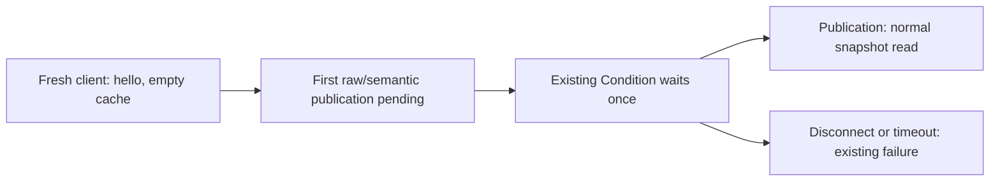

# Native snapshot: first semantic publication on a fresh client

2026-10-04, CK3 1.20.0.3. Status: **production-live primitive for observed next-session first snapshots**; see Root confirmation below. This records a real source harness failure and its minimal fix, without granting new gameplay credit.

Root observed repeated snapshot failures on fresh clients against the same paused game, without a load or restart. Sealed08 diagnostics succeeded, but initial and final snapshot both returned `native game state is not available yet; CK3 may still be loading or may not have entered a map`. The attempt advanced0 days and saved0 times.

The owner's typed comparison records generation20 connected with adapter hello/build-ready, while semantic state was false and heartbeat absent. Recovery generation21 already had semantic state, heartbeat and cached snapshot before the capability call. Hello readiness does not establish arrival of the first semantic frame; capability reads use cache and do not perform bootstrap. Archived heartbeat stamps do not establish call elapsed time.

The driver starts its endpoint asynchronously. Receiving hello connects it and clears cache; heartbeat/state publication follows. Previously `take_snapshot` immediately read the empty semantic cache. The adopted change in `native_driver.py` waits once for first raw publication or disconnect, using the existing Condition and command timeout, only while connected with advertised `game.state.snapshot` and both raw/semantic caches absent. Existing cached reads add no wait; an unusable received raw frame retains the existing error.

The registered production call-chain check covers original create_server/service, candidate driver and protocol ingestion. Preimage reproduces the failure; candidate02 is GREEN. Candidate01's harness import still pointed to the preimage and remains RED. No SDK or game was used by those checks. Root adopted the exact fix in `889821f5a8f55e5d6a2a2f724d7693e3575118a7`; this handoff alone does not prove a new cold runtime fix live.

The original handoff retained R24 closure/source harness RED and a pending cold rebind. That historical boundary precedes the Root-confirmed results below. Accounting remains4061/resume908/Oct4+36; this page adds0 days/actions.

Evidence: [sealed ROOT-HANDOFF](Z:/ck3_mod_rewrite_process_assets/g2-resume-20261004/snapshot-semantic-bootstrap-fault-v47/ROOT-HANDOFF.md). Its existing receipt owns source and check pins; this page does not duplicate that audit.

## Root-confirmed next-session qualification

Root confirms hot g54 SDK84390 firstsnapshot GREEN; R25 cold18199 GREEN with native+Python889821f5, full5702/saveanchor5701/PID66464. Fresh SDK13201 and38881 initialsnapshot are GREEN and each closed normally with exit0;38881 preview and reinforcement3 are also GREEN, owned separately. The fix has finite **production-live first-snapshot qualification for these observed next sessions**, without a guarantee for all future loads or additional province/reinforcement credit. New days:0. No raw, SDK or tests were repeated for this update.
