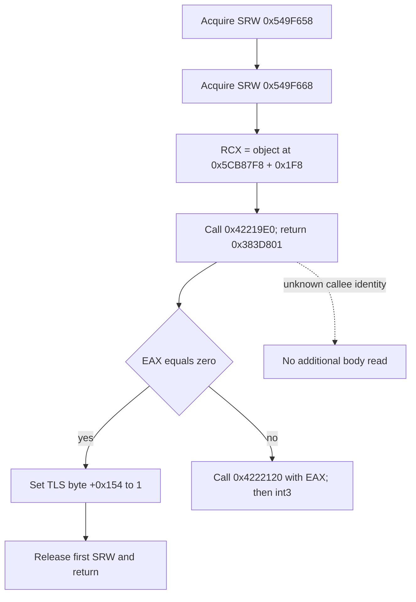

# Native66 failed R0085: two retained-stack function bodies on CK3 1.20.0.4

The two retained words both equal static call-return addresses in the frozen game image. That establishes useful offline entry points, not a verified runtime stack. The first enclosing function acquires synchronization locks; the second computes three floating-point output components. Neither result establishes that FMOD caused failed R0085 startup.

This is a bounded failure investigation, not a capability or live qualification. Root closed failed R0085 and resumed the Native60 fallback. No process, PSS, UI, SDK, Game, build or test operation was performed for this package. No runtime fix or new readiness gate follows from these results.

## Exact build and finite capture

- Game: CK3 **1.20.0.4**, Steam build **25734779**.
- Existing EXE SHA-256 reused verbatim: `98702F88A547CDE2EAF29A85F93B85F68EE4CF8148336A4F7AFAEB75319DD518`. It was not recomputed.
- Frozen EXE: `Z:/ck3_mod_rewrite/artifacts/migrations/2026-10-07/installed-build/binaries/ck3.exe`.
- Existing PE section/import metadata: `Z:/ck3_mod_rewrite_process_assets/g2-background-20261007/upstream-build-migration/global-pe-diff/NEW-PE-METADATA.json`.
- Existing runtime-function map: `Z:/ck3_mod_rewrite_process_assets/g2-background-20261007/upstream-build-migration/function-match-core/NEW-RUNTIME-FUNCTIONS.json`.
- Capture: **2026-10-10 01:46:17.765252–01:46:17.819664 UTC**, or **09:46:17 Asia/Shanghai**. Exactly **two EXE reads / 571 bytes**, fully decoded; no extra body, PE/header reread, EXE copy or hash.
- Capture receipt and full assembly: `D:/codex-ck3-background-spill/native66-retained-audio-functions/actual01/CAPTURE-RECEIPT.json`, `CK3-0383D7D0.asm.txt`, `CK3-03847B70.asm.txt`; corresponding JSON files retain exact captured hex and all decoded instruction/call edges.
- Reproducible finite reader: `D:/codex-ck3-background-spill/g2-native66-build-preparation/CAPTURE-TWO-HELD-AUDIO-FUNCTIONS.py`. It has only these two fixed ranges; this completed capture should be reused.

The section mapping comes from retained metadata: `.text` RVA `0x1000`, raw offset `0x400`; both bodies use file offset `RVA - 0xC00`. No executable bytes outside the following intervals were read.

| Function interval, end exclusive | Bytes | Retained candidate | Exact static call ending there |
| --- | ---: | --- | --- |
| `0x383D7D0..0x383D836` | 102 | `0x383D801` | `call 0x42219E0` at `0x383D7FC` |
| `0x3847B70..0x3847D45` | 469 | `0x3847C7B` | `call 0x3FA13B0` at `0x3847C76` |

## Function 0x383D7D0: synchronization entry

The complete body establishes this sequence:

1. `AcquireSRWLockExclusive` on image RVA `0x549F658`, called at `0x383D7DB` through IAT `0x43DA690`.
2. The same import on a second lock at `0x549F668`, called at `0x383D7E8`.
3. Load the object pointer stored at `0x5CB87F8`, add `0x1F8`, and call `0x42219E0` with that address in RCX. Its return address is exactly the retained candidate `0x383D801`.
4. If EAX is zero, set byte `+0x154` in the TLS block selected by `gs:[0x58]` and its first slot, then tail-jump to `ReleaseSRWLockExclusive` for the first lock `0x549F658` through IAT `0x43DA7D8`.
5. If EAX is nonzero, pass it in ECX to `0x4222120`; the final instruction is `int3` if that call returns.

The body does not release the second SRW lock itself. The unknown direct call and the second lock may be part of a paired synchronization protocol; the release partner and object class are not established by this bounded capture. The import names above are resolved from already retained PE metadata.

`0x42219E0` has no containing row in the retained runtime-function table. Its target address is certain, but its identity, including whether it is a library thunk or a mutex operation, is **not closed**. The observed argument/status pattern alone is insufficient to name it. `0x4222120` has retained runtime interval `0x4222120..0x422215C`; its semantic role was not decoded. No direct FMOD import appears in this body.

## Function 0x3847B70: floating-point three-component output

This body accepts an input object in RCX and output storage in RDX. It saves both, prepares two stack intermediates and calls `0x3FA13B0` twice, at `0x3847BC2` and `0x3847C76`. The second call returns at exactly `0x3847C7B`.

The function reads input floats at `+0x10/+0x14`, flips their sign using an XOR constant, and prepares basis-like triples `{1,0,0}` and `{0,1,0}`. It combines float elements from the returned intermediates with the input `+0x0C` scalar and initial `+0/+4/+8` components, writes three floats at output `+0/+4/+8`, returns the output pointer in RAX and executes `ret` at `0x3847D44`.

The complete captured body contains no wait, synchronization import or audio import. Its arithmetic supports the description **three-dimensional transform/offset helper**. The exact class and upstream use, including camera versus audio-listener use, remain unknown. The callee's retained runtime interval is `0x3FA13B0..0x3FA1502`; its body and identity were not expanded.

## Evidence boundary and next entries

The retained read used a historical PSS stack pointer and was not a validated unwind. Root's artifact is `D:/codex-ck3-background-spill/next-native66-durable6051-cold-preparation/ROOT-GAME164340-RETAINED-STACK-CANDIDATES-THIN.json`. `fmodstudio.dll+0x94B12` remains a mapped pointer candidate only; no FMOD image, function body or symbols were read here. The bridge-worker observation occurred after SDK exit and can represent ordinary next-connection waiting.

The source comparison of Native60 to Native66 found newly installed Person and Knight observers but no source-closed original-call/mutex recursion. Loading-time synchronous Person capture remains a separate unproven cost candidate. These two bodies do not establish a connection to those observers.

Finite unresolved entries are now exact: identity of direct target `0x42219E0`, release partner for SRW `0x549F668`, and caller/class identity for the floating-point helper. No further capture is included or required to close this package. A later Root-authorized offline package can reuse these artifacts and ask one of those questions without repeating the 571-byte capture or treating the retained words as verified frames.

Readiness remains **research**; no `fixture-live`, `production-live primitive`, `production-live loop`, full Person/Entry, actor, action-day or G2 credit. Daily/week report fields are delivered separately for Root to merge into the shared 2026-10-10 / 2026-W41 reports.
