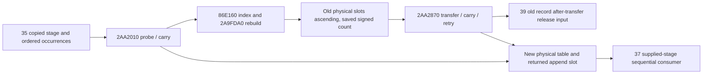

# Actual4 ArmyManager assault physical placement and growth

This source contract adds a pure, explicitly staged normal-return placement
projection for CK3 1.20.0.4 / Steam25734779. It closes the previously unknown
growth header, physical reinsertion order, carried-overflow retry and moved
record postimage. It reuses the existing current table reader and35's prepared
input binding. It grants no new live callback or complete daily/monthly credit.

Exact held executable SHA-256 is
`98702f88a547cde2eaf29a85f93b85f68ee4cf8148336a4f7afaeb75319dd518`.
Initial source freeze records Z HEAD
`6809dc7ebe8c6fbf57b3e73df690ff11091acf6e`. All source/tree/candidate/focus
artifacts are externally owned under
`D:/codex-ck3-background-spill/native71-continuation-20261010/continuation-36/`.
The working Z source and shared core/service/serializer/CMake/Git/Game remain
owned by Root. Source evidence is finite and cache-first under Root's
`FINITE-CAPTURE-POLICY.json`, with immutable shared-range O_EXCL claims.

## Actual inputs and physical layout

Actual pre-date callsite2A9A081 supplies the original roster occurrence. The
full admission producer2A99B20 reaches CALL2A99C7A ->2AA2010 with table
receiver primary CArmyManager+170, the selected/fallback Siege DWORD+8,
its four-byte little-endian FNV-1a hash, and output entry pointer/inserted flag.
The requested Province reference is not substituted for that selected key.
Army+10 and ordered repeated ArRg references append after placement returns.
35 owns the admission and original-roster binding; this leaf consumes
`DailyAssaultPreparationInput12004` without another reader.

Header fields are storage pointer+8, signed occupied count+10, signed mask+14,
u8 tail+18 and float32 load threshold bits+1C. A physical record has stride40,
hash+0, control+4, full Siege key+8, Army vector+10 and ArRg vector+28.
Each vector has data+0, capacityDWORD+8, signed count+C and allocator+10.
The current collector already provides physical controls, raw full keys and
ordered duplicate references. Current observations remain separate from any
conditional placement result.

The daily consumer2A97EB0 traverses occupied physical slots in ascending
address order before end slot `wrap_i32(mask+zeroextend(tail)+1)`. Logical
key order and insertion order do not replace that order. Its copied future
reference resolution and sequential numerical evolution belong to37.

## Probe and collision order

2AA2010 uses signed `hash & mask`, u8 distance starting1, and contiguous
ascending records without repeated modulo. It compares the full key when
control>=distance; a key hit returns before growth tests. A missing key selects
growth when distance>tail or ordered float32
`f32(wrap_i32(occupied+1))/f32(mask) > threshold` by COMISS/JA. NaN compares
false; denominator is the raw signed mask, not an inferred capacity.

Direct empty records receive canonical null Army/ArRg headers. Actual scalar
constructor stores use allocator RVA54E0570 and54DEB68. Collisions move the
resident pair, replace the selected slot, and carry the displaced record.
The lower-distance exchange arm reloads resident control, increments its
byte and advances without testing tail. The other occupied arm increments
the carried byte and compares it with tail. Empty completion increments the
occupied count once. Occurrences retain their original order and duplicates.

On carried overflow, the temporary record swaps with the first selected slot,
the table grows, and2AA2870 inserts the carried key/value. Its returned slot
is the recursive insertion result. The later Army/ArRg appends must use this
returned slot; they cannot use the original first selected slot after rebuild.

## Exact growth and value transfer

The actual pdata-free numeric leaf86E160..86E1D0,112 B through both returns,
with second argument1 returns3 for signed wrap32(mask+1)<=1. Otherwise it
returns `max(3,ceil(log2(signed wrap32(mask+1)))+1)`. Returned index>=31 is the
identified nonreturning exception boundary and stays unavailable here.

2A9FDA0 validates unsigned argument1..30. Its normal body sets tail to
u8(index+2), mask to `(1<<index)-1`, occupied count to0, and uses the table
allocator's virtual slot+8 with alignment8 for
`((1<<index)+tail+1)*0x40` bytes. It preserves threshold and allocator, zeros
every control before the new end slot `(1<<index)+tail`, and writes FF there.
The projection represents normal-return fresh storage symbolically and an
implicit zero-control range. It never calls an allocator or materializes
billions of empty records.

2A9E8A0 returns native empty storage at exact literal RVA5D68C00. Equality
with the old storage is a separate explicit input binding; an empty current
list does not prove it. Saved signed occupied count<=0 skips reinsertion.
Otherwise, when old storage differs, growth walks old controls from slot0,
skips control0 and decrements the saved count only for a nonzero control.
It stops on that signed count, with no end-marker termination check. A count
mismatch can demand a marker record and becomes unavailable if that record
was not supplied. Observed group count never silently replaces the raw count.

Each actual CALL2A9FE68 ->2AA2870 occurs before CALL2A9FE71 ->9D11F0 on
the old record's slot+10. Thus39's growth release receives after-transfer
headers in stage `growth_after_2AA2870_before_9D11F0`. This differs from the
ordinary daily cleanup stage. Old table deallocation after iteration uses
the table allocator virtual slot+10/alignment8; the leaf reports the selected
source event without executing it.

2AA2870 moves the supplied key/vector pair and preserves the same full key,
probe/carry and growth rules. Exact reached helpers are2AA2430 (pair move),
2AA3670 (pair replacement),2AA22A0 (scalar and pair exchange),2AA24F0
(growth wrapper),2AA35A0 (empty pair replacement),2A9F9F0 (Army transfer),
C85A90 and its C8EAA0 matched ArRg header exchange. The canonical matched
arms transfer data/count/capacity and leave the moved source null with count0
and capacity0. A key hit does not move the supplied value. Actual allocator
reads on copied baseline records are distinct from constructed canonical
provenance; the projection does not fabricate a read witness on another slot.
Unmatched allocator branches are explicit unsupported functional edges.
Exception/CRT and allocation/OOM audits remain outside this package.

## Production interface and limits

`ProjectAssaultGroupPlacement12004(preparation, baseline)` accepts35's copied
input and an explicit baseline stage/frame/provenance. A pre-date copied
baseline requires35's actual source-entry binding. A standalone current query
can support only the explicit conditional-current baseline. Missing group
data is retained as missing; it is never turned into an empty table.
The pre-date table may already contain earlier original-roster appends. Root
explicitly supplies a request suffix starting exactly at the bound occurrence;
earlier requests are rejected and are never replayed against that baseline.

The result preserves the observed current table and separately returns the
projected header, explicit controls plus a proven zero extent, physical groups
in ascending slot order, each ordered raw reference list, request results,
growth reinsertion order and post-transfer release inputs. Registry/ArRg
resolution for newly appended references is supplied to37 independently at
the same projected stage. Vector allocation headers after logical append are
unknown and are not reused as actual cleanup input.

The unsupported request stops atomically while preserving earlier supplied
requests. The operation limit bounds offline work and reports unavailable;
it is not a native count or capacity rule. `ready` means this supplied ordinary
matched branch completed under the stated conditional premise. Actual callback
execution observed, full future placement, full daily assault and full monthly
execution flags remain false.

## Evidence and focused validation

Held actual4 mapping evidence is
`army-world-family/native-main/map03/table_placement_source-DETAIL.json`
(653 B),map07 daily consumer (801 B),map01/map02 full admission (637 B) under
`Z:/ck3_mod_rewrite_process_assets/g2-background-20261007/upstream-build-migration/`.
Root supplied250 B of split growth source. Owner finite capture adds2554 B,
in finite-growth-source714 B, finite-value-source662 B, finite-transfer-source
754 B, finite-arrg-move-source227 B and finite-constructor-source197 B.
All decode fully; no image scan/hash, old EXE acquisition or Game operation
was performed. PLACEMENT-SOURCE-FREEZE and CANDIDATE-FREEZE bind exact files.

One new fixture argv is `--growth-physical-order-only`. It covers old physical
reinsertion order that differs from logical key order, growth controls/header,
carried overflow's recursive append slot, repeated raw references, after-move
old release headers, raw occupied-count mismatch, a key hit whose resident
hash is undemanded, and stage/allocator/empty-storage binding gaps. Root runs
`run_new_focus36.py` once in a fresh owned output. Until its receipt is present
the fixture status is NOTRUN. Offline GREEN proves only this new conditional
leaf, not live callback execution or complete day/month functionality.

Storage follows policy1.0.0. Source/record review is180 days, active inputs have
a limited review date2026-10-17, and generated build outputs are reviewed48
hours after close. New focused peak16 MiB is inside Root's existing parallel
20 GiB admission, expiring2026-10-11T08:41:22.843427Z. Z stays read-only.
