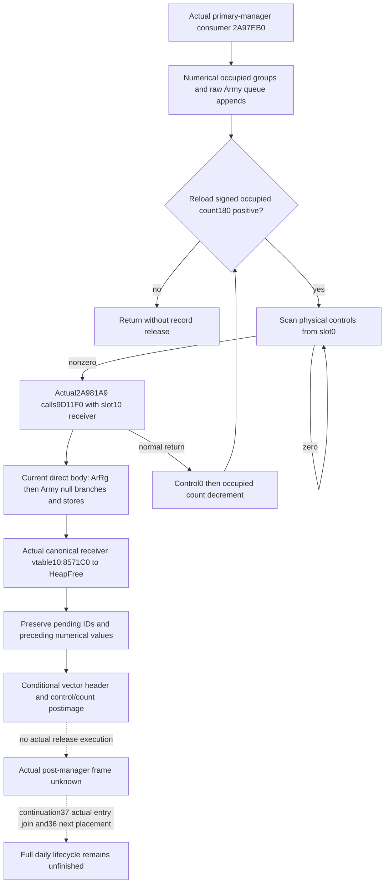

# Native71 actual4 assault-group occupied-record release

This continuation closes the actual4 occupied-record release source and supplies a conditional stage adapter for the next manager input. It binds CK3 1.20.0.4 / Steam25734779 to retained executable SHA-256 `98702F88A547CDE2EAF29A85F93B85F68EE4CF8148336A4F7AFAEB75319DD518`. The source checkout stays read-only; candidate output is external. The final source tree is `continuation-39/SOURCE-TRANSITIVE-CLOSED.json`, built from the earlier source-first and direct-body checkpoints before enabling the canonical callback binding.

The held actual4 complete consumer is `2A97EB0..2A981D1`, 801 bytes, in the migration family's `map07/daily_assault_table_consumer_source-DETAIL.json`. Its cleanup stage starts after the numerical physical-table traversal. At `2A9817C` it reads signed manager `+180`; count at or below zero skips cleanup even if numerical groups were processed. Positive count starts at manager `+178` entries, using slot0 control at entries `+4`. Zero control advances physical stride `0x40`; any nonzero control selects that actual record.

At `2A981A5`, `RCX=control-address+0xC`, exactly occupied physical `slot+0x10`. The actual `2A981A9` bytes `e84290f3fd` call **`9D11F0`**. This target comes from the current cached instruction, with no global address delta. Only after it normally returns does `2A981AE` store control0, `2A981B1` decrement manager `+180`, and `2A981B9` reload the occupied count. The loop advances one physical slot and continues while that reloaded signed count is positive. It can release fewer records than the observed group vector; the numerical end marker does not bound cleanup.

The `.3` direct `9D11F0` body, ArRg-before-Army vector stores and canonical raw-buffer callback chain were already closed in [the historical release topic](army-daily-assault-queue-release-12003.md). That evidence did not establish the current direct body or its selected callbacks. The first source checkpoint recorded **NOT_HELD** and handed Root the exact current target. Root subsequently captured the actual4 92-byte body at `9D11F0..9D124C`, with ordinary `RET` at `9D124B` and raw SHA-256 `d04dbf98b0753f1ebdd1ca022537661ad1967759e8965f61f33ae762c9d96ca9`. This is actual current capture evidence even though its bytes match the historical body. The frozen direct tree is `continuation-39/SOURCE-DIRECT-CLOSED.json`. Root then replaced its source-supply convention with `native71-continuation-20261010/FINITE-CAPTURE-POLICY.json`: the exclusive owner used the existing mapper and shared O_EXCL cache for the necessary actual callback source. No game or historical FIRST ran.

The current direct body releases ArRg first. Its slot `+28` nonnull data selects count `+34=0` before `9D1216` dispatches the callback at the actual slot `+38` receiver's vtable `+10`, with data in RDX and alignment4 in R8D. Ordinary return then stores slot `+28` data0 and `+30` capacity0. Army follows: slot `+10` data, `+1C` count, `+20` receiver, callback at `9D1238`, and `+18` capacity. Null data skips every store for that vector and does not consume its callback receiver. There is no direct pending-queue or registry write in these92 bytes.

Current constructor identity is independently known. Continuation36's held actual4 `2AA2010` body writes Army-vector release receiver `image+54E0570` to slot `+20`, and ArRg receiver `image+54DEB68` to slot `+38`. Its current `2AA2430` move body independently confirms those identities. The existing current table observer publishes each actual record's allocator witness plus optional raw data presence/identity, count and capacity. A constructor constant cannot replace the actual receiver read.

The actual singleton qwords bind Army `54E0570` to current vtable `44E61F8`, and ArRg `54DEB68` to `449C468`. Each actual vtable `+10` returns `8571C0`. The full14-byte current dispatcher returns for null RDX and otherwise moves the raw buffer to RCX and jumps to actual `40EC530`. Its5-byte jump selects `423543C`; that17-byte wrapper uses only a stack-local zero and jumps to `424E364`. The current `.pdata` interval `424E364..424E3A1`,61 bytes, passes `(heap=[5C5DE30], flags=0, raw buffer)` to the retained current import `43DA748`, `KERNEL32.dll!HeapFree`. Success reaches ordinary RET; failed result uses `GetLastError` and CRT errno handling before RET. The logical state contract ends at this standard raw-buffer deallocation boundary. It does not expand CRT/heap internals into a general allocation audit. No manager, pending queue, Army object or ArRg object receiver is propagated in the selected chain.

This establishes preservation of pending raw ArmyID occurrences and the preceding numerical physical/cached values through a normally returning canonical record release. The actual source addresses were selected from returned current qwords and jumps, with no global delta. Current vtables and backend/wrapper/terminal addresses differ from the historical chain. The worker acquired121 new bytes in8 exact reads and reused8 current dispatch-prefix bytes; Root's92-byte direct body was reused without rereading. The complete capture receipt and source body hashes are under `continuation-39/callback-source/`.

The candidate `army_assault_group_release_12004.py` consumes the existing physical table/pending observation and continuation37's full explicit numerical-stage result. Its keyword-only stage supplies manager, capture, observed-query capture, predecessor stage, exact current EXE pin and the fixed table-header/control premise. All identities must match before the existing queue/release kernels run. The added source binding records the actual4 selected chain on each canonical call; it retains `.3` kernel reuse provenance separately. It copies observations and returns a conditional cleanup frame containing physical controls, occupied count, reached vector headers, pending prefix/sequence and the numerical physical/cached maps. No observer or numerical kernel is duplicated.

A noncanonical or missing reached receiver keeps the before-call count0 store and stops the later vector/caller suffix. A null vector keeps its raw count/capacity, including unknown optional fields, without demanding an allocator. A partial numerical stage can preserve a qualified queue prefix, but its frame carries `numerical_prefix_complete=false` and no complete pending sequence. The explicit stage identities are conditional input declarations; the leaf does not certify a live capture or actual later manager callback. Growth/reinsertion must supply actual after-transfer old-slot headers before reusing record release; before-transfer headers cannot serve as that stage.

The sole new compound focused argv was `Python313/python.exe -B continuation-39/test_army_assault_group_release_12004.py`. It passed one test in0.001437 seconds. It checks the stage join, physical count-driven stop, ordered duplicate/raw IDs, numerical carryforward, null unknown-field preservation, noncanonical pre-call prefix, partial numerical readiness, stale identities/source pins and input immutability. `FOCUSED-RESULT.json` and `ACTUAL-FOCUSED-VALUES.json` explicitly mark pure conditional fixtures and no historical runtime credit. No old suite, build or game was run.

The actual cleanup callsite/bookkeeping, direct body and selected canonical normal-return logical callback effects are source-closed. The external stage consumer and conditional postimage are focused GREEN. Root owns shared receiver/caller, binder, serializer, service, CMake and runtime adoption. Actual record-release execution, actual post-manager frame, complete daily/monthly execution and live readiness remain false/null; an actual same-query stage and later manager frame are still required for those claims. Existing current raw observers and bounded kernels are reused, with no new historical gameplay credit.
