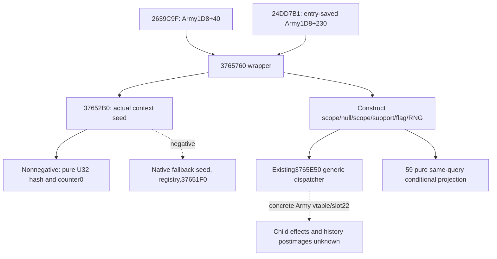

# Native71 Army compiled-effect wrapper 3765760

The actual late Army callers reach an embedded compiled-effect receiver at
`Army1D8+40` or the entry-saved `Army1D8+230`. The complete actual4 wrapper is
`[3765760,376585C)` (252 bytes). It constructs scratch support and a six-field
EffectContext, then executes `3765E50`; it has no direct receiver history store.
This closes the argument constructor, not the effects of arbitrary compiled
children. Exact source and its two callers are pinned in external
`SOURCE-PROOF.json`; no old executable or whole image was read.

The constructed context has root=original borrowed scope, alias8=null,
alias10=the same scope, environment=owned support118, flag=loaded byte5D1DADC,
and RNG=owned pair from `37652B0`. Existing exact4 support constructors and
teardown are reused. Continuation27 closes the generic dispatcher forwarding
and slot22 call, but its concrete Sway true/false receivers do not identify
these Army receivers. No Sway hook or shared installer is modified.

The complete 780-byte seed constructor tests signed incoming scope DWORD+10.
For a nonnegative seed it writes a deterministic wrapping U32 hash and counter0.
For a negative seed it obtains a native fallback seed, reads the compiled
receiver key, and may lock/insert global registry state and call37651F0. The
conditional leaf preserves that branch as partial. It does not run the native
fallback, registry operation, compiled effect or game.

The implemented Python API is
`project_army_compiled_effect_context_12004(supplied_or_None)`. Its precise
schema is external `INPUT-SCHEMA.json`. 59 must pass only fields from its own
same query. Missing fields remain partial; an absent native context remains
unavailable. Available argument arithmetic never proves a real invocation or
history change. The original callback observation family cannot fill this
different context. One new focused method passed, with six seed vectors
checked by an independent finite register interpretation of the retained
source and with both real routes, missing inputs, invalid types and rejected
historical basis. This is offline evidence only.

`army_compiled_effect_entry12004.hpp` supplies a read-only entry DTO and a
generic original-once adapter. A Root-owned naturally reached3765760 detour
must supply the actual ABI/trampoline, reader, sequence/frame/thread/parent
ingress and publisher. Disabled or failed observation still invokes the
provided original once, and forwards its return. No native binder, patcher,
journal, installed observer or historical normalizer is manufactured here.
The candidate header has not been compiled or installed. Root41 coordinates
native ingress; 59 owns the actual service integration.

The package stays outside the repository. Root adopts its complete
`patch-63.diff`; no source/Git/game state changed. Full daily/monthly and
transitive material effects remain unqualified. Small active inputs have a
seven-day review under storage policy1.0.0; derived helpers receive48-hour
review, records180-day review, and no automatic renewal is claimed.
