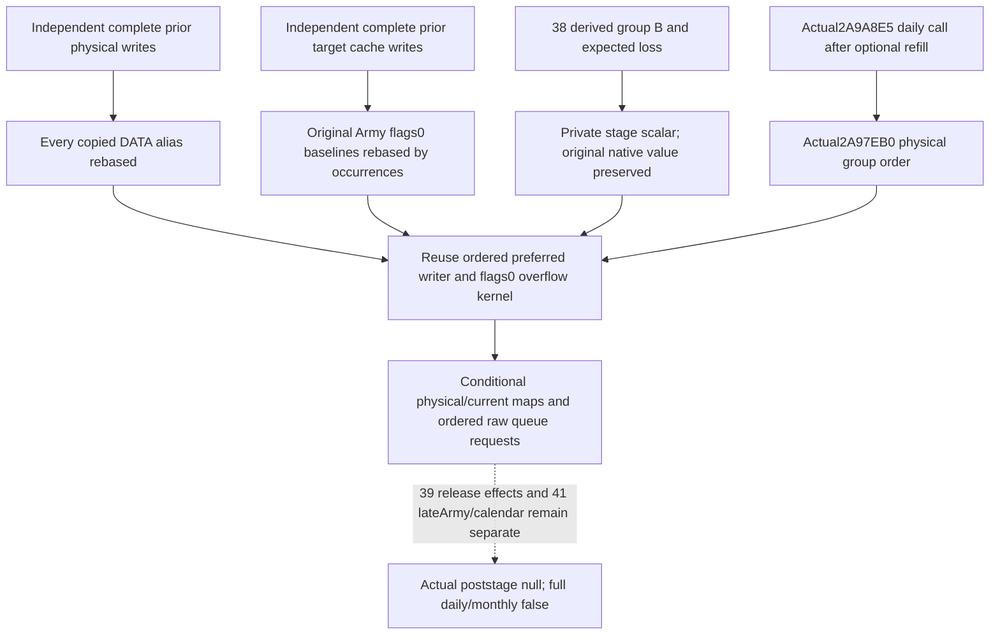

# Actual4 daily assault-group numerical consumer at an explicit stage

2026-10-10 / W41. CK3 `1.20.0.4`, Steam25734779, inherited EXE SHA256
`98702F88A547CDE2EAF29A85F93B85F68EE4CF8148336A4F7AFAEB75319DD518`.
The source-first scope, exact source contract and new arithmetic expectations
were frozen before candidate implementation. All files remain in the exclusive
external `native71-continuation-20261010/continuation-37` packet. The Z source
tree is read only; shared hooks, serializers, service, CMake, reports, Git and
Game remain Root owned.

The new value is a daily group calculation that can begin with independently
supplied preceding preparation/refill output. It performs zero further refill
ADDs. It preserves physical DATA aliases, stored ArRg caches and original raw
group Army IDs as different identities. The old current table calculation is
reused at this newly rebased numerical entry, without replaying its old FIRST.

## Actual caller and direct consumer source

The held actual4 packet is
`Z:/ck3_mod_rewrite_process_assets/g2-background-20261007/upstream-build-migration/army-world-family/native-main/map07/daily_assault_table_consumer_source-DETAIL.json`.
Its `new.instructions` completely decodes actual `2A97EB0..2A981D1`, 801B.
The adopted actual4 migration manifest independently identifies this entry;
no global RVA delta, new EXE/PE read or image hash is used.

Continuation41's frozen `SOURCE-PROOF.json` confirms actual post-date callback
`2A9A570..2A9AB73`: `2A9A8E2` supplies primary manager RCX=R15 and
`2A9A8E5` calls `2A97EB0`. Its return is `2A9A8EA`, where the original late
Army roster begins. The daily group call follows optional calendar-month refill
and precedes the late Army work and actual stored-D modulo30 bucket. It has no
new month-first or Siege44C admission test.

| Actual returned call | Direct use |
| --- | --- |
| `2A97F5F -> 25205A0` | Resolve original raw group Siege key by generation/fallback, then obtain that group's expected whole loss |
| `2A98091 -> 2634190` | Preferred valid ArRg definition2A0<=0; signed64 Q100000 writer request |
| `2A980CD -> 2A957E0` | Positive original budget minus initial signed cap; same group ArRg descriptor, flags0 |
| `2A98129 -> 2A95720` | Re-resolved group Army+38 flags0 current count |
| `2A98140 -> B02D10` | Append original raw group Army ID to primary68 if signed count<=0 |
| `2A981A9 -> 9D11F0` | Release occupied record at physical slot+10; continuation39 owns transitive effects |

The source traverses occupied primary178 table slots in ascending physical
order, stride40. The signed32 wrapped mask184 plus unsigned tail188 plus1 forms
the end; its marker is excluded. Original group Army and ArRg lists retain
repetitions. A logical dictionary sorted by Siege ID is not this source order.

Whole budget **equals zero** skips allocation. Otherwise the preferred signed32
sum, signed minimum and low32 multiplication/signed division are preserved.
The inner loop stops at nonpositive remaining amount or denominator. Each
request decrements caller amount by the requested quantity and denominator by
the pre-call current; physical application or writer skip is a separate value.
Overflow uses original budget minus the initial cap, independently of unused
preferred remainder. Each called writer updates all shared physical aliases,
then refreshes only its actual target's current/max. No full-Army refresh is
added to this consumer.

The actual4 writer, DATA selector, physical store, current/max refresh and
flags0 allocator were already source closed and qualified in
[current callback soldier effects](army-current-callback-soldier-effects-12004.md).
The existing daily-loss kernel retains its historical `.3` nested source labels;
this package binds only the direct actual4 daily group caller and the associated
current/max numerical domain. Native71 physical-debit and alias evidence are
reused, not requalified here.

## Minimal independent stage interface

`project_army_daily_assault_loss_stage_12004(army, stage=...)` consumes normalized
current table/loss families plus explicit `stage_id`, `capture_id`,
`manager_identity` and `basis`. The caller supplies every preceding-stage
physical change in `physical_chunks` and every preceding target-cache write in
`regiment_currents`. Their completeness flags must be true for a nonempty
table: an omitted object means unchanged only under that explicit prior-write
set premise, never unreadable or zero.

The adapter updates every copied DATA alias from the same physical map. It
updates only supplied cached ArRg identities. For each group Army it rebases
the captured flags0 whole baseline by the prior cache delta for every original
Army38 occurrence. Physical sharing alone does not refresh another cache.
Provided unavailable physical rows stop at the demanded writer; missing
completeness refuses the stage before using old observed values.

Continuation38's `group_budget_outputs` provide same-stage derived eligible B,
expected loss and rebased `besieging_inputs_v1`, aligned by original group
index and physical slot. The old kernel initially consumes its scalar before
any target delta. Therefore the adapter supplies the derived expected loss in
that private simulation slot while retaining the original native scalar in
`original_current_group_observations`. Later groups reduce their rebased B
using the subsequent target-cache deltas. A preceding-stage current scalar is
not silently relabeled as a fresh native observation.

The output contains separate provenance, original observations, entry budgets
and `numerical_prefix`. That prefix retains ordered preferred/residual requests,
physical/current maps and raw queue append requests. A real complete empty
table has a ready empty numerical result without demanding unused DATA or
budgets. Membership/resolution and all nonphysical context remain explicit
stage premises; callers must supply the output of actual earlier mutable stages
when those stages change those inputs.

## New qualification and precise limits

Only one new pure compound is authored and executed. FIRST was a fixture
shape RED, 1.6151043s: the minimal ready occurrence omitted
`unavailable_reason`, which the qualified current-table helper demands. It
failed before any numerical assertion. The original receipt and logs remain;
the correction added only that missing null fixture field. Candidate production
code did not change after FIRST.

The necessary same-compound retry is GREEN, exit0, 0.2887613s process and
`Ran1 test in0.002s`, at `2026-10-10T09:13:04.255163..09:13:04.544892 UTC`.
Frozen expectations and actual values show observed physicalA50/cachedA100/B240
becoming an independently supplied entry physicalA60/cachedA120/B280. Two
physical groups then use budgets `[28,18]`, requests `[[14,10],[18]]`, final
physicalA18 and target cachedA36. Their Army tail counts are `[112,76]`.
Unused preferred remainder4 does not create overflow: original overflow0
leaves the flags0 pass uncalled. Original native budgets `[24,24]` and input
objects are preserved. The same compound covers missing completeness,
unavailable demanded physical input and a genuinely empty source table.

Evidence: `FIRST-EXPECTATIONS.json`, `FIRST-RESULT.json`,
`FIRST-FIXTURE-CORRECTION.json`, `RETRY02-RESULT.json` and
`ACTUAL-FOCUSED-VALUES.json`. This qualifies only the new explicit-stage pure
adapter, not a newly compiled collector, registered service or game invocation.
All native writes, refill ADDs, EXE reads, Game/SDK calls and old test/wire
replays are zero. Actual loss/effects are false, actual post-stage is null,
and full daily/full monthly remain false. Group preparation/placement,
earlier post-date lifecycle, release callbacks and later Army work remain
independently owned source/stage dependencies; no whole daily frame is invented.
