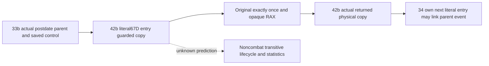

# Native71 actual4 natural gathering entry and return

42b implements passive facts around the actual `2A9AF20(primary,CDate*)` call. It records one entry copy, forwards the intercepted original once, then records one returned copy. Noncombat physical results are read from the real returned memory; the producer does not predict the unknown allocator, placement, destruction or statistics transitions described in continuation-42's source contract.

The immutable source basis is CK3 1.20.0.4 / Steam25734779, held SHA-256 `98702F88A547CDE2EAF29A85F93B85F68EE4CF8148336A4F7AFAEB75319DD518`. Actual caller `2A9A678` is unconditional and returns to`2A9A67D`; the caller does not consume RAX. The complete logical body `[2A9AF20,2A9B579)` is1625B, already acquired and closed by42. This continuation reads no additional executable bytes and does not repeat42's previous eight cases.

## Native and ABI boundary

The entry patch spans exactly the first16B, four complete instructions: `mov r11,rsp`, save RDX home slot, push R12 and subtract80 stack bytes. These instructions contain no branch or RIP-relative relocation. The original trampoline replays them and resumes at`2A9AF30`. The runtime entry anchor must match the retained source bytes; installation additionally requires Root's actual `primary_thread_suspended_proven` cold-start proof.

The small entry thunk `45 88 E8` copies actual caller R13b toR8b and tail-jumps the gate, preserving original RCX/RDX and the caller return PC. Gate reads `_ReturnAddress`, records the saved mask through33b before copying the active parent, then invokes the original trampoline with its original two arguments once. Native RAX is opaque64 bits; the gate returns those bits unchanged. Observation failure does not suppress or repeat the original call. No getter, gathering, cache refresh, destructor or allocator is invoked by the observer.

The leaf exposes `BindArmyGatheringDueNaturalHook12004(base,sha)` and `InstallArmyGatheringDueNaturalHook12004(state&)`. It never fabricates the startup proof or uninstalls during Stop/DllMain. Shared startup integration is owned by55; central validation is owned by10.

## Immutable physical facts

Both snapshots contain raw primary158 buffer,160 capacity,164 signed count and original ordered FullIDs. Entry has original30/3C persistent occurrences, prepared148 and seven complete chunk field copies per resolved physical receiver, plus50/5C Army roster, Army38/44 ArRg occurrences, ArRg source references/current38/maximum3C/state/association IDs and80 raw statistics bytes from Army130..17F. Army gathering50/5C records retain signed low32 date, ordered pending owner8/ordinalC refs and Character IDs. No normalization changes full raw CDate values.

Resolution preserves low24 index, exact full-generation and native physical fallback identity. Original occurrences and repeated aliases remain separate. At return, the observer also copies the original queue extent from the actual current158 backing buffer even if164 is0. Returned logical visible IDs and backing extent are separate facts.

Destroyed due-record memory is not read after the original returns. `entry_due_refs_at_return` retains the immutable entry owner/ordinal/source-reference token, resolves the physical receiver in actual returned state, and reads its actual chunk association, byte14, state, raw date, current and maximum. The wire labels that basis explicitly; it does not claim the freed source-reference bytes survived.

Snapshot array bounds and read-operation bounds produce partial arrays and explicit missing fields. Unreadable optional values serialize as null, never zero defaults. `all_declared_reads_complete` concerns the declared guarded fields; it does not assert an atomic global game snapshot. Cache fields are entry/returned observations. `internal_refresh_callback_observed=false` prevents before/after values from being represented as an individually intercepted refresh event.

## Parent and downstream provenance

The observer accepts only the literal67D child boundary inside33b's active postdate scope with matching primary/secondary/GameState/date-pointer identities. It copies the full parent DTO, including session, process clock, thread, original roster and saved-control provenance. Serialization calls33b's authoritative `AppendArmyNaturalPhaseScope12004`; no reduced parent schema is maintained here. Events use33b's adapter to13's process-lifetime clock. Query reads only immutable journal copies filtered by resolved owned Army fullID, and cannot create a parent or entry event.

43 cleanup precedes this actual call; its physical effects therefore remain in the observed entry state. A later current query cannot replace either snapshot. The actual returned snapshot is a predecessor fact for34;34 must still capture and qualify its own literal regular-core entry. Neither this observer nor59d fills a missing historical34entry from the42b return. Noncombat prediction remains unavailable and whole daily/monthly readiness remains false.

## Qualification and storage

`RunArmyDueNaturalFocus12004()` is a no-main fragment for10's single new `--army-natural-connected-phase` compound. It uses real33b TLS and13clock around a fixture original, covers actual before/after changes and freed-record reference handling, full parent/session wire, wrong returnPC, guard-read failure and standalone context rejection.42b performs no separate compile/run, no previous cases and no live CK3 operation. The initial frozen implementation awaits the central receipt; it is not reported as GREEN before that receipt exists.

External42b ABI proof, manifest and storage receipts are under `D:/codex-ck3-background-spill/native71-continuation-20261010/continuation-42b`. The unified storage policy applies; required source is referenced rather than copied, the8MiB incremental budget is below the current usage, and active source/integration evidence is due for review on2026-10-17. No Z source, Git, shared core or game operation is performed by42b.
