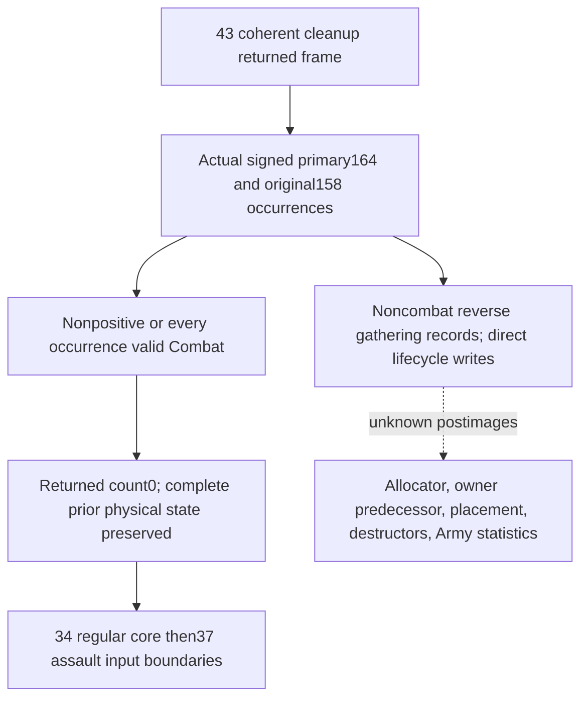

# Native71 actual4 early postdate gathering/due stage

`2A9AF20(primary,CDate*)` 的实际主函数已闭合；外置 conditional producer 与唯一新 focused test 已完成。可完整返回的分支是 primary164 非正队列，以及正队列的每个原始 occurrence 都解析为有效 native Combat。任何 noncombat occurrence 都进入真实 gathering/lifecycle/refresh；尚未闭合的 transitive postimage 不在候选中生成。

目标固定为 CK3 **1.20.0.4** / Steam **25734779**，继承 EXE SHA-256 `98702F88A547CDE2EAF29A85F93B85F68EE4CF8148336A4F7AFAEB75319DD518`。[SOURCE-FREEZE.json](SOURCE-FREEZE.json) 记录开始时源树 HEAD `6809dc7ebe8c6fbf57b3e73df690ff11091acf6e` 和 native/policy 哈希；当前实际语义契约是 [SOURCE-CLOSED.json](SOURCE-CLOSED.json)。早期 [SOURCE-ENTRY.json](SOURCE-ENTRY.json) 与初版 graph 保留为读入过程记录。

## 实际入口、队列与日期

continuation-41 的 [caller proof](../continuation-41/SOURCE-PROOF.json) 证明 `2A9A649` 构造 GameState+8 CDate 指针，`672` 设置 RDX，`675` 设置 primary RCX，`678` 无条件 CALL；下一条 `67D` 没有消费 RAX。saved-mask bit2 的 `2A98C90` cleanup 位于本阶段之前；continuation-43 的完整 ready+returned 分支是本阶段的前序 frame。之后依次进入 `2A9A8DD ->2A98AC0` regular core 和 `2A9A8E5 ->2A97EB0` assault。

实际 `.pdata` 多段区间经 literal branch/fallthrough 连接，逻辑主函数为 `[2A9AF20,2A9B579)`，共 **1625 B**。前26 B 与48 B 由 Root 提供；后续1515 B 正分支、14 B 跳转出口和22 B 清零/RET 都已保存。

| 源分支 | 实际消费与返回 |
|---|---|
| initial primary164=0 | 直接出口，不读取队列、记录或日期，没有业务 store。 |
| initial primary164<0 | 不读取队列、记录或日期；primary164 写0。 |
| initial primary164>0 | 固定初始 count，按原 primary158 FullID occurrence 顺序处理；结尾清 primary164，保留 backing IDs。 |
| 有效 Combat | Army128 查 Combat；完整 generation 或 physical fallback 后，magicC=`436F6D62` 且 ID8 非 sentinel，即进入下一 occurrence，不调用 gathering/refresh。 |
| noncombat | Army50/5C gathering pointer records 从原 reverse index 开始遍历；即使没有到期记录，也调用24E8100 refresh。 |

Army 查表使用 low24 index、registry2C unsigned 上界和 full generation ID10；失败保留真实 fallback receiver。顶层没有额外 Army magic/sentinel gate。Combat fallback 同样可以通过真实 typed/fullID gate，不能只凭 requested ID 或 combat Boolean 判定。due 比较在 `2A9B0C8..CC`：signed record DWORD0 <= signed passed CDate.low32；高 DWORD 和 day normalization 不参与。完成 gathering 后 Army190 写入新读 GameState+8 的完整 QWORD，不能用归一化 day 值替代。

## 真实 due 与 refresh 作用

到期 record 的 pending refs 保存 owner FullID8/ordinalC。主函数按 Regi 完整 generation/fallback 与 typed/sentinel gate 解析，再计算 `Regi+18+36*ordinal`，调用实际 `2A9AB80(primary,chunk,owner,Army)`；主函数没有 ordinal 范围 gate。

`2A9AB80` 实际 body `[2A9AB80,2A9AF1C)` 已闭合。它选择可复用 Army38/44 ArRg，或调用 `2A96D40` 创建；随后 `24E0C50` 在 roster 缺项时追加，并写 ArRg140=Army10。chunk byte14 写0；完整184 B `2633E10` 追加 ArRg20/2C 的16 B source ref，写 chunk association10=ArRg10、chunk date1C=`FFFFFFFF029C77F8`，tail-jump 到既有2633320 current/max refresh。类型为`4744624F`时还写 ArRg18 类型指针；特定 owner 分支写 ArRg144 军事组件 ID。

record Character 分支会清 military component108、FC，并可能创建 ArRg。`2633ED0` 的 named body 到 `2633FC3` 写 ArRg148=Character18、可选 componentF8=ArRg10；解析 Army/Unit/location 后 tail-call `28B2710(Character,location,0,0)`，placement lifecycle 完整后像仍为明确未知 producer。最后一次64 B bounded capture 多保留 padding 与相邻入口27 B，这些不计入 association 语义或相邻函数归属证明。切在 instruction 中间的独立 decode 只作原始 packet；语义使用从实际 entry 开始的 joined decode。

due record 被 swap-pop：保存最后 pointer、置最后 slot 为null、销毁已选 record/列表、替换当前 slot、释放最后 slot、减 Army5C。原 reverse cursor 继续下降，不重跑 moved-last。当5C变0，primaryC8/D4 中所有 matching raw 当前 queue ArmyID 被 unordered 删除，随后写 Army190 日期。

完整230 B `24E8100` 对原 Army38/44 ArRg occurrences 调用2633320，再调用 `24E1190` 并复制80 B 到 Army130..17F。**non-due noncombat 也执行此缓存/统计刷新**。完整 allocator/ctor、owner predecessor28BFC50、Character placement28B2710、实际 destructor callbacks 与24E1190 统计 postimage 仍为实际入口；候选不提供未闭合结果。

## 外置候选、输入复用与消费者

[candidate/army_gathering_due_stage_12004.py](candidate/army_gathering_due_stage_12004.py) 要求 exact4 pin、明确 cleanup-return entry，以及相同 manager/frame/capture predecessor receipt。完整显式 physical baseline 和完整 prior writes 被深拷贝保留。正队列使用原顺序 IDs、registry slot/full-generation/fallback materialization，从 raw Combat magic/fullID 得出真实 skip 条件。

ready 返回归零 primary164；158 backing IDs 原样保留。primary30/3C、prepared148、全部 chunk bytes、Army/ArRg rosters、physical170 table/cache、Army130..17F、primaryC8/D4、Army190 都保持前序返回状态，包括43已产生的 chunk date1C 和468/474 写入。下一阶段 provenance 指向 regular entry。noncombat 或缺少 reached physical slot 输入只返回 unavailable/partial 和实际 producer 入口，不交付完整 frame。

native reader `ck3_12002_army.cpp:564..570` 已通过 `monthly_first_removal_cleanup_inputs_v1.id_lists.158` 读取158；signed count<=0 返回 available empty。`reuse_native_empty_gathering_queue` 复用该读数并保留零/负区别未知，不新建 collector。独立当前 query 缺 cleanup-return 绑定时被拒绝；已知同帧 positive count 与 empty reader 矛盾时也拒绝。

34仍要求 literal `2A9A8DD` 前全部 persistent occurrences、prepared148、七chunk完整字节、Army50/5C及Army38/44 frame；37仍要求实际 physical table/group/roster/cache 与完整 prior-write overlay。只有两个已闭合分支可提供同源 returned frame；任何 noncombat lifecycle 都必须先组成真实 postimage。

## 验证与保留

[focus01/RECEIPT.json](focus01/RECEIPT.json) 记录唯一新 argv 与 **8项 GREEN**：原始重复 occurrence、generation fallback、前序 cleanup alias/date/roster/cache 保留、zero/negative 区别、noncombat 不假造 count drain/refresh、未知 slot 不当作 fallback、精确 pin 与跨帧拒绝。OpenKaishek parse 不适用：纯 native DWORD/QWORD projection，没有 Jomini script。没有 native/game 调用、旧 FIRST、旧矩阵或实机信用。

[research-plan.json](research-plan.json) 与 [research-graph-closed.md](research-graph-closed.md) 的检查为 record structure/file integrity consistent；它不证明 semantics/runtime correctness。未知 transitive edge保留在图中。

Root-only capture 约定已被 [FINITE-CAPTURE-POLICY.json](../FINITE-CAPTURE-POLICY.json) 撤销。42按独占 named/reached cachefirst 与 D shared O_EXCL acquisition 执行 **4253 B** actual4 新读，每批<=8192 B；没有旧 EXE、full hash/section scan、Git/Game或shared repository修改。交付全部外置 D；2 MiB预算与Root统一保留策略在闭场 receipt中记录，活跃证据复核期 **2026-10-17**。
