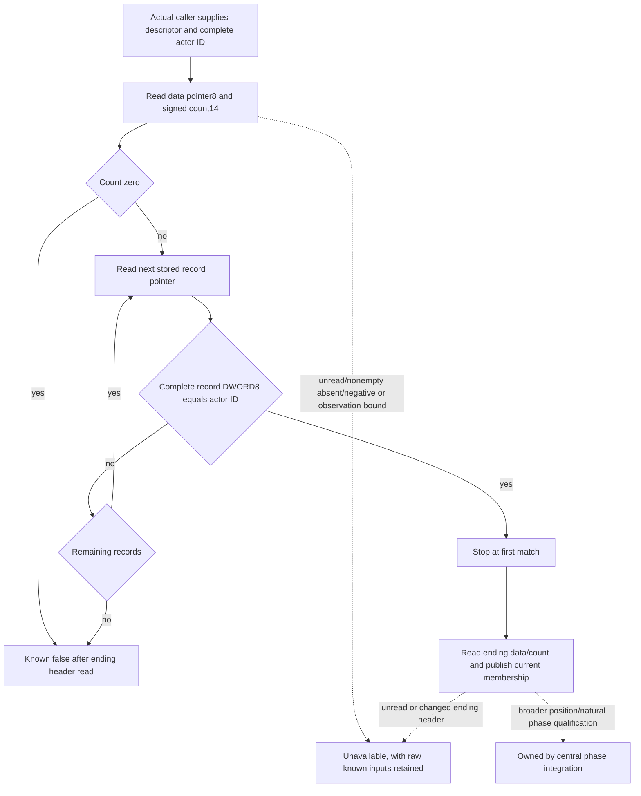

# Current-position ordered War membership, actual CK3 1.20.0.4

Actual `2494B40` checks whether a caller-supplied side descriptor contains the
queried complete DWORD Character ID. The new guarded reader reproduces its
ordered first-match scan without calling a native getter. It is a dependency
of the separately owned position predicates; it does not decide War object
resolution, a War filter, actor/holder selection or complete Army position.

Build: Steam25734779 / `1.20.0.4`; held EXE SHA-256
`98702F88A547CDE2EAF29A85F93B85F68EE4CF8148336A4F7AFAEB75319DD518`.
The [source closure](D:/codex-ck3-background-spill/native71-continuation-20261010/continuation-51b/SOURCE-CLOSURE.json)
reuses the existing actual4 complete130B helper from
`army-family-12004/world-mapping/first01/contains_participant-DETAIL.json`.
No old.3 address translation is used. Its actual callback has literal
`395108`: `CMP DWORD[RCX+8], EDX` at2494B30, followed by `SETE AL` at2494B33
and `RET` at2494B36. The trailing9 INT3 bytes end at the next helper2494B40.
The initial input freeze incorrectly called the three-byte prefix MOV; the
reviewed literal and implementation use CMP. The only missing13 bytes were
already captured by continuation15b before ownership rerouting; this packet
reuses its receipt with zero new image reads, decodes or full-image hashes.

The complete helper reads descriptor data pointer+8 and signed count+14,
then each stored record pointer with stride8. It compares record+8's complete
DWORD with requested EDX, including generation bits; duplicates retain stored
order. First true stops scanning. The native return rereads descriptor data/count
and compares the stopped cursor with its current end. No Character storage
lookup, low24 mask, capacity field or liveness test appears in this predicate.

Actual position caller2C097F0 uses actorR13's fullID+18 in EDX, first with
`&War+20` at2C09915 and only after false with `&War+80` at2C0992A. Its selected
side iteration consumes true; both false advances the War list. Other actual
callers2C090D0 and2C09410 share the same helper, while their surrounding context
remains owned by continuation15b and48b respectively.

`ReadArmyPosition2494B4012004` takes the shared guarded
`ArmyRegularCoreReadonlyAccess12004`, descriptor address and complete int32 ID,
and returns `ArmyRegularCoreReadonlyPredicate12004`. Its rich sibling
`ReadArmyWarMembershipSide12004` retains nullable raw count, data-present flag,
evaluated full-ID prefix and matched index. Empty with null data is knownfalse;
failed headers/records retain unavailable values. The Root callback owns the
frame and read budget. A changed ending header cannot certify the captured
prefix; the raw prefix remains separate from the unavailable predicate.

The candidate is source implemented and **not newly qualified** here. Eight
new owned-memory cases are exported as
`RunArmyPositionMembership12004NewPhaseCases()` to Root10's single new phase
compound. They cover complete generation comparison, duplicates/order,
first-match short-circuit, legitimate empty/null data, absent nonempty data,
unread count/record and changed ending header. There is no standalone main or
test invocation in this packet, and no prior qualified producer is rerun.
Shared wire/CMake/install belong to their designated owners. No Game/SDK,
clone, Git, Z source mutation or new gameplay/live credit occurs here.
