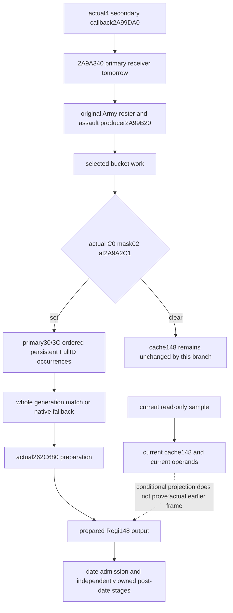

# ArmyManager pre-date persistent roster and prepared148 — actual 1.20.0.4

Continuation33 keeps the existing Native71 source/compiled/archive/qualified pin
`16da78339cdff5c1a462e20bc301684594a3f800`. The actual game is Steam25734779,
1.20.0.4, EXE SHA-256
`98702f88a547cde2eaf29a85f93b85f68ee4cf8148336a4f7afaeb75319dd518`.
`SOURCE-FREEZE.json` fixes the relevant current source inputs before the new leaf;
no immutable full tree, EXE, PE or old FIRST qualification is copied or rerun.
All candidates remain external; Root owns integration and shared reports.

## Actual pre-date entry and ordered frame boundaries

The held complete actual callback at `2A99DA0..2A9A33E` is 1438B. Its original
locator is old3 `2A99DC0`; the actual4 body is consumed directly. No global RVA
delta is inferred. The receiver is the secondary ArmyManager interface. Actual
`2A99E71` passes `secondary-8` to `2A9A340` with tomorrow's calendar date.
That is the primary manager, independently located at `GameData+2A540` by the
adopted manager/current source. The persistent roster operands are primary+30
data and primary+3C signed count, equivalently secondary+28/+34.

The callback first captures original Army references at secondary+48/+54
(primary+50/+5C). Each occurrence reaches actual `2A9A081 -> 2A99B20` assault
preparation followed by `2A9A089 -> 24DF3A0`. After the original Army loop ends,
selected-bucket work still occurs before `2A9A2C1` tests **mask0x02** of the byte
at `GameState+C0`. Therefore the assault-preparation exit and persistent
preparation entry are separate frames. Continuation35 owns the prior assault
admission; post-date, refill and daily assault consumers remain separately owned.

When mask0x02 is set, `2A9A2CB/2CF` capture the ordered persistent bounds.
Each raw DWORD is preserved in native occurrence order, including repetitions.
The actual resolver masks only the index to24bits, compares it unsigned with
registry+2C, selects slot+8 with stride16, and compares the **whole** raw DWORD
with object+10. Null registry/candidate, out-of-bounds index or generation
mismatch selects native fallback at `5D1EB58`; the registry slot is `5D1EB68`.
There is no extra Regi magic or `id != -1` gate in this callback. The call at
`2A9A31C` targets actual4 `262C680`; it runs once for every stored occurrence.

Source: held `army-world-family/native-main/map01/pre_date_roster_source-DETAIL.json`
and `CURRENT-GLOBAL-SOURCE-USE-LEDGER.json`. Current actual4 support closes
permission `262C6E0` and fresh fraction `262CAB0` independently. The old3
prepared-stage contract is a locator and prior semantic explanation; actual4
`262C680` is now closed by Root's actual93B cached span at
`root-literal-source/prepared-roster-262C680.json` and `.bin`, SHA-256
`026599cafe4d664859c8953c5f341ccc8c355da6caf4b283136ae249fb460392`.
Those inputs were appended to the freeze before conditional implementation.
No branch is implemented from a guessed global delta.

The actual method compares **dword** guard138 at `262C686`. Nonzero takes the
permission branch without reading definition magic. Zero reads definition+118,
then magic+38; magic unequal to `4744624F` bypasses permission. Required
permission at `262C6A6` passes **physical chunk0 at Regi+18** to `262C6E0`.
False stores qword0 at148 and returns without demanding a fresh fraction.
Bypass or true permission reaches `262C6C8 -> 262CAB0`; `262C6CD` consumes the
qword through returned RAX, and `262C6D0` stores that value at148. Both ordinary
returns therefore store148. The read-only candidate computes those conditional
values separately and never invokes this mutating method.

## Minimal external read-only candidate

`BindArmyPreDatePreparedRoster12004` admits the actual4 hash and binds only
read-only permission/fresh getters and loaded state slots. It exposes no
preparation, writer or manager-mutator callback.
`ReadArmyPreDatePreparedRoster12004` reads one current manager frame, rawC0,
actual date/rawD, the whole ordered primary+30/+3C roster, resolution/fallback
and current signed64 cache148. It retains unread occurrence slots rather than
dropping or sorting them. Raw roster, current resolution, cache and conditional
preparation readiness are independent. Empty roster is a real known empty set.

The observed cache148 stays separate from the conditional current-frame branch
result. A positive fresh getter can coexist with cached0. Mask-off preparation
does no getter work and preserves the current cache. Mask-on projection follows
the actual4 complete preparation body and demands only the branches executed
under this current entry. It preserves signed guard/fraction values and each
original occurrence; it does not deduplicate their getter evaluations.

The caller's sequence/stage marker and the actual sampled date/rawD remain in
`observed_frame`. The default stage is `current_query`; neither that label nor
an explicit supplied pre-date label grants actual earlier-stage evidence.
`observed_post_frame` remains absent and `actual_preparation_observed=false`.
An actual preparation-entry observation after selected-bucket work and a later
post-preparation observation must be supplied by Root's real owning-thread
integration. The current reader cannot manufacture those earlier/later frames.

The fresh focused test candidate covers raw occurrence/repetition, full-generation
fallback, mask-off demand, physical chunk0 preparation branches, current versus
conditional cache148, frame separation and read-only memory. Root's dedicated
focus owner executes the one new compound; no GREEN is claimed before its
actual receipt. The existing selected assembly, manager
shared wire and Native71 callback qualifications are reused without reexecution.
Open Kaishek is not applicable to these native pointer/callback contracts. No
game, SDK, profile, save, Steam, shared CMake, shared driver/service/serializer or
Git operation is performed by this continuation.
