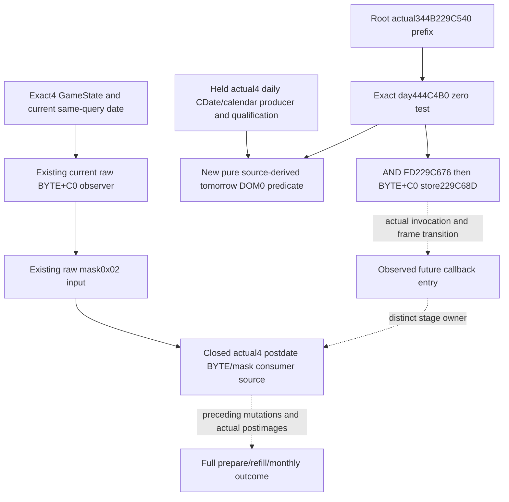

# Actual4 calendar-month flag producer and existing current BYTE input

2026-10-10. Exact target is CK3 `1.20.0.4`, Steam build `25734779`, retained EXE SHA-256 `98702F88A547CDE2EAF29A85F93B85F68EE4CF8148336A4F7AFAEB75319DD518`. This package reads the source tree at `Z:/ck3_mod_rewrite` without changing it. Identity, rawdate epoch, calendar tables, phase predicates, roles and their existing qualification are reused. No EXE/game/build/test operation has been performed by this worker.

The actual current raw month-first input is already implemented. `BindArmyImage12004` sets the exact4 GameState slot and calls `PopulateArmySupportBindings12004`. That support binder enables `current_month_first_refill_call_bindings.enabled`. The existing `ReadCurrentMonthFirstRefillCallInputs12003` then reads exactly one BYTE at the resolved `GameState+C0` on the same Strength row, alongside its existing timing/date family. It publishes `game_state_calendar_flags_raw_u8` and `(raw & 0x02) != 0` as `month_first_mask_2_set`. Mathematical bit index is1; mask0x04 is a separate year flag. The `.3` name of the reused reader is not an executable binding: actual4 source admission and slots are supplied by the `.4` binder.

This existing observer has concrete `.4` source support. `research/ck3_1_20_0_4_army_support.json` identifies the adopted month-first family and the complete1539B `2A9A590 -> 2A9A570` source proof. The referenced `support_2A9A590-DETAIL.json` retains actual `.4` `2A9A655` `movzx r13d,byte ptr [rax+C0]`, `2A9A65D` `and r13b,2`, and `2A9A8D5` `test r13b,r13b`. The same actual collector, DTO, serializer and strict consumer already carry this raw value. A second observer, new duplicate DTO, shared-hook edit or repeat of its old FIRST would add no input value and is not proposed.

The current BYTE is a paused same-query observation. It does not reveal the register saved at a past callback entry, nor establish that a future pre-command has run. A present mask2false also does not suppress the separate daily assault consumer or unsigned-D%30 supply dispatcher. Those source-defined boundaries remain unchanged.

## Source gap and actual bounded closure

The remaining question is the actual `.4` pre-command's **clear/select/store** operation, rather than another current raw observation. The `.3` held source at `army-monthly-update-order-v61/source-clock-new-spans/gamestate-calendar-pre-callee.json` is a959B actual capture of `229C560..229C91F`. Its relevant path uses the supplied RCX as GameState, derives tomorrow rawdate by low32+24, loads the selected native calendar byte, clears mask2 with `and r8b,FD` at `229C696`, selects2 if DOM0, preserves other flags while replacing year mask4, and stores one BYTE at `229C6AD`. It does not establish the `.4` operand identities.

The already parsed old/new runtime tables locate ordinal118667: old `229C560..229C91F`, current candidate `229C540..229C8FF`, with matching959B length. Candidate clear/store are `229C676`/`229C68D`. This is a locator only; no global RVA shift, unchanged epoch or table-role assertion follows from it. `PDATA-LOCATORS.json` records the zero-EXE-read lookup.

Root subsequently executed the sole344B request. The actual packet is `root-literal-source/monthflag-precommand-229C540.json`, captured at `2026-10-10T09:09:07.955882+00:00`, span SHA-256 `3895e9d1054d97f41460e3225cd026c4713ea9f409769d198851b4f2070e9e6b`. It covers the declared prefix through the immediate month gate, not the full function. `SOURCE-CLOSED.json` freezes these actual edges before the new leaf.

| Actual4 source | Operation |
| --- | --- |
| `229C552`, `229C576`, `229C582` | Retain supplied RCX in RDI, read CDate QWORD at GameState+8, derive tomorrow low32 by+24. |
| `229C58C..229C5EF` | Use daily CDate epoch `0x29C55C0` (43800000), signed32 delta/division24, and normalized365-day table index. This is distinct from the phase epoch `0x29C55A8`. |
| `229C5F9`, `229C609` | Actual month byte comes from `444C340`; actual DOM byte comes from `444C4B0`. These immediate operands differ from the old `.3` roles. |
| `229C642..229C64E` | Read current C0 BYTE and perform the intermediate weekly mask1 replacement. |
| `229C655..229C672` | Load DOM signed; a negative value reloads the identical byte unsigned at `229C659`. Both paths test that exact DOM at `229C670`; only zero selects mask2 at `229C672`. |
| `229C676`, `229C67A` | Clear previous mask2 with `AND R8B,FD`, then OR the selected month mask. |
| `229C67D..229C68B` | Independently replace year mask4. This cannot change the mask2 predicate. |
| `229C68D`, `229C693..229C696` | Store final BYTE to GameState+C0; test mask2 and skip the month branch on zero. |

The existing actual4 phase/date/calendar source and FIRST remain authoritative. The next full64 calendar producer already uses the same **daily** epoch43800000 and actual day444C4B0/month444C340 operands. The new leaf therefore consumes `source_derived_next_calendar_day_u8` from that existing same-row producer. It does not recompute dates, normalize365, reread tables, modify current C0 or repeat calendar/role qualification. Its semantic meaning is a source-derived next pre-command branch input, not an observed future flag, actual regular refill or completed month transition.

`ROOT-FINITE-MONTHFLAG-SOURCE-REQUEST.json` preserves the original bounded request, now fulfilled. Existing actual postdate usage already closes the consumer; pre-cache ordering and postdate caller are owned separately by continuation33 and41. The rest of this pre-command, its invocation link, external callees and native calendar tables remain outside this new capture. A source prefix does not establish that the pre-command executed on a future frame.

Status is **existing current rawC0 input reused; actual4 pre-command clear/select/store source closed; new pure predicate SOURCE_PREPARED / FIRST_NOTRUN**. `calendar_month_flag_12004.hpp/.cpp` supply only `ProjectNextCalendarMonthFlag12004(existing_next_clock) -> optional<bool>`. It returns true for DOM0, false for every other byte, and null when the existing ready/full64/day input is unavailable. The raw current C0 family remains unchanged and independent of this prospective result.

`calendar_month_flag_12004_test.cpp` contains the sole new focused compound with six explicit checks: DOM versus month operand, DOM0, the actual signed-negative/unsigned-reload branch, earlier low32/D-only shape, missing DOM and unavailable clock. Literal caller-owned bytes are explicitly synthetic; no old arithmetic or native callbacks run. `ROOT-LEAF-AND-FOCUSED-ARGV.json` supplies its one executable argv and Root's same-row attachment. Worker build/test/EXE/game/shared/Git operations remain0. Root owns all shared wire/serializer/driver/Service/CMake adoption and any FIRST qualification.

Observed future C0, actual callback-entry saved registers, intervening stage outputs, full daily/monthly completion and gameplay credit remain unqualified.

Sources reused:

- `Z:/ck3_mod_rewrite/ck3_autonomous_player/native_bridge/src/ck3_12004_army.cpp` and `ck3_12004_army_support.cpp`.
- `Z:/ck3_mod_rewrite/ck3_autonomous_player/native_bridge/include/xar_bridge/ck3_12003_current_month_first_refill_call_inputs.hpp`, its existing DTO/serializer, and `research/ck3_1_20_0_4_army_support.json`.
- `Z:/ck3_mod_rewrite_process_assets/g2-background-20261007/upstream-build-migration/army-family-12004/commander-supply/support-first01/support_2A9A590-DETAIL.json`.
- `Z:/ck3_mod_rewrite_process_assets/g2-background-20261007/upstream-build-migration/function-match-core/{OLD,NEW}-RUNTIME-FUNCTIONS.json` (locator only).
- `Z:/ck3_mod_rewrite_process_assets/g2-resume-20261004/army-monthly-update-order-v61/source-clock-new-spans/gamestate-calendar-pre-callee.json` (old actual source only).
- Existing `army-monthly-update-order-12003.md`, `army-monthly-manager-prepared-stage-inputs-12003.md`, `army-current-month-first-refill-call-inputs-12003.md` and `army-next-full-cdate-calendar-12004.md`, within their exact source/qualification boundaries.

The small external artifacts follow storage policy1.0.0. `START-STORAGE.json` binds the owner/output volume and a1MiB maximum small-output estimate; no worker heavy-write reservation is asserted. Minimum source inputs have a7-day review, records a180-day review. Other tasks' expired assets are outside this worker's disposal scope.
