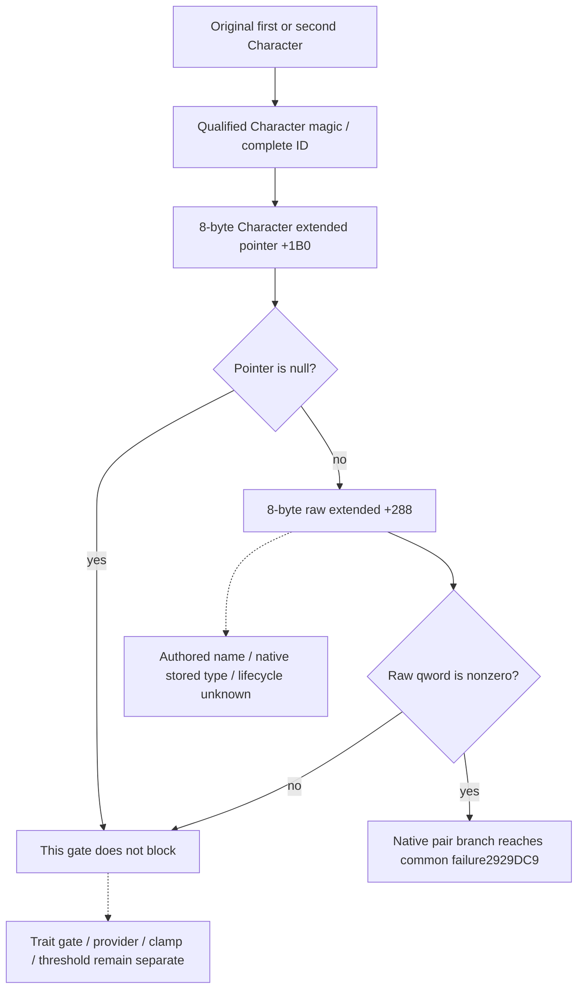

# Native71: exact4 conception extended-state gate

Source tree fixed on 2026-10-10 before the owned leaf implementation.
Build: CK3 1.20.0.4 / Steam 25734779; retained executable SHA-256
`98702F88A547CDE2EAF29A85F93B85F68EE4CF8148336A4F7AFAEB75319DD518`.
This supplements [the current pregnancy entry](current-first-heir-pregnancy-entry-12004.md).

The useful missing input is one actual pair-attempt gate. Observed fertility,
active-pregnancy status and trait exclusion do not determine this separate
extended-state gate. The authored name, stored native type and lifecycle of
the qword remain unknown; the source proves only its zero/nonzero use.

## Frozen native source

Reuse the complete 664-byte pair function `0x2929B40..0x2929DD8`, its
entry/exit closure in
[CONCEPTION-CONSUMER-CLOSED-RECEIPT.json](D:/codex-ck3-background-spill/m7-natural-pregnancy-consumer-20261010/manager-owner/CONCEPTION-CONSUMER-CLOSED-RECEIPT.json),
and the held middle instructions in
[ACTUAL-SCALAR-CONSUMER-DETAIL.txt](D:/codex-ck3-background-spill/m7-natural-pregnancy-consumer-20261010/manager-owner/ACTUAL-SCALAR-CONSUMER-DETAIL.txt).
There is no new EXE read, decode, section scan, field-owner inventory or
generic-callee expansion in this increment.

| Native role | Actual instructions | Width and branch |
| --- | --- | --- |
| First Character: entry RCX, held in RDI | `2929BBD` loads Character `+1B0`; `2929BC4/BC7` skips to `2929BD7` when null; `2929BC9` compares `[extended+288]` with zero | 8-byte qword; `2929BD1` JNE to common failure `2929DC9` |
| Second Character: entry RDX, held in RSI | `2929BE7` loads Character `+1B0`; `2929BEE/BF1` skips to `2929C01` when null; `2929BF3` compares `[extended+288]` with zero | 8-byte qword; `2929BFB` JNE to common failure `2929DC9` |

The independently closed entry validates each Character's magic DWORD
`+1C == 43686172` and full ID DWORD `+18 != FFFFFFFF`. It requires the
first native sex byte `+1A1` to be nonzero and the second to be zero. This
leaf does not infer first/second from an heir or spouse label and does not
evaluate the sex or other pair prerequisites. Root supplies the actual
current household row's already resolved Character pointer and complete ID.

## Independent read contract

Owned files are `conception_extended_gate_12004.hpp`,
`conception_extended_gate_12004.cpp` and
`conception_extended_gate_12004_test.cpp`. The leaf accepts a guarded-copy
callback using the existing project callback signature, exact version/hash
binding, the resolved Character pointer and expected complete ID. It calls
no native pair predicate, initializer, active-pregnancy lookup or trait/
fertility getter and writes no source memory.

An available result contains `extended_data_present` and
`blocks_pair_conception`. A null extended pointer is an available false
gate, with raw qword absent because the native branch does not read it.
A nonnull pointer with zero qword is available false with raw zero.
A nonzero qword is available true with its exact raw 64-bit value. The raw
value is not interpreted or dereferenced. Binding, identity and copy failures
produce a distinct unavailable reason with no gate Boolean; a failed read
never supplies a native false result. Read failure at `+288` may retain the
already observed extended-pointer presence.

Root owns application-thread same-family resolution and before/after frame
qualification, public serialization, registered query/Service propagation,
driver and CMake integration. The per-role leaf remains outside pregnancy,
trait-exclusion and fertility availability. A false leaf means only that
this one observed gate does not exclude that role at the current frame. It
does not establish full eligibility, conception probability or any next
monthly check time.

## Bounded verification and remaining entrance

The one new owned-memory test will exercise both distinct Character roles,
a high-half-only nonzero qword (to distinguish an 8-byte read from a DWORD),
null extended-state skip, and an independent guarded-copy failure. It will
verify the actual copy widths/addresses and unchanged source bytes. Legacy
FIRST recipes and qualified pregnancy/trait/fertility fixtures are not
replayed.

Source ready; build and test are NOTRUN until their actual execution receipt
is appended. The original campaign, observed pregnancy and birth roster are
unchanged. Remaining source entrance: an actual retained incoming caller of
`2929B40` that supplies cadence, or an actual consuming/clearing callsite for
extended `+3E8/+3F0` that closes transition into active pregnancy. None is
held here; no new range acquisition is proposed. This gate adds no M7/G2,
pregnancy, birth or natural-succession completion credit.
