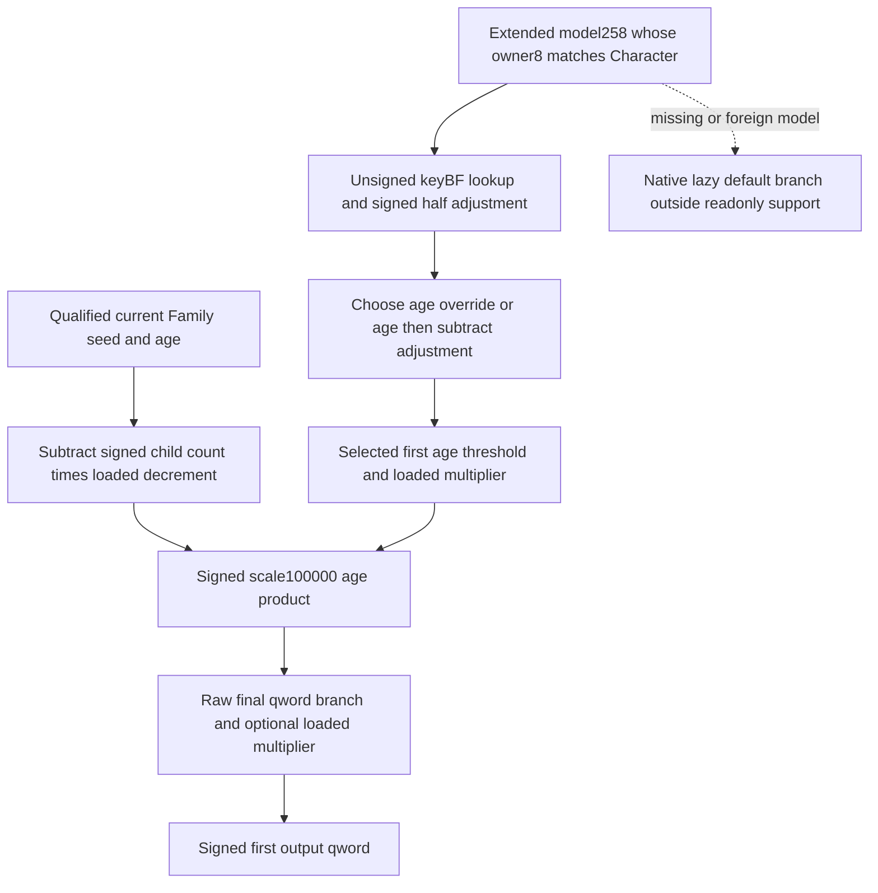

# Native71 first-side conception output provider (1.20.0.4)

This source-first topic owns only actual `2B951D0..2B953DD` (525 bytes,
unwind `51209EC`) and its necessary input dependencies. The build pin is CK3
1.20.0.4 / Steam build25734779 / EXE SHA-256
`98702F88A547CDE2EAF29A85F93B85F68EE4CF8148336A4F7AFAEB75319DD518`.
The original workspace is read-only; independent source, leaf and focused
fixture outputs belong to this external continuation-47 directory.

The actual parent body is retained in continuation-17's
`root-literal-source/pair-value-provider-2B95670.json`; its exact actual4
runtime owner metadata is in `PROVIDER-INDEX.json`. At `2B95DE8` the parent
copies first Character R14 to RDX, at `2B95DEB` it places `&[rbp+240]` in RCX,
and at `2B95DF2` it calls this provider. At `2B95DF7` the parent reads an
eight-byte result into RAX. A false first-role predicate together with
signed result <=0 and fifth argument0 reaches the parent's zero-result
branch. The separate pair owner handles predicate/short circuit and the
later signed minimum/threshold-average arithmetic.

The exact body is now retained in
`actual-source/FIRST-VALUE-PROVIDER-2B951D0.json` and its assembly companion.
One new cache-first read acquired525 bytes into the common external
`shared-span-cache/new-02B951D0-02B953DD.bin`. The actual body decodes into144
instructions through its terminal RET at `2B953DC`; span SHA-256 is
`844a1d6e14669c420dae425a06760490c1661bba8652f8ac661363291a85506b`.
The existing mapper was imported with its common cache redirected to the
coordinated D output root; existing Z named caches remained read-only inputs.

The closed source record is `SOURCE-CLOSED-PLAN-a02.json`, its diagram is
`SOURCE-CLOSED-GRAPH-a02.md`, and its five-file integrity check is
`SOURCE-CLOSED-CHECK-a02.json`. The graph has eight static-confirmed edges and
one explicit native-default-model edge outside this readonly observer's
owned-model support. These checks bind files and declarations; they do not
prove live semantics. The first closed-plan draft used `observed` for a static
source case, which the plan tool correctly rejected because that status
requires live evidence. Its a02 record declares source edges as static and
both live cases as not applicable.

## Exact numerical inputs and branches

| Actual source | Concrete dependency |
| --- | --- |
| `2B951F0..2B95218` | Gate `28BB4C0` and Character extended `+1B0 -> +2E0` supply the seed; the qualified same-frame actual4 Family value already reads this input. |
| `2B95218..2B95240` | Character Family `+1A8`, child collection `+38`, signed DWORD count `+C`; null Family uses inline fallback `5459588`. Subtract count multiplied by loaded signed Q64 `5C69ED8`, keeping native low64 arithmetic. |
| `2B95243..2B952EA` | Modifier owner getter `28C3AC0`, unsigned WORD keyBF in owner `+68` / signed DWORD count `+74`, aligned Q64 value array `+D0`. Key absence yields raw0; negative raw subtracts50000, other raw adds50000, then signed division by100000. |
| `2B952EA..2B952FC` | Signed WORD override Character `+6C` replaces signed WORD age `+68` when nonnegative, including zero. Subtract the modifier adjustment's low DWORD. |
| `2B952FC..2B95333` | Load Q64 count at `544FC04` and consume signed lowEDX; threshold pointer `544FBF8` points to DWORD rows. Increment while adjusted age is below the current threshold. Load the selected signed Q64 factor through pointer `544FCA8`. |
| `2B95337..2B953B6` | Multiply decremented seed by selected age factor, scale100000. Both fast operands lie within ±3037000499; larger operands use the signed max/min quotient-and-remainder path with stock low64 intermediate products. |
| `2B953BC` | Reach shared final writer `2B950E0(out, age_product, Character)`. |

The independently retained final writer is continuation-46's
`FINAL-WRITER-SOURCE.json` / `FINAL-WRITER.asm`. Its finite240-byte interval
includes both terminal returns at `2B95168` and `2B951C7`, followed by eight
INT3 padding bytes. Any nonzero Character qword `+1C8`, `+1C0`, or `+1B8`
preserves the supplied signed raw. A null extended pointer `+1B0` also
preserves it. Only three zero qwords plus a nonnull extended pointer multiply
by loaded signed Q64 `5C69E10`, using the same scale100000 arithmetic. These
qword fields receive no inferred gameplay names here.

## Readonly current-household input and consumer

The candidate leaf is `candidate/ck3_autonomous_player/native_bridge/`:
`include/xar_bridge/conception_first_value_12004.hpp`,
`src/conception_first_value_12004.cpp`, and its connected source fixture.
Root supplies the resolved Character/fullID and existing same-frame
`ck3_12002::family_value::CharacterValue`, which the actual4 binder provides.
The collector validates Character magic/fullID, reuses qualified seed and age,
then copies only the additional source fields and consumed age-threshold
prefix. Optional unread input and legitimate signed zero/negative output are
kept distinct. The pure consumer preserves the intermediate decremented seed,
adjusted age, selected band, age product and first output qword.

Actual `28C3AC0` has a closed owned return: Character `+1B0 -> model+258`,
nonnull model with qword `+8 == Character`, then inline modifier owner `+10`.
Its complete actual4 source is the retained combat-map/pass01
`character_modifier_aggregator-DETAIL.json` under `new.instructions`. The other
return depends on a TLS/static guard and initializer calls. This readonly
collector does not invoke that getter, the original provider, or any
initializer; missing/foreign owned model returns unavailable. Root's
same-query first stage therefore remains conditional on an observed owned
model. This boundary is not a claim that native default behavior produces
zero, nor that the whole pair/lifecycle provider is complete.

Shared signed multiply and age-adjustment implementation is reused from
continuation-46's `conception_value_arithmetic_12004.hpp`; its arithmetic
qualification is owned there. This leaf's one new focused fixture is the
connected first-specific source collection/consumer, not another arithmetic
matrix. The final frozen request `FOCUSED-FIXTURE-REQUEST-a03.json` pins source, header,
implementation, fixture, shared arithmetic and reused Family/build headers.
Central continuation-10 owns the sole compilation/run. Its fixture covers
the child decrement, BF hit/miss and signed adjustment, zero age override,
selected loaded factor, signed negative and zero results, actual-width copies,
child-owner fallback, final branch short circuit, unchanged source memory,
unread fields and owned-model/fullID/build failures. Central execution is now recorded in `fixture-build-retry/RESULT.json`: the
corrected connected fixture compiled with unchanged `/W4 /WX` flags and
ran once with exit0. The qualified scope is this conditional first-specific
readonly input reader and consumer on the frozen source fields.

This packet has no game call, old FIRST execution, section scan or whole-image
hash. It claims no conception, pregnancy, birth, succession or M7 completion.
The independent first output is not a renamed fertility field, a couple
probability, or a scheduling observation. Predicate and pair short circuit,
second-role output, pair minimum/threshold-average and downstream natural
lifecycle belong to their separate owners and Root's actual query qualification.

## Focused execution receipt

The first central compilation retained `fixture-build/RESULT.json` as
COMPILE_RED: production code compiled, but fixture assignments of int literals
to optional<int16_t> triggered C4244 under /WX; the fixture had not run. Exactly
three fixture assignments were changed to explicit std::int16_t literals. The
retry reused the pinned production object, compiled only the fixture source,
linked and ran the one connected fixture. The earlier shared-header pin drift
was caught before compilation and resolved to owner46's final constexpr-only
revision; neither production implementation nor runtime arithmetic changed.

The final central status is `FIXTURE_GREEN_DEFENDER_PENDING`, compile exit0,
fixture exit0 with one fixture invocation; Defender status is
`settings_failed`. Defender authorization, invocation
and effective setting readback remain distinct. This fixture provides no live
game credit. Shared arithmetic qualification reuses owner46's actual root-first/RESULT.json: one compile and one fixture, both exit0, same frozen shared header; Defender settings_failed/admin_required pending. No arithmetic fixture is replayed by this leaf.
