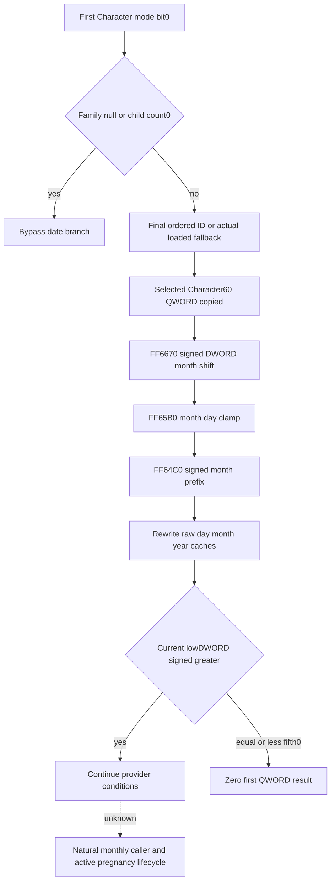

# Native71 last child date branch on CK3 1.20.0.4

Recorded2026-10-10. Exact source is Steam25734779 / CK3 1.20.0.4 /
held EXE SHA-256 `98702F88A547CDE2EAF29A85F93B85F68EE4CF8148336A4F7AFAEB75319DD518`.
The actual provider packet and decoded index supplied by continuation17 are
reused; no historical `.3` body, whole executable, section or hash is read.
The source tree and manual contract were frozen before this independent leaf.
Its current status is **SOURCE_READY / focused NOTRUN**; Root owns adoption,
the existing household-query frame guard, integration and production evidence.

## Actual selection and first-empty branch

The actual mode3/fifth0 pair provider is `2B95670..2B96595`. Its mode bit0
enables the recent-child branch. `2B958AF` reads the first Character's Family
pointer at `+1A8`. A null Family at `2B958B9`, or exact zero signed DWORD
child count at Family`+44` at `2B958C3`, jumps directly to `2B95AA9`; neither
requires a date, clock, shift or calendar input. This is a branch bypass,
not a default birth date. A negative count is not a native empty-list check:
the following `MOVSXD` uses it as an index. The bounded observer retains it
as unavailable instead of accepting all counts<=0 as empty.

For nonzero count, the native code loads the IDs pointer from Family`+38` and
store slot `5C67568`. Store null selects loaded fallback slot `5C67570`
before reading the final array ID. Otherwise it reads exactly the final
ordered DWORD at `ids+count*4-4`, masks low24 bits for unsigned store bounds,
selects stride16 entry`+8`, and verifies the complete generation ID against
Character`+18`. A missing slot, pointer or generation match selects that
same loaded native fallback. The source does not search for maximum birth
date or prove this final array occurrence is the chronologically newest child.

`2B9590F` copies the selected-or-fallback Character`+60` QWORD to caller stack
`+48`. At `2B95918`, `EDX` receives **DWORD** `5C69E84`; every bit is retained.
At `2B95923`, `RCX` is the address of that copied date and the actual target
is `FF6670`. Neither an authored define name nor a plausible duration supplies
the units: the actual reached arithmetic below proves a month shift.

## Closed actual date arithmetic

The finite actual source chain is:

| Actual body | Extent | Necessary outgoing call |
| --- | --- | --- |
| Month shift `FF6670` | `FF6670..FF67A2`,306B | `FF671E -> FF65B0` |
| Target day adjustment `FF65B0` | `FF65B0..FF6662`,178B | `FF6637 -> FF64C0` |
| Month prefix sum `FF64C0` | `FF64C0..FF65A9`,233B | None; both real returns covered |

All native DWORD additions, subtractions and low multiplication results wrap
modulo2^32. Signed divisions truncate toward zero. From raw32:

```text
days = trunc0(wrap32(raw - 43800000) / 24)
year = trunc0(days / 365)
remainder = days - year*365
index = remainder < 0 ? remainder+365 : remainder
initial_month = unsignedBYTE[monthTable444C340 + index]
month_sum = wrap32(initial_month + loaded_signed32_shift)
year_delta = trunc0(month_sum / 12)
target_month = month_sum - year_delta*12
intermediate_raw = wrap32(raw + wrap32(year_delta*8760))
if target_month < 0:
    intermediate_raw = wrap32(intermediate_raw - 8760)
    target_month += 12
```

The corrected target month is0..11 even for loaded DWORD extrema. The
intermediate raw date is decoded by the same epoch,24 and365 formula.
`FF65DA` reads signed month-length byte at `4513BD0+target_month`; `FF6625`
reads unsigned day byte at day table `444C4B0+intermediate_index`. The target
day is signed `min(source_day, signed_month_length-1)`. `FF64C0` signed-sums
the preceding month-length bytes, including its eight-byte SSE path, then
adds that target day. Therefore:

```text
target_index = signed_sum(month_lengths[0:target_month]) + target_day
adjusted_raw = wrap32(intermediate_raw + wrap32((target_index-intermediate_index)*24))
```

The direct12B month-length footprint was acquired once and is
`31,28,31,30,31,30,31,31,30,31,30,31`. It has no leap-day branch. The source
retains the native hour through the24-hour arithmetic, including signed
epoch/overflow cases; it does not approximate a month by30 days.

`FF6670` finally rewrites the complete copied date: low raw DWORD at0, day
BYTE at4, month BYTE at5, year WORD at6. The source ignores the original
upper caches. Each final index is corrected for a negative remainder while
the stored year remains the truncating quotient modulo16 bits. The selected
calendar footprint0..364 and month-length footprint0..11 do not prove native
array descriptor lengths.

The caller then obtains the current clock pointer from `5C68C50`, loads the
adjusted low DWORD from stack`+48`, and compares it with current DWORD`+8`.
`JG` at `2B95936` is signed and **strictly greater**: current>adjusted passes
to `2B95AA9`; equality and smaller signed current reject. In actual fifth0,
rejection goes to the provider's zero first-QWORD output at `2B95AF1`.
This is one current provider condition, not an incoming monthly check time.



## Minimum current-household input and conditional leaf

The new independent module is
`include/xar_bridge/conception_last_child_date_12004.hpp` and
`src/conception_last_child_date_12004.cpp`. `Access` carries the already
admitted exact4 image base, guarded memory callback and the existing full-ID
resolver. `ReadCurrentHouseholdSourceInputs(access,firstptr,fullID,mode=3)`
reads the first role's actual Family/list/count and final occurrence, reuses
that resolver, then reads the actual fallback slot on native lookup miss.
It preserves requested full ID, selected full ID and fallback use separately;
store null preserves an absent requested ID because native code did not read it.
It creates no new Character store, dispatcher or unguarded family query.

`Read(access,source)` reads selected Character`+60` Q64, loaded shift DWORD,
current clock pointer and its raw DWORD. It copies supplied source identity
and independently preserves each successful raw input on later read failure.
The calculation reads only the demanded initial/intermediate/final calendar
bytes and at most12 month-length prefix bytes; it calls no native date mutator
or original conception provider. Null Family, count0 and disabled mode bit0
bypass without reading these unused inputs. Negative count, missing source,
resolver, fallback or table read remains unavailable rather than becoming
zero, false or provider permission.

Continuation55 owns the existing current-household collection seam and shared
integration. Root must pass the native first role already selected by the pair
caller, reuse its guarded resolver and keep its existing paused before/after
frame check. The helper's resolver-null result means native lookup miss;
the parent must preserve its existing query read-error guard. Static source
and the isolated leaf do not publish an observed future frame or perform a
conception, birth, RNG draw, Army flag update or action.

## Evidence and one new focused qualification

The external packet is
`D:/codex-ck3-background-spill/native71-continuation-20261010/continuation-53/`.
`SOURCE-CLOSED.json` holds the reviewed arithmetic and exact sites.
`SOURCE-FREEZE.json`, `SOURCE-PLAN.json` and generated `SOURCE-GRAPH.md` were
saved before implementation. The actual provider is reused directly from
continuation17's `root-literal-source/pair-value-provider-2B95670.json` and
`PROVIDER-INDEX.json`; the three new body receipts are under
`actual-date-helper-source/`, `actual-date-adjust-source/` and
`actual-calendar-prefix-source/`. `actual-calendar-data-source/` holds the
direct12B month-length evidence. New source cost is729B=717 code+12 data;
all four captures use the common finite mapper and D shared range cache.
There is no old EXE read, hash, section scan, Game, SDK or Git operation.

`ROOT-FIRST-RECIPE.json` freezes the single new test recipe. Its sparse owned
image maps only the three reached exact machine bodies and three4KiB pages.
The16 date/shift inputs include month-end clamp, negative shift, negative
epoch, signed raw and loaded shift extrema, and year/wrap cases. Two distinct
original upper-cache values give32 native calls; five signed current clocks
per result give160 comparisons. The same focused fixture verifies exact
empty bypass, missing input, ordered final generation ID, normal lookup,
generation miss, actual fallback, store-absent early fallback and negative
count through the new current-input helper.

Its365B calendar arrays are explicit synthetic fixture inputs derived from
the actual12B month lengths. They are not observations of the game's current
table bytes. The three machine bodies and production reader use the same
owned tables, qualifying arithmetic and input plumbing without a runtime
query. Focused execution is currently NOTRUN; callback ACK, source integrity
or successful compilation alone does not grant GREEN. Actual household
query wire, production binding and natural conception lifecycle remain Root
work, and this packet adds no live M7/G2 or completed family credit.
