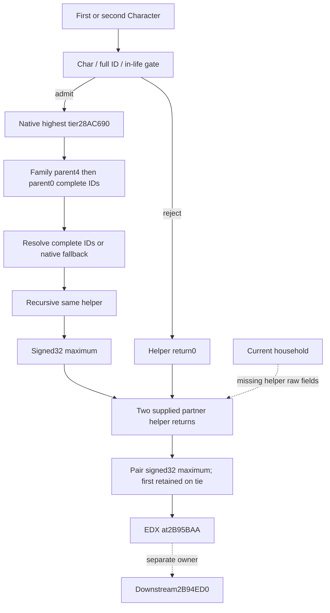

# Native71 conception pair maximum input — actual1.20.0.4

The `2B94DC0` input is the maximum native tier across a living character and
its recursively admitted living parent chains. The parent provider computes
this for each partner, then passes their signed32 maximum in EDX to `2B94ED0`.
The two return values are currently missing from the actual household query.

Exact build: CK3 1.20.0.4 / Steam25734779 / executable SHA-256
`98702F88A547CDE2EAF29A85F93B85F68EE4CF8148336A4F7AFAEB75319DD518`.
The current compiled Native71 primary pin remains16da. All source, candidate
and qualification records are external under
`D:/codex-ck3-background-spill/native71-continuation-20261010/continuation-48/`.

The helper comprises three reached contiguous runtime fragments:
`2B94DC0..2B94DF6`54B, `2B94DF6..2B94EB8`194B,
`2B94EB8..2B94EC5`13B. Only the261B reached source was newly captured, in54B and
207B batches through the shared cache-first finite mapper. Both returns and
all internal control-flow targets are closed. No padding or neighboring
helper body was acquired. The source tree was frozen before the numeric leaf.

| Actual source | Meaning |
| --- | --- |
| `2B94DCA/DDF/DE8` | Character type `+1C` must equal `Char`, complete ID `+18` differs from-1, death pointer `+1D0` is zero; rejected receiver returns0 |
| `2B94DFB → 28AC690` | Existing independently adopted actual4 native highest-tier input |
| `2B94E02/E57` | Character `+1A8` FamilyData; parent complete IDs at `+4` then `+0`; missing FamilyData supplies-1 |
| `2B94E15/E65` | Character storage slot5C67568; low24 index, capacity2C, slots20, stride10, object8 and complete-ID equality; fallback slot5C67570 |
| `2B94E4D/E9C → 2B94DC0` | Same helper recursion for the two parent slots; a dead parent stops at zero before its own ancestors |
| `2B94E52/E54` and `EA1/EA3` | Signed DWORD `CMP/CMOVL` maximizes own tier and both recursive returns |
| `2B95B89/B93` | Provider supplies firstR14 and secondR13 separately |
| `2B95B98/B9A/BA3` | Signed32 pair maximum; equality retains first; low32 bits passed unchanged in EDX to downstream `2B94ED0` |

Parent slot order remains `parent4`/`parent0`; this source does not assign
father/mother names. Effective fertility and the separately owned downstream
limit formula remain separate fields. `family-bindings-12004.md` supplies the
existing parent-slot identity; `HIGHEST-TIER-FRAMELESS-MAP.json` supplies the
already adopted getter. Neither proof nor old FIRST was rerun.

The independent Python API is
`consume_conception_pair_max_input_12004(build_version, executable_sha256,
first_character_id, second_character_id, first_lineage_tier_max_raw,
second_lineage_tier_max_raw)` with keyword arguments. It accepts supplied
signed32 helper returns, preserves missing values, selects first on equality,
and exposes `pair_lineage_tier_max_raw`. It does not call the helper, reproduce
the ancestor reader, or claim that earlier provider branches admitted the pair.
The same output field is the downstream owner's EDX input.

The independent native header/source additionally expose
`BindConceptionPairMaxInputImage(build_version,SHA,module_base,read_memory,context)`
and `ReadConceptionPairMaxInput(bindings,firstPointer,firstFullIDuint32,
secondPointer,secondFullIDuint32)`. The callback uses the existing guarded
`bool(context,address,output,bytes) noexcept` convention. It verifies the held
17-byte entry prefix and the supplied complete IDs, then calls the original
read-only getter and retains independently available partner values. The
closed helper and its previously adopted highest-tier child have only stack
writes; no character/global write or further unknown callee occurs. Native TU
compilation and actual query qualification remain with Root/55.

`selected_return` / native `maximum_return_role` identifies only the origin of
the B98/B9A maximum. The downstream RCX character comes from earlier stack48
selection and must be supplied independently by the provider owner; maximum
origin must never substitute that role.

One focused qualification executes the five already captured `CMP/CMOVL`
bytes in a synthetic Windows register wrapper and compares14 signed32 input
pairs with the new consumer, including zero, negative, signed extrema and
ties. Negative/extreme vectors qualify arithmetic only; they are not actual
CK3 tier values. Missing versus zero and the signed32 width are also checked.
The qualification receipt is `FOCUSED-VALIDATION.json`; Game/SDK/image reads
are zero for this validation.

The existing actual thin household response binds native3/raw53289936 to
heir38822 and spouse38718. It has fertility40000/25000 and no helper-return
fields, so its actual pair maximum stays unavailable. That response has no
public revision/episode; Robert29829/spouse34730's separate cold metadata is
not joined. The precise next reading entry is `2B94DC0(Character*)` for both
independently observed current household roles within the same admitted
paused frame. Root owns the native binder/query and actual value qualification.
This packet grants no pregnancy, birth, natural succession or M7 completion
credit. Source retention review is due2026-10-17; no automatic renewal.
