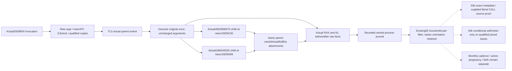

# Native71b: naturally reached conception pair observation

The source tree is fixed before code. Exact build is CK3 1.20.0.4 /
Steam25734779, held executable SHA256
`98702F88A547CDE2EAF29A85F93B85F68EE4CF8148336A4F7AFAEB75319DD518`.
All construction files are in this worker's external D packet; Z and Game
remain read-only. This is a new natural-producer observation surface. The
already qualified extended288 and pending-state leaf fixtures are reused.

## Actual source and native orientation

The complete held `2929B40..2929DD8` body is 664 bytes, closed by
`m7-natural-pregnancy-consumer-20261010/manager-owner/CONCEPTION-CONSUMER-CLOSED-RECEIPT.json`.
The prior middle decode and missing273 prefix/suffix are the source inputs.
No native code or old FIRST is reacquired or decoded by this increment.

Native entry RCX is the first Character (RDI), RDX is the second (RSI),
R8 is the two-DWORD sample storage passed to E46530, and R9 is the preserved
raw signed64 modifier. Native first sex-byte1A1 must be nonzero and native
second must be zero. Household heir/spouse labels are not these native roles.
The entry checks complete Character IDs18 and magic1C; raw pair facts retain
both generation-bearing full IDs before and after the original.

Source-defined readable gates are kept separately: magic/fullID, native sex,
Character1B0 pointer and extended288 qword. The first Character's pending
BYTE3E8 and QWORD3F0, and the same raw slots for the second, are independent
before/after facts. AL is actual returned low-byte state; complete RAX bits
are preserved and returned unchanged. On AL1 the original source writes
first.extended3E8=1 and first.extended3F0=second pointer. Observing these writes
is separate from a completed active pregnancy record or birth.

## Original-once natural hook

The exact first 19 bytes consist of complete 5/1/1/1/4/7-byte instructions:
saveRBX, pushRBP/RSI/RDI, subRSP30, compare Character magic. No relative/RIP
operand is moved. A 14-byte indirect absolute jump plus NOP tail replaces
those19 bytes during the existing suspended-primary startup installer; the
trampoline copies all19 and returns to2929B53. Its indirect jump preserves
the compare flags consumed by the original later JNE. Installation reuses
the current project allocate/protect/flush/rollback contract and pinned
process lifetime. It introduces no live uninstall or permission flow.

Every naturally reached call captures actual returnPC, optional image-relative
RVA, process/thread and the existing13 process-lifetime clock. This domain is
clock_identity plus monotonically increasing sequence, not wall/calendar
time. It is not reset by query reads. A TLS active parent exists only around
the genuine original call. Nested original calls restore the outer scope
after their child completes; no journal lock surrounds native execution.
The original receives unchanged four arguments and is called exactly once,
with no fault catcher around it and no original/RNG invocation from query.

The provider's stack50 first qword and sample return are supplied only by
their naturally reached original-once child hooks. A household projection
is never substituted. Loaded scalar5C69EC8 and clamp5C69F00/5C69F10 may be
guarded-copied before/after, but those copies are explicitly observations,
not captures of the internal consumed MOV instructions. Source-keyed20b
consumption must keep this distinction. Native acceptedAL is independent
of whether conditional arithmetic inputs are all qualified.

## Query and verification boundary

The query returns installed/current-session status, ordered journal metadata
and copied rows filtered by the two current complete IDs in either native
orientation. Empty naturally observed rows are a real zero sample. Capture
failures and overwritten/identity-unattributed counts remain visible; failed
reads do not synthesize eligibility or acceptance. It performs no native
candidate, RNG, mutation or clock increment.

Root/10 owns one new connected parent/provider/sample/threshold compound;
this worker supplies its owned fixture entry and precise sources without
compiling or replaying old gate/pending fixtures.55 owns natural installation,
same-query current-family filtering and public wire/Service propagation;60
owns CMake adoption.53 owns independent exact returnPC source binding. These
are SOURCE_NOTRUN until the fresh central compound is actually executed.
No Game, natural pregnancy, birth, monthly cadence, M7 or G2 completion is
claimed by this source candidate.
