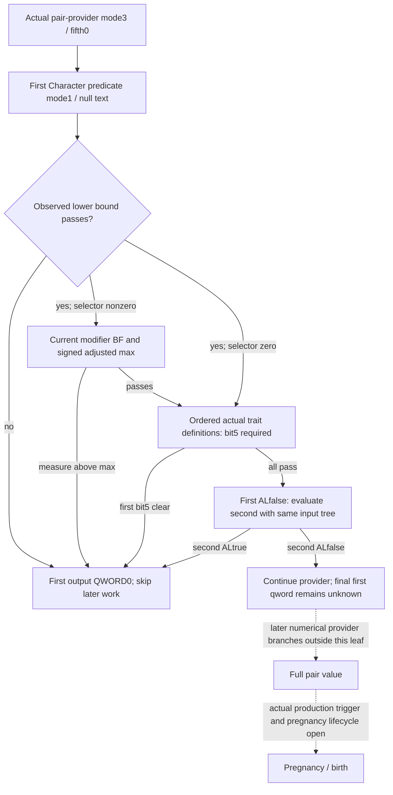

# Native71 pair-provider predicate short circuit, actual 1.20.0.4

Source frozen before implementation on 2026-10-10. This packet targets CK3
1.20.0.4, retained EXE SHA-256
`98702F88A547CDE2EAF29A85F93B85F68EE4CF8148336A4F7AFAEB75319DD518`.
The source tree remains read-only; candidates and focused output belong to
`continuation-45` on the external output volume. Root owns integration,
current household publication, native builds and all game operations.

## Actual caller and finite source

The retained parent body in continuation-17 proves call `2B956BD` with
`RCX=first Character`, `EDX=(entry mode & 1)`, `R8=fifth argument`, and the
second call `2B956E5` with the second Character. The actual caller supplies
entry mode 3 and fifth argument 0, so both predicate calls receive mode 1
and a null optional text receiver. Each true AL leads to `QWORD[out]=0` at
`2B956D3`, then returns the caller's out pointer through `2B9647E`.
A true first result skips the second call entirely. Both false only permits
later provider work; it does not prove a nonzero output or conception.

The actual target's retained runtime row is
`[2B96730,2B97096)`, 2406 bytes, unwind `52A9ABC`. The already deployed
finite family mapper performed one authorized cache-first new-only capture
after consulting retained metadata and its shared exact-range claim.
`PREDICATE-SOURCE.json` contains the complete 512-instruction decode and
references the single shared raw span; no raw copy was made here.
Span SHA-256:
`2bb1a3d2d6ca28d614eea1c8370b261458a35561c0e40f382e6d01955573f992`.
New source cost is 2406 bytes / one read / one decode. Full-image hashes,
new PE parses, old-source reads, section scans and game calls are zero.

## Necessary mode1 / null-text input tree

| Actual instruction | Current input or branch |
|---|---|
| `2B9677D` | Character BYTE `+1A1`, zero versus nonzero selector. No broader gender interpretation is needed. |
| `2B96791..9E`, `2B96B6C..79` | Signed INT16 `+6C`; if negative, substitute signed INT16 `+68`. |
| `2B9679F`, `2B96B7A` | Compare measure against current signed DWORD minimum at `5C69EA0` for nonzero selector or `5C69EA4` for zero selector. Below minimum returns true immediately when text receiver is null. |
| `2B96913..9B4` | Nonzero selector alone uses the existing `28C3AC0` current modifier aggregator. Search UINT16 key `0xBF` in keys `+68`, signed count `+74`, paired signed QWORD values `+D0`. Missing key supplies zero. Round current raw by adding `+50000` for nonnegative or `-50000` for negative then signed division by 100000. |
| `2B969C7..D5` | Add the rounded modifier to signed DWORD maximum at `5C6A1A8`, using native 32-bit wrap. Measure greater than that adjusted maximum returns true immediately. Equality passes. |
| `2B96CEA..D3C` | Reuse actual Trait database and lookup `89E5B0 -> C85E80`. Character trait IDs are DWORD array `+F8`, raw DWORD count `+104`. Each resolved definition reads DWORD `+4A4`; bit5 **clear** returns true. Existing bit3 conception exclusion is a separate earlier input. |
| `2B96F39`, `2B96F3D` | First failing input returns AL1; otherwise return the internal boolean initialized false. With null text there is no diagnostic formatting path. |

The Trait lookup's existing invalid-definition behavior remains native input
provenance. A worker must not replace an unavailable definition with flags
zero. Likewise an unread modifier is distinct from a completed lookup that
found no key. Only relevant branch inputs are necessary: a lower-bound
failure requires neither max/modifier nor trait rows, and a max failure
requires no trait rows. The zero-selector path does not read max/modifier.
Trait iteration preserves occurrence order and stops at the first bit5-clear
definition. A missing earlier definition cannot be bypassed using a later
blocking flag.

The count loop compares equality at `2B96D10`, without a signed `<=0`
empty shortcut. Only observed raw count0 proves an empty iteration. A
negative signed spelling of the same DWORD must not be reused as empty.

## Conditional consumer contract

After this source freeze, the isolated leaf may consume explicit supplied
current inputs without invoking the predicate, provider, database accessor
or initialization routine. It preserves complete first/second IDs and
evaluates only the observed mode3/fifth0 short-circuit stage. Each optional
input distinguishes a failed/unperformed read from native zero or no match.
Only a closed rejecting branch exposes output QWORD0. Both predicates false
exposes `continue_provider` and leaves the final first output unavailable.

Root/55 must join the supplied values to the same current household query
frame using already qualified exact4 Character, loaded-slot, modifier and
Trait lookup sources. This packet does not independently publish current
runtime values, probability, conception, pregnancy, offspring or M7 credit.
The existing fertility floor and bilateral relationships are reused; they
cannot substitute for this predicate's three separate loaded age slots.

One new focused conditional-stage fixture is permitted after code exists.
Source plan/file-integrity checking is separate from that implementation
qualification, and neither grants a live result.

## Guarded current-input observer

The external observer now supplies this stage from Root's existing
core-resolved Character pointers/full IDs and guarded-copy callback.
`OBSERVER-SOURCE-TREE.md` froze its input production before implementation.
It independently checks Character magic/full ID and copies only the
necessary branch inputs. Root's current-household query retains its
existing before/after frame check and publication boundary.

The complete held `28C3AC0..28C3B9C` getter is reused without calling it.
It selects owned Model+10 through Character+1B0 / scratch+258 / Model+8,
or inline default context `5D67B90`. Default guard `5D67B80` readiness
is proved by the two reached held helper bodies `4223A24..4223A84` and
`4223A84..4223AEB`: guard0 is uninitialized, guard-1 initializing, other
values completed epochs. Negative initialized epochs are valid. The
observer does not invoke any initializer, synchronization or TLS helper.
All 419 getter/helper bytes were reused; new observer image reads are zero.

The current BF search preserves the literal partition order and final
end/key/index checks. Observed count0 supplies raw0 without reading array
pointers; signed negative count is not reclassified as empty. Trait IDs
use the existing actual4 database slots and native invalid-definition
fallback, while the new predicate reads raw definition DWORD4A4 bit5.

The conditional stage's focused fixture passed 16 branch scenarios with
the original production object retained. Its initial fixture compile
failure and corrected central-run receipt remain separate evidence.
The observer has its own focused input fixture and does not replay the
conditional-stage main. These fixtures qualify owned-memory behavior;
same-query publication and any actual current runtime observation remain
Root/55 work. Defender registration receipts retain their actual status.
