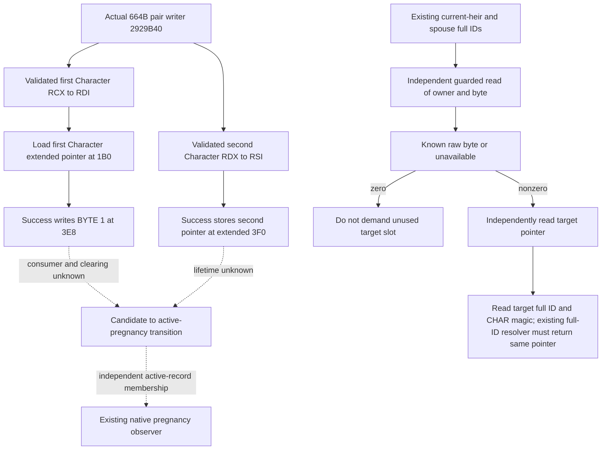

# Native71: independent conception-candidate pending slots

Source tree frozen on 2026-10-10 before implementing this leaf. Exact build:
CK3 **1.20.0.4**, Steam **25734779**, EXE SHA-256
`98702F88A547CDE2EAF29A85F93B85F68EE4CF8148336A4F7AFAEB75319DD518`.
This supplements [the actual pair tree](current-first-heir-pregnancy-entry-12004.md)
and its existing current-heir/current-spouse observation; it creates no new
population selector or gameplay action.

## Held body and field ownership

The retained [whole-body receipt](D:/codex-ck3-background-spill/m7-natural-pregnancy-consumer-20261010/manager-owner/CONCEPTION-CONSUMER-CLOSED-RECEIPT.json)
closes actual `[0x2929B40,0x2929DD8)` as **664 bytes**, including success RET
`0x2929DC8` and rejection RET `0x2929DD7`. Its fields are source facts:

| Operand | Actual owner and width | Source instruction |
| --- | --- | --- |
| Character `+0x18` | Full Character ID, DWORD | Entry qualification and existing full-ID resolver |
| Character `+0x1C` | Character magic `0x43686172`, DWORD | Entry qualification |
| Character `+0x1B0` | Extended-data pointer, QWORD | Success owner load |
| Extended `+0x3E8` | First Character's candidate-state byte; success writes **1** | `0x2929DA5` |
| Extended `+0x3F0` | First Character's stored second-Character pointer, **QWORD** | `0x2929DB3` |

Entry RCX is preserved as RDI (first Character); RDX as RSI (second
Character). The first native sex byte `+0x1A1` is nonzero and the second is
zero on this branch. The stored pointer is RSI; this is not a pregnancy
record ID or a completed biological-father observation. This leaf does not
select its owner from sex or an inferred relationship role: the existing
household query supplies its already-resolved heir/spouse role and full ID.

The current Native71 trait/status inputs do not read these two candidate
slots. The active-pregnancy reader independently searches the manager's
record arrays. Neither a false active-pregnancy result nor positive fertility
establishes the candidate byte's current value.

## Minimal read contract

Owned files are `conception_candidate_pending_12004.hpp`, its `.cpp`, one
focused owned-memory test, and this topic. Root owns family/query wiring,
serialization, core, CMake and aggregate reports. The raw leaf accepts the
already-resolved owner/full ID, a guarded memory-reader callback, and a
target full-ID resolver supplied from the existing actual4 Character route.
It admits only the exact build above. Root supplies existing household roles
and the owning paused frame; the leaf does not make a native conception call.

The byte and the target resolution are separate results. A successfully read
zero byte is available and does not require reading `+0x3F0`. A missing
extended-data object or unreadable byte is unavailable, never false. For a
nonzero byte, pointer/identity/lookup failure does not erase the known byte;
the target result separately records unavailable, null pointer, invalid
identity, generation mismatch or a resolved full ID. The raw byte is
preserved even if it differs from the source writer's value 1. No native
predicate for every possible byte value is invented.

No clearing/lifetime consumer, incoming monthly caller, exact next-check
deadline, birth, natural succession or whole lifecycle is closed. These
remain source dependencies. Qualification is **SOURCE_NOTRUN** at this
initial tree freeze; the focused test will validate this new raw leaf only,
and Root must separately qualify the integrated existing-query wire.

## Authored leaf and sole new focus

The source candidate now exists at
[conception_candidate_pending_12004.hpp](../../ck3_autonomous_player/native_bridge/include/xar_bridge/conception_candidate_pending_12004.hpp)
and its
[implementation](../../ck3_autonomous_player/native_bridge/src/conception_candidate_pending_12004.cpp).
`conception_candidate_pending::Read(Access, owner, full_id)` uses guarded
reads for all fields. `Access.resolve_character` is an owning-query thunk
to the existing `ck3_12004::ResolveCoreCharacter(core, full_id)`; it must not
introduce a second store or resolve by the low index alone. The owner is an
already-resolved current household role. Root retains its usual owning
paused frame and complete household relation checks around the raw leaf.

The result keeps `candidate_state_available`, exact
`candidate_flag_raw` and its unavailable reason separate from
`target_status`, `target_pointer_raw`, `target_full_id_raw` and
`resolved_target_character_id`. Only a successful full-ID resolver return
equal to the stored pointer publishes a resolved target. A target lookup
failure preserves the independently observed byte and pointer/raw ID that
were read successfully. A byte other than 0 or 1 remains that exact byte;
there is no invented active-pregnancy Boolean.

The [owned-memory focus](../../ck3_autonomous_player/native_bridge/src/conception_candidate_pending_12004_test.cpp)
has twelve new scenes in one invocation: zero-byte target skipping;
resolved targets with byte1 and a retained noncanonical byte; missing
extended data; unread byte; unread target pointer; known null pointer;
unread target identity; invalid Character magic; unresolved generation;
owner full-ID mismatch; and a different-build admission refusal. Target
identity includes a generation-bearing DWORD with its high bit set, so its
signed resolver parameter must preserve every bit. Each scene verifies no
write to owned Character, extended or target memory. The fixture resolver
is only the new leaf's seam, and does not replay the existing store FIRST.

The exact compile/run proposal and output path are frozen in
[ROOT-FIRST-RECIPE.json](D:/codex-ck3-background-spill/native71-continuation-20261010/continuation-20/ROOT-FIRST-RECIPE.json).
Root and shared-build owner10 own budget admission, the already selected
x64 MSVC environment, project EXE registration, compile/run and receipts.
This worker executed **zero builds/tests**, acquired **zero new EXE bytes**,
and made **zero Game/SDK/Git operations**. Current readiness remains
**SOURCE_NOTRUN** until that sole validation actually runs. The integrated
whole-query wire, real Service consumer and live observation are separate
Root qualifications; this leaf adds no pregnancy, birth, M7 or G2 credit.
